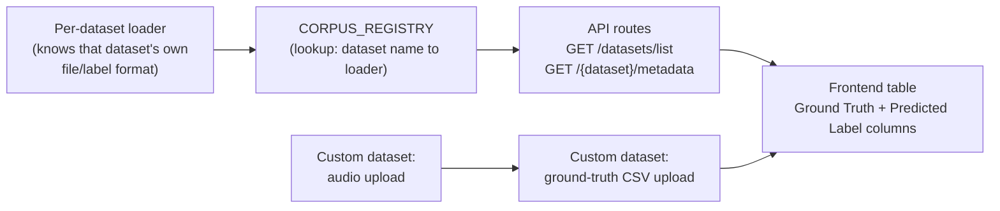

# Dataset Ingestion Pipeline — Plain-English Q&A / Demo Guide

Prepared as a walkthrough of AudioLIT's dataset ingestion pipeline and the
Linear issues Ravindu Pathirana implemented for it (LIT-123, LIT-141,
LIT-142, LIT-181, LIT-236, LIT-235, LIT-247, LIT-249). Written for
non-technical Q&A and live demos — grounded in the actual Linear issue
descriptions and acceptance criteria, not guesses. See `docs/SAD.md` 5.1
and `docs/SRS.md` FR2 for the authoritative architecture/requirements text
if this doc and those ever disagree.

---

## 1. What "dataset ingestion" means here

Before AudioLIT can run a model (Whisper for speech-to-text, an emotion
classifier, or a deepfake detector) against a benchmark dataset, the system
needs a consistent way to:

1. Find the audio files and their labels for that dataset.
2. Convert every audio file to the same format (16 kHz, mono) regardless of
   how the original dataset stored it.
3. Present it through one common interface so the rest of the app doesn't
   need to know "is this Common Voice or ASVspoof or a hand-uploaded
   folder."

That's the ingestion pipeline — the plumbing that turns 7 differently-shaped
public datasets (plus user-uploaded custom ones) into one uniform stream the
UI and models can consume.

## 2. The pipeline, step by step

1. **A loader exists per dataset** — a small Python class that knows how to
   read *that specific dataset's* file layout and label file (e.g. a CSV, a
   filename-encoded label, or a folder-per-accent structure).
2. **All loaders plug into one registry** (`CORPUS_REGISTRY`) — a lookup
   table mapping a dataset name (`"common-voice"`, `"asvspoof-2021"`, etc.)
   to its loader. This lets the rest of the app say "give me dataset X"
   without caring how X actually works internally.
3. **The API exposes it** — routes like `GET /datasets/list` and
   `GET /{dataset}/metadata` read from that registry and hand rows
   (filename + ground-truth label) to the frontend.
4. **The frontend shows a table** — one row per audio file, with a "Ground
   Truth" column and (once you run inference) a "Predicted Label" column.
5. **Custom datasets are a side path** — instead of a public corpus, a user
   can upload their own audio files and, separately, a CSV of ground-truth
   labels that gets matched onto them.

## 3. Ravindu's issues, in order, in plain English

### LIT-123 — Build the ingestion core (the foundation)
The "build the pipe itself" ticket: design one common interface so 7 very
different datasets (Common Voice, LibriSpeech, CREMA-D, RAVDESS, ESD,
L2-ARCTIC, ASVspoof) could all be read the same way, standardized to
16 kHz mono audio. Everything below builds on this.

### LIT-141 — LibriSpeech + Common Voice loaders
Wrote the code that reads those two speech datasets' label files (which map
a filename to a spoken sentence plus speaker info like accent/gender) and
discards broken or silent audio clips before they can pollute results.

### LIT-142 — ASVspoof 2021 deepfake loader
Reads the protocol file that says which clips are genuine ("bona-fide") vs.
AI-generated ("spoofed"), and surfaces a license notice since this dataset
is research-use-only.

### LIT-181 — L2-ARCTIC (accent) loader
Loads non-native-English speech grouped by the speaker's native language
(Hindi, Korean, Arabic, etc.) — the data used later to check whether models
are biased against certain accents.

### LIT-236 — ESD (emotion) loader
Completed the 7th and final dataset. Found and fixed two subtle bugs:

- The CSV file had an invisible "BOM" character at the start that silently
  caused *every single row* to be skipped with no error raised.
- The emotion labels in the raw file ("Angry", "Surprise") didn't match the
  exact spelling the rest of the app expects ("angry", "surprised") — had
  to translate between the two.

### LIT-235 — Wire the real registry in (bug fix, Urgent priority)
The loaders from LIT-123 onward were built and tested, but the *live* API
routes were still using old hardcoded logic that only knew about 2
datasets. Six working loaders existed but were invisible to the app — e.g.
RAVDESS was listed as a dropdown option but pointed at a folder that didn't
exist, so selecting it failed. This ticket connected the real registry to
the live routes and fixed two folder-name typos, making all 6 datasets
actually work end-to-end. Good illustration of "code existing" vs. "code
being reachable."

### LIT-247 — Custom dataset ground-truth CSV upload
For a user's own uploaded dataset, there was no way to supply ground-truth
labels — the column just stayed blank. Added a separate CSV upload for
ground truth, designed so order doesn't matter: the CSV can be uploaded
before the audio files, after them, or in between, and it still matches
correctly by filename. Re-uploading a CSV replaces the old labels rather
than merging with them.

### LIT-249 — Fix: deepfake predictions showed raw JSON instead of a label
A user reported that after running the deepfake detector on a batch, the
table cell showed a JSON blob (`{"predicted_label":"bona-fide",
"synthetic_probability":...}`) instead of just "bona-fide" or "spoof".
Root cause: the code writing into the results table only knew how to
unwrap Whisper's plain-text answers; every other model type (emotion,
deepfake) returns a structured object, and the code fell back to dumping
the whole object as text. Fixed by extracting the right field
(`predicted_label`) in priority order before falling back to raw JSON.

## 4. Anticipated Q&A

**Q: Why did you need loaders per dataset instead of one generic reader?**
A: Every public dataset stores its labels differently — one uses a CSV,
another encodes emotion in the filename itself, another has folders per
language. A generic reader can't handle all of that; each loader translates
its dataset's own format into the same standard shape.

**Q: If the loaders were done in LIT-123–181, why was there a separate bug
fix (LIT-235) two weeks later?**
A: Building a loader and *plugging it into the live app* were two different
steps. The loaders were tested in isolation but the actual API endpoints
hadn't been updated to use them yet — so from a user's perspective, nothing
changed until LIT-235 connected the two.

**Q: What happens if I upload a custom dataset with no ground truth?**
A: You can still run inference and see predictions — the Ground Truth
column stays blank until you optionally upload a matching CSV via LIT-247's
feature.

**Q: What was actually broken in the JSON bug (LIT-249) — the model, or the
display?**
A: Just the display. The deepfake model returned correct predictions the
whole time; the sidebar detail card already showed them correctly. Only the
summary table cell formatted the result wrong.

## 5. Suggested demo flow

1. Show the dataset dropdown — point out all 6 public corpora are
   selectable (LIT-235's fix).
2. Pick ASVspoof (deepfake) or ESD (emotion), run inference on a few rows,
   show the table displaying a clean label, not JSON (LIT-249).
3. Switch to Custom Dataset Manager, upload a few audio files, then upload
   a ground-truth CSV separately and show the match-summary and populated
   Ground Truth column (LIT-247).

---

_Source: Linear issues LIT-123, LIT-141, LIT-142, LIT-181, LIT-236,
LIT-235, LIT-247, LIT-249 (all assigned to Ravindu Pathirana, all status
Done as of 2026-08-20). Cross-check against the live repo before citing
specific file paths in a demo — see CLAUDE.md's note on verifying claims
against actual source rather than trusting convention docs._
