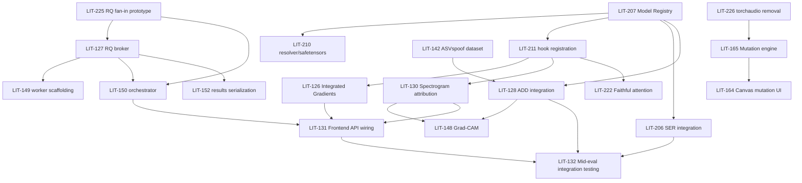

# AudioLIT — Issue Plan & Dependency Map

**What this is:** a local, scannable index of every committed Phase 2–4 Linear
issue — build order, current status, and who owns what — so any of the 3
developers (or a cold Claude Code session) can look here first to decide what
to pick up next, without opening 50 Linear tickets. **This file is not the
source of truth for scope or acceptance criteria** — that's Linear (each
issue's Tier-C stamp, see LIT-228). This file only answers "what can I start,
and what's it waiting on."

Keep this file's **Status** and **Blocked by** columns updated as work lands —
it will drift from Linear otherwise. The dependency edges here are also
encoded in Linear itself as `blockedBy`/`blocks` relations, so Linear's own
dependency graph matches this document.

---

## How to read the tiers

Each tier can start once everything in the tiers above it (that it's actually
blocked by — check the **Blocked by** column, not just tier position) is
merged. Issues within the same tier are parallelizable across the 3
developers. Assignees below reflect Linear at the time this doc was written —
Linear is authoritative for current assignment.

Status legend: 🟢 Todo (not started) · 🟡 In Progress · 🔵 In Review · ✅ Done

---

## Phase 2 — MVP (target: end of Phase 2)

### Tier 0 — Foundational infra (start immediately, no blockers within this project)

| ID | Title | FR | Assignee | Status | Blocked by | Notes |
|---|---|---|---|---|---|---|
| LIT-225 | Prototype RQ fan-out/fan-in | infra | Tharusha | 🟡 In Progress | none | **PR #10 open, CI green, awaiting review.** Pattern documented in `docs/rq_fanout_pattern.md`. Found a pre-existing, out-of-scope bug while testing (health.py bypasses the fake_redis fixture) - flagged, not fixed here. |
| LIT-207 | Dynamic HF model ingestion (Model Registry) | FR1 | Rahim | 🟢 | none | Also satisfies LIT-227's "model-loading reorganised" migration step — same work, don't duplicate. |
| LIT-210 | Model ID resolver / safetensors / cache | FR1 | Rahim | 🟢 | none | Sub-task of LIT-207; can run in parallel with it. |
| LIT-211 | Forward/attention hook registration | FR1 | Tharusha | 🟢 | LIT-207 (loose — same PR is fine) | Unlocks all attribution work (FR8/FR9/FR17). |
| LIT-226 | Remove torchaudio, standardise on soundfile | infra | — | 🟢 | none | Touches `pertubation_service.py` — do before LIT-165 to avoid rework on the same file. |
| LIT-227 | Layered migration (restructure ECHO code) | infra | — | 🟢 | none | Incremental per SAD §8.2 — infra → registry → explanation code → orchestration → new features, system kept working at each step. Coordinate with LIT-207 (same registry work). |
| LIT-123 | Multi-task dataset ingestion core | FR2 | Ravindu | 🟢 | none | Parent of 141/142/208/181 below. |
| LIT-125 | Librosa DSP extraction pipeline (STFT/pYIN/RMS) | FR10 | Ravindu | 🟢 | none | Fully independent — no model or async-fabric dependency. |
| LIT-145 | pYIN F0 tracking | FR10 | Ravindu | 🟢 | none | Sub-task of LIT-125. |
| LIT-146 | RMS energy estimation | FR10 | Ravindu | 🟢 | none | Sub-task of LIT-125. |

### Tier 1 — Dataset loaders (parallel with Tier 0, children of LIT-123)

| ID | Title | FR | Assignee | Status | Blocked by | Notes |
|---|---|---|---|---|---|---|
| LIT-141 | Common Voice / LibriSpeech ingestion | FR2 | Ravindu | 🟢 | LIT-123 (parent) | |
| LIT-142 | ASVspoof 2021 DF loader | FR2 | Ravindu | 🟢 | LIT-123 (parent) | **Blocks LIT-128** (FR7 needs this dataset). |
| LIT-208 | CREMA-D/RAVDESS demo subset | FR2 | Tharusha | 🟢 | LIT-123 (parent) | |
| LIT-181 | L2-ARCTIC ingestion | FR2 | Ravindu | 🟢 | LIT-123 (parent) | **Blocks LIT-168/182** (FR15 needs this). |

### Tier 2 — Async fabric build-out (blocked by the Tier-0 prototype)

| ID | Title | FR | Assignee | Status | Blocked by | Notes |
|---|---|---|---|---|---|---|
| LIT-127 | Deploy RQ broker | FR3 | Rahim | 🟢 | **LIT-225** | |
| LIT-149 | RQ worker scaffolding | FR3 | Rahim | 🟢 | LIT-127 (parent) | |
| LIT-150 | ASR+SER+ADD orchestrator | FR3 | Rahim | 🟢 | LIT-127, LIT-225 | Real fan-in logic — reuses the pattern LIT-225 proves out. |

### Tier 3 — Model integration (blocked by the registry + relevant datasets)

| ID | Title | FR | Assignee | Status | Blocked by | Notes |
|---|---|---|---|---|---|---|
| LIT-206 | Integrate SER model | FR6 | Tharusha | 🟢 | **LIT-207** | |
| LIT-224 | Verify/select working SER checkpoint | FR6 | — | 🟢 | **LIT-207** | De-risks LIT-206 — the currently-referenced checkpoint may have an untrained classifier head; do this alongside/before LIT-206 lands. |
| LIT-128 | Integrate ADD classifier | FR7 | Tharusha | 🟢 | **LIT-207, LIT-142** | |
| LIT-151 | Binary deepfake detection head | FR7 | Tharusha | 🟢 | LIT-128 (parent) | |
| LIT-152 | Forensic feature map API routing | FR3/FR7 | Tharusha | 🟢 | LIT-128 (parent), **LIT-127** | Needs the async fabric to serialize fan-in results. |

### Tier 4 — Attribution / XAI (blocked by hook registration)

| ID | Title | FR | Assignee | Status | Blocked by | Notes |
|---|---|---|---|---|---|---|
| LIT-126 | Captum IG saliency core | FR9 | Rahim | 🟢 | **LIT-211** | |
| LIT-147 | IG temporal attribution | FR9 | Rahim | 🟢 | LIT-126 (parent) | |
| LIT-209 | Extend Captum to SER outputs | FR9 | Rahim | 🟢 | LIT-126 (parent), LIT-206 | Needs SER integrated first. |
| LIT-130 | LIME/SHAP spectrogram translators | FR8 | Rahim | 🟢 | **LIT-211** | |
| LIT-148 | Grad-CAM registration hooks | FR8 | Rahim | 🟢 | LIT-130 (parent), **LIT-128** | Grad-CAM targets the ADD classifier's final layer (SRS FR8.2) — needs LIT-128. |
| LIT-155 | Spectrogram patch/perturbation engine | FR8 | Rahim | 🟢 | LIT-130 (parent) | |
| LIT-156 | SHAP coordinate transformer (frontend) | FR8 | Rahim | 🟢 | LIT-130, LIT-155 | |
| LIT-222 | Faithful attention extraction (FR17 fix) | FR17 | — | 🟢 | **LIT-211** | Correctness fix — touches the same attention path as LIT-211. |

### Tier 5 — Mutation suite (blocked by torchaudio removal)

| ID | Title | FR | Assignee | Status | Blocked by | Notes |
|---|---|---|---|---|---|---|
| LIT-165 | Backend mutation engine | FR12 | Rahim | 🟢 | **LIT-226** | Same file (`pertubation_service.py`) as LIT-226 — sequence to avoid conflicting edits. |
| LIT-175 | Time-frequency slice masking | FR12 | Rahim | 🟢 | LIT-165 (parent) | |
| LIT-164 | Canvas selection controls (frontend+backend) | FR12 | Ravindu | 🟢 | **LIT-165** | |
| LIT-176 | Canvas mouse drag/bbox tracker | FR12 | Ravindu | 🟢 | LIT-164 (parent) | |
| LIT-177 | 2D spectrogram grid selector | FR12 | Ravindu | 🟢 | LIT-164 (parent) | |
| LIT-178 | Mutation trigger/state dispatcher | FR12 | Ravindu | 🟢 | LIT-164 (parent), LIT-165 | Needs the backend mutation endpoint contract. |

### Tier 6 — Frontend integration (blocked by the backend features it binds to)

| ID | Title | FR | Assignee | Status | Blocked by (from Linear) | Notes |
|---|---|---|---|---|---|---|
| LIT-131 | Connect UI to async API/XAI endpoints | FR3 | Tharusha | 🟢 | LIT-126, LIT-130, LIT-121, LIT-127 *(relation already set in Linear)* | |
| LIT-157 | WebSocket/polling handlers | FR3 | Rahim | 🟢 | LIT-131 (parent) | |
| LIT-158 | Frontend XAI overlay binding | FR8/FR9 | Ravindu | 🟢 | LIT-131 (parent) | |
| LIT-159 | Reactive multi-model analytics widgets | FR3 | Tharusha | 🟢 | LIT-131 (parent) | |

### Security & migration wrap-up (parallel, no strict feature blockers)

| ID | Title | Assignee | Status | Blocked by | Notes |
|---|---|---|---|---|---|
| LIT-223 | Remediate inherited security gaps | — | 🟢 | **LIT-227** (loose) | Touches `dataset_service.py`, which LIT-227 also restructures — sequence to avoid rework. |

---

## Phase 3 — Refinement, Bias/Faithfulness, Testing & Evaluation

### Tier 7 — Latent projection & accent bias (blocked by registry + L2-ARCTIC)

| ID | Title | FR | Assignee | Status | Blocked by | Notes |
|---|---|---|---|---|---|---|
| LIT-185 | Projection-space lasso handler | FR11 | Tharusha | 🟢 | **LIT-207** | Needs embeddings from a registry-loaded model. |
| LIT-167 | Lasso selection UI (committed part only) | FR11 | Tharusha | 🟢 | LIT-207 | Multi-model comparison part is stretch — do not build. |
| LIT-168 | Accent bias profiling scripts | FR15 | Ravindu | 🟢 | **LIT-181**, LIT-207 | Needs L2-ARCTIC + a working ASR path for WER. |
| LIT-182 | Group-wise WER diagnostic runner | FR15 | Ravindu | 🟢 | LIT-168 (parent) | |

### Tier 8 — Faithfulness auditing (blocked by at least one attribution method)

| ID | Title | FR | Assignee | Status | Blocked by | Notes |
|---|---|---|---|---|---|---|
| LIT-169 | Quantitative faithfulness checking | FR16 | Tharusha | 🟢 | **LIT-126** (needs ≥1 attribution method) | |
| LIT-183 | High-saliency masking engine | FR16 | Tharusha | 🟢 | LIT-169 (parent) | |
| LIT-184 | Downstream degradation scoring (reassigned from FR15 — see LIT-228 comment) | FR16 | Tharusha | 🟢 | LIT-169 (parent) | |
| LIT-212 | Deletion/insertion AUC metric (deletion part only) | FR16 | Tharusha | 🟢 | LIT-169 (parent) | Insertion/AUC part is stretch — do not build. |

### Tier 9 — Mid-evaluation & integration testing

| ID | Title | Assignee | Status | Blocked by (from Linear, corrected) | Notes |
|---|---|---|---|---|---|
| LIT-132 | Mid-eval integration testing | Tharusha | 🟢 Urgent | LIT-206, LIT-130, LIT-128, LIT-131, LIT-123, **LIT-207** (was LIT-124 — corrected, see below), LIT-126, LIT-127, LIT-122, LIT-148 *(LIT-154 removed as blocker — see below)* | |
| LIT-160 | Cross-browser E2E QA | Ravindu | 🟢 | LIT-132 (parent) | |
| LIT-161 | API stress/memory profiling | Rahim | 🟢 | LIT-132 (parent) | |
| LIT-162 | Code review & mock walkthrough prep | Tharusha | 🟢 Urgent | LIT-132 (parent) | |
| LIT-170 | Full software testing + DS evaluation | Ravindu | 🟢 | LIT-132, LIT-130, LIT-126 | |
| LIT-187 | Backend pytest + UI boundary testing | Ravindu | 🟢 | LIT-170 (parent) | |
| LIT-188 | WER/deletion-score metric computation | Tharusha | 🟢 | LIT-170 (parent) | |
| LIT-171 | Testing & evaluation document | Rahim | 🟢 | LIT-170 | |
| LIT-189 | Latency/FPS metric synthesis | Rahim | 🟢 | LIT-171 (parent) | |
| LIT-190 | Error analysis (accent/faithfulness) | Tharusha | 🟢 | LIT-171 (parent) | |
| LIT-172 | Mentor Meetup 3 prep & sign-off | Tharusha | 🟡 In Progress, Urgent | LIT-170 | |
| LIT-191 | Live evaluation walkthrough script | Tharusha | 🟢 | LIT-172 (parent) | |
| LIT-192 | Mentor Meetup 3 execution | Tharusha | 🟢 | LIT-172 (parent) | |

**Corrections applied to Linear (this pass):**
- **LIT-132** was blocked by **LIT-154**, a non-committed stretch sub-task (LIT-129 → LIT-153 "do not start until committed work done" → LIT-154, which lacked its own stretch banner). An optional diffusion-artifact task should never gate an urgent committed mid-eval deliverable — removed as a blocker; flagged LIT-154 for a stretch banner instead.
- **LIT-132** was blocked by **LIT-124**, one of the FR1 duplicate issues not being built (superseded by LIT-207/210/211) — replaced with LIT-207.

---

## Phase 4 — Final Submission (lightweight — mostly process/deliverable, not FR-mapped)

Not Tier-C stamped (per LIT-228 rule 2 — process/deliverable issues carry no FR). Listed here only for overall sequencing awareness; treat Linear as authoritative for these.

| ID | Title | Blocked by |
|---|---|---|
| LIT-194 | Final individual examiner demonstration | LIT-172, LIT-193 |
| LIT-200 | Sandbox staging & mock defense runs | LIT-194 (parent) |
| LIT-201 | Individual viva defense | LIT-194 (parent) |
| LIT-195 | GitHub landing page | — |
| LIT-202 | Landing page deployment | LIT-195 (parent) |
| LIT-196 | Package source, finalize report | LIT-194 |
| LIT-203 | Production containerization | LIT-196 (parent) |
| LIT-204 | Final IEEE-style report | LIT-196 (parent) |
| LIT-205 | Academic portal submission | LIT-196 (parent) |

---

## Non-committed / stretch — do not build without explicit sign-off

Per SRS §4.4 and LIT-228 rule 3. Listed so nobody accidentally picks these up thinking they're in the plan above.

| ID | Title | Gate |
|---|---|---|
| LIT-166 | Demographic corpus ingestion + SER fine-tuning | Stretch — sub-task LIT-179 also stretch |
| LIT-180 | SER downstream probability matrix optimization | Stretch — sub-task of LIT-166 |
| LIT-186 | Multi-model side-by-side comparison grid (dropped FR5) | Stretch |
| LIT-129 | ADDSegDiff diffusion artifact localization | Stretch — fallback is LIT-130 |
| LIT-153 | ADDSegDiff execution | Stretch — explicit "do not start until committed work + Phase-3 essentials done" |
| LIT-154 | Boundary mask exporter | Stretch by inheritance from LIT-129/153 (needs its own banner — not yet added) |
| LIT-213 | Multi-class generator fingerprinting | Stretch — committed counterpart is LIT-151 |
| LIT-124 / 143 / 144 | Early FR1 duplicates | Superseded by LIT-207/210/211 — recommend closing as duplicate |

---

## Critical path (Phase 2 core)

---

*Update this file as issues move through Todo → In Progress → Done. If a dependency here turns out to be wrong (or Linear's own relations drift from this doc), fix both — this file and the Linear relations should always agree.*
