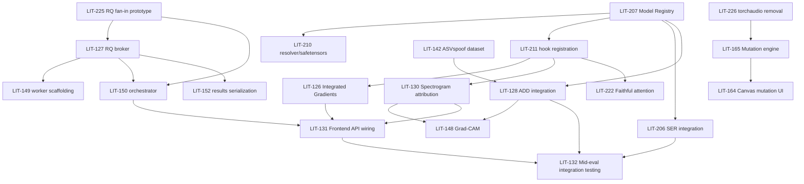

# AudioLIT — Issue Plan & Dependency Map

**What this is:** a local, scannable index of every committed Phase 2–4 Linear
issue — build order, current status, and who owns what — so any of the 3
developers (or a cold Claude Code session) can look here first to decide what
to pick up next, without opening 50 Linear tickets. **This file is not the
source of truth for scope or acceptance criteria** — that's Linear (each
issue's Tier-C stamp, see LIT-228). This file only answers "what can I start,
and what's it waiting on."

Keep this file's **Status** and **Blocked by** columns updated as work lands —
it will drift from Linear otherwise. The dependency edges here are also
encoded in Linear itself as `blockedBy`/`blocks` relations, so Linear's own
dependency graph matches this document.

> **STATUS (2026-08-05, end of session) — a large batch just merged; re-check
> Linear + `gh pr list` before trusting this note:**
> - **Merged to `develop` this session:** the ingestion core **LIT-123** plus
>   its loaders **LIT-141** (Common Voice/LibriSpeech), **LIT-142** (ASVspoof),
>   **LIT-181** (L2-ARCTIC); the async base **LIT-150** (orchestrator, re-added
>   + import-fixed after the #21 revert) and **LIT-127** (RQ broker foundation);
>   plus two CI fixes — the flaky `test_fanout_orchestrator` determinism fix and
>   CI dependency caching + CPU-only torch.
> - **Dataset ingestion is ~complete:** 6 of 7 corpora have loaders in
>   `app/infrastructure/dataset_ingestion.py`; only the SER trio (CREMA-D /
>   RAVDESS / ESD, **LIT-208**) is left. There is now one common
>   `DatasetLoader`/registry the SER loader plugs into.
> - **Next on the dataset→ADD critical path:** **LIT-128** (ADD integration,
>   Tharusha) is now unblocked (LIT-207 ✅ + LIT-142 ✅) → then LIT-148 Grad-CAM
>   → LIT-132. On the async path, **LIT-149** (RQ workers) follows the merged
>   LIT-127, then orchestrator wiring + LIT-131/157 (the `/upload` async cutover
>   still needs LIT-157 frontend polling).
> - **Highest-leverage unstarted work:** LIT-128 (ADD), LIT-208 (SER data),
>   LIT-206/224 (SER model), LIT-126/130/222 (XAI cores, unblocked by LIT-211),
>   LIT-149 (workers), LIT-165 (mutation engine, unblocked by LIT-226).
>
> _Status column last reconciled against Linear + `develop`: 2026-08-05 (end of
> session)._

> **UPDATE (2026-08-06) — the async/frontend tier landed, then needed a
> cleanup:**
> - **Merged since:** LIT-128 (ADD classifier, PR #33 — went into `main`
>   directly, back-merged to `develop` via PR #40), LIT-148 (Grad-CAM, PR #36),
>   and the whole frontend stack in one go via **PR #39** — LIT-131, LIT-157,
>   LIT-158, LIT-159 and LIT-149, because #34/#35/#37/#38 were all ancestors
>   of #39 rather than independent PRs.
> - **LIT-230** cleans up after that merge: `app/services/queue_service.py`
>   duplicated the already-merged `rq_broker.py`, because four Tier-C `Path:`
>   stamps still pointed at `app/services/` after LIT-227 emptied it. Both
>   collapse into `app/orchestration/task_orchestrator.py`, `app/services/` is
>   deleted, and the stamps are corrected. **`app/services/` no longer exists —
>   do not recreate it.**
> - **Still open on the async path:** the `/upload` HTTP-contract cutover, and
>   pointing LIT-150's orchestrator at the canonical per-family queues (it
>   still uses its own `multitask_*` names).
> - **Highest-leverage unstarted work now:** LIT-208 (SER data), LIT-206/224
>   (SER model), LIT-126/130/222 (XAI cores), LIT-165 (mutation engine),
>   LIT-151/152 (ADD follow-ons, now that LIT-128 is on `develop`).

> **UPDATE (2026-08-09) — ~20 PRs landed; the async path was green but hollow.**
> `develop` is at `2e05c5c`; the only open PR is **#68** (LIT-146). Merged since
> the note above: LIT-126, LIT-130, LIT-132, LIT-145, LIT-147, LIT-155, LIT-156,
> LIT-161, LIT-163, LIT-165, LIT-173, LIT-174, LIT-175, LIT-181, LIT-206,
> LIT-208, LIT-209, LIT-210, LIT-224, LIT-230 (PRs #41–#71).
>
> - **⚠ The finding of this session: every task family in
>   `app/orchestration/task_orchestrator.py` was still a `{"_scaffold": True}`
>   stub.** LIT-127, LIT-149, LIT-150, LIT-131, LIT-157, LIT-206 and LIT-128
>   were all marked Done, and the fan-out/fan-in fabric, the workers, the
>   WebSocket relay and the UI all worked — but `POST /api/inference/multitask`
>   enqueued jobs that computed nothing and reported SUCCESS. Nothing failed,
>   which is why it survived seven "Done" issues and a full green CI. **LIT-151**
>   wires the three families onto the real domain functions.
> - **Two contract bugs found the same way** (a mismatch here fails nowhere —
>   the job succeeds and the panel silently renders nothing): the UI sent
>   `tasks: [...,"xai"]`, which hit `_TASK_FUNCS[XAI]` → `KeyError` → 500 on
>   *every* real multi-task call; and `PredictionPanel` compared the deepfake
>   label against `'synthetic'`, a value the backend never emits, so a spoof clip
>   would have rendered the green "Bona-fide Audio" banner. `npm run build` is
>   `vite build` (esbuild — **no typechecking**) and there is no `typecheck`
>   script, so the type union alone would not have caught it. **Worth adding
>   `tsc --noEmit` to CI.**
> - **⚠ `app/core/` is back.** `Backend/app/core/redis.py` (201 lines, LIT-163 /
>   LIT-173 / LIT-174) resurrects the directory LIT-227 emptied and LIT-230
>   deleted. It opens its own Redis connection from raw env vars instead of
>   `app/infrastructure/settings.py`, and `results.py` plus three test files now
>   import `app.core.redis`. **Same stale-`Path:`-stamp failure mode as the
>   LIT-230 duplicate-orchestrator incident** — flagged on LIT-163/LIT-230, not
>   silently moved. Decide deliberately where it belongs before more code
>   imports it.
> - **Also on `develop`:** `app/api/routes/inference.py` (the async gateway) and
>   `inferences.py` (ECHO-legacy synchronous routes) both exist and are both
>   mounted. Not a bug, but the near-identical names are a trap.
> - **Next for Tharusha:** LIT-151 (in progress), then **LIT-152** (typed
>   unified-result serialization — its `Path:` stamp says `results.py`, which is
>   **stale**: that file is now LIT-163's cache endpoint). LIT-124/143/144 are
>   superseded by the now-Done LIT-207/210/211 and are proposed for closure.
>
> _Status column last reconciled against Linear + `develop`: 2026-08-09._

---

## How to read the tiers

Each tier can start once everything in the tiers above it (that it's actually
blocked by — check the **Blocked by** column, not just tier position) is
merged. Issues within the same tier are parallelizable across the 3
developers. Assignees below reflect Linear at the time this doc was written —
Linear is authoritative for current assignment.

Status legend: 🟢 Todo (not started) · 🟡 In Progress · 🔵 In Review · ✅ Done

---

## Phase 2 — MVP (target: end of Phase 2)

### Tier 0 — Foundational infra (start immediately, no blockers within this project)

| ID | Title | FR | Assignee | Status | Blocked by | Notes |
|---|---|---|---|---|---|---|
| LIT-225 | Prototype RQ fan-out/fan-in | infra | Tharusha | ✅ Done | none | **Merged (PR #10).** Pattern documented in `docs/rq_fanout_pattern.md`. Found a pre-existing, out-of-scope bug while testing (health.py bypasses the fake_redis fixture) - flagged, not fixed here. |
| LIT-207 | Dynamic HF model ingestion (Model Registry) | FR1 | Rahim | ✅ Done | none | Also satisfies LIT-227's "model-loading reorganised" migration step — same work, don't duplicate. **Correction:** was marked Done via draft PR #14, but its DoD's "registers hooks... selectable layers" line wasn't actually met until PR #16 wired `HookManager` (from LIT-211/PR #12) into `ModelRegistry` (`LoadedModel.available_layers` / `.attach_hooks()`). Flagged in a Linear comment rather than silently reopened — genuinely Done now that #16 has merged. |
| LIT-210 | Model ID resolver / safetensors / cache | FR1 | Rahim | ✅ Done | none | Sub-task of LIT-207; can run in parallel with it. |
| LIT-211 | Forward/attention hook registration | FR1 | Tharusha | ✅ Done | LIT-207 (loose — same PR is fine) | **Merged (PR #12).** Unlocks all attribution work (FR8/FR9/FR17) — LIT-126/130/222 now unblocked. |
| LIT-226 | Remove torchaudio, standardise on soundfile | infra | — | ✅ Done | none | **Merged (PR #9).** Unblocks LIT-165 (mutation engine), same `perturbation_service.py` file. |
| LIT-227 | Layered migration (restructure ECHO code) | infra | Tharusha | ✅ Done | none | **Merged (PR #16 completed slice 2).** Incremental per SAD §8.2 — infra → registry → explanation code → orchestration → new features, system kept working at each step. Coordinate with LIT-207 (same registry work). **PR #13 (slice 1, merged):** infra/domain/orchestration skeleton stood up, `settings`/`redis`/`session` moved into `infrastructure`, `upload.py`↔`inferences.py` route coupling removed, 5 duplicated `get_session_id` defs collapsed, `pertubation_service.py` renamed, unused LRP import removed. **Correction:** this was then marked Done in Linear even though the DoD wasn't fully met (found via repo audit) — `domain`/`orchestration` were still empty placeholders (everything stayed flat in `app/services/`), and the "unreachable model option" dead-code item was still present. **PR #16 (slice 2):** actually moves every service into its real domain/infrastructure/orchestration home per SAD §5.1/§5.2, fixes `Toolbar.tsx`'s unreachable `whisper-large` option; investigated "orphaned visualisation components" and found none (all 5 files reachable). **Still open, deliberately out of scope:** `queue_service.py` → real RQ / no synchronous inference on `/upload`'s request path — changes the HTTP contract, needs LIT-157 (frontend polling, not started); that's LIT-150's job (merged as a draft via PR #17/#20 without touching the routes — but the real-RQ swap itself is still open, needs LIT-157). |
| LIT-123 | Multi-task dataset ingestion core | FR2 | Ravindu | ✅ Done | none | **Merged (PR #23).** The common `DatasetLoader` / `CsvCatalogLoader` / `CORPUS_REGISTRY` + 16 kHz-mono standardization + accent/demographic `SampleMetadata` in `app/infrastructure/dataset_ingestion.py`. Parent of 141/142/208/181; each per-corpus loader plugs into the registry. |
| LIT-125 | Librosa DSP extraction pipeline (STFT/pYIN/RMS) | FR10 | Ravindu | 🔵 In Review | none | Fully independent — no model or async-fabric dependency. |
| LIT-145 | pYIN F0 tracking | FR10 | Ravindu | ✅ Done | none | Sub-task of LIT-125. |
| LIT-146 | RMS energy estimation | FR10 | Ravindu | 🔵 In Review | none | Sub-task of LIT-125. |

### Tier 1 — Dataset loaders (parallel with Tier 0, children of LIT-123)

| ID | Title | FR | Assignee | Status | Blocked by | Notes |
|---|---|---|---|---|---|---|
| LIT-141 | Common Voice / LibriSpeech ingestion | FR2 | Ravindu | ✅ Done | LIT-123 | **Merged (PR #27).** Common Voice loader shipped with the core; this added `LibriSpeechLoader` (walks speaker/chapter `*.trans.txt` + `.flac`, gender from `SPEAKERS.TXT`) + `is_silent()` corruption/silence validation. |
| LIT-142 | ASVspoof 2021 DF loader | FR2 | Ravindu | ✅ Done | LIT-123 | **Merged (PR #26).** `ASVspoofLoader` — bona-fide/spoof from the protocol/label file (2021-DF + 2019-LA layouts), research-use notice (C5). **Unblocks LIT-128** (FR7 ADD data). |
| LIT-208 | CREMA-D/RAVDESS demo subset | FR2 | Tharusha | ✅ Done | LIT-123 ✅ | **Only remaining corpus loader** — the SER benchmark data (no SER loader exists yet). Plugs into the merged `CORPUS_REGISTRY` (crema-d/ravdess/esd slots are pending). ⚠ **Now also gates LIT-224's last DoD item** — SER label-accuracy cannot be measured without known-label clips, so this is worth more than its tier position suggests. |
| LIT-181 | L2-ARCTIC ingestion | FR2 | Ravindu | ✅ Done | LIT-123 | **Merged (PR #30).** `L2ArcticLoader` — fixed 24-speaker→L1 accent map (6 L1s) exposed as `accent`/`demographic["l1"]`. **Unblocks LIT-168/182** (FR15 accent bias). |

### Tier 2 — Async fabric build-out (blocked by the Tier-0 prototype)

| ID | Title | FR | Assignee | Status | Blocked by | Notes |
|---|---|---|---|---|---|---|
| LIT-127 | Deploy RQ broker | FR3 | Rahim | ✅ Done (foundation) | **LIT-225** ✅ | **Merged (PR #25).** Broker foundation: per-family queues (asr/ser/add/xai + cpu mutation) with GPU concurrency pinned to 1 (SAD C2), enqueue + job-id progress pub/sub, and a `python -m app.orchestration.worker <family>` entrypoint. **Now lives in `app/orchestration/task_orchestrator.py`** — LIT-230 merged `rq_broker.py` with the duplicate `services/queue_service.py` that LIT-149/157 built from this issue's stale `Path:` stamp. ⚠ **Still not done** (follow-on): the `/upload` route rewrite → enqueue + WebSocket relay (changes its HTTP contract), and wiring the LIT-150 orchestrator onto the canonical per-family queues — it still uses its own `multitask_*` queue names. **The task functions themselves ran nothing until LIT-151** — the broker, workers and relay were all real, but `asr_task`/`ser_task`/`add_task` returned `{"_scaffold": True}`, so the whole fabric moved empty payloads around and reported SUCCESS. |
| LIT-149 | RQ worker scaffolding | FR3 | Rahim | ✅ Done | LIT-127 ✅ | **Merged (PR #34, via the #39 stack).** `WorkerContext` (per-process model cache), `AudioLITWorker`, per-family GPU lock. Its code now lives in `app/orchestration/task_orchestrator.py` — LIT-230 moved it out of `app/services/`, where this issue's stale `Path:` stamp had sent it. |
| LIT-150 | ASR+SER+ADD orchestrator | FR3 | Rahim | ✅ Done | LIT-127, LIT-225 | **Merged (PR #22)** after a churny history (draft #17 → revert #19 → re-apply #20 → revert #21 deleted it → **#22 re-added it with post-migration imports fixed + a determinism fix for its flaky fan-in tests**). ⚠ Draft-level: ADD stubbed, and it isn't wired into the routes yet — the `/upload` → real-RQ cutover it needs is still open (LIT-157). Don't assume it runs end-to-end via HTTP yet. |

### Tier 3 — Model integration (blocked by the registry + relevant datasets)

| ID | Title | FR | Assignee | Status | Blocked by | Notes |
|---|---|---|---|---|---|---|
| LIT-206 | Integrate SER model | FR6 | Tharusha | ✅ Done | **LIT-207** | **Merged (via #43/#44).** `predict_emotion_wave2vec` in `app/domain/model_loader_service.py`, on the checkpoint LIT-224 selected, with LIT-208's corpora. ⚠ This covers the *model*; it did **not** put SER on the async path — `ser_task` was still a `_scaffold` stub until LIT-151. |
| LIT-224 | Verify/select working SER checkpoint | FR6 | Tharusha | ✅ Done | **LIT-207** ✅ | **Confirmed broken, replaced.** The inherited `r-f/...` checkpoint failed two ways: no safetensors (registry refuses it under C3 — SER raised on every call), and a custom `classifier.dense`/`out_proj` head that `Wav2Vec2ForSequenceClassification` random-initialises (chance-level, seed-dependent output). New default `firdhokk/speech-emotion-recognition-with-facebook-wav2vec2-large-xlsr-53` pinned at `611e6db`; covers FR6.1's six categories + surprise. **SRS TBD-1 closed.** ⚠ Label-accuracy on known-label clips still unmeasured — needs **LIT-208**'s CREMA-D/RAVDESS subset. **Unblocks LIT-206.** |
| LIT-128 | Integrate ADD classifier | FR7 | Tharusha | ✅ Done | **LIT-207, LIT-142** | **Merged (PR #33 → `main`, back-merged via #40).** `predict_deepfake` + `DEEPFAKE_BONA_FIDE`/`DEEPFAKE_SPOOF` in `app/domain/model_loader_service.py`. |
| LIT-151 | Binary deepfake detection head | FR7 | Tharusha | 🟡 In progress | LIT-128 ✅ (parent) | Wires `add_task` (and `asr_task`/`ser_task`, LIT-127's open follow-on) onto the real domain functions — they were all `{"_scaffold": True}`. Emits `label`/`confidence`/`synthetic_probability`/`probabilities`; keeps the fraud probability distinct from confidence. Also guards the fan-out (unsupported family → `ValueError` → 400, was a `KeyError` → 500) and fixes two silent frontend contract mismatches. |
| LIT-152 | Forensic feature map API routing | FR3/FR7 | Tharusha | 🟢 | LIT-128 ✅ (parent), **LIT-127** ✅, LIT-151 | Needs the async fabric to serialize fan-in results. ⚠ Its Tier-C `Path:` stamp says `app/api/routes/results.py` — **stale**: that file is now LIT-163's cache endpoint. The typed schemas belong in a new `app/api/schemas/` module + `tasks.py`. |

### Tier 4 — Attribution / XAI (blocked by hook registration)

| ID | Title | FR | Assignee | Status | Blocked by | Notes |
|---|---|---|---|---|---|---|
| LIT-126 | Captum IG saliency core | FR9 | Rahim | ✅ Done | **LIT-211** | |
| LIT-147 | IG temporal attribution | FR9 | Rahim | ✅ Done | LIT-126 (parent) | |
| LIT-209 | Extend Captum to SER outputs | FR9 | Rahim | ✅ Done | LIT-126 (parent), LIT-206 | Needs SER integrated first. |
| LIT-130 | LIME/SHAP spectrogram translators | FR8 | Rahim | ✅ Done | **LIT-211** | |
| LIT-148 | Grad-CAM registration hooks | FR8 | Rahim | 🟢 | LIT-130 (parent), **LIT-128** | Grad-CAM targets the ADD classifier's final layer (SRS FR8.2) — needs LIT-128. |
| LIT-155 | Spectrogram patch/perturbation engine | FR8 | Rahim | ✅ Done | LIT-130 (parent) | |
| LIT-156 | SHAP coordinate transformer (frontend) | FR8 | Rahim | ✅ Done | LIT-130, LIT-155 | |
| LIT-222 | Faithful attention extraction (FR17 fix) | FR17 | — | 🟢 | **LIT-211** | Correctness fix — touches the same attention path as LIT-211. |

### Tier 5 — Mutation suite (blocked by torchaudio removal)

| ID | Title | FR | Assignee | Status | Blocked by | Notes |
|---|---|---|---|---|---|---|
| LIT-165 | Backend mutation engine | FR12 | Rahim | ✅ Done | **LIT-226** | Same file (`pertubation_service.py`) as LIT-226 — sequence to avoid conflicting edits. |
| LIT-175 | Time-frequency slice masking | FR12 | Rahim | ✅ Done | LIT-165 (parent) | |
| LIT-164 | Canvas selection controls (frontend+backend) | FR12 | Ravindu | 🟢 | **LIT-165** | |
| LIT-176 | Canvas mouse drag/bbox tracker | FR12 | Ravindu | 🟢 | LIT-164 (parent) | |
| LIT-177 | 2D spectrogram grid selector | FR12 | Ravindu | 🟢 | LIT-164 (parent) | |
| LIT-178 | Mutation trigger/state dispatcher | FR12 | Ravindu | 🟢 | LIT-164 (parent), LIT-165 | Needs the backend mutation endpoint contract. |

### Tier 6 — Frontend integration (blocked by the backend features it binds to)

| ID | Title | FR | Assignee | Status | Blocked by (from Linear) | Notes |
|---|---|---|---|---|---|---|
| LIT-131 | Connect UI to async API/XAI endpoints | FR3 | Tharusha | ✅ Done | LIT-126, LIT-130, LIT-121, LIT-127 | **Merged (PR #39).** #39 was the top of a cumulative stack (#34 ⊂ #35 ⊂ #37 ⊂ #38 ⊂ #39), so merging it closed all four frontend issues plus LIT-149 at once. |
| LIT-157 | WebSocket/polling handlers | FR3 | Rahim | ✅ Done | LIT-131 (parent) | **Merged in the #39 stack (PR #35).** `useTaskStatus` + `/api/tasks/{id}/status` + `/api/ws/tasks/{id}`. ⚠ Shipped with the hook pointing its WebSocket at `window.location.port` (Vite's 8080, no proxy) and polling a relative path — so the async path submitted jobs but never observed them finish. Fixed in LIT-230. |
| LIT-158 | Frontend XAI overlay binding | FR8/FR9 | Ravindu | ✅ Done | LIT-131 (parent) | **Merged in the #39 stack (PR #38).** `XAIOverlayCanvas.tsx`. |
| LIT-159 | Reactive multi-model analytics widgets | FR3 | Tharusha | ✅ Done | LIT-131 (parent) | **Merged in the #39 stack (PR #37).** |
| LIT-230 | Consolidate duplicated task-orchestrator modules | FR3 | Tharusha | ✅ Done | LIT-131 ✅, LIT-149 ✅ | Cleanup after the #39 merge: `app/services/queue_service.py` duplicated the merged `rq_broker.py`. Both collapse into `app/orchestration/task_orchestrator.py` (SAD §5.2 — one Task Orchestrator); `app/services/` deleted; `SimpleWorker` kept over the forking `Worker` per SAD §10's ~8 s multi-task budget; one progress-channel prefix; the `useTaskStatus` URL bug above fixed. Also corrects the stale `Path:` stamps on LIT-127/149/150/225 that caused the duplication. |

### Security & migration wrap-up (parallel, no strict feature blockers)

| ID | Title | Assignee | Status | Blocked by | Notes |
|---|---|---|---|---|---|
| LIT-223 | Remediate inherited security gaps | — | 🟢 | **LIT-227** (loose) | Touches `dataset_service.py`, which LIT-227 also restructures — sequence to avoid rework. |

---

## Phase 3 — Refinement, Bias/Faithfulness, Testing & Evaluation

### Tier 7 — Latent projection & accent bias (blocked by registry + L2-ARCTIC)

| ID | Title | FR | Assignee | Status | Blocked by | Notes |
|---|---|---|---|---|---|---|
| LIT-185 | Projection-space lasso handler | FR11 | Tharusha | 🟢 | **LIT-207** | Needs embeddings from a registry-loaded model. |
| LIT-167 | Lasso selection UI (committed part only) | FR11 | Tharusha | 🟢 | LIT-207 | Multi-model comparison part is stretch — do not build. |
| LIT-168 | Accent bias profiling scripts | FR15 | Ravindu | 🟢 | **LIT-181**, LIT-207 | Needs L2-ARCTIC + a working ASR path for WER. |
| LIT-182 | Group-wise WER diagnostic runner | FR15 | Ravindu | 🟢 | LIT-168 (parent) | |

### Tier 8 — Faithfulness auditing (blocked by at least one attribution method)

| ID | Title | FR | Assignee | Status | Blocked by | Notes |
|---|---|---|---|---|---|---|
| LIT-169 | Quantitative faithfulness checking | FR16 | Tharusha | 🟢 | **LIT-126** (needs ≥1 attribution method) | |
| LIT-183 | High-saliency masking engine | FR16 | Tharusha | 🟢 | LIT-169 (parent) | |
| LIT-184 | Downstream degradation scoring (reassigned from FR15 — see LIT-228 comment) | FR16 | Tharusha | 🟢 | LIT-169 (parent) | |
| LIT-212 | Deletion/insertion AUC metric (deletion part only) | FR16 | Tharusha | 🟢 | LIT-169 (parent) | Insertion/AUC part is stretch — do not build. |

### Tier 9 — Mid-evaluation & integration testing

| ID | Title | Assignee | Status | Blocked by (from Linear, corrected) | Notes |
|---|---|---|---|---|---|
| LIT-132 | Mid-eval integration testing | Tharusha | ✅ Done | LIT-206, LIT-130, LIT-128, LIT-131, LIT-123, **LIT-207** (was LIT-124 — corrected, see below), LIT-126, LIT-127, LIT-122, LIT-148 *(LIT-154 removed as blocker — see below)* | **Merged (PRs #46 → `main`, back-merged to `develop` via #55/#57 after #53 was reverted by #54).** `tests/test_system_integration.py`. ⚠ Covers the demo paths at the service level; it did **not** catch that the RQ task functions were `_scaffold` stubs (see the 2026-08-09 note) — the integration tests call the domain layer directly, not through the queue. |
| LIT-160 | Cross-browser E2E QA | Ravindu | 🟢 | LIT-132 (parent) | |
| LIT-161 | API stress/memory profiling | Rahim | ✅ Done | LIT-132 (parent) | **Merged (PR #59).** `tests/test_memory_profiling.py`, `tests/test_performance_load.py`. |
| LIT-162 | Code review & mock walkthrough prep | Tharusha | 🟢 Urgent | LIT-132 (parent) | |
| LIT-170 | Full software testing + DS evaluation | Ravindu | 🟢 | LIT-132, LIT-130, LIT-126 | |
| LIT-187 | Backend pytest + UI boundary testing | Ravindu | 🟢 | LIT-170 (parent) | |
| LIT-188 | WER/deletion-score metric computation | Tharusha | 🟢 | LIT-170 (parent) | |
| LIT-171 | Testing & evaluation document | Rahim | 🟢 | LIT-170 | |
| LIT-189 | Latency/FPS metric synthesis | Rahim | 🟢 | LIT-171 (parent) | |
| LIT-190 | Error analysis (accent/faithfulness) | Tharusha | 🟢 | LIT-171 (parent) | |
| LIT-172 | Mentor Meetup 3 prep & sign-off | Tharusha | 🟡 In Progress, Urgent | LIT-170 | |
| LIT-191 | Live evaluation walkthrough script | Tharusha | 🟢 | LIT-172 (parent) | |
| LIT-192 | Mentor Meetup 3 execution | Tharusha | 🟢 | LIT-172 (parent) | |

**Corrections applied to Linear (this pass):**
- **LIT-132** was blocked by **LIT-154**, a non-committed stretch sub-task (LIT-129 → LIT-153 "do not start until committed work done" → LIT-154, which lacked its own stretch banner). An optional diffusion-artifact task should never gate an urgent committed mid-eval deliverable — removed as a blocker; flagged LIT-154 for a stretch banner instead.
- **LIT-132** was blocked by **LIT-124**, one of the FR1 duplicate issues not being built (superseded by LIT-207/210/211) — replaced with LIT-207.

---

## Phase 4 — Final Submission (lightweight — mostly process/deliverable, not FR-mapped)

Not Tier-C stamped (per LIT-228 rule 2 — process/deliverable issues carry no FR). Listed here only for overall sequencing awareness; treat Linear as authoritative for these.

| ID | Title | Blocked by |
|---|---|---|
| LIT-194 | Final individual examiner demonstration | LIT-172, LIT-193 |
| LIT-200 | Sandbox staging & mock defense runs | LIT-194 (parent) |
| LIT-201 | Individual viva defense | LIT-194 (parent) |
| LIT-195 | GitHub landing page | — |
| LIT-202 | Landing page deployment | LIT-195 (parent) |
| LIT-196 | Package source, finalize report | LIT-194 |
| LIT-203 | Production containerization | LIT-196 (parent) |
| LIT-204 | Final IEEE-style report | LIT-196 (parent) |
| LIT-205 | Academic portal submission | LIT-196 (parent) |

---

## Non-committed / stretch — do not build without explicit sign-off

Per SRS §4.4 and LIT-228 rule 3. Listed so nobody accidentally picks these up thinking they're in the plan above.

| ID | Title | Gate |
|---|---|---|
| LIT-166 | Demographic corpus ingestion + SER fine-tuning | Stretch — sub-task LIT-179 also stretch |
| LIT-180 | SER downstream probability matrix optimization | Stretch — sub-task of LIT-166 |
| LIT-186 | Multi-model side-by-side comparison grid (dropped FR5) | Stretch |
| LIT-129 | ADDSegDiff diffusion artifact localization | Stretch — fallback is LIT-130 |
| LIT-153 | ADDSegDiff execution | Stretch — explicit "do not start until committed work + Phase-3 essentials done" |
| LIT-154 | Boundary mask exporter | Stretch by inheritance from LIT-129/153 (needs its own banner — not yet added) |
| LIT-213 | Multi-class generator fingerprinting | Stretch — committed counterpart is LIT-151 |
| LIT-124 / 143 / 144 | Early FR1 duplicates | Superseded by LIT-207/210/211 — **all three superseders are now ✅ Done (2026-08-09), so these carry no remaining work.** Closure proposed in Linear comments; still open as of 2026-08-09. |

---

## Critical path (Phase 2 core)

---

*Update this file as issues move through Todo → In Progress → Done. If a dependency here turns out to be wrong (or Linear's own relations drift from this doc), fix both — this file and the Linear relations should always agree.*
