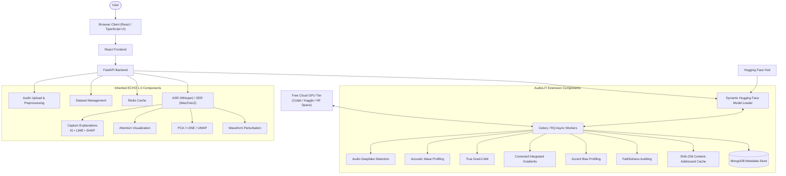
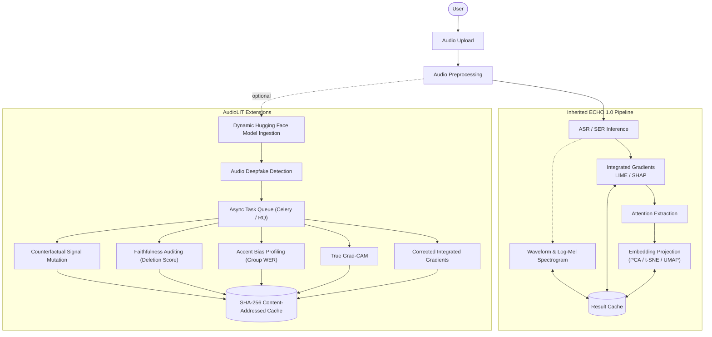
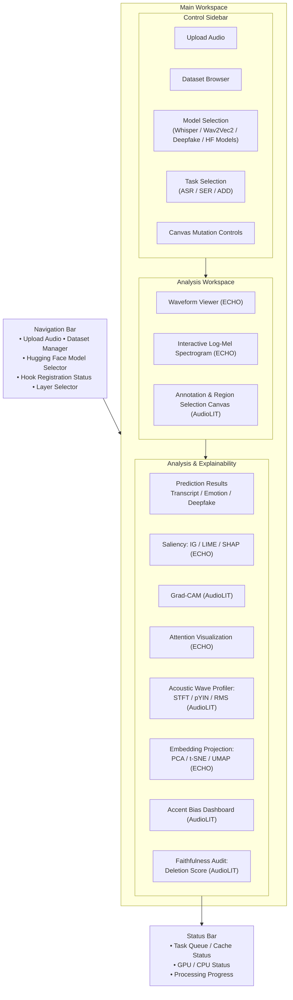
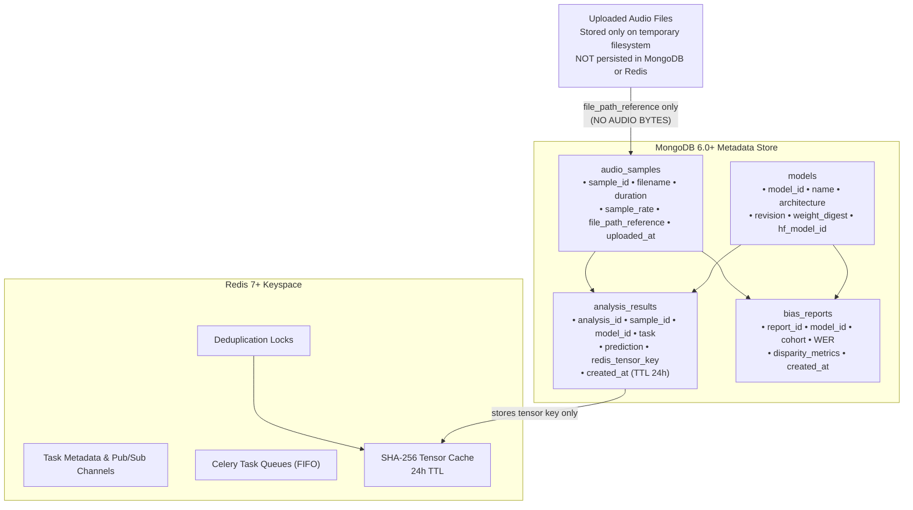

# **AudioLIT**

# **Software Requirements Specification**

# **For An Interactive Multimodal Explainable-AI Workbench for Speech Recognition, Emotion Analytics, and Deepfake Detection**

# 

# **Version 1.0**

# 

**Project Team (Group 19\)**  
Pathirana K.P.R.J. \- 230467R  
Perera D.I.R.T. \- 230475N  
Rahim M.I. \- 230506M

**Mentor**: Dr. Uthayasanker Thayasivam  
**Teaching Assistant**: Anas Hussaindeen

# **Revision History**

| Date | Version | Description | Author |
| :---- | :---- | :---- | :---- |
| 20 Jul 2026 | 0.9 | Initial SRS baseline. | Group 19 |
| 29 Jul 2026 | 1.0 | Realignment against the ECHO 1.0 baseline (Linear LIT-220): the inherited-versus-new boundary was corrected across all requirements; novelty claims for SER, Integrated Gradients, LIME/SHAP, latent projection, and perturbation tooling were reconciled to reflect capabilities ECHO 1.0 already provides; scope was reduced to committed deliverables, with non-committed advanced features moved to the project backlog. Document expanded to the FURPS+ structure. | Group 19 |

# **Table of Contents**

[Revision History	2](#heading=)

[Table of Contents	3](#heading=)

[1\. Introduction	5](#heading=)

[1.1 Purpose	5](#heading=)

[1.2 Scope	5](#heading=)

[1.3 Definitions, Acronyms, and Abbreviations	6](#heading=)

[1.4 References	6](#heading=)

[1.5 Overview	7](#heading=)

[2\. Overall Description	8](#heading=)

[2.1 Product Perspective	8](#heading=)

[2.2 Product Functions	9](#heading=)

[2.3 User Classes and Characteristics	10](#heading=)

[2.4 Operating Environment	10](#heading=)

[2.5 Design and Implementation Constraints	11](#heading=)

[2.6 Assumptions and Dependencies	11](#heading=)

[3\. Specific Requirements	13](#heading=)

[3.1 Functionality	13](#heading=)

[3.1.1 Model and Data Ingestion	13](#heading=)

[3.1.2 Inference, Orchestration, and Caching	14](#heading=)

[3.1.3 Model Tasks: SER and Deepfake Detection	15](#heading=)

[3.1.4 Interpretability and Attribution	17](#heading=)

[3.1.5 Acoustic Profiling and Latent-Space Exploration	19](#heading=)

[3.1.6 Counterfactual Analysis and Auditing	19](#heading=)

[3.2 Usability	22](#heading=)

[3.2.1 User Training Time	22](#heading=)

[3.2.2 Task-Time Expectations	22](#heading=)

[3.2.3 Usability Standards	22](#heading=)

[3.3 Reliability	22](#heading=)

[3.3.1 Fault Tolerance and Graceful Degradation	22](#heading=)

[3.3.2 Error Recovery	23](#heading=)

[3.4 Performance and Security	23](#heading=)

[3.4.1 Performance Requirements	23](#heading=)

[3.4.2 Security Requirements	24](#heading=)

[3.4.3 Resource Utilisation	24](#heading=)

[3.5 Supportability	24](#heading=)

[3.5.1 Coding Standards and Architecture	24](#heading=)

[3.5.2 Reusability	25](#heading=)

[3.5.3 Maintainability and Observability	25](#heading=)

[3.6 Design Constraints	26](#heading=)

[3.6.1 Technology Stack	26](#heading=)

[3.6.2 Architectural Constraints	26](#heading=)

[3.6.3 Security Constraints	26](#heading=)

[3.6.4 Development Tools and Environment	26](#heading=)

[3.6.5 External Services and APIs	27](#heading=)

[3.6.6 User Interface and Experience	27](#heading=)

[3.7 Online Documentation and Help System Requirements	27](#heading=)

[3.8 Reused and Third-Party Components	27](#heading=)

[3.9 Interfaces	28](#heading=)

[3.9.1 User Interfaces	28](#heading=)

[3.9.2 Hardware Interfaces	28](#heading=)

[3.9.3 Software Interfaces	28](#heading=)

[3.9.4 Communication Interfaces	29](#heading=)

[3.10 Database Requirements	29](#heading=)

[3.11 Licensing, Legal, Copyright, and Other Notices	30](#heading=)

[3.12 Applicable Standards	31](#heading=)

[4\. Supporting Information	32](#heading=)

[4.1 Dataset Inventory	32](#heading=)

[4.2 Model Configuration	32](#heading=)

[4.3 Requirements Traceability and Delivery Phases	32](#heading=)

[4.4 Features Not Committed in This Delivery	33](#heading=)

[4.5 Inherited Items Requiring Remediation	33](#heading=)

[4.6 To Be Determined	33](#heading=)

**Software Requirements Specification** 

# **1\. Introduction**

This Software Requirements Specification (SRS) provides a comprehensive and detailed description of AudioLIT, an interactive, web-based Explainable-AI (XAI) workbench for deep-learning speech models. It captures the complete software requirements for the system using natural-language requirements organised under the FURPS+ model, and is intended to be read together with the project's Software Architecture Document and the ECHO 1.0 Baseline Inventory.

## **1.1 Purpose**

This document defines the functional and non-functional requirements, external interfaces, system constraints, and quality attributes required to design, build, test, deploy, and maintain the AudioLIT platform. It serves as the authoritative reference for the developers and machine-learning engineers of Group 19, the project mentor and teaching assistant, academic examiners, and testers.

AudioLIT is an extension of the open-source ECHO 1.0 audio-interpretability baseline and adapts the visualisation principles of Google's Language/Learning Interpretability Tool (LIT) to the time-frequency audio domain. Because AudioLIT is built on an existing system rather than from scratch, this SRS is explicit about the boundary between inherited and new capability. Requirements already satisfied by ECHO 1.0 are inherited and are not duplicated here unless AudioLIT materially extends them; where a requirement concerns inherited behaviour, this is stated in the requirement so the boundary is unambiguous. This SRS specifies only the capabilities AudioLIT commits to deliver. Advanced capabilities that are envisioned but not committed for this delivery are tracked separately in the project's issue tracker and recorded in Section 4; their absence from the delivered product is therefore an intentional scope decision, not a specification gap.

## **1.2 Scope**

AudioLIT is a modular, containerised, open-source web workbench that delivers model-interpretability visualisations for three families of speech models: Automatic Speech Recognition (ASR), Speech Emotion Recognition (SER), and Explainable Audio Deepfake Detection (ADD). It transforms raw audio into visual media \- waveforms and log-mel spectrograms \- and overlays gradient-based saliency, transformer attention, and physical acoustic attributes so that the internal decision paths of otherwise opaque models become inspectable.

Where ECHO 1.0 provides ASR and SER inference with waveform and spectrogram visualisation, Captum-based attribution (Integrated Gradients, LIME, SHAP), attention visualisation, PCA/t-SNE/UMAP embedding analysis, and waveform perturbation tools, AudioLIT broadens and deepens this foundation. In scope for this delivery are: Audio Deepfake Detection as a new task; a dynamic Hugging Face model-ingestion layer for supported architecture families; an asynchronous Celery/RQ task fabric for concurrent, non-blocking multi-task inference; a deterministic content-addressed (SHA-256) cache evolved from ECHO 1.0's existing Redis cache; a new MongoDB metadata tier for a durable audit trail; spectrogram-adapted attribution and a genuine Grad-CAM; an Acoustic Wave Profiling engine; canvas-driven counterfactual signal mutation; accent-bias profiling; attribution faithfulness auditing; and a correctness fix to the baseline's attention-extraction fallback.

Out of scope for this delivery are: training foundation models from scratch (AudioLIT loads pre-trained weights only); a native mobile application (the presentation tier is a responsive browser workspace); multi-tenant commercial SaaS deployment (the target is a single-tenant academic deployment); and any speech-synthesis capability (AudioLIT detects and explains deepfakes, it does not generate them).

## **1.3 Definitions, Acronyms, and Abbreviations**

| Term | Definition |
| :---- | :---- |
| ASR | Automatic Speech Recognition \- transcribing spoken audio into text. |
| SER | Speech Emotion Recognition \- classifying emotional affect from speech. |
| ADD | (Explainable) Audio Deepfake Detection \- distinguishing bona-fide from synthetic speech and explaining the decision. |
| XAI | Explainable Artificial Intelligence. |
| ECHO 1.0 | The prior open-source audio-interpretability suite (University of Moratuwa) that forms AudioLIT's technical baseline. |
| FURPS+ | Functionality, Usability, Reliability, Performance, Supportability, plus design constraints, interfaces, and other requirement classes; the model used to organise Section 3\. |
| Integrated Gradients (IG) | An axiomatic attribution method computed via Captum; present in ECHO 1.0 but mislabeled "GradCAM". |
| Grad-CAM | Gradient-weighted Class Activation Mapping; genuinely new in AudioLIT. |
| LIME / SHAP | Local Interpretable Model-agnostic Explanations / SHapley Additive exPlanations; inherited from ECHO 1.0 via Captum. |
| Cache-by-Hash | Deterministic retrieval of stored tensors keyed by SHA-256(audio bytes \+ model ID \+ task \+ params). |
| Deletion score | A faithfulness metric: the drop in model confidence when the highest-saliency regions of an input are masked. |
| pYIN / F0 | Probabilistic YIN algorithm for fundamental-frequency (pitch) tracking. |
| STFT / RMS | Short-Time Fourier Transform / Root-Mean-Square amplitude \- core acoustic-profiling primitives. |
| safetensors | A safe serialisation format for model weights that cannot execute arbitrary code on load. |
| WER / CER | Word / Character Error Rate \- ASR accuracy metrics used for accent-bias profiling. |
| VRAM | Video RAM \- GPU memory holding model weights and activations. |

## **1.4 References**

* ECHO 1.0 \- LIT for Voice: baseline open-source audio-interpretability suite (S. Amarasinghe, T. Ambepitiya, A. Hussaindeen), University of Moratuwa. https://github.com/AnasSAV/ECHO

* ECHO 1.0 Baseline Inventory (Linear LIT-220): file-by-file inventory of the ECHO 1.0 codebase, used to establish the inherited-versus-new boundary of this SRS.

* AudioLIT Project Proposal and AudioLIT Feasibility Study, Group 19, University of Moratuwa, July 2026\.

* I. Tenney et al., "The Language Interpretability Tool," EMNLP 2020 System Demonstrations, pp. 107-118. arXiv:2008.05122.

* A. Radford et al., "Robust Speech Recognition via Large-Scale Weak Supervision" (Whisper), OpenAI, 2022\.

* A. Baevski et al., "wav2vec 2.0," NeurIPS 2020\. arXiv:2006.11477.

* N. Kokhlikyan et al., "Captum: A Unified and Generic Model Interpretability Library for PyTorch," arXiv:2009.07896, 2020\.

* M. Sundararajan, A. Taly, Q. Yan, "Axiomatic Attribution for Deep Networks" (Integrated Gradients), ICML 2017\.

* R. R. Selvaraju et al., "Grad-CAM," IEEE ICCV 2017; M. T. Ribeiro et al., "LIME," ACM KDD 2016; S. Lundberg, S.-I. Lee, "SHAP," NeurIPS 2017\.

* Dataset references: Common Voice (LREC 2020), LibriSpeech (ICASSP 2015), CREMA-D (2014), RAVDESS (PLoS ONE 2018), L2-ARCTIC (Interspeech 2018), ESD (Speech Communication 2022), ASVspoof 2021 (IEEE/ACM TASLP 2023).

* IEEE Std 830-1998, IEEE Recommended Practice for Software Requirements Specifications; W3C WCAG 2.1, 2018\.

## **1.5 Overview**

The remainder of this document is organised as follows. Section 2 (Overall Description) presents the product perspective relative to ECHO 1.0, the product functions, user classes, operating environment, design constraints, and assumptions. Section 3 (Specific Requirements) details the functional and non-functional requirements using the FURPS+ model: Functionality (3.1), Usability (3.2), Reliability (3.3), Performance and Security (3.4), Supportability (3.5), Design Constraints (3.6), Online Documentation (3.7), Reused Components (3.8), Interfaces (3.9), Database Requirements (3.10), Licensing and Legal (3.11), and Applicable Standards (3.12). Section 4 provides supporting information: the dataset inventory, model configuration, Linear traceability, and the register of features not committed in this delivery.

# **2\. Overall Description**

## **2.1 Product Perspective**

AudioLIT is a follow-on product built directly on the ECHO 1.0 baseline; it is not a self-contained new system. ECHO 1.0 is an existing open-source audio-interpretability suite developed within the department, and AudioLIT extends it rather than replacing it. Stating this boundary precisely is essential, because the ECHO 1.0 Baseline Inventory (LIT-220) established that several capabilities a reader might assume are new are in fact already present in the baseline.

***Inherited from ECHO 1.0 (baseline capabilities):***

* Audio upload and preprocessing, with automatic inference on upload; single-file management and range-request audio streaming.

* Waveform and log-mel spectrogram rendering on an HTML5 canvas.

* ASR inference (Whisper) and SER inference (a fine-tuned Wav2Vec2 emotion classifier), including batch emotion and transcript analysis.

* Captum-based attribution: Integrated Gradients (mislabeled "GradCAM" in the baseline UI), LIME, and SHAP, all user-selectable.

* Transformer attention extraction and visualisation, with layer and head selection.

* Embedding projection via PCA, t-SNE, and UMAP in 2-D and 3-D, with box, lasso, and angle-to-plane selection.

* Five waveform perturbations \- Gaussian noise, time masking, frequency masking, pitch shift, and time stretch \- with automatic re-inference and before/after comparison.

* A session-scoped custom-dataset management system (create, upload, list, delete) with on-disk metadata.

* Redis result caching keyed by a hash of the file path, with versioned keys and tiered TTLs.

* A React 18 / TypeScript / Vite / Tailwind / shadcn-ui frontend with Plotly charts, and a FastAPI backend with Redis as its only persistence tier.

***Added or materially extended by AudioLIT (this delivery):***

* Task breadth: Audio Deepfake Detection as a first-class task alongside inherited ASR and SER.

* Model openness: a dynamic Hugging Face ingestion layer for supported architecture families, with safetensors enforcement and hook registration.

* Infrastructure: an asynchronous Celery/RQ task fabric; evolution of the inherited Redis cache into a deterministic content-addressed (SHA-256) store; and a new MongoDB metadata tier for the durable audit trail. The asynchronous fabric and the MongoDB tier are net-new additions not present in ECHO 1.0.

* Interpretability depth: spectrogram-adapted LIME/SHAP, a genuine Grad-CAM, a corrected and time-aligned Integrated Gradients, an Acoustic Wave Profiling engine, and attribution faithfulness auditing.

* Fairness: accent-bias profiling by group-wise Word Error Rate.	

* Correctness: replacement of the baseline's silent synthetic-attention fallback with faithful behaviour.

![][image1]

**Figure (SRS §2.1). The AudioLIT platform: inherited ECHO 1.0 components alongside AudioLIT's extension components.** *(This diagram has no caption text of its own in the source document — unlike the SAD's figures, the SRS embeds it without a "Diagram type"/"Description" pair. The description below was written from the rendered figure to make it text-readable.)*

**Description:** The diagram shows a Browser Client (React/TypeScript UI) talking to a React Frontend, which talks to a FastAPI Backend. The backend fans out to two groups. In the **Inherited ECHO 1.0 Components** group, the backend connects directly to Audio Upload & Preprocessing, Dataset Management, the Redis Cache, and ASR (Whisper) / SER (Wav2Vec2) inference (these four are siblings, not a chain); ASR/SER inference in turn feeds Captum Explanations (IG, LIME, SHAP), Attention Visualization, PCA/t-SNE/UMAP projection, and Waveform Perturbation. In the **AudioLIT Extension Components** group, the backend connects to both the Dynamic Hugging Face Model Loader and the Celery/RQ Async Workers (which are wired to each other); the Async Workers drive Audio Deepfake Detection, Acoustic Wave Profiling, True Grad-CAM, Corrected Integrated Gradients, Accent Bias Profiling, Faithfulness Auditing, the SHA-256 Content-Addressed Cache, and the MongoDB Metadata Store. Two external boxes sit outside the platform: the Hugging Face Hub (feeding the Dynamic HF Model Loader) and the Free Cloud GPU Tier — Google Colab / Kaggle / HF Space (connected to the Celery/RQ Async Workers).

**Recreated diagram (Mermaid):**

## **2.2 Product Functions**

At a high level, AudioLIT (baseline plus committed extensions) enables a user to:

* Upload audio and run ASR, SER, and Audio Deepfake Detection over it, concurrently and without blocking the web server.

* Ingest a Hugging Face model of a supported architecture family and obtain hooked, attributable inference from it, with a clear typed error for unsupported architectures.

* View gradient saliency, Integrated Gradients, LIME/SHAP, and Grad-CAM attributions overlaid on waveforms and log-mel spectrograms.

* Inspect an Acoustic Wave Profile (STFT spectrogram, pYIN pitch path, RMS envelope) time-synchronised with attention and saliency overlays.

* Select a region on the spectrogram canvas and apply a non-destructive signal mutation to probe model sensitivity.

* Explore latent projections of hidden states, colour-coded by task label, with audio-linked selection.

* Profile accent bias by group-wise Word Error Rate across accent cohorts.

* Audit the faithfulness of an explanation by masking its highest-saliency regions and measuring the resulting confidence drop.

* Retrieve any previously computed result instantly from a deterministic content-addressed cache.

![][image2]

**Figure (SRS §2.2). The inherited ECHO 1.0 pipeline alongside AudioLIT's extensions.** *(No caption text in the source document — description and Mermaid recreation added below.)*

**Description:** The diagram shows a User performing Audio Upload, then Audio Preprocessing. From there, the **Inherited ECHO 1.0 Pipeline** runs ASR/SER Inference, feeding Integrated Gradients / LIME / SHAP, then Attention Extraction, then Embedding Projection (PCA/t-SNE/UMAP) - alongside the Waveform & Log-Mel Spectrogram view and the Result Cache, which the whole pipeline reads from and writes to. An optional path (dashed in the source) leads into the **AudioLIT Extensions** group: Dynamic Hugging Face Model Ingestion feeds Audio Deepfake Detection, which runs through the Async Task Queue (Celery/RQ); from there, Counterfactual Signal Mutation, Faithfulness Auditing (Deletion Score), and Accent Bias Profiling (Group WER) all connect to the SHA-256 Content-Addressed Cache, alongside True Grad-CAM and the Corrected Integrated Gradients.

**Recreated diagram (Mermaid):**

## **2.3 User Classes and Characteristics**

| User class | Characteristics and needs | Importance |
| :---- | :---- | :---- |
| ML researchers and scientists | Investigate speech models, interpretability, and AI safety. Require custom-model ingestion, attribution depth, latent-space exploration, and reproducible results. | Primary |
| Software developers and engineers | Integrate speech models into products; need debugging and robustness insight. Benefit from counterfactual mutation and model comparison. | High |
| Trust-and-safety and ethics analysts | Audit models for accent bias and deepfake risk. Require accent-disparity reporting and deepfake detection; this class motivates the bias-profiling and ADD features. | High |
| Educators and students | Teach or learn speech ML and interpretability. Require intuitive multi-pane layout, contextual tooltips, and guided exploration. | Medium |

## **2.4 Operating Environment**

**Client:** a modern desktop browser (Chrome 90+, Firefox 88+, Safari 14+, Edge 90+) on commodity hardware with audio output; JavaScript and WebGL enabled.

**Server (development / demonstration):** Ubuntu 22.04 LTS or newer with Docker Engine; minimum 4 vCPU and 16 GB RAM; an optional single NVIDIA GPU (for example a T4) passed through by the container runtime. Heavy inference may be offloaded to a free cloud GPU tier (Google Colab, Kaggle, or Hugging Face Spaces) via an optional gradio client.

**Minimum workstation:** a quad-core x86-64 or ARM64 CPU with 16 GB RAM recommended (8 GB minimum) for local container testing; absence of a GPU is a supported configuration in which all workers execute on CPU.

**Software baseline:** the inherited ECHO 1.0 stack \- Python 3.10+, FastAPI, Uvicorn, Redis, PyTorch, Hugging Face Transformers, Captum, Librosa, Torchaudio, React 18, TypeScript, Vite, Tailwind, shadcn-ui, and Plotly \- extended by AudioLIT with Celery/RQ and MongoDB 6.0+.

## **2.5 Design and Implementation Constraints**

**C1:** White-box model access is mandatory. Interpretability requires gradients, activations, and attention tensors, so models must be loaded locally; closed managed transcription APIs cannot serve the core attribution function.

**C2:** Concurrent VRAM must stay within roughly 3-5 GB so the committed model set fits a free T4 tier (16 GB); a CPU fallback path is required and must degrade gracefully rather than fail.

**C3:** Third-party Hugging Face model ingestion is restricted to the safetensors serialisation format to prevent arbitrary code execution on load.

**C4:** No personally identifiable information may be persisted. Uploaded audio is transient; the MongoDB tier stores metadata and file-path references only, never audio bytes or personal profiles.

**C5:** Several benchmark corpora are non-commercial or research-only, constraining AudioLIT to academic use; dataset loaders must carry and surface licence metadata.

**C6:** Delivery is bounded by a phased academic schedule; committed requirements target the Phase-2 MVP and Phase-3 refinement, and research-grade components are isolated behind interfaces so they can be dropped without structural change.

**C7:** ECHO 1.0 parity must be preserved. Inherited features must remain functional, and existing frontend canvas, waveform, and spectrogram components are extended rather than replaced.

**C8:** TLS 1.2+ is required in transit and secrets must be kept outside source control.

## **2.6 Assumptions and Dependencies**

* The ECHO 1.0 source tree remains available as the starting codebase and its inherited features remain functional after extension.

* Pre-trained models and the seven approved corpora remain available from the Hugging Face Hub and their respective dataset hosts.

* PyTorch 2.x, Hugging Face Transformers, Captum, Librosa, and Torchaudio remain mutually compatible.

* GPU acceleration is available from a free cloud tier or a university laboratory; otherwise the CPU fallback path is exercised with proportionally longer latencies.

* Users upload reasonable-quality audio (8-48 kHz, mono or stereo, at most 100 MB or 15 minutes) from a JavaScript-enabled modern browser, primarily in English.

* Arbitrary Hugging Face architectures outside the supported families are not guaranteed to yield attributable inference; this is a stated limitation (FR1), not an assumption of success.

# **3\. Specific Requirements**

This section details the functional and non-functional requirements using the FURPS+ model. Requirements cover only capabilities that are new or materially extended relative to ECHO 1.0, and only those AudioLIT commits to deliver. Inherited ECHO 1.0 features (basic audio upload, waveform and spectrogram display, the Captum attribution engine, attention heatmaps, embedding projection, and the perturbation primitives) are not repeated except where AudioLIT extends them; where a requirement builds on inherited behaviour, a baseline note makes the boundary explicit. Capabilities considered but not committed for this delivery are recorded in Section 4.4.

## **3.1 Functionality**

### **3.1.1 Model and Data Ingestion**

**FR1 \- Dynamic Hugging Face Model Ingestion**

**Priority:** High. AudioLIT's principal extensibility mechanism and its principal external trust boundary.

***Baseline note:** ECHO 1.0 loads only two fixed models (Whisper, Wav2Vec2) with hand-written extraction code; dynamic ingestion of user-supplied models is entirely new.*

**Description:** The system shall allow a user to supply a Hugging Face model identifier, safely resolve and load the model, register PyTorch forward and attention hooks on target layers, and expose the model in the debugging view alongside bundled benchmark models. Full support is committed for tested architecture families \- the Whisper family (ASR) and the Wav2Vec2 family (SER/ADD). Models outside these families shall load for inference on a best-effort basis, and any attribution request that cannot resolve the architecture shall return a typed error rather than a silent or fabricated result.

***Detailed Steps:***

**1\. Resolution and download:** validate the model identifier format; download weights and tokenizer with the exact revision pinned to a local cache; enforce safetensors format and reject other serialisation formats with a clear typed error before any deserialisation.

**2\. Hook registration:** register PyTorch forward and attention hooks on user-selected or automatically detected target layers (for example the encoder layers of a Whisper or Wav2Vec2 encoder), and expose the available layer names for attribution selection.

**3\. Sandboxed execution:** load within configurable resource limits; on an unsupported architecture, missing safetensors, or VRAM overflow, surface an actionable, typed error message.

***Technical Specifications:***

**FR1.1:** safetensors shall be the required serialisation format; a non-safetensors artefact shall be rejected with a typed error before deserialisation.

**FR1.2:** The exact model revision hash shall be stored in the local cache manifest to ensure reproducibility.

**FR1.3:** For a supported-family model, hook registration on the primary encoder layer shall succeed within 60 s of download start; for other architectures, a descriptive UNSUPPORTED\_ARCHITECTURE error shall be returned within the same bound.

**FR1.4:** VRAM overflow shall trigger a lazy fallback to CPU execution with a user-visible warning.

**FR2 \- Benchmark Dataset Ingestion and Management**

**Priority:** High. Provides the corpora on which inference, bias auditing, and deepfake evaluation depend.

***Baseline note:** ECHO 1.0 already implements a session-scoped custom-dataset system (create, upload, list, delete; on-disk metadata; range-request file streaming). AudioLIT extends this existing system to the seven approved benchmark corpora rather than building new ingestion infrastructure.*

**Description:** The system shall extend ECHO 1.0's custom-dataset system to ingest and manage the seven approved benchmark corpora used for evaluation, bias auditing, and deepfake forensics. Standardised loaders shall stream or sub-sample large corpora to keep the active working footprint bounded, and shall surface licence metadata on load.

***Approved corpora:***

| Corpus | Licence | Role in AudioLIT |
| :---- | :---- | :---- |
| Mozilla Common Voice | CC0 | Accent baselines and cross-accent ASR evaluation. |
| LibriSpeech | CC BY 4.0 | Clean ASR saliency-validation benchmark. |
| CREMA-D | Open Database Licence | SER across demographic groups (committed use: SER inference). |
| RAVDESS | CC BY-NC-SA 4.0 | Emotion classification; pitch-variant metrics. |
| L2-ARCTIC | CC BY-NC 4.0 | ASR accent-bias profiling (FR15). |
| ESD | Research-use only | Emotional speech reference corpus. |
| ASVspoof 2021 (DF) | Research-use only | Deepfake detection training and evaluation (FR7). |

***Technical Specifications:***

**FR2.1:** Each corpus shall have a loader, built on the inherited dataset service, that validates file integrity, reads per-item metadata (speaker, language, emotion label, bona-fide/synthetic tag), and returns a streaming iterable.

**FR2.2:** The active working footprint across all datasets shall not exceed approximately 100 GB; loaders shall stream or sub-sample large corpora (LibriSpeech, RAVDESS).

**FR2.3:** Per-dataset licence metadata shall be retained; non-commercial corpora (RAVDESS, L2-ARCTIC, ESD, ASVspoof 2021 DF) shall display a licence notice on load.

### **3.1.2 Inference, Orchestration, and Caching**

**FR3 \- Asynchronous Multi-Task Inference**

**Priority:** High. Establishes the non-blocking execution model that all heavy operations depend on.

***Baseline note:** ECHO 1.0 runs inference synchronously, auto-triggered on upload, on the web thread. AudioLIT replaces this with an asynchronous Celery/RQ fabric so that ASR, SER, and ADD run concurrently without blocking the server. The fabric is new.*

**Description:** The system shall run ASR, SER, and ADD inference concurrently using a Celery/RQ task fabric with a Redis broker, returning multi-task predictions without blocking the web server. Task state shall be reported to the frontend asynchronously.

***Detailed Steps:***

**1\. Dispatch:** on request, the gateway validates the upload, enqueues a task, and immediately returns a task identifier and a progress channel.

**2\. Concurrent execution:** workers bound to per-task queues execute ASR, SER, and ADD in parallel, each publishing granular progress.

**3\. Aggregation:** results are aggregated into a versioned multi-task response and delivered over the progress channel.

***Technical Specifications:***

**FR3.1:** All three tasks shall be dispatchable concurrently on the same uploaded audio clip.

**FR3.2:** Task state shall be communicated to the frontend via WebSocket messages, with a long-polling fallback; the web-server thread shall never block on model inference.

**FR3.3:** The multi-task JSON response schema shall be versioned and backward-compatible across model updates.

**FR4 \- Deterministic Cache-by-Hash Retrieval**

**Priority:** High. Delivers the reproducibility guarantee and the order-of-magnitude latency reduction on repeat requests.

***Baseline note:** ECHO 1.0 already caches results in Redis keyed by an MD5 of the file path, with versioned key suffixes and tiered TTLs. AudioLIT evolves this into a deterministic content-addressed store keyed by a SHA-256 of the (audio bytes, model, task, parameters) tuple. The caching mechanism is inherited; the content-addressed key scheme and its determinism guarantee are new.*

**Description:** The system shall cache inference and attribution outputs keyed by a SHA-256 hash of the (audio bytes, model identifier, task, parameters) tuple, and shall return cached results without re-running inference. The cache is a pure performance optimisation: any cached value may be discarded at any time without changing the answer.

***Technical Specifications:***

**FR4.1:** The key scheme shall be unique across audio content, model, task, and parameters, and shall include a cache schema version so that a key-format change cannot cause collisions.

**FR4.2:** Cache-hit tensor retrieval shall target sub-10 ms; the full API response on a cache hit shall target under 200 ms.

**FR4.3:** Cache eviction shall use an LRU policy under a configurable memory cap; a corrupt cached value shall be treated as a miss and recomputed.

**FR4.4:** Identical requests shall produce byte-identical cached responses, guaranteeing reproducible audits.

### **3.1.3 Model Tasks: SER and Deepfake Detection**

**FR6 \- Speech Emotion Recognition (SER)**

**Priority:** Medium. Extends an inherited capability into the AudioLIT workflow.

***Baseline note:** ECHO 1.0 already runs Wav2Vec2 emotion recognition with per-class probabilities and batch emotion analysis. SER inference is therefore inherited, not new; AudioLIT wires it into the multi-task fabric and the shared attribution pipeline.*

**Description:** The system shall provide SER inference, extending ECHO 1.0's existing Wav2Vec2 emotion classifier, returning per-class probabilities, a top-1 label, and a confidence score, and making these available to the attribution and latent-projection features.

***Technical Specifications:***

**FR6.1:** The SER module shall classify audio into at least six emotion categories (angry, disgust, fear, happy, neutral, sad).

**FR6.2:** SER inference shall return a probability distribution over all emotion classes, the top-1 predicted label, and a confidence score (inherited behaviour).

**FR6.3:** The SER module shall accept audio resampled to 16 kHz mono, matching the classifier's training configuration (inherited behaviour).

**FR7 \- Audio Deepfake Detection (ADD)**

**Priority:** High. The headline new model task and a core novelty of AudioLIT.

***Baseline note:** ECHO 1.0 has no deepfake, enhancement, or speaker-identification model of any kind; only ASR and SER exist. ADD is entirely new.*

**Description:** The system shall classify audio as bona-fide or synthetic using a Wav2Vec2-based detector trained on ASVspoof 2021 (DF), returning a probability with a confidence score and a confidence timeline across the clip, and making its predictions available to the shared attribution pipeline.

***Technical Specifications:***

**FR7.1:** The ADD module shall output a binary bona-fide/synthetic probability with a confidence score.

**FR7.2:** The ADD forensic panel shall display a deepfake confidence timeline across the clip.

*Note: multi-class generator fingerprinting and diffusion-based artefact localisation (ADDSegDiff) are not committed and are recorded in Section 4.4.*

### **3.1.4 Interpretability and Attribution**

**FR8 \- Spectrogram-Adapted Attribution and Grad-CAM**

**Priority:** High. Deepens the inherited attribution stack and adds a genuinely new method.

***Baseline note:** ECHO 1.0 already provides Captum LIME and SHAP as user-selectable saliency methods. AudioLIT inherits these engines; its new work is (a) adapting LIME/SHAP to 2-D log-mel spectrogram patches, and (b) adding a genuine Grad-CAM, which ECHO 1.0 does not implement despite a UI label to the contrary (see FR9).*

**Description:** The system shall compute and visualise LIME/SHAP and Grad-CAM attributions adapted to 2-D log-mel spectrograms. LIME/SHAP shall segment the spectrogram into patches, perturb them, fit a local surrogate, and map values back to spectrogram coordinates; Grad-CAM shall localise class activation using gradient-weighted feature maps from the target model's final convolutional or attention layer.

***Detailed Steps:***

**1\. Method selection:** the user selects the attribution method (LIME, SHAP, Grad-CAM, or Integrated Gradients), a target class or token, and an encoder layer where applicable.

**2\. Computation:** the selected strategy runs under a PyTorch hook context that is guaranteed to be removed on completion, producing a spectrogram-aligned attribution array.

**3\. Overlay:** the attribution is alpha-blended over the waveform and spectrogram using a perceptually uniform colour scale with an adjustable opacity.

***Technical Specifications:***

**FR8.1:** LIME/SHAP: 2-D spectrogram patches shall be segmented, perturbed, and used to fit a local surrogate; values shall be mapped to spectrogram coordinates and overlaid as a heatmap (new spectrogram adaptation of the inherited methods).

**FR8.2:** Grad-CAM: class-activation localisation shall use gradient-weighted feature maps from the deepfake classifier's final layer, projected onto the spectrogram grid (genuinely new; ECHO's "GradCAM" label denotes Integrated Gradients, corrected under FR9).

**FR8.3:** The user shall be able to select the attribution method and the target class or token.

**FR8.4:** Heatmap overlays shall be alpha-blended with adjustable transparency, using a perceptually uniform, accessible colour scale.

**FR9 \- Integrated Gradients (Correction and Time-Alignment)**

**Priority:** High. Corrects a baseline labelling defect and refines an inherited method.

***Baseline note:** ECHO 1.0 already computes Captum Integrated Gradients, but mislabels it "GradCAM" in its UI and API. The IG engine is inherited; AudioLIT's work is to correct the label and to time-align the attributions.*

**Description:** The system shall provide Captum Integrated Gradients attributions for ASR, SER, and ADD, correcting ECHO 1.0's mislabelling of this method and producing time-aligned attributions overlaid on the waveform and spectrogram.

***Technical Specifications:***

**FR9.1:** IG attributions shall be computed via PyTorch hooks on user-selected encoder layers using Captum (inherited engine; UI/API label corrected from "GradCAM" to Integrated Gradients).

**FR9.2:** Attribution scores shall be time-aligned to audio frames and overlaid on the waveform and spectrogram canvas (new refinement).

**FR17 \- Faithful Attention Extraction (Baseline Defect Correction)**

**Priority:** High. A correctness fix to inherited behaviour that is prerequisite to AudioLIT's interpretability claims.

***Baseline note:** When real attention extraction fails, ECHO 1.0 silently substitutes a fabricated attention pattern derived only from audio length and returns it, unflagged, in the same shape as genuine attention. For a workbench whose purpose is faithful interpretability, and which offers faithfulness auditing (FR16), this is a correctness defect that AudioLIT must not inherit unchanged.*

**Description:** The system shall not present fabricated attention data as if it were genuine. Where real attention extraction fails for a given model and input, the system shall either omit attention or explicitly flag it as unavailable or synthetic, so that no visualisation represents fabricated attention as faithful model output.

***Technical Specifications:***

**FR17.1:** Any attention response derived from a fallback rather than genuine extraction shall carry an explicit flag distinguishing it from real attention, and the UI shall render that distinction visibly.

### **3.1.5 Acoustic Profiling and Latent-Space Exploration**

**FR10 \- Acoustic Wave Profiling Engine**

**Priority:** High. A new analytical pane placing physical signal attributes beside deep-layer metrics.

***Baseline note:** ECHO 1.0 already extracts a broad set of Librosa features (including RMS energy) for its embedding analysis. AudioLIT builds on that extraction to present a dedicated, time-synchronised profiler pane; the pane and the pYIN pitch-path presentation are new.*

**Description:** The system shall extract and display physical acoustic attributes alongside deep-layer XAI metrics, so that a user can relate what a model attends to with the underlying signal properties. The profiler shall be time-synchronised with playback and with XAI overlays.

***Technical Specifications:***

**FR10.1:** The engine shall compute the STFT log-mel spectrogram, the pYIN fundamental-frequency (F0) pitch trajectory, and the RMS amplitude envelope.

**FR10.2:** Computed metrics shall be displayed in a dedicated Acoustic Wave Profiler pane, time-synchronised with audio playback and XAI overlays.

**FR10.3:** Backend-computed F0 and RMS values shall be validated against a reference toolkit (Librosa or Praat) during testing to confirm calculation reliability.

**FR11 \- Latent Projection Explorer**

**Priority:** Medium. Extends an inherited viewer with task-aware colouring and audio linkage.

***Baseline note:** ECHO 1.0 already provides PCA, t-SNE, and UMAP projection in 2-D and 3-D, with box/lasso selection and a 3-D angle-to-plane tool. The reduction methods and selection are inherited; AudioLIT adds label-driven colour-coding and audio-clip linking on selection.*

**Description:** The system shall project high-dimensional hidden states into interactive 2-D and 3-D scatter spaces, extending ECHO 1.0's inherited projection viewer with label-driven colouring and audio-linked selection, so that clusters can be inspected against task labels and played back.

***Technical Specifications:***

**FR11.1:** PCA, t-SNE, and UMAP projection methods shall be available (inherited).

**FR11.2:** Interactive lasso selection shall highlight the selected cluster and link to the corresponding audio clips for playback (new linking on inherited selection).

**FR11.3:** Scatter points shall be colour-codable by emotion label (SER), bona-fide/synthetic (ADD), and accent or speaker group (new).

### **3.1.6 Counterfactual Analysis and Auditing**

**FR12 \- Canvas-Driven Signal Mutation**

**Priority:** High. Couples the spectrogram canvas to the inherited perturbation engine for counterfactual testing.

***Baseline note:** ECHO 1.0 already implements Gaussian noise, time masking, frequency masking, pitch shift, and time stretch, with automatic re-inference and before/after comparison. The mutations are inherited; AudioLIT's new work is canvas-driven coordinate selection \- converting a bounding-box or lasso on the spectrogram into (time, frequency) units that drive the backend mutation endpoint.*

**Description:** The system shall allow users to select time-frequency regions on the spectrogram canvas using bounding-box or lasso tools and apply non-destructive backend signal mutations to the selected region, then compare the model's response before and after the mutation.

***Detailed Steps:***

**1\. Selection:** the user draws a region on the spectrogram; the frontend converts pixel coordinates to signal units (milliseconds and hertz), so the backend never sees pixels.

**2\. Preview:** a Web Audio API preview lets the user audition or mute the selected region locally before any network call.

**3\. Mutation and comparison:** the backend applies the chosen mutation non-destructively, re-runs inference on the derived clip, and the UI presents an original-versus-mutated comparison.

***Technical Specifications:***

**FR12.1:** Mutations shall be non-destructive: the original audio is always preserved and the mutation produces a derived clip (inherited behaviour).

**FR12.2:** A client-side Web Audio API preview shall allow local playback or muting of the selected region before dispatch.

**FR12.3:** The mutation endpoint shall return correctly shaped 16 kHz mono audio arrays to all downstream inference and attribution endpoints.

**FR12.4:** Canvas mutation interactions shall update within 500 ms in the UI and produce backend results within 2 s per perturbation.

**FR15 \- Accent Bias Profiling**

**Priority:** Medium. A core fairness capability, delivered at minimal committed scope.

***Baseline note:** ECHO 1.0 already computes WER, CER, and Levenshtein distance against ground-truth transcripts. AudioLIT reuses this accuracy engine to produce group-wise disparity reporting, which is new.*

**Description:** The system shall compute group-wise Word Error Rate across the accent cohorts in L2-ARCTIC and display a ranked disparity chart, reusing ECHO 1.0's existing WER computation.

***Technical Specifications:***

**FR15.1:** The system shall compute per-cohort WER over L2-ARCTIC and render a ranked disparity chart.

*Note: per-demographic confusion matrices (CREMA-D), cross-lingual disparity (ESD), and CSV/JSON export are not committed and are recorded in Section 4.4.*

**FR16 \- Attribution Faithfulness Auditing**

**Priority:** Medium. A core interpretability-integrity capability, delivered at minimal committed scope.

***Baseline note:** New capability; ECHO 1.0 has no faithfulness auditing. This feature is central to AudioLIT's novelty and composes the shared attribution and mutation services.*

**Description:** The system shall quantify explanation faithfulness by masking the top-K highest-saliency time-frequency regions of an input, re-running inference, and reporting the resulting drop in model confidence (the deletion score).

***Technical Specifications:***

**FR16.1:** An automated masking engine shall identify the top-K highest-saliency regions (configurable K), apply zero masking, re-run inference, and report the deletion-score confidence drop for one attribution method.

*Note: insertion score, infidelity, and IoU against ground-truth manipulation masks are not committed and are recorded in Section 4.4.*

## **3.2 Usability**

### **3.2.1 User Training Time**

AudioLIT retains ECHO 1.0's multi-pane workspace, so users familiar with the baseline require no retraining for inherited functionality. For the new capabilities, the design goal is that a practitioner who is already familiar with speech-ML concepts can reach a first counterfactual explanation within about 30 minutes of first use, aided by contextual tooltips and a quick-start walkthrough. Progressive disclosure keeps advanced XAI panels hidden until requested, so a first-time user is not confronted with all analytical views at once.

### **3.2.2 Task-Time Expectations**

| User task | Expected interaction time (target) |
| :---- | :---- |
| Upload a clip and obtain a first multi-task prediction | Under 30 seconds (cold), instant on a cache hit. |
| Generate and view an attribution overlay | Under 15 seconds including computation. |
| Draw a canvas region and view a counterfactual comparison | Under 5 seconds after selection. |
| Run an accent-bias profile on a prepared cohort | Under 1 minute for a small batch. |
| Visualisation refresh and synchronisation on interaction | Under 1 second. |

### **3.2.3 Usability Standards**

***Visual and interaction design:***

* A consistent typographic scale and spacing system, following the inherited shadcn-ui and Tailwind design tokens, extended rather than replaced.

* A semantic, accessibility-compliant colour system; attribution intensity uses a perceptually uniform colour scale so it is readable by users with colour-vision deficiency.

* Consistent interaction patterns with clear feedback and state indication; drag-and-drop upload and canvas selection provide visual feedback.

* Contextual help and tooltips for every new interpretability metric (IG score, LIME patch, Grad-CAM activation, F0 path, deepfake confidence).

***Accessibility (WCAG 2.1 AA target):***

* Full keyboard navigation with a logical tab order; ARIA labels and semantic HTML for screen-reader compatibility.

* Sufficient contrast (minimum 4.5:1) on text and heatmap legends; alternative text for visual content.

* Dark mode following system preference with a manual override; support for reduced-motion preferences.

## **3.3 Reliability**

AudioLIT targets an academic research deployment with best-effort availability and no continuous service-level agreement. Reliability is delivered primarily through fault tolerance and deterministic recovery rather than redundant infrastructure.

### **3.3.1 Fault Tolerance and Graceful Degradation**

* Core functionality shall be maintained during partial failures: a failure in one model task shall not prevent the others from returning results.

* When the GPU is unavailable or overflows, the system shall fall back to CPU execution rather than failing the request, with a user-visible warning.

* Cached results shall continue to serve during transient backend unavailability, since the cache is a pure, recomputable optimisation.

* Features shall degrade progressively rather than the system failing as a whole.

### **3.3.2 Error Recovery**

* Transient faults (GPU out-of-memory, timeouts, transient download failures) shall be retried with exponential backoff and a bounded number of attempts; non-retryable faults (corrupt audio, unsupported model) shall fail immediately with an actionable, typed message.

* Faults shall be classified into typed error codes that determine the recovery strategy, and the retryable/non-retryable distinction shall be surfaced to the UI so a retry control appears only when retrying is meaningful.

* A durable failure record shall be written for every unrecoverable fault to support debugging.

* Because task state is not held in a transactional store, a lost in-flight task is recoverable by resubmission, which is inexpensive by design.

## **3.4 Performance and Security**

### **3.4.1 Performance Requirements**

The following are engineering targets, to be validated against Phase-1 benchmarks. GPU figures assume an NVIDIA T4 or equivalent free cloud tier; CPU fallback is proportionally slower but functional.

| Operation | Target | Notes |
| :---- | :---- | :---- |
| Cached (repeat) tensor retrieval | \< 10 ms | SHA-256 cache-by-hash hit (FR4). |
| API response for a cached request | \< 200 ms | End to end, including deserialisation. |
| Cache miss to task enqueue | \< 50 ms | Validation, hashing, and acknowledgement. |
| Cold ASR inference (Whisper-base, 15 s audio) | \< 3 s | GPU; inherited model. |
| Multi-task inference (ASR \+ SER \+ ADD) | \< 8 s cold | Concurrent workers; instant on a cache hit (FR3). |
| Interpretability attribution (IG / saliency) | \< 8 s | Captum, 15 s clip (FR8, FR9). |
| Canvas mutation \- UI response | \< 500 ms | Targeting a fluid 30-60 FPS interaction (FR12). |
| Canvas mutation \- backend result | \< 2 s | Per perturbation. |
| Accent bias profiling | \< 30 s | L2-ARCTIC cohort batch, exploiting cache re-use (FR15). |
| Faithfulness audit | \< 15 s | Per clip, deletion score (FR16). |
| Cold model download \+ hook registration | \< 60 s | Bounded by Hub bandwidth (FR1). |

### **3.4.2 Security Requirements**

**SR1:** Every audio upload shall undergo MIME-type, size (\<= 100 MB), duration (\<= 15 min), magic-number, and structural validation before hashing, to guard against malicious files and denial of service by oversized input.

**SR2:** All ingested third-party models shall be restricted to safetensors and format-verified before any deserialisation, to prevent arbitrary code execution (constraint C3).

**SR3:** TLS 1.2+ shall be used for all client-server communication; secrets shall be injected through environment variables and never committed to source control (constraint C8).

**SR4:** Uploaded audio shall be buffered transiently and purged on a configurable TTL; the MongoDB tier shall persist file-path references and analysis metadata only, never audio bytes or personal profiles (constraint C4).

**SR5:** Cache keys shall be pure digests containing no filenames, user identifiers, or session tokens; logs shall carry only non-identifying task and cache metadata, never audio, transcripts, or personal data.

**SR6:** Inherited endpoints that expose session or header data without authentication, and wildcard CORS on file-serving routes, shall be reviewed and hardened before release (see Section 4.5).

**SR7:** Container images and Python and JavaScript dependencies shall be vulnerability-scanned on every pull request in CI.

### **3.4.3 Resource Utilisation**

| Resource | Budget | Mechanism |
| :---- | :---- | :---- |
| Concurrent VRAM \- committed models | \~3-5 GB | Whisper-base, Wav2Vec2 SER, and the deepfake detector; concurrency of one per worker with lazy loading and idle eviction. |
| Concurrent VRAM \- with attribution | \+1-2 GB | The attribution worker holds the parent model plus gradient buffers. |
| GPU ceiling | 16 GB (free T4) | The committed set uses well under half, leaving headroom. |
| Redis cache | 2 GB cap (configurable) | LRU eviction; persistence disabled since every entry is recomputable. |
| Cache value \- typical request | 3-8 MB | Selective per-layer attention caching to avoid a 60-160 MB worst case. |
| Host RAM | 16 GB recommended, 8 GB minimum | Containers plus the model working set. |
| Dataset working footprint | \~100 GB across seven corpora | Streaming and sub-sampling loaders; nothing materialised whole. |

## **3.5 Supportability**

### **3.5.1 Coding Standards and Architecture**

* Python code shall follow PEP 8, enforced with Black and ruff; TypeScript shall use strict type checking with ESLint and Prettier. Both are enforced in CI.

* The system shall preserve a clear separation of concerns: the presentation, application (API), orchestration, domain, and infrastructure layers each own one concern, with the domain layer free of framework dependencies so it is testable without a broker, server, or GPU.

* New interpretability methods shall be added through a strategy interface so that adding a method means adding a class, not editing the core router or orchestrator.

### **3.5.2 Reusability**

* The domain services (attribution strategies, acoustic profiler, mutation engine, auditors) shall be reusable across the interactive and batch workflows; faithfulness auditing, for example, composes the same attribution and mutation services the interactive features use, so no separate audit pipeline exists.

* The infrastructure layer shall isolate Redis, MongoDB, and the serialisation format behind interfaces so each remains a replaceable decision.

* Inherited ECHO 1.0 components (canvas, waveform, spectrogram, embedding viewer) shall be extended and reused rather than reimplemented (constraint C7).

### **3.5.3 Maintainability and Observability**

* Every backend capability shall be exposed through an OpenAPI-documented endpoint so the API reference cannot drift from the implementation.

* The domain layer shall be unit-testable in isolation; the cache subsystem shall have explicit determinism, sensitivity, hit-bypass, and miss-enqueue tests.

* Structured JSON logs shall be emitted on task events, carrying non-identifying task, worker, queue, model, and timing fields, and key operational metrics (task counts and durations, queue length, cache hit ratio, GPU memory) shall be exported for monitoring.

* Dead or unreachable code inherited from the baseline shall be removed during integration and shall not be counted as existing capability.

## **3.6 Design Constraints**

### **3.6.1 Technology Stack**

***Inherited from ECHO 1.0:***

* Frontend: React 18, TypeScript, Vite, Tailwind CSS, shadcn-ui component primitives, Plotly for charting, wavesurfer.js for waveform playback, and the Web Audio API.

* Backend: Python 3.10+, FastAPI, Uvicorn (ASGI), Redis 7+ for caching, PyTorch, Hugging Face Transformers, Captum, Librosa, Torchaudio, and scikit-learn / umap-learn for projection.

***AudioLIT extensions:***

* Asynchronous fabric: Celery/RQ workers with a Redis 7+ broker for multi-task inference decoupling.

* ML and XAI additions: the deepfake detector; a genuine Grad-CAM; spectrogram-adapted LIME/SHAP; corrected, time-aligned Integrated Gradients.

* DSP: Librosa STFT, pYIN, and RMS envelopes for the Acoustic Wave Profiler.

* Metadata store: MongoDB 6.0+ for model, audio, analysis, and bias-report records (new tier; ECHO 1.0 is Redis-only).

* Hugging Face ingestion layer: supported-family model identifiers with safetensors enforcement.

Note: the inventory of the baseline (LIT-220) found that ECHO 1.0's documentation referenced Chart.js, whereas the codebase actually uses Plotly; AudioLIT continues with Plotly. State that had been mounted but unused in the baseline (a query-cache provider) is not relied upon; global workspace state is held in a single React context.

### **3.6.2 Architectural Constraints**

* The web tier shall never block on a model forward pass; every operation costing more than roughly 200 ms is dispatched to a background worker (constraint driving FR3).

* Interpretability requires white-box model access; models are loaded locally, and managed transcription APIs cannot serve the core function (constraint C1).

* Concurrent VRAM shall stay within the 3-5 GB envelope with a mandatory CPU fallback (constraint C2).

* Inherited ECHO 1.0 components shall be extended, not replaced (constraint C7).

### **3.6.3 Security Constraints**

* safetensors-only third-party model ingestion, verified before deserialisation (constraint C3).

* No PII persistence; audio is transient and never written to the metadata tier (constraint C4).

* TLS 1.2+ in transit; secrets outside source control (constraint C8).

* Inherited security weaknesses identified in LIT-220 (an unauthenticated debug endpoint, wildcard CORS on file routes, and a weakly-authorised cross-session dataset path) shall be reviewed and remediated (Section 4.5).

### **3.6.4 Development Tools and Environment**

* Version control on GitHub with protected main and develop branches requiring reviewed pull requests and passing CI.

* GitHub Actions running pytest (unit, integration, API), Jest with React Testing Library, Black and ruff, ESLint and Prettier, and container-image plus dependency vulnerability scanning on every pull request.

* Multi-stage Dockerfiles producing the deployment images; a single Docker Compose file defines the full topology so it runs on a developer machine (GPU optional) and on the demonstration host.

* Development is coordinated through the project's Linear workspace, which holds the phased work-breakdown structure and the traceability of requirements to issues.

### **3.6.5 External Services and APIs**

* Hugging Face Hub: model, tokenizer, and configuration download for supported-family models, with version pinning and safetensors enforcement.

* Free cloud GPU tier (Colab, Kaggle, or Hugging Face Spaces) via an optional gradio client, used only when no local GPU is present.

AudioLIT does not depend on commercial monitoring, analytics, or third-party SaaS services; observability is provided by self-hosted metrics and structured logging.

### **3.6.6 User Interface and Experience**

* The interface extends ECHO 1.0's multi-pane dashboard; new panels (deepfake forensics, model selector, acoustic profiler, bias, faithfulness) follow the inherited design system.

* Progressive disclosure prevents interface overload; advanced XAI panels appear on demand.

* Dark-mode support follows system preference with a manual override; the layout is responsive for desktop use, with graceful degradation on smaller screens.

## **3.7 Online Documentation and Help System Requirements**

* In-app contextual tooltips for every new interpretability metric and control.

* A quick-start walkthrough covering the deepfake-detection, canvas-mutation, bias, and faithfulness workflows.

* Developer documentation: an architecture overview and an OpenAPI/Swagger API reference generated from the implementation.

* A public GitHub project page linking to datasets, models, and a demonstration video, plus an IEEE-style final project report as a separate deliverable.

## **3.8 Reused and Third-Party Components**

AudioLIT purchases no commercial components. It reuses the open-source ECHO 1.0 codebase as its baseline and depends on open-source libraries under permissive licences (FastAPI, PyTorch, Hugging Face Transformers, Captum, Librosa, Torchaudio, scikit-learn, umap-learn, React, Plotly, Redis, MongoDB Community Edition, Celery). Pre-trained models are obtained from the Hugging Face Hub under their respective licences and loaded in safetensors form. Benchmark corpora are used under the licences listed in Section 3.1 and Section 4.1.

## **3.9 Interfaces**

### **3.9.1 User Interfaces**

The user interface extends ECHO 1.0's multi-pane workspace (constraint C7). Inherited panels (canvas, waveform, spectrogram, embedding, saliency, attention, perturbation) are retained; the following are added or materially extended: a deepfake forensic panel, a Hugging Face model selector with hook-registration status and layer selection, an Acoustic Wave Profiler pane, canvas mutation controls, an accent-bias disparity panel, and a faithfulness-audit widget. Detailed screen designs are maintained in the design artefacts.

![][image3]

**Figure (SRS §3.9.1). The AudioLIT multi-pane workspace layout.** *(No caption text in the source document — verified by decoding the embedded image directly; description and Mermaid recreation added below.)*

**Description:** A top-level Navigation Bar (Upload Audio, Dataset Manager, Hugging Face Model Selector, Hook Registration Status, Layer Selector) sits above the Main Workspace. Inside the Main Workspace: a Control Sidebar (Upload Audio, Dataset Browser, Model Selection for Whisper/Wav2Vec2/Deepfake/HF Models, Task Selection for ASR/SER/ADD, Canvas Mutation Controls) sits above an Analysis Workspace (Waveform Viewer [ECHO], Interactive Log-Mel Spectrogram [ECHO], Annotation & Region Selection Canvas [AudioLIT extension]), which sits above an Analysis & Explainability row (Prediction Results: Transcript/Emotion/Deepfake; Saliency/IG/LIME/SHAP [ECHO]; Grad-CAM [AudioLIT]; Attention Visualization [ECHO]; Acoustic Wave Profiler: STFT/pYIN/RMS [AudioLIT]; Embedding Projection: PCA/t-SNE/UMAP [ECHO]; Accent Bias Dashboard [AudioLIT]; Faithfulness Audit / Deletion Score [AudioLIT]). A Status Bar (Task Queue/Cache Status, GPU/CPU status, Processing Progress) runs along the bottom.

**Recreated diagram (Mermaid):**

**Still missing (not recoverable from this document — flagging rather than fabricating):** the SRS PDF's pages 27-28 additionally show two full-fidelity **rendered UI mockup screenshots** of this layout in use (one on the Saliency/Attention tab showing a Grad-CAM heatmap over a spectrogram with a datapoint editor and audio-dataset table; one on the Acoustic Profile/Faithfulness tab showing an accent-bias disparity bar chart and pYIN/RMS plots, plus an activity-log console). Those two screenshots were never embedded in this `.md` export at all (unlike the box diagram above, which decodes cleanly) — most likely a Google-Docs-export limitation on that particular image type, per this file's own placeholder note below. If pixel-accurate mockups are needed, they exist in the original SRS PDF / design artefacts, not in this repo.

| \[ DIAGRAM PLACEHOLDER \] Actual User Interface \- Still Implementing |
| :---: |

### **3.9.2 Hardware Interfaces**

* Client: a standard browser on commodity hardware; audio output is required for playback verification.

* Server: a CPU baseline with an optional NVIDIA GPU passed through by the container runtime; absence of a GPU is a supported CPU-only configuration.

### **3.9.3 Software Interfaces**

| Component / version | Purpose and data exchanged |
| :---- | :---- |
| Hugging Face Transformers / Hub | Downloads weights, tokenizers, and configuration for supported-family models; safetensors only. Inbound: model artefacts; outbound: model identifiers and revision pins. |
| Captum (\>= 0.6) | Integrated Gradients, LIME, GradientShap, and layer attribution via PyTorch hooks (inherited); AudioLIT adds Grad-CAM and spectrogram adaptation. |
| Librosa / Torchaudio | STFT, pYIN F0 tracking, and RMS envelopes for the Acoustic Wave Profiler; audio I/O for signal mutation. |
| Redis 7+ | Inherited result cache, evolved into the SHA-256 content-addressed tensor store, and the Celery broker for the asynchronous fabric. |
| MongoDB 6.0+ (new) | Durable metadata and audit trail: model, analysis, and bias-report records. No audio blob stored; file-path references only. |
| Celery / RQ (new) | Asynchronous task fabric decoupling heavy inference from the web thread. |
| gradio client (optional) | Proxy to a Hugging Face Space for inference offload when no local GPU is present. |

### **3.9.4 Communication Interfaces**

* HTTPS / JSON REST between the frontend and the FastAPI gateway, documented via OpenAPI/Swagger; versioned response schemas.

* WebSocket, with an HTTP long-polling fallback, for asynchronous task-state updates from the Celery fabric.

* Multi-part streaming for large audio uploads; HTTP range requests for audio playback seeking (inherited from ECHO 1.0).

* TLS 1.2+ for all client-server communication (constraint C8).

## **3.10 Database Requirements**

AudioLIT introduces a MongoDB 6.0+ metadata tier (new; ECHO 1.0 is Redis-only) that holds durable model, analysis, and bias-report records, and retains Redis 7+ as the evolved result cache (FR4) and Celery broker. Neither tier ever stores audio content.

***MongoDB configuration:***

* Version: MongoDB 6.0+ with document validation and indexing; single-node deployment for the academic target.

* Collections: models (with revision and weight digest for reproducibility), audio\_samples (metadata and a file-path reference only), analysis\_results (with Redis tensor keys rather than duplicated tensors), and bias\_reports.

* Indexing and retention: compound indexes on frequently queried fields (for example audio-sample and model identifiers); a TTL index giving temporary analysis records a 24-hour expiry; bias reports retained beyond the TTL window.

***Redis keyspace:***

* Content-addressed tensor entries under a 24-hour TTL; a short-lived deduplication lock to prevent cache stampedes; task-metadata and Pub/Sub channels for progress; and the FIFO task queues used by the broker. allkeys-lru eviction under a configurable memory cap, with persistence disabled since every entry is recomputable.

## ![][image4]

**Figure (SRS §3.10). Redis 7+ keyspace and MongoDB 6.0+ metadata store, and the privacy boundary between them.** *(No caption text in the source document — verified by decoding the embedded image directly; description and Mermaid recreation added below.)*

**Description:** Uploaded Audio Files are stored only on the temporary filesystem — explicitly **not** persisted in MongoDB or Redis ("NO AUDIO BYTES" is called out twice on the arrows leaving this box). The Redis 7+ Keyspace holds Task Metadata & Pub/Sub Channels, Celery Task Queues (FIFO), Deduplication Locks, and the SHA-256 Tensor Cache (24h TTL) — the cache "stores tensor key only". The MongoDB 6.0+ Metadata Store holds four collections: `audio_samples` (sample_id, filename, duration, sample_rate, file_path_reference, uploaded_at), `models` (model_id, name, architecture, revision, weight_digest, hf_model_id), `analysis_results` (analysis_id, sample_id, model_id, task, prediction, redis_tensor_key, created_at with 24h TTL), and `bias_reports` (report_id, model_id, cohort, WER, disparity_metrics, created_at). Arrows connect `audio_samples` and `models` into `analysis_results` and `bias_reports`, and the uploaded-audio box connects to `audio_samples` via a "file_path_reference only" label — reinforcing that only a reference is stored, never the bytes.

**Recreated diagram (Mermaid):**

## **3.11 Licensing, Legal, Copyright, and Other Notices**

***Dataset and model licensing:***

* Benchmark corpora are used under their stated licences (Section 3.1); non-commercial and research-only datasets (RAVDESS, L2-ARCTIC, ESD, ASVspoof 2021 DF) restrict AudioLIT to academic, non-commercial use. The team shall not redistribute datasets and shall preserve attribution and licence notices.

* Pre-trained models are used under their Hugging Face licences and loaded in safetensors form only.

***Disclaimers:***

* AudioLIT is a research tool provided without warranty. It makes no medical or diagnostic claims and shall not be represented as fit for such use.

* Model outputs carry no accuracy guarantee and may reflect bias; the tool is designed to surface bias and to expose the limitations of interpretability methods, not to conceal them.

* Deepfake capabilities are strictly for detection and forensic explanation; AudioLIT includes no speech-synthesis capability.

## **3.12 Applicable Standards**

* Requirements engineering: IEEE Std 830-1998, under which this SRS is written.

* Web and accessibility: W3C HTML5/CSS3 standards, the Web Audio API, WebGL, and WCAG 2.1 AA for accessible design.

* API documentation: the OpenAPI (Swagger) specification for the backend API surface.

* Security practices: OWASP web-application security guidance for input validation and dependency scanning.

* Reproducibility: content-addressed caching and revision pinning follow reproducible-research practice, so a published bias or faithfulness finding can be re-verified.

* Cryptographic hashing: the cache-by-hash key uses SHA-256 (NIST FIPS 180-4).

# **4\. Supporting Information**

## **4.1 Dataset Inventory**

| Corpus | Approx. size | Licence | Committed role |
| :---- | :---- | :---- | :---- |
| Mozilla Common Voice | 100s of hours | CC0 | Accent baselines; cross-accent ASR evaluation. |
| LibriSpeech | \~1,000 hrs / \~60 GB | CC BY 4.0 | Clean ASR saliency-validation benchmark. |
| CREMA-D | 7,442 clips / 91 actors | Open Database Licence | SER inference reference. |
| RAVDESS | 7,356 files / \~24 GB | CC BY-NC-SA 4.0 | Emotion classification; pitch-variant metrics. |
| L2-ARCTIC | 24 non-native speakers | CC BY-NC 4.0 | Accent-bias profiling (FR15). |
| ESD | 20 speakers / 29+ hrs | Research-use only | Emotional-speech reference corpus. |
| ASVspoof 2021 (DF) | Large; DF track | Research-use only | Deepfake detection training and evaluation (FR7). |

## **4.2 Model Configuration**

| Task | Committed model | Approx. VRAM | Source |
| :---- | :---- | :---- | :---- |
| ASR | Whisper-base | \~1 GB | Inherited (Hugging Face). |
| SER | Wav2Vec2 emotion classifier | \~0.5-1 GB | Inherited (Hugging Face). |
| ADD | Wav2Vec2-based deepfake detector (ASVspoof 2021 DF) | \~0.5-1 GB | New (Hugging Face). |
| Attribution | Parent model \+ Captum gradient buffers | \+1-2 GB | Captum (inherited engine). |

User-supplied models of the Whisper and Wav2Vec2 families are ingested per FR1; other architectures are best-effort with a typed error where attribution cannot be resolved.

## **4.3 Requirements Traceability and Delivery Phases**

Phase 2 constitutes the MVP \- the thin delta over ECHO 1.0 plus the genuinely new core features. Phase 3 refines and deepens. Requirements are cross-referenced to the Linear work-breakdown structure.

| FR | Feature | Baseline status | Phase |
| :---- | :---- | :---- | :---- |
| FR1 | HF model ingestion | New | Phase 2 |
| FR2 | Benchmark dataset management | Extends inherited custom-dataset system | Phase 2 |
| FR3 | Asynchronous multi-task inference | New (replaces sync inference) | Phase 2 |
| FR4 | Cache-by-hash | Evolves inherited Redis cache | Phase 2 |
| FR6 | Speech Emotion Recognition | Inherited; wired in | Phase 2 |
| FR7 | Audio Deepfake Detection | New | Phase 2 |
| FR8 | Spectrogram attribution \+ Grad-CAM | LIME/SHAP inherited; adaptation \+ Grad-CAM new | Phase 2 wire-in; Phase 3 adaptation |
| FR9 | Integrated Gradients | Inherited; relabel \+ time-alignment | Phase 2 |
| FR10 | Acoustic Wave Profiling | Builds on inherited feature extraction | Phase 2 |
| FR11 | Latent Projection Explorer | Reduction inherited; colour \+ linking new | Phase 2 wire-in; Phase 3 colouring |
| FR12 | Canvas-driven signal mutation | Perturbations inherited; canvas layer new | Phase 2 |
| FR15 | Accent bias profiling | Reuses inherited WER engine | Phase 3 |
| FR16 | Attribution faithfulness auditing | New (minimal scope) | Phase 3 |
| FR17 | Faithful attention extraction | Corrects inherited defect | Phase 2 |

## **4.4 Features Not Committed in This Delivery**

The following capabilities appear in the broader project vision but are deliberately excluded from this SRS to keep the committed scope deliverable within the academic timeline. They are tracked in the project's Linear backlog and may be delivered as time permits; they are not requirements of this delivery, and their absence from the product is an intentional scope decision rather than a specification gap.

* Concurrent multi-model side-by-side comparison.

* Chained dual-column counterfactual auditing (the inherited before/after comparison remains available).

* Deepfake forensics beyond binary detection: multi-class generator fingerprinting and diffusion-based artefact localisation (ADDSegDiff).

* Cross-lingual SER evaluation (ESD) and per-demographic SER confusion matrices (CREMA-D).

* Faithfulness metrics beyond the deletion score (insertion score, infidelity, IoU against ground-truth manipulation masks).

* Bias-report export (CSV/JSON) and cross-lingual disparity reporting.

## **4.5 Inherited Items Requiring Remediation**

The ECHO 1.0 Baseline Inventory (LIT-220) identified inherited behaviours requiring attention during AudioLIT development, recorded here for tracking:

* The silent synthetic-attention fallback \- addressed as a committed requirement (FR17).

* An unauthenticated debug endpoint exposing session and header data, and wildcard CORS on file-serving routes \- to be reviewed and hardened (SR6).

* A cross-session dataset-access path authorised only by a guessable session identifier \- to be reviewed.

* Dead or unreachable code (an unused LRP import, orphaned visualisation components, an unreachable model option) \- to be removed during integration; not counted as existing capability.

## **4.6 To Be Determined**

* TBD-1: final selection of the fine-tuned SER classifier checkpoint, pending comparison against the inherited ECHO classifier.

* TBD-2: the final K value and target attribution method for the committed faithfulness deletion-score audit (FR16.1).

* TBD-3: confirmation of the chosen deepfake detector's suitability for the ASVspoof 2021 DF track, pending Phase-1 benchmarking (FR7).

[image1]: <data:image/png;base64,iVBORw0KGgoAAAANSUhEUgAAAnAAAAJdCAYAAACyIUpLAABnK0lEQVR4XuzdB7wcVf3//28ahJCEkAABQuggNVIFNBDIl6JUkRIQQUB+WEC/NAXxi/KgSonSv0oRBARBQWPoRQElgShIR9HQAiQEQkjvmb+fk/8ZZs+cvXc/587cO+X1fDyGmTlzzuxm9rN73uy9d/e/IsBjzJgx0X/913+xsLCwsLCwFGwRy/4LJGy88cZxgQAAgOIYPnz4siDnHgAIbwAAFFf37t0JcEgjwAEAUFxHH300AQ5pBDgAAIrr//2//0eAQxoBDgCA4iLAwYsABwBAcRHg4EWAAwCguAhw8CLAAQBQXAQ4eBHggGXkuTBr1iy3uV3xB23+Z33ttdc6RxstXrzYbWoY7y6//vWvG/rut99+Dcefeuop077LLrvEfVZfffV427VkyZJo4cKF8b6cY7311kv0AFA0BDh4EeCAZe69996g54NmTFsBzurTp0/DfpIEuIcffjjet2NbDXCTJk2KfvWrX8X77m0DKB4CHLx4AQeWfZ2ccJ8PyX13O7mILbbYIj7ev3//hmNW1gHu05/+tFn7Atzjjz8e34d11lnHtLn3O3kfzYeFOvd59913jz766KO4LTlGztmrVy+z3aNHj3gMgGwR4ODlTh5AHdnnwcyZMxvCSPL5YbePP/74uC3ZbgPc6aefHl199dWp4yLLADdjxox4rC/AJdl+zd6BW7p0qQlqbrsEuCeeeCLV3tY2gGwR4ODFCy/qTkKVPA+23XZbszQLJnZ7hRVWiNuS7TbAuc+prAOc9JclGdp8Ae7GG2+M+9rbaBbg3n///bgt2S4B7p133km1t7UNIFsEOHjxwou6c58DzYKJ3d5qq63itmS7DXDy5dMvvPBC6rjIIsAlf4Rq+QKc7743C3CLFi0y78K57QQ4oOsR4ODFCy/qzn0OSJCR3wezxyQw2d9ps+z2gAEDUgHOHpdQtP7660fLL7983P7oo49Gf/rTn8wyceLEuG9S1gFu5MiRqfs+d+7chj7J7QcffDDaddddzTYBDuh6BDh48cILAEBxEeDgRYADAKC4CHDwIsABAFBcBDh4EeAAACguAhy8CHAAABQXAQ5eBDgAAIqLAAcvAhwAAMVFgIMXAQ4AgOIiwMGLAAcAQHER4OBFgAMAoLgIcPAiwAEAUFwEOHgR4AAAKC4CHLwIcAAAFBcBDl4dCXAzZsww41lYWFhYWFiaL3//+9/dKbRlBDh4SWGFuOeee4LHAgBQJzJf3n777W5zSwhw8AoNYTJu4cKFbjMAAHAsXbo0eL4lwMErtKBCxwEAUEeh8yYBDl6hBRU6DsjLAw884DYZ2lr95S9/6TY15Z47+Tsv06ZNi9vWXnvthr7J7VtvvbWhffDgwanziuOPP97bbm/vo48+cg+Z9r59+3rHdaX+/fu7TUDlhT4PCXDwCi2o0HFAXmyAkx9VDB06NG6XWt1zzz2jL3zhC3HbaaedFh1wwAHx/hFHHBH17t3bbL/33nvRZz7zGbNYyfOJ9dZbLxo/fnzqeeDu9+zZs2HfHvcFuK233jpuE+655s6dG22zzTYNbfY+C7e/u7/tttua9XHHHWfuvyX/zu22285sy3Ww/U466SSzdv/tsv/EE0/E+wsWLIjWXXfdRI9lfZ599lmzLed/9913ow033DDe7969e9x3nXXWif7xj3/E+0BVuc/JVhHg4BVaUKHjgLzYADd16lSzdsPSW2+9ZdYjRowwIc/XR7zxxhvxtrDHll9+ebMeOHCgWft+p0X277vvPrPYfR9pP+OMM8yy++67x21uH5cb4JJ93P7uvthoo42a/tvd/nvvvXd02WWXNRyz63vvvTd65513zLZ7vh49epj1ww8/3NAuJkyYYNb2HTh7bNSoUXEfoKrc51irCHDwCi2o0HFAXtwfobqhI9meXMT6668fH/cFOLvYj85JHktqb99Kttt34Ny+7r7oaIDz9XfXlgQ4y9fH7Z/sY5dkuzj33HPN2ga45ZZbzhx/+eWX4z5AVbnPmVYR4OAVWlCh44C8tBrghg0bFm/bkNJegBP2R4oDBgxIHWu2Lz9elHe9LPtj3GQ/G+AWLVoU/7jy+eefjzbffPO4j2UD3KRJk8z66quvjo/16tUr3hZHH310vC0/tpw+fXo0ZMiQuM29Pu59l2tzySWXNByz63HjxqVClz1m34FbsmRJQ7uwAc7+6Ne+mzl69Oi4D1BV7nOsVQQ4eIUWVOg4IC/yO2lJO+ywQ8M66ayzzmoISF/60pfibfkdOJEMXlLvTz31VMP+Qw89lDq37NvF/l7X4sWLTf9vfetbDf2s+++/P94W0vfRRx9taLOOOuoos7ZhUqy++urRwQcfHO8nnXrqqeZ8c+bMidtkbPL52+w6SYBr9mPiO++8s6FN2PF2zOmnn97QLn7xi1+Y9ZVXXmnWco2k7+OPPx73AarKfS61igAHr9CCCh0HoBySP0IF0HGh8yYBDl6hBRU6DgCAOgqdNwlw8AotqNBxAADUUei8SYCDV2hBhY4DAKCOQudNAhy8QgsqdBwAAHUUOm8S4OAVWlCh4wAAxfDiiy+6TchR6LxJgINXaEGFjgMAdL2ZM2e6TfDI8jqFzpsEOHiFFlToOABA18symFRZltcpdN4kwMErtKBCxwEAul6WwaTKsrxOofMmAQ5eoQUVOg4A0PWyDCZVluV1Cp03CXDwCi2o0HEAgK6XZTCpsiyvU+i8SYCDV2hBhY4DAHS9LINJlWV5nULnTQIcvEILKnQcAKDrZRlMqizL6xQ6bxLg4BVaUKHjAABdr61gIq/vssyePds9lPLRRx+5TS2xt9HKXPLWW2+5TS0ZMGCA26TW1nXSauXf6kOAg1doQYWOAwB0vWbBZN999423+/bta9ZvvvlmdNttt5nt3/zmNybYPfHEE2Z/4MCB5ti8efPicUuWLDFt999/f7R06dJo7Nix8TEfe+5FixZFCxYsiCZNmhRdf/31ZqywAW7MmDHm3HbMvffeu+wE/zF//vzogQceiI/J8vTTT8fHzz333Hhbjp1zzjnx/oMPPtj0Q42bXacQofMmAQ5eoQUVOg4A0PWaBRPfa7sNTZtssknUv3//uF3211lnHbM9efLkuH3hwoXxedy1deGFF5pFwpM444wzUn3XXHNNs5YA9+STT5rtlVdeuaGPXduAlgxixx13XEOfZmsxffr0eDup2XUK4V6DVhHg4BVaUKHjAABdr1kwSb62n3feeWb90EMPxceSAU72QwOcS44///zzZnvo0KFm/e9//9usJcD16tXL3Od111037p9c23cL//jHP5q1cAPcKaec0rBv1xJQm92/ZtcpRLPbaA8BDl6hBRU6DgDQ9doKJvL6LsuQIUPM/o477mje+ZI2CXDdunUzPzqVH1v++Mc/jq677jrTb8SIEVGPHj1aCnD2NmQZNGiQabPrkSNHRo888kg8RgLcsGHDogkTJpggZ8cn1927dzfbNsCtscYacYDbbLPNzI9z5b75xh5xxBGp+2e1dZ20mt1Gewhw8AotqNBxAICuFxpMku/A5eWEE05wm7pM6HXyCZ03CXDwCi2o0HEAgM43a/bs6LO77W2WK665LtNgUmVZXqfQeZMAB6/QggodBwDouLPO+bHb1KZkgJs69YNMg0mVZXmdQudNAhy8QgsqdBwAoOtlGUyqLMvrFDpvEuDgFVpQoeMAAF0vy2DSilmzZrlNpZDldQqdNwlw8AotqNBxAICuFxJMrr322ujQQw+NP2B39OjRTo/8JeeezTff3Pw1rO+YbP/0pz+N95PtGiHXqRntbVsEOHiFFlToOABA1wsJJhLgQl/77bhddtnFfO7a3//+d/ONDvL5cfbY3nvvnRziJR8P8o1vfCPebxbgll9+ee999bW1JeQ6NaO9bYsAB6/QggodBxSJ1LF8BVCdlilTpkTHH3+8eyk63SGHHBI9/vjjqftX9aUor50hwSQZ4CZOnGgew1bZcXPmzGlov+WWW8wxu/zrX/9qON6MfOPCnnvu6Q1wjz32WHTnnXfGnwNnj4Vc+5Dr1EzI7QsCHLxCCyp0HFAU7733nttUG0V4/hbhPnQV+QDcrhYSTCTACfnQXPk3tPcYfvzxx2aR7zdtL8CJ3XffveGYj+17xx13mK/f8gW45P1q7z62J+Q6NRN6Xwhw8AotqNBxQFEQ4LpWEe5DVylrgKujLK9TaM0T4OAVWlCh44CiIMB1rSLch65CgCuPLK9TaM0T4OAVWlCh44CiIMB1rSLch65CgCuPLK9TaM0T4OAVWlCh44CiaDXAXX/99dFuu+3mNqecfPLJbpOa9nklf8Vn2bHyy93t0d5OHjT3QfoefvjhZvvDDz+M5s6dG7cnNds/4IADzNp+Obvl9u8IzbkIcOWR5XXS1EgSAQ5eoQUVOg4oilYDnNR6st6ffvpps95mm23M+swzzzTHJcBNnTo1HvPb3/624eMOfKSffKzCdtttF+/b9VlnnRV95zvfMftHHnlkNHLkyHjc5ZdfbvokA5zc3q9+9at4vy1FeP5q7sO4cePi/m+//bb561Uf95xvvPFGQ7v8Mr389aT9HDNpP/fccxuuuxgzZkxDm1zb5P4ll1wSff7zn28Y89Zbb5l1Kwhw5ZHldXLrs1UEOHiFFlToOKAoWg1w48ePN39JZyUD3D777BO3JwOcBADR3vMkeVz+Os/tnwwHO+ywQ/TMM89E3bp1i48nA9yKK65oPvuqFe7tdAXtfXj11Vcb9iX4rrrqqmZbziWLBDSf5G3Jdv/+/VPtyf0vfOELqbYf/OAHZn3ppZeaxR2rQYArjyyvU2jNEODgFVpQoeOAomglwLkTv13LOzgS4OQDSYX8WM99By65tk4//XSzlndwhD2efEdIyIebJveF3IYEuFGjRpn9U045pSHA9e7d26zd2/RppU/eWr0P7mPg+9gIa8stt2zYf+655+Jt+9l366+/ftPHR/btY3jqqafGbcm1vIMnVlttNbO25INpW0WAK48sr5Nbb60iwMErtKBCxwFF0UqAe/LJJ+Nt93fLnn/+ebO277bJj+sWLlwYH//KV74Sbycl2+V5tHjx4ujll182+/b25J2kq6++Ou733e9+16xtYDv77LPNWsYm2TETJkxoaHcV4fnb6n1IPgbPPvusWb/wwgvxO2JJyb4ieRvJYzZAuf3t/kUXXdQQqu2Psq2LL764YV+0+u8RRQhwYsaMGW4TcqSpkSQCHLxCCyp0HFAUrQS4vHXV86grbve6G29p2O+M+yDffNBRrd5PzW0VJcBJ0Jd/H4t/OeGEE9xL1iFyzhAEOHiFFlToOKArfXa3vc3y1eNOLESA6ypd8fy1116WOXPndsl9KIqOBriRX/iS24QSCK15Ahy8QgsqdBzK44yzznWbSk/Cw+L///fWCHCdS679zbfdGe93xX0oio4GOJRTaM0T4OAVWlCh41AeMuFWGQGuaxXhPnQVAlw9hdY8AQ5eoQUVOg7lQYD7hNS7XbpSVref1Xk6oq37YK/1Ouus07Bvx9jtzTffPDHqk3NOmjSpYd/d9pG/OpU+ffr0MX/A8P7778fHhg4dmujpl7x/l112mXO0EQGuntqrwWYIcPAKLajQcSgPAtwnkr/MLN8CcNRRRzWECfvZbHYS7969u9m3n+0mgSDZLgFD9nv16mX2e/TokQobyfMnt4X8laRs//znP2/okzxHW1rtl6e27sNrr73WsL/vvvs27NuPWbnnnnsa2t3P3/v3v/8dffDBB2ZbzmmvkXy2X/L2H3rooXh7+PDhZu3eP/lLYGl76qmnzL485m6fpE9/+tNuU4wAV09t1UtbCHDwCi2o0HEoDwLcJ+RDdK+88sq47keMGGHWsr9o0aJ4QrbH5fPahP3YC/f54u7LOWSx7cm/aEz2dcfJflvHm2m1X57auw89e/aM1lxzTbMtAVfeGZNF2H938kONhf0YF/ea/O53v4v35SNapM1+1MpGG20UHxP2WzFsONx+++3Nescdd2x4jHzc222GAFdPbdVEWwhw8AotqNBxKA8C3CfcjxPYc889zdp9Hth9+y6NfSepWT/LfuZYUrLPNddcE7300kupcbLfamhIarVfnlq5D/LvFs3egXPPYb8xQ0Ka/TGqBEHbz/0A5dVXX73hHKusskq8LfbYY4/4uIR4Sz7A2X3M3PvihsskAlw9uTXSKgIcvEILKnQcyoMA94lmAU707ds3fj7I+jOf+Yx5x0jYACc/dk2GrT/96U+m34ABA+Jxstiv6ZJ3gZLnTG4nuX3c48202i9Pbd0HOSZfd9Xs32cDnASspOQ5k9v9+vWL2+TH2PaYfHuF/fot9zZs20cffWS2JUSutdZaDb+Xt9VWW5kgJz/KtmNnzZpljrsfEpxUlAC39tprN/y7WdJLlkLPR4CDV2hBhY5DeRDg9LrieSG/47XuuutGhx12WHTddde5h7264n668rgP7u/EdZUDDzzQbWpQhACn+eDhOkt+u0pHhdY8AQ5eoQUVOg7lQYCrriI8f4twH7pKEQJclt/xWWVZXqfQmifAwSu0oELHoTwIcNVVhOdvEe5DVyHAlUeW1ym05glw8AotqNBxKI+qBzhhf/+pborw/C3CfegK8gcQRZBlMKmyLK9TaM0T4OAVWlCh41AedQhw8gvqUst1Wr7zne+4l6HLHHLIIan7V/WlKL97lmUwqbIsr5M8/iEIcPAKLajQcSiPOgQ4oK6yDCZVluV1Cp03CXDwCi2o0HEoDwIcUF1ZBpMqy/I6hc6bBDh4hRZU6DiUBwEOqK4sg0mVZXmdQudNAhy8QgsqdBzKgwAHVFeWwSRLs2fPdpu6VJbXKXTeJMDBK7SgQsehPAhwQHU1CybnnHNOvG1f55PfJdtMs/O1ZbXVVou3Q+eUVse12s8V8u9qJvQ+EODgFVpQoeNQHgQ4VNn/XXeT29RlZs2e3eby+htvtbn8+cmn2lxuuf030Q2//JV5TttlypQp7t1Iva67Ac7uL7fccmY9cuTI+GNRbNDZZpttGvra9f7779+wb9mvpfvJT35i1smvkbNfW2ZJu4QZMW3atLjNZdvsu3m//vWv47Zx48aZtf26O9s+aNCghn2LAIfCCi2o0HEoDwIcUB0SBOU5/ctb7zD7vmAir+vylWw2oPkCnF2S3njjjVSAk+8IFt/73vfifsIdK/uf//zn430JcB9//HFDWLPsWFnLd9om26zkvr2ve++9d9xuA5z9DMhJkyaZtf1+Xfd8vusUyj13qwhw8AotqNBxKA8CHFBdbjB58skn4+1kUBKXXHKJWa+44opmbd81s3wBzj2H5e7PmDGjoU0C3A477GC2hw0bZtb23UIbyIQNXsmxW221Vbyd5AtwgwcPNus+ffqYNQEOpRNaUKHjUB4EOKC63GBig41YunSpWc+ZMyeaOHFi9Morr8THRo8eHW9b9qvB7rrrruj555+P2w844IB420rejrV48eJ4244/8sgj43fJ3n777Wjq1Knx2OR5k+eTbbuI008/PZo7d258/3/+8583/LuT57FfWu/eP/c6dUTovEmAg1doQYWOQ3kQ4IDqyjKYVFmW1yl03iTAwSu0oELHoTwIcEB1ZRlMqizL6xQ6bxLg4BVaUKHjUB4EOKC6sgwmVZbldQqdNwlw8AotqNBxKA8CHFBdWQaTKsvyOoXOmy0FuEWLFkU77bRTdOCBB5pfGET1hRZU6DiUBwEOqK4sg0mVZXmdQufNNgPcBx98EP8pbVLojaE8Qh/j0HEoDwIcUF1ZBpMqy/I6hc6bTQOcfFLxW2+95TbHQm8Q5RD6+IaOQ3kQ4IDqyjKYVFmW1yl03mwa4L761a+6TSnnn3++24SKCC2o0HEoDwIcAGQndN5sGuBaEXqjKL7QxzZ0HMqDAAdUm3z/p7yWszRfshR6PgIcvEIf29BxKA8CHABkJ3TebBrg5A8Y2hN6oyi+0Mc2dBzKgwAHANkJnTebBrhWTnjjjTe6TaiIVh5/n9BxKA8CHABkJ3TebBrg5LPfpk+f7jbHQm8Q5RD6+IaOQ3kQ4AAgO6HzZtMAJ37zm99E3/ve99zm4BtDeYQ+xqHjUB4EOADITui82WaASzrvvPPcJlRYaEGFjkM2Vl111dyXbXYckWrLY7nwwgvdf16ncu9P1RcAXSN03iTAwSu0oELHoeOqeO132203t6lTyK+Q1E0d/81AEYS+dpcywH344YfRvffey9KBpT2hBRU6zr1/VVs6w2qrreY2lV5oPXXEe++95zYBQG5CX+dKF+B4cc3GkiVL3KYGoQUVOq7qli5d6jZljgCXDV5jAHSm0Ne50gW4iy++2G1CDkILSjuulc8bRGsIcNkgwAHoTKGvcwQ4eIUWlHYcAS47BLhsEOAAdKbQ1zkCHLxCC0o7jgCXnY4GuHPOOcdt8tpyyy3j7ZEjRzY85meeeaZZf+5znzNrbT24Ojo+RB4Bzv47zjjjjOiNN95oPBiF/TtDxgAontDncu0DnFy4E088MfgCagwfPjxaffXVox49ekRjx441f4whNtlkE6dnWmfcv6TQ29OOI8Blp6MB7qijjor+8pe/mOXuu+82bX/84x/N2j6uDzzwQEOAGzhwoFnPmDHDrG2Ak+eU0NaDq6PjQ+QZ4Oz2Y489ZrY/+uijhuNjxoxp2B8yZIhZy++sdu/e3WwPHjy4oQ+Acgt9LhPgnAu3ww47RMsvv7zZXm655eLjzdbyoiqBTMyfP9+0L1682Oxffvnl0ejRo822sJObkH42wNlzubfXr1+/hn33vuYp9La04whw2elogEu+A2deGP7zWNrPYnv44YfN/l//+teGAGfr0j7uBxxwQPSHP/whfg5o68HV0fEhOiPAPf/882Z9/vnnNxz/xje+0XA977///njbvdZdcW0AZC/0uUyAc14UJcCJm2++uaHPl7/8ZbO9/fbbm/U666xj1rfccovtlnph3Xvvtj+x3g1wVvL+iPHjx6f65C309rTjCHDZyTLA2cexd+/eZr3++uvH7Z/+9KfN9ttvv72s83/IO8si+T8pQlsPro6OD5FngOvTp48Jt3b/8MMPbzjurrfYYguzlvu0wgormO3+/fs39AFQbqHPZQJc4sL95Cc/iQPcbbfdFrfbPvJ/w+L999+Pj4k777zTrN0H4dBDD23YTx6X7WYBzm0bN26ct0+eQm9PO66tACfvRhx//PHqcwr3Y1LuuOMOcy5ZNEJuu6t0NMAVUVdc/zwCHFAm22yzjduEhJkzZ7pNHRL6OleKACffvWh/JJNHgLOLsAFOJH+kKey222Z/hDpr1iyzf+utt5p9N8DJZ4Elb8sNcPb25syZ03AbEuCeeeaZ4Ac5ROhttTfuo+nTzeP5/tRlwa29AGetvfbaZi3n/+xnP2u2X375ZbM/e/Zss/+Vr3yl4TFK3hcJcEnJ47K2gd22S1jfeeed4z7bbbed2X7nnXei3/72t9E+++zTcH7ZXnfddeP9ziDXceLrb8b7BLhwci3v+v09ZpsAhzrLOpxUlczTWQl9nWs5wH3rhBOjvz37XJcs8uJql3O7MEhWzUU/uTJ1re2y0sqDUm2tLO2Ne+yJJxsez/YCnPyVowRbG36F+6G4tv3ZZ5+N23zvwLmhLbmW393ytbtPLNmXAOe2tcK9Fh1dktfxH6/9q5IBbsDAVVL/7jyWhmv5j3+6dwOoDQJca7K8Tq3OIa6WA9zXvvY1t6nTfO2bJ8XbWb8DB7/QgmpvnLwD96fH/xLvtxfgRDJMybtt9h032Zcnke82fQEuyQ1oTzzxhLfdru3tyhIa4LImYSOpigGus67t3l9c9rtognfgUGdZBpMqy/I6hb7OtRzgROiNZIkA1zlCH2vtuFYCnLA/ppbz21/m/u///m+zb29T/icjefvJ7WYBzm7LX04m2+16lVVWMWv5UnVpkx+PuwFOyLFhw4a5zZ2KAJcNAhzqLMtgUmVZXqfQ17mWApydPMUxxxyTONL5CHCdI7SgtOPaCnDQCQ1w9jH74he/6BzJzh577OE2tURbT1kICXDJ10i5zyNGjPjkYBfpimuH8ssymFRZltcp9LnaUoBbuHBhvC2fbdaV2gtw8llsYq+99jLLU0895fQIk7zA9tx20ZIx8kvwbdlwww3dJq/k7Se3QwvCCh2vHUeAy05HA5wNLvJNAaecckrcLmt5obB/PCKS74gecsgh8R//yP5KK61kXtxeeOEF8zEk0lb1APfqq6/Gf50uf8EnAe473/mOeU7af4P8kYv9nDch6z333NN8tp78kZZ8pqQ9Jn8QtfLKKzf0Pemkk8xfyssHLq+55ppxu3ysiPQX7pizzz7bbAOtyjKYVFmW1yn0da7dAHfppZe6TVGvXr3cpk7TXoBLvnhZr7zyStw2b948sz137tyGPn/+85+j9dZbL+63++67x8fE9OnTG/btJ6YnyQQqL9CvvfZaw7kHDRoUDR061Gwn2+0v4/fs2TP+NgY5LstOO+0U7/ft29cEU/m0e/eBTu67x77//e837Gu452qVdhwBLjsdDXDTpk2L/vGPf8RtzR5Lt+Z8fd22OgQ4ua/2K8QkwH388cemzf7If6211jLrrbfe2qyT1879d7rtdr3ZZps17Lv9LPldTbcNaEV7wcTW24orrmj23U9XSPZry4svvug2Gb66T2pW80kyv1v2TR23f3Lf3W7v/KK966TR3m0102aAa3ZSCRLuL4l3Fm2Ak79iTO7bDyRNhjphH+Q333wzOuGEE8x2W5IBbsCAAWYt50r+3pbs2w84TZJ2G67ca2z3kwFO2CdLs/7utm9fI3SsdhwBLjsdDXDCfgNDst2+iy3/o2HZY/fcs+yjN84999z4mJDjyfPWIcAJe38lwNlt+1xPBrjJkyebbSH97PPbfjRB8loLey43wFn33Xdfwz4BDq2a9Z9akT+IWrhwkdlvL5jYv9i3knVmt+UTAdp7o0feqbdfuWfJmx2W1LT7OiLcfZ9mAc6O/eEPf9hwnokTJ0ZXXXVV3M+SN2Oaae86abTyb/JpGuDkq17aEnqDHaUNcMn1t7/9bbPYfXnAZO2+YLsBLvkjZCsZ4OQcCxYsMNtugHNvN0nGuNfR7rsBzv0leyu539YxrdCx2nEEuOyEBrizzjrLLPZ7T8WBBx5o2oT8D5vv9+PksyHlmPyBh8uOlQ9Olnf2brrpJqdHa7T1lAX39aAVbh3fcMMNZr3tttvG7/pfcsklZn311VebtfwoVJ7X9lrJdUo6+uij4/Bn+1xxxRUN+/Ij1SOPPHLZgAR5bZEfy5588snuIbTD/ViZui0TX3/DvSQNbICzc92NN96YOLpMK8/bTTfd1G0yZKz8GofdFj/4wQ8ajh988MFmaaZZgLOhUrbtuTfaaKO4LbluT6EDnP1HtUU+6LSzaQPcXXfdZdbyVVjJL4SWdfIjKORdtH/9619mcX9vzvd/EskAl/yMMilq+fGrtMmXTss7elOnTk19N+S7775r1vvtt1+0aNGi1MdYJANc8vzuA21/L0kmg5deeqnhmPtjYA33dlqlHedOfAgXGuCKTFtPWQgJcB01duxY885cV/x7UW+fvAO37I2K9oKJ/I5n8n/I7FyVJHVsl2ZsgHv99dfNkiRz9TXXXBOPT/4kq61zWskAZ9/VtuPk3PKB7Mk5NXlfZS3/vgkTJiw7QRPtXSeNVv5NPt4At/HGG7tNTf3tb39zm7qUDUpZsr+f1owErH/+c9mHfybfgctC6APb3jj78RjNtDe+mZBxP/rRj9ymyunXr5/blDkCXDa6IsABRdFeMHF/hGrDUDIAWaNHj463XRdccIH5KKgk+b3RIUOGeM/VLHA1Y/t069Yt3vetk1o5r9XeddJo9TZd3gD32GOPuU1NfepTn3KbOsWUKVMqtxRJaEGFjnOvRRGWsiHAZYMAhzrLMphUWZbXKfR1LhXgQk5kf8aM6gipAxE6Dh1XxWvv/h96Z5Ffpagb91dHUE9ZBpMqy/I6hb52NwQ4+cymEPb3t1AdoQUVOg7lIb8vA6CasgwmVZbldQqdNxsCnP2OyRChdwDFFPp4ho5DeRDggOrKMphUWZbXKXTejAOc/YyijrjtttvcJpRUaEGFjkN5EOCA6soymFRZltcpdN6MA1yzT0XWkI/EQDWEFlToOJQHAQ6oriyDSZVleZ1C500T4OQTkbPi+1BPlE9oQYWOQ3kQ4IBq69Onj9uEBPvNK1kJnTdTf4UKiNCCCh2H8iDAAUB2QufNVIBLnij0pCi/0Mc+dBzKgwAHANkJnTdbCnDyScZue/LL1UNvHMUV+piGjkN5EOAAIDuh82ZLAc7XZr93M/SGUWyhj2voOJQHAQ4AshM6b7YU4MRDDz0U3XHHHakbcvdRDaGPa+g4lAcBDgCyEzpvpgKckJPJMnfu3IZ9S358avdDbxjFFvq4ho5DedQhwO2///61Wl5//XX3EgDoJKHzpjfAAaEFFToO5VH1APfmm2+6TbVw4oknuk0AOkHovEmAg1doQYWOQ3lUPcDNnz/fbaoFnrtA1wh97hHg4BVaUKHjUB4EuGriuQt0jdDnHgEOXqEFFToO5UGAqyaeu0DXCH3uEeDgFVpQoeNQHgS4auK5C3SN0OceAQ5eoQUVOg7lQYCrJp67QNcIfe4R4OAVWlCh41AeBLhq4rkLdI3Q5x4BDl6hBRU6DuVBgEuTur/uuuvarf/tttvObUr53Oc+F91www3tnku00qdVWZ4LQOtCn3sEOHiFFlToOJRH1QKc/HtO+/6P4v3QACe++tWvmvWoUaNM29KlS+Pj3bt3bwhw0ibLnXfe2dBmTZo0KW6TZfHixQ37yW27v/HGG5vts846a9lJFHjuAl0j9LlHgINXaEGFjkN52AA3b978Sizy77HLQ48+Fhzgtt9++7j+77rrrrj9hRdeiPu5Ac7la7OSQS3ZJvbdd1+ztvd96NChcZ9WuecG0DlCn3sEOHiFFlToOJRH1d6B22v/Qxv2QwOckBdU8cADD8THxo4dG2+7P0KdMmVKw3MmuX355Zeb9e9+97v4mPv8svuXXHJJQ3sI99yoL2qhbS+++KLb1CGh15sAB6/Qggodh/KoWoBzdSTAnXbaaWY9Z86chueCvDt35JFHNgQ4eddM+sybNy9uE2ussUYq1G222WZxW48ePaK+ffvGx4QNcH/5y19M2+OPP75ssALPXYiZM2e6TfDI8jqFPvcIcPAKLajQcSgPAlw18dyFyDKYVFmW1yn0uUeAg1doQYWOQ3kQ4KqJ5y5ElsGkyrK8TqHPPQIcvEILKnQcyoMAV008dyGyDCZJO+20U7wdWmvyV92rrbaa29wlsrxOodeDAAev0IIKHYfyIMBVE89diCyDiUt+N1TsscceZj1jxgyz/ta3vhUdcMABZvu3v/2tWdvfDb3qqquiww47zGzLZyTuuuuuZvuggw6KzjvvPLP98ssvRz/+8Y/N9oEHHhhtsMEGZjvPms7yOoXeTwIcvEILKnQcyoMAV008dyGyDCYuqbGFCxea7SVLlpg/yEl66qmn4jqU9dNPPx0fk/1p06aZbRlrjRw5Mho/fny8361bN7OWsCfyqussr1PofSTAwSu0oELHoTwIcNXEcxciy2DikhqzdTZs2DCzPXXqVLO+9NJLo4ceeii6++67zXF5R07at91223ixAe6Xv/xlwzmTAW7w4MFmbd+dy6uus7xOofeRAAev0IIKHYfyqHqAq2MNjxs3zm1CTWUZTHx69epl1vJOmbwb98orr5iPxZHnnQQ4kXwO2tB3/fXXxwEu2S4IcEBCaEGFjkN5VD3AAXWS/HGkyDKYVFmW1yl03iTAwSu0oELHoTwIcKiy/zntB25Tpc2aPTv+Krn9D/5KpsGkyrK8TqHzJgEOXqEFFToO5UGAA6rDBrjFixeb/SyDSZVleZ1C500CHLxCCyp0HMqDAAdUV5bBpMqyvE6h8yYBDl6hBRU6DuVBgAOqK8tgsmjRomjBggVuc5CszpOVLK9T6LxJgINXaEGFjkN5EOCA6soymBx++OFmLX9p+sgjjzhHG73zzjtuU4OizS1ZXqfQfxsBDl6hBRU6DuVBgAOqK8tgYgOcGD58ePTcc8+Zv3o97rjjTFtyvnADnByTRd7Fs/vJ9TXXXGPW9oN7k+Qz5YR8W4Nwx2Yhy+sUer8IcPAKLajQcSgPAhxQXVkGEwlwMid87WtfM/vyGXA2mE2ZMqWlAJfcFzJOdO/ePdXHSra9/fbb8f4aa6wRt3dUltfJ929oBQEOXqEFFToO5UGAA6ory2CSfAdOjB071qw/+OADs07OF/LunPjwww/jY74AZ9fuO3NJ9nbt7RHgUCuhBRU6DuVBgAOqK8tgUmVZXqfQeZMAB6/Qggodh/IgwAHVlWUwqbIsr1PovEmAg1doQYWOQ3kQ4AAgO6HzJgEOXqEFFToO5UGAA6ptueWWM6/lLM2XLIWejwAHr9CCCh2H8iDAAUB2QudNAhy8QgsqdBzKgwAHANkJnTcJcPAKLajQcSgPAhwAZCd03iTAwSu0oELHoTwIcACQndB5kwAHr9CCCh2H8iDAAUB2QudNAhy8QgsqdBzKgwAHANkJnTcJcPAKLajQcSgPAhwAZCd03iTAwSu0oELHoTwIcACQndB5kwAHr9CCCh2H8iDAAUB2QudNAhy8QgsqdBzKgwAHANkJnTcJcPAKLajQcSgPAhwAZCd03iTAwSu0oELHoTwIcACQndB5kwAHr9CCCh2H8iDAAUB2QudNAhy8QgsqdBzKgwAHANkJnTcJcPAKLajQcSgPAhwAZCd03iTAwSu0oELHoTwIcACQndB5kwAHr9CCCh2H8iDAAUB2QudNAhy8QgvqiiuuCB6LciDAAUA2+vbtG2277bZuc0sIcPDqSAiTsbIsXLgwWrx4MUvFFglwbhsLCwsLS+vLokWLoj59+nRoriXAwasjRSXuvvvuOMixVGuRAOe2sbCwsLDols0339ydOlUIcPCS4gJ8+BEqAHQ9Ahy8CHBohgAHAF2PAAcvAhyaIcABQNcjwMGLAIdmCHAA0PUIcPAiwKEZAhwAdD0CHLwIcGiGAAcAXY8ABy8CHJohwAFA1yPAwYsAh2YIcADQ9Qhw8AoNcN/+9rejjTbaiKXCiwQ4t42FhYWFRbccdthh7hSqQoCDV0iAkzFrrrlm9MADD7BUeJEA57axsLCwsOiWww8/PGiutQhw8NIWlfR/8cUX3WZUED9CBYBsjB07Vj3fWgQ4eGkLStsf5UWAA4DshM6fBDh4aQtK2x/lRYADgOyEzp8EOHhpC0rbH+VFgAOA7ITOnwQ4eGkLStsf5UWAA4DshM6fBDh4aQtK2x/lRYADgOyEzp8EOHhpC0rbH+VFgAOA7ITOnwQ4eGkLStsf5UWAA4DshM6fBDh4aQtK2x/lVfQA9+UvfzlaunSp2+y13377mfUqq6ziHFnGHndJe3KZNGlSfOzyyy9vOJa10OfaVVddZcYuXrzYPQSgC4U+pwlw8NIWlLY/yqvoAU5qsdV6bK9fe8cPOOAAtyk65phj3KaU9s6btSOOOCLeXnXVVRNHut6wYcPcJqBWQl8PCHDw0haUtj/Kq8gBbv78+dErr7zSUI92+4c//GHc1q1bt4agN2rUqLjvkCFD4vb26rrVAOeeT9b23TnZlvszc+ZMsz9ixIhojz32aOgr7yq659huu+0a+tlj/fv3j44//vi4zba75F1KaR80aJC5bqJfv37RyJEjo80226zhOmy66aZRz549zf7pp59u2o499tjoc5/7XMP9kmWNNdaItthii7htl112SfWx+3L/+/TpEx878sgjoy233NLsA3Xhe362ggAHL21BafujvIoc4Gwdzp49O9VmA1yyVu22BLg5c+ZEb775ptmXwOL29WkW4GxI+dKXvmTabFiykoHGbZs7d27TPs3a77rrrnhbNBvTrM09p9vfXg/h63PSSSelzrdkyZJo8uTJcZttt2699Vaztu/AubcJ1EVo7RPg4KUtKG1/lFeRA5y8a/TWW2+ZRd75EbY25Z2t5H5yWwLcxx9/HP9+WPLdsbY0C3CuefPmeW+3rfO7x1ZaaaWG9uTxX/ziF/G2cMe6+26be063f3sBbu+9906db8GCBdE777wTt9l2yw1wlnvbQNWF1jwBDl7agtL2R3kVOcAlJYPGvvvuG91yyy3xsY033ti02z7JH6Em302yfWTp0aNHPN5qFuCS44Rv/fWvfz3eHj58uLlPScm+jz32WOocffv2je6+++54P6lZW/I+LVq0yGwfddRR0bRp0+I+ybUlAU5+zLvOOuuY+yo23HDD6Je//KV3TLLtiiuu8PaxAS557Mknn/ReZ6DK3Odbqwhw8NIWlLY/yqssAQ7ZSb4DByBbofMnAQ5e2oLS9kd5EeDq57333nObAGQkdP4kwMFLW1Da/igvAhwAZCd0/iTAwUtbUNr+KC8CHABkJ3T+JMDBS1tQ2v4oLwIcAGQndP4kwMFLW1Da/igvAhwAZCd0/iTAwUtbUNr+KC8CHABkJ3T+JMDBS1tQ2v4oLwIc0Pnks/pYwpZZs2a5l7NQQudPAhy8tAWl7Y/yIsABnUe+XQQdJ9/vW1Sh8ycBDl7agtL2R3kR4IDOw2trNtzv5S2S0MeYAAcvbUFp+6O8CHBA5+G1NRsEONSGtqC0/VFeBDig8/Damg0CHGpDW1Da/igvAhzQebJ8bX344YfdppQ5c+aYdVu3+/bbb0d77rlndOyxx7qHWuY7/zHHHOM2ZYYAh9rQFpS2P8qLAAd0nixfW+Vc7Z1v5syZblPKq6++Gm+3dz6NjTbayG3KDAEOtaEtKG1/lBcBDug8Wb62jh8/Pho4cKDZfvfddxuO7bTTTtGSJUvi27PrnXfeuWFfJAPcW2+9ZdbuuPvuu8+sBwwYEK299trRv/71r2jp0qXRpptuumxgwsSJE81aAtw//vGP6LnnnjP7CxcuNIHyiSeeSHYPQoBDbWgLStsf5UWAAzpPVq+tPXv2bHgHzg1wtn3KlCnx/pgxY1LHRTLAXXPNNWZ95ZVXRj/72c/MIuy2LBLgLPffc8ghh0QLFiwwP7qVAGePy+e3Jc/RUQQ41Ia2oLT9UV4EOKDzZPXamjxP7969zfroo4+OlltuObMtYeDNN9+MevXq1dB/8ODB0eLFi1MB7qOPPopOOeWUaPXVV2/ob9e77767eUevR48eJsD9z//8j/ndudNPPz0+j7XOOuvEAU7Yc8i7eK+//np03nnnJbsHIcChNrQFpe2P8iLAAZ2nCq+tyXfgugoBDrWhLShtf5QXAQ7Ijzy/Xno5nz8S6CoEuLaFPsYEOHhpC0rbH+VFgENZvfPue25T4cjzyy7HfetkXlszQoBDbWgLStsf5UWAQxkN/+993aZCOv6EUxr2eW3NBgEOtaEtKG1/lBcBDmU0fOQ+blMp8NqaDQIcakNbUNr+KC8CHMqIAKdj/7rU1VX3p6MIcKgNbUFp+6O8CHAoIwJcmAsvvNB8APDQoUPNvr0/Rx55ZMO+rOWjRQYNGrRsYIIckw/ltX032WSTuL2zEOBQG9qC0vZHeRHgUEYEuDBy+/IdpfZ7SpOBTdrkGxzac9FFFzXs//jHPzbrzvy3EeBQG9qC0vZHeRHgUEYEOJ1Zs2aZtXv7yQAn5J01IR/aKyZMmLCsY0L//v3N+tlnnzVrAlyj0OtAgIOXtqC0/RFGXiS//8Pzumw58LCvmvux215fTB1j6djy9qTGrzZCtghw2fvwww/dpqa6OkB19e23JfQxJsDBS1tQ2v4A0s654FK3CRkhwNUbAQ61oS0obX/o2R9VoLr48XR+CHD1RoBDbWgLStsfegS46iPA5YcAV28EONSGtqC0/aFHgKs+Alx+yhrg5I8C7B8IIFyR56jQ+0aAg5e2oLT9oUeAqz4CXH7KGuBQfaHzJwEOXtqC0vaHHgGu+ghw+SHAoahC508CHLy0BaXtDz0CXPUR4PJDgENRhc6fBDh4aQtK2x96BLjqI8DlhwCHogqdPwlw8NIWlLY/9Ahw1UeAyw8BDkUVOn8S4OClLShtf+gR4KqPAJcfAhyKKnT+JMDBS1tQ2v7QI8BVHwEuPwQ4FFXo/EmAg5e2oLT9oUeAqz4CXH4IcCiq0PmTAAcvbUFp+0OPAFd9BLj8EOBQVKHzJwEOXtqC0vaHHgGu+ghw+SHAoahC508CHLy0BaXtDz0CXPUR4PJDgENRhc6fBDh4aQtK2x96BLjqI8DlhwCHogqdPwlw8NIWlLY/9Ahw1UeAyw8BDkUVOn8S4OClLShtf+gR4KqPAJcfAhyKKnT+JMDBS1tQ2v7QI8BVHwEuPwQ4FFXo/EmAg5e2oLT9oUeAqz4CXH4IcCiq0PmTAAcvbUFp+0OPAFd9BLj8EOBQVKHzJwEOXtqC0vaHHgGu+ghw+SHAoahC508CHLy0BaXtDz0CXPUR4PJT1gA3ZcqU6Gc/+5nbDKUiz1Gh940ABy9tQWn7Q48AV30EuPyUNcDx2pqNCRMmuE2FEfoYE+DgpS0obX/oEeCqjwCXHwJcvU2ePNltKozQx5gABy9tQWn7Q48AV30EuPwQ4OqNAIfa0BaUtj/0CHDVR4DLDwGu3ghwqA1tQWn7Q48AV30EuPwQ4OqNAIfa0BaUtj/0CHDVR4DLDwGu3ghwqA1tQWn7Q48AV30EuPxUNcA98MADblMuHn744Xj7tttuM+v58+fHbRoyXpYPP/zQPZRi//3PP/98fLs333xzsktLCHCoDW1BaftDjwBXfQS4/FQxwA0bNqzN46364IMP3KY29evXz6xDb7vVcRdffHHDfqvjfAhwqA1tQWn7Q48AV30EuPxIgHvo0ceiz/1nXeRFaiC59B8w0P2nxFZbbTWzfv3118368ssvN+vu3btHq6yyStxPuK/RyX03wNljch5XclyPHj3i7euvv96s7XFZL1iwID4+a9aseNv2Wbp0acN+kpwvGeBee+21uN+1114bb7/66qtmbfe7deu2bICDAIfa0BaUtj/0CHDVR4DLT1negZMa2H2fg+P9tl5b5ZhdXMm2Rx55xNtHwo78GLRZgHMNHTo0PrbllluatbwuSduTTz5p9p955pm4v7SvscYaZkn+CFbax44d27AvTjvttIa2VgKcDYl33323Wcs3V/gQ4FAb2oLS9oceAa76CHD5kXe3yqjZa+tjjz0Wbx900EFm3b9/f7OWMXfeeacJN4sWLTJtG264oVlfcMEFcR+x//77p15b7DH3tmX/3nvvbTh24oknmnXy3bjhw4fH2+PHj4/++c9/RlOnTo3bfOdNeuWVV6KJEyeqApzsL168mHfgAG1BaftDz32RRfUQ4PJTtQCHRvLuoBg1apRzZBkCHGpDW1Da/tAjwFUfAS4/BLjqe/rpp92mGAEOtaEtKG1/6BHgqo8Alx8CXL0R4FAb2oLS9oceAa76CHD5IcDVGwEOtaEtKG1/6BHgqo8Alx8CXL0R4FAb2oLS9oceAa76CHD5IcDVGwEOtaEtKG1/6BHgqo8Al5+yBrhmH4sBnc76yrEQofMnAQ5e2oLS9oceAa76CHD5KWuAE0cffbR5jWUJW3r37u1e0kKR+xiCAAcvbUFp+0OPAFd9BLj8lDnAodpC508CHLy0BaXtDz0CXPUR4PJDgENRhc6fBDh4aQtK2x96BLjqI8DlhwCHogqdPwlw8NIWlLY/9Ahw1UeAyw8BDkUVOn8S4OClLShtf+gR4KqPAJcfAhyKKnT+JMDBS1tQ2v7QI8BVHwEuPwQ4FFXo/EmAg5e2oLT9oUeAqz4CXH4IcCiq0PmTAAcvbUFp+0OPAFd9BLj8EOBQVKHzJwEOXtqC0vaHHgGu+ghw+SHAoahC508CHLy0BaXtDz0CXPUR4PJDgENRhc6fBDh4aQtK2x96BLjqI8DlhwCHogqdPwlw8NIWlLY/9Ahw1UeAyw8BDkUVOn8S4OClLShtf+gR4KqPAJcfAhyKKnT+JMDBS1tQ2v7QI8BVHwEuPwQ4FFXo/EmAg5e2oLT9oUeAqz4CXH4IcCiq0PmTAAcvbUFp+0OPAFd9BLj8EOBQVKHzJwEOXtqC0vaHHgGu+ghw+SHAoahC508CHLy0BaXtDz0CXPUR4PJDgENRhc6fBDh4aQtK2x96BLjqI8DlhwCHogqdPwlw8NIWlLY/9Ahw1UeAy0+ZA5y8vrJ0bHn22Wfdy1oYcv9CEODgpS0obX/oEeCqjwCXn7IGOF5bs3HPPfe4TYUR+hgT4OClLShtf+gR4KqPAJcfAly9TZ482W0qjNDHmAAHL21BaftDjwBXfQS4/BDg6o0Ah9rQFpS2P/QIcNVHgMsPAa7eCHCoDW1BaftDjwBXfQS4/BDg6o0Ah9rQFpS2P/QIcNVHgMsPAa7eCHCoDW1BaftDjwBXfQS4/BDg6o0Ah9rQFpS2P/QIcNVHgMsPAa5j7P2QIHTSSSc5R/26devmNkU9e/Y06z59+sRtq666ajR+/HizvdNOOzX8m9dbb714uyMIcKgNbUFp+0OPAFd9BLj8lCXASQ3Y5bEnnszttVXO+6c//anh/O+++240ePDg6Pnnn0/d7ujRoxv2xRZbbBHNnz/f9H355Zeja6+91rTL/qBBg1IBbvjw4Q37YubMmWZtb08C3A477GC2b7/99mjMmDFx344gwKE2tAWl7Q89Alz1EeDyU8YAN3vOnNxeW+153QAn+5tuuqlZku6//36zluO++7Tuuuuad9XuvffeuE0CnAQn6X/++edH/fr1S4xYxp7ry1/+sllLgBNXX321OUaAa44ABy9tQWn7Q48AV30EuPyUJcAtWbKkYT+v11Z73mHDhsVtNsD5JNvdPrvuuqtZS4B7++2343b3HThhj7/00kvR0qVLoy233DI+dtRRR8UBTm5DjhPgmiPAwUtbUNr+0CPAVR8BLj9lCXCuznhtnT59esP+Cy+8YMKTS9p9fH3b0uw8eSLAoTa0BaXtDz0CXPUR4PJDgKs3AhxqQ1tQ2v7QI8BVHwEuPwS4eiPAoTa0BaXtDz0CXPUR4PJDgKs3AhxqQ1tQ2v7QI8BVHwEuPwS4eiPAoTa0BaXtDz0CXPUR4PJDgKs3AhxqQ1tQ2v7QI8BVHwEuPwS4eiPAoTa0BaXtDz0CXPUR4PJT1gAn5PVVvpWgasv//u//dsryxS9+Mdp4443dy1oYofMnAQ5e2oLS9oceAa76CHD5KXOAQ7WFzp8EOHhpC0rbH3oEuOojwOWHAIeiCp0/CXDw0haUtj/0CHDVR4DLDwEORRU6fxLg4KUtKG1/6BHgqo8Alx8CHIoqdP4kwMFLW1Da/tAjwFUfAS4/BDgUVej8SYCDl7agtP2hR4CrPgJcfghwKKrQ+ZMABy9tQWn7Q48AV30EuPwQ4FBUofMnAQ5e2oLS9oceAa76CHD5IcChqELnTwIcvLQFpe0PPQJc9RHg8kOAQ1GFzp8EOHhpC0rbH3oEuOojwOWHAIeiCp0/CXDw0haUtj/0CHDVR4DLDwEORRU6fxLg4KUtKG1/6BHgqo8Alx8CHIoqdP4kwMFLW1Da/tAjwFUfAS4/BDgUVej8SYCDl7agtP2hR4CrPgJcfghwKKrQ+ZMABy9tQWn7Q48AV30EuPwQ4FBUofMnAQ5e2oLS9oceAa76CHD5IcChqELnTwIcvLQFpe0PPQJc9RHg8kOAQ1GFzp8EOHhpC0rbH3oEuOojwOWHAIeiCp0/CXDw0haUtj/0CHDVR4DLT1kD3AsvvBC99NJLbjOUijxHhd43Ahy8tAWl7Q89Alz1EeDyU9YAx2trNiQIF1XoY0yAg5e2oLT9oUeAqz4CXH4IcPU2efJkt6kwQh9jAhy8tAWl7Q89Alz1EeDyQ4CrNwIcakNbUNr+0CPAVR8BLj8EuHojwKE2tAWl7Q89Alz1EeDyU4cAJ30nTJgQ9evXzz0UpL3bHjduXMO+73ZnzpzpNqm0dx/aO24R4FAb2oLS9oceAa76CHD5qXqAmz59utsUvfbaa9Hvf//7qEePHmZfzvX000/H2771hhtuGC1evDjaYIMN4rb58+dH55xzTrTCCiuY/fXXXz+aMWNG1LdvX7Nv2QDXs2fP6IILLjDbNsA999xz0VNPPRX99Kc/NfvLLbdctGTJkqh3795mX27rgw8+iLbffvto7ty50f777x+3i2HDhjXsDxkyxJy71etDgENtaAtK2x96BLjqI8Dlp+oB7s0333SbGsZKOEruL1iwwKw32mgjsyy//PLxMSsZ7my/ZGi68847k91T78C98cYbcYBLnsPui+22265hX+yzzz4Nt23XMrZ///5xv+Tx9hDgUBvagtL2hx4BrvoIcPmpeoATa6+9drw9Z86ceOxHH30ULV261BvgrrzySrOeOnVqfEzcdNNNcf/DDjus4Zgbrqy2AlyfPn0ajrnncNdy/33t9n7KvyfZ3h4CHGpDW1Da/tAjwFUfAS4/dQhwZfSpT33KbcoFAQ61oS0obX/oyO+kyOTOBF9d9vFdsmTZOwvIVlkC3EGHH9OwX9XX1r/85S/m3/btb3/bPZQLAhxqQ1tQ2v7QI8BV2513jeHxzVFZApx9nsty1HEn8NqaEQIcakNbUNr+0JMX9Cf+Mt5tRoUQ4PJTxgAneG3NBgEOtaEtKG1/6H3w4TS3CRVDgMtPWa8tr63ZIMChNrQFpe1fRPJvYOnY8te//tW9rIXx/e9/P3V/WfRLWRHgWiO3t8kmm6huV/5KVT77rcgIcKgNbUFp+xdN2e9/UXzhC19wmwpj0aJFbhMC2I+dKBsCnJ580O5OO+1kPrh39uzZqRAv26eeeqoJcLZ94sSJDX2SH2eSHC/rzTbbLO6XNwIcakNbUNr+RVP2+18Ut956q9uEivnKV77iNpUCAU5HbvfBBx80AS7pqquuivbee+/om9/8ZtyWDHBjxowxn//m3u9nnnkm3h41alR05plnJo7mjwCH2tAWlLZ/0ZT9/hcFAa76CHCdq7Nfm+SdtiQ3wAkJcNdcc028nwxw3/3ud+P2pGSAs3gHbpnQx5gABy9tQWn7F03Z739REOCqjwDXuTr7tWnPPfc0t2lvNxngpE2+w1QCnN0fNGhQQ4D7xje+Ybbdb3awAU6OjR8/vuE2OgMBDrWhLSht/6Jp6/7bFxr3q2A6Qn5JuJkPP/ww3v73v/+dONK6E0880W1qyv772roGrap7gJOvMpLrePHFF7uHjMcff9xtaon9wm/he7wGDBiQyePXCgJc5+qsx7XqCHCoDW1BafsXTVv3P3lMto855pNPSj/llFOivn37Rt27d4/7ySeLy7b9XsIpU6aY/RVWWCHuM3bsWLP+3ve+l7ptX4CzfeT3T8RKK63UMInbCdzuT5o0Kd7v1q2baZNfNpb9cePGmX3LvX3Zl/ML+QYI2bdf47Xiiium+ifVPcC53n33XXO9dtxxR7NvA5y02e+NtI9T8rq+8sor8bbLvf7J/cMPPzxxJB8EuM7lPt4IQ4BDbWgLStu/aNq6/8ljF1xwgVnvsMMOcZsEOB877q233mpo/8Mf/hAHuMsuu6zhmJAA507qdm0DnPtFz+6+DXDi2WefNWs78R500EFmbdnbOeeccxrakmtXs/Y6B7jkL3VbNrg9/PDDZi0BbvDgwWbbhuLktXz00Uej9dZbL94X8heASdL///7v/7yP0axZs+LtvBDgOlez5xp0CHCoDW1BafsXTVv3P3ksOWkefPDBZtsNcO7E+v777ycPNwS4119/veGYaOsduCuuuCI+lmy3H5Fh95MBzt7+5ZdfbtYXXXSRWVvJf9+6664bv2Mo1lhjjfhYK+GgzgHOx9aIJQHOrTW3vto6ntx313vssUd05JFHxv3yQoDrXJ31Ze9VJ7+nV1Tuc7xVBDh4aQtK279o2rr/dlKVH4EmbbDBBmbtBjj50VhyIm4rwP3iF79I3bYvwD300EOm3x133GH2//73vzfcxp///OeGfV+As+/stfUjVPeznubNm2e2p0+fbvYPOOCA1P1Nsu/21dUqq6xirs/1119v9uXay76tkeSPUO11TF7PBQsWxNvN2pL9586da9by+5nSfsQRR8TH8rL11lu7TaVQ1gAnZsyYYd6dZQlbQn/3tLO09ZraFgIcvLQFpe1fNNr7P2zYMLepU9n7O2TIELPu0aOHWcu7MM34AkPW6h7gOsr9n4EiIsAB2Qp9TSbAwUtbUNr+RVP2+18URQpw9gvBly5d6h5CB5Q1wP1l3NNuE1AIofMPAQ5e2oLS9i+ast//oihigJPl8quvcw8jUBkD3FFfO8FtAgojdP4hwMFLW1Da/kVT9vtfFEUKcMhHGQOc4EeoKKrQ+YcABy9tQWn7F00e93/JkiUN+xtvvHHDvqu946KVPq4JEya4TbmpU4ALeSyaSZ7LfoK9+5VGrq76i18CHJCt0PmHAAcvbUFp+xdNHvfffgiudcghhySOprVyH1rp4+rMv8CqU4ALeSya6dmzp1nLx8HY87Z3fvuZgJ2NAAdkq73nejMEOHhpC0rbv2jyuP8S4M4991yzLZ/If/TRR5tte1trrbVWw36zdVKyLfnL+cn2iRMnmrV9V2fo0KFmbb9ey/6l4/z58806S3UJcLvuuqtZy/dCCvexktB84403Nhxz1yeffLJZJ8mxgQMHmm35Bo2XXnopPvbXv/614XYkwA0fPtxsu+d219OmTTPrLBDggGy5rx+tIsDBS1tQ2v5Fk8f9lwAn5MNw5fxugHv66WV/Fbfqqqs2tMu3PIwePdosruT9lA/cTbbL54XJ54C9+uqrpu2RRx4xaxsk7Dl9581KXQKcXG+7WIceemj8xd/JY+56m222WTbAIZ8fKIEwGcyT3/jh3p5s33vvvfF28rFN9ttrr70a9juKAAdkK/T5SYCDl7agtP2LJo/7bwOcnPuFF16IA5wb2NpbJ7lt8k0O8qG98sG+NjzZH8e553HXeahLgHv++efj7eQ3V9j11VdfHX+AsnvMXVuyLx+cLFZbbTWztmHu2GOPNdvJMfIO3Gc/+1mzbb9uyz23u84CAQ7IVujzkwAHL21BafsXTdnvf1HUJcDVGQEOyFbo/EOAg5e2oLT9i6bs978oCHDVR4ADshU6/xDg4KUtKG3/oin7/S8KAlz1EeCAbIXOPwQ4eGkLStu/aMp+/4vi97//vduEitltt93cplIgwKGoQucfAhy8tAWl7V9E8m9g6dhy3333uZe1MHbZZZfU/WXRL2VFgENRhT6vCHDw0haUtj/03pv8yceGoJoIGfnh2qKoQudPAhy8tAWl7Q89mYDsR5OgmggZ+eHaoqhC508CHLy0BaXtDz2ZgJiEqmvO3Lk8vjni2qKoQudPAhy8tAWl7Q+dhYsWEeAqzj6+8n2oyF5Znzs777yz24QAgwcPdpsKI3T+JMDBS1tQ2v4A0soaMsqgrNeW19ZsTJ482W0qjNDHmAAHL21BafsDSCtryCiDsl5bXluzQYBDbWgLStsfQFpZQ0YZlPXa8tqaDQIcakNbUNr+ANLKGjLKoKzXltfWbBDgUBvagtL2B5BW1pBRBmW9try2ZoMAh9rQFpS2P4C0soaMMijrteW1NRsEONSGtqC0/QGklTVklEFZr632tVXbv5nTTjutYV/OK0u3bt3M/sCBAxuOt8WOfeaZZ9xDDeTcc+bMafg3ZPXvIcChNrQFpe0PIK2sIaMMPjdyH7epkKQG5EOdLe1r61577ZUKQG+++WbDvvXAAw9Eq6yyitmW7wr+97//HR100EFxvwcffDDua8ctXbrUrHfffXez/upXv5q6veuvvz7eT7L9/vnPf0a33357Q5ucT7anTp2aOp845phjUu033HBDtPLKK8dtbSHAoTa0BaXtDyCNAJcfCXBHfu1b0aR33iv0IjWQXDSvrWPHjjXrHj16mLUde8UVVzTsy8Qv7FfzXXTRRSbAieuuu86s11xzTbO2ZKwsG2ywgdm3Ac5asmRJfP5mX/nn/lvsfrO1r03e+bMhUhDgAIe2oLT9AaQR4PJTpnfg7n/w0Xhf89oqfR955BGz2P2k7t27x9tzE+/yCRvg5N0x4Qtw1sknn2wCnPy4c9q0aaYtGdrWW2+9eLstbjhz18nt7bbbLt63tykIcIBDW1Da/gDSCHD5KUuAc2leW5PvTK2//vpmX8bbc+y///7RgAEDottuu83s22PSzw1wY8aMic4///xlJ0v0teey78BJKJRFAtzNN98c9evXr+X7vN9++0UrrrhidNNNN5n9VgOcXcvvzBHgAIe2oLT9AaQR4PJThwBXR1tttZXb5EWAQ21oC0rbH0AaAS4/BLh6I8ChNrQFpe0PII0Alx8CXL0R4FAb2oLS9geQRoDLDwGu3ghwqA1tQWn7A0gjwOWHAFdvBDjUhragtP0BpBHg8kOAqzcCHGpDW1Da/gDSCHD5KWuA+9GPfuQ2IYB8fEpRhc6fBDh4aQtK2x9AGgEuP2UNcOLhhx+O9thjD5bAxf1e16IJnT8JcPDSFpS2P4A0Alx+yhzgUG2h8ycBDl7agtL2B5BGgMsPAQ5FFTp/EuDgpS0obX8AaQS4/BDgUFSh8ycBDl7agtL2B5BGgMsPAQ5FFTp/EuDgpS0obX8AaQS4/BDgUFSh8ycBDl7agtL2B5BGgMsPAQ5FFTp/EuDgpS0obX8AaQS4/BDgUFSh8ycBDl7agtL2B5BGgMsPAQ5FFTp/EuDgpS0obX8AaQS4/BDgUFSh8ycBDl7agtL2B5BGgMsPAQ5FFTp/EuDgpS0obX8AaQS4/BDgUFSh8ycBDl7agtL2B5BGgMsPAQ5FFTp/EuDgpS0obX8AaQS4/BDgUFSh8ycBDl7agtL2B5BGgMsPAQ5FFTp/EuDgpS0obX8AaQS4/BDgUFSh8ycBDl7agtL2B5BGgMsPAQ5FFTp/EuDgpS0obX8AaQS4/BDgUFSh8ycBDl7agtL2B5BGgMsPAQ5FFTp/EuDgpS0obX8AaQS4/BDgUFSh8ycBDl7agtL2B5BGgMtPWQPc66+/Hv3xj390m6GwZMmSQs9RofeNAAcvbUFp+wNII8Dlp6wBjtfWbDz11FNuU2GEPsYEOHhpC0rbH0AaAS4/BLh6mzx5sttUGKGPMQEOXtqC0vYHkEaAyw8Brt4IcKgNbUFp+wNII8DlhwBXbwQ41Ia2oLT9AaQR4PJDgKs3AhxqQ1tQ2v4A0ghw+SHA1RsBDrWhLShtfwBpBLj8VD3AyV9ZHnPMMWY5/fTT3cPRwoUL423p4/Ldjq9fKM25hg4dGm8vXbo0mj17duJoGAIcakNbUNr+ANIIcPmpeoC7/fbb3aaUww47zKzdc44YMaJh33L7dcTBBx8cffzxx25zpyHAoTa0BaXtDyCNAJefsgQ4qQFZdtljf7Pf6murG+DsuOT4Qw89NFq8eLFp++CDD6JRo0aZ9l122cW0J40dOzYe27NnT/NhuEcddZTZX2uttaIFCxaY7VNOOSVatGhR3HfTTTdteLdP2M9g890nu588h6zl/iTv00YbbRTfd9tH7lOvXr3iPm0hwKE2tAWl7Q8gjQCXn7IFuO+fdZ7Zb/W11Rfg9tprr4bxmnfgkgHupJNOMuuVVlopuummm6I999zTLIcffrhp33rrraNPf/rTZvuSSy5JnV/27WL3k3bccceGffe4kAAn7L9z/vz5Zn3EEUfEfdpCgENtaAtK2x9AGgEuP2UJcK5WX1t9AS65Fueee26qTSQDnPzO2ejRo5sGOPG1r33NrB999NGG25F3xJ555hmzn/S3v/0t3u7du3e0ySabmO2dd97ZrO05+vTp07Cf5AY46SP3dcUVV0x2a4oAh9rQFpS2P4A0Alx+qh7gOlvyx6Ty48+OmjdvntvUku22285t8iLAoTa0BaXtDyCNAJcfAlz1PPzww25TUwQ41Ia2oLT9AaQR4PJDgKs3AhxqQ1tQ2v4A0ghw+SHA1RsBDrWhLShtfwBpBLj8EODqjQCH2tAWlLY/gDQCXH4IcPVGgENtaAtK2x9AGgEuP2UNcPKxG+g4+fy6ogqdPwlw8NIWlLY/gDQCXH7KGuCEvL5utdVWLIGLfFvD17/+dfeyFkbo/EmAg5e2oLT9AaQR4PJT5gCHagudPwlw8NIWlLY/gDQCXH4IcCiq0PmTAAcvbUFp+wNII8DlhwCHogqdPwlw8NIWlLY/gDQCXH4IcCiq0PmTAAcvbUFp+wNII8DlhwCHogqdPwlw8NIWlLY/gDQCXH4IcCiq0PmTAAcvbUFp+wNII8DlhwCHogqdPwlw8NIWlLY/gDQCXH4IcCiq0PmTAAcvbUFp+wNII8DlhwCHogqdPwlw8NIWlLY/gDQCXH4IcCiq0PmTAAcvbUFp+wNII8DlhwCHogqdPwlw8NIWlLY/gDQCXH4IcCiq0PmTAAcvbUFp+wNII8DlhwCHogqdPwlw8NIWlLY/gDQCXH4IcCiq0PmTAAcvbUFp+wNII8DlhwCHogqdPwlw8NIWlLY/gDQCXH4IcCiq0PmTAAcvbUFp+wNII8DlhwCHogqdPwlw8NIWlLY/gDQCXH7KHODOPffcaOWVV2YJXAYOHOhe0kIJnT8JcPDSFpS2P4A0Alx+yhrgeG3NxrHHHus2FUboY0yAg5e2oLT9AaQR4PJDgKu3yZMnu02FEfoYE+DgpS0obX8AaQS4/BDg6o0Ah9rQFpS2P4A0Alx+CHD1RoBDbWgLStsfQBoBLj91DXAyXpa5c+ea/fXWW6/hmG/bWrp0aTxePPvssw37wt1vr93n5ptvdpsyR4BDbWgLStsfQBoBLj91DHBLliyJt88++2yz9gW4fv36RTvuuGPcbiVvW8LboEGDEkeb3zc34An5S9rDDz/cbH/zm9+Mxo0bFx199NFxny996Utme6eddormzZtntqdNmxZtu+22Zvvaa6+N+4QgwKE2tAWl7Q8gjQCXnzoGOCHjjzvuuHi/Z8+e0brrrmsWe267fuKJJ+J+SYMHDzZr6bfbbrvF/VdYYYVozTXXTN3HtdZaq2H/1FNPjbd79OgRbbDBBomjn9z+kCFDzNr2X2eddRqOdwQBDrWhLShtfwBpBLj81DHALVy4MN6253Hfgbv00kujzTff3Cy+20q2Jc935ZVXevuLZLtsu7fZLMC557vnnnu87SEIcKgNbUFp+wNII8Dlp44BTsh4Wc4880yz74apts5vj8ty2WWXRS+88ELDmJdffrnpOdx22e7WrVu0ePHiVIDbfvvt4x+Vfv7zn4/HuQHOdzutIsChNrQFpe0PII0Al5+6BjgsQ4BDbWgLStsfQBoBLj9lCXBSA4d+5ZPfWeO1NRsEONSGtqC0/QGkEeDyM7xEAc4uXzjgMF5bM0KAQ21oC0rbH0AaAS4/ZQlwXzrs6IZ9XluzQYBDbWgLStsfQBoBLj9lCXCuKr22zpo1y23qNAQ41Ia2oLT9AaQR4PJT1wDXvXt37zncNne/PYsWLXKbYvKXpvaz46zk+Zt93lxS1mGPAIfa0BaUtj+ANAJcfuoa4OSjO3r37h3vb7jhhmbtntfdlw/8Fdtss000f/5887Va8sG9Qs4pJKjJBwKLXr16mbU9T/J8U6dOjbetLbfc0qzd/nYt91POP2XKlOi1114z3ypx2223LRscgACH2tAWlLY/gDQCXH7qGODkg3f32msvs8jXUkkIs9zz+vbtYve//vWvm235zLZke7Lfpz71KbMeOHCgWYvkV3pZEs6S45Lf1iDsO3DyQcPJ2wgNYqHjOoN77VtFgIOXtqC0/QGkEeDyU8cAlxxrt0844YTUMd/+pptuatYXXnhh9Pjjj5vtNdZYw6ztV3P94Q9/iPr27Wu2zzjjDLO253HPl9yX7zp1+7nrZIAbM2aM2Z47d65ZhyDAoTa0BaXtDyCNAJefOgY4fIIAh9rQFpS2P4A0Alx+CHD1RoBDbWgLStsfQBoBLj8EuHojwKE2tAWl7Q8gjQCXHwJcvU2YMMFtKozQx5gABy9tQWn7A0gjwOWnrAFO/nJUPlLj3XffZQlcHnvssULPUaH3jQAHL21BafsDSCPA5aesAQ7VFzp/EuDgpS0obX8AaQS4/BDgUFSh8ycBDl7agtL2B5BGgMsPAQ5FFTp/EuDgpS0obX8AaQS4/BDgUFSh8ycBDl7agtL2B5BGgMsPAQ5FFTp/EuDgpS0obX8AaQS4/BDgUFSh8ycBDl7agtL2B5BGgMsPAQ5FFTp/EuDgpS0obX8AaQS4/BDgUFSh8ycBDl7agtL2B5BGgMsPAQ5FFTp/EuDgpS0obX8AaQS4/BDgUFSh8ycBDl7agtL2B5BGgMsPAQ5FFTp/EuDgpS0obX8AaQS4/BDgUFSh8ycBDl7agtL2B5BGgMsPAQ5FFTp/EuDgpS0obX8AaQS4/BDgUFSh8ycBDl7agtL2B5BGgMsPAQ5FFTp/EuDgpS0obX8AaQS4/BDgUFSh8ycBDl7agtL2B5BGgMtPWQPc17/+dbcJAXr27Ok2FUbo/EmAg5e2oLT9AaQR4PJT1gDHa2s2Jk+e7DYVRuhjTICDl7agtP0BpBHg8kOAqzcCHGpDW1Da/gDSCHD5IcDVGwEOtaEtKG1/AGkEuPzUJcDNnDmzzf0Qs2fPNudZsmRJ3Cb7vnO7be5+K+bPn+82dRgBDrWhLShtfwBpBLj81CXASf899tijYb+jtthiC7OWALfccsuZbXve1VdfPe4n+vfvH29/4xvf8N7+rrvu6jY1OPvss92mDiPAoTa0BaXtDyCNAJefOgU4O8bdnjdvXrzfo0eP6IMPPjDbS5cujfbZZ5/ommuuif7617+afqNGjYr72gAnVlllFbNOnjdp4MCB3tvfaqutoieffDK69NJL4wAntyvv0PXp08fsr7XWWtHChQuj3r17m/1evXpFixYtioYMGWL2rTXWWCMaMWJEQ1t7CHCoDW1BafsDSCPA5adOAc46/fTT4337488//vGPZr1gwQKzvv322xvGSIBL7t9yyy0NAU5ClbB9Xn755fiYkAAn55w+fbrZl3477LBDHOZkSb4DJ/v/+7//G28L+w5cckyS7Mu7exoEONSGtqC0/QGkEeDyU7cAZ9+hsvvuOhng5HfOJkyYYPYlwF188cXm3bFTTz3VtNkAN3Xq1PjdMHueG264wawtCXDCvb0ZM2aYdbdu3cy7e8L+qNfta9eLFy9u2BdTpkwxawIcAQ5NaAtK2x9AGgEuP3UJcG1555133KaUN954w23Klf0xrmWDZdYIcKgNbUFp+wNII8DlZ/h/7+s2FZLUwGln/Cje76zX1jFjxph346qKAIfa0BaUtj+ANAJcvvba79DoK8d+q9CL1EByWW75Zb/Qj44hwKE2tAWl7Q8gjQAHG9x8v/+FcAQ41Ia2oLT9AaQR4ODitTUbBDjUhragtP0BpBHg4CrKa6t8Rpy46667ovfee885WnwEONSGtqC0/QGkEeDgKspr6957N9bmyJEjzSIfNyL30d7PZttdjQCH2tAWlLY/gDQCHFxFem299dZbU/en2b583luREOBQG9qC0vYHkEaAg6sor63J+yHBwbLfffroo4+ate238847x32KgACH2tAWlLY/gDQCHFxFem3deuutowsuuCDeP+qoo8z65JNPjj7++GOzfeaZZ8bH5SuxbJ+uRoBDbWgLStsfQBoBDi5eW7NBgENtaAtK2x9AGgEOLl5bs0GAQ21oC0rbH0AaAQ4uXluzQYBDbWgLStsfQBoBDq6LL77YbUKAFVZYwW0qjND5kwAHL21BafsDSCPAwefFF1+MRo8ezRK4XH755e4lLZTQ+ZMABy9tQWn7A0gjwAH1Ezp/EuDgpS0obX8AaQQ4oH5C508CHLy0BaXtDyCNAAfUT+j8SYCDl7agtP0BpBHggPoJnT8JcPDSFpS2P4A0AhxQP6HzJwEOXtqC0vYHkEaAA+ondP4kwMFLW1Da/gDSCHBA/YTOnwQ4eGkLStsfQBoBDqif0PmTAAcvbUFp+wNII8AB9RM6fxLg4KUtKG1/AGkEOKB+QudPAhy8tAWl7Q8gjQAH1E/o/EmAg5e2oLT9AaQR4ID6CZ0/CXDw0haUtj+ANAIcUD+h8ycBDl7agtL2B5BGgAPqJ3T+JMDBS1tQ2v4A0ghwQP2Ezp8EOHhpC0rbH0AaAQ6on9D5kwAHL21BafsDSCPAAfUTOn8S4OClLShtfwBpBDigfkLnTwIcvLQFpe0PII0AB9RP6PxJgIOXtqC0/QGkEeCA+gmdPwlw8NIWlLY/gDQCHFA/ofMnAQ5e2oLS9geQRoAD6id0/iTAwUtbUNr+ANIIcED9hM6fBDh4aQtK2x9AGgEOqJ/Q+ZMABy9tQWn7A0gjwAH1Ezp/EuDgpS0o6T9ixAi3GYACAQ7/X3v3GmJTF8dxvHEZ90vKpdzywq145Z4Xj5LnJYmQEG+IlGte4AXeTRRJ8ZIir5AUKbxQIkSJUmbcL4OYiYx5clnP819a61l7WcPeZ5/ZZzv7+6nVXmvt2zln1t7za59z9kGx1NXVJf5/axDgEFTKgJJ1pMyfP59CoZRQJMD5fRQKpTqL+Z9ZKgIcgkodVFevXlV79uyhUCglFAlwfh+FQqnO0tDQ4P8LTYQAh6BSAxyA0vEWKoC4CHAIIsAB2SPAAYiLAIcgAhyQPQIcgLgIcAgiwAHZI8ABiIsAhyACHJA9AhyAuAhwCCLAAdkjwAGIiwCHIAIckD0CHIC4CHAIIsAB2SPAAYiLAIcgAhyQPQIcgLgIcAgiwAHZI8ABiIsAhyACHJA9AhyAuAhwCCLAAdkjwAGIq6amhgCHn0mAk8EBIDsEOABx1NfX6//TBDgE1dbW/hggFAolkyIBzu+jUCiUUBEEOADIAa7AAUiCAAcAOUCAA5AEAQ4AcoAAByAJAhwA5AABDkASBDgAyAECHIAkCHAAkAMEOABJEOAAIAcIcACSIMABQA4Q4AAkQYADgBwgwAFIggAHADlAgEvvwIEDavLkyRRKpHz//t0fKlWBAAcAOUCAS2fkyJF+F6AdO3bM76oKBDgAyAECXDrm9yGBomDEA0AOEODSIcChaBjxAJADBLh0CHAoGkY88B/5oKv8A6CUXpAOAS4dxiCKhhGPwuPEXx6rV6/2u5AAAS6dvB7HDx488Ltiky9mHDlyRDU2NqonT574s3/Lf01Mu6amJtI+efKkWr9+vVq+fLlddtasWbZuuNt7+vSpMweVkM8RD2TIP8mhNEePHvW7kAABLp28HsdugKuvr7eP079y7bfFlClTbP3du3fOHKUGDRoU2ZY/7d69e2R7/q00ZHv+/pMEuNDzOHPmzE/PAe2HVxqFxwmnPAhw6RDg0snrcWwCTs+ePXWA88m84cOH2/abN29s/fDhw7buMs/127dvkbb/GrjthoaGSL8pK1asUIMHD1aPHz9OHODcUCmBUQIcspPPEQ9kyD/poTQEuHQIcOnk9Tj2r8AZHz580NOWlhY1e/ZsXfevkrnPqV+/frYuYVCcO3dOT/0A19TUFGkb3bp109Pm5ma9X3/+2bNnVWtrq6778/w+U3/9+rWefv78mQCXsZ//QkDBhE5USI4Alw4BLp28HsfuZ8WePXtm63L1asyYMbY9ffp0tXjxYts2JkyYoMaOHet3q/79++urZkLCk2xLlhVbt25Vo0ePtm2XrPfy5UtdD80/ceKEXibEXd7Ub9y4oUaNGqXrly9ftvPR/vI54oEM5fXE/6chwKVDgEumqak50uY4RtEw4lF4nPjL49SpU34XEmht/cfvwi9I4DVFcByjaBjxKLz2OPHL2wpxxd1/x44ddUlCPpzcliVLlvhdqdy6dcvvAtqNBLe//v7x2TER9zgCqgUjHoXXHif+UICT/UjZvXu3WrdunW2b/c+bN8/W3f4QmXf//n1bb2s9P8CZeTNnztQBTtqPHj2KLFMqAhwq6VfHC1CNGPEovHKe+OfOnavLjBkz/FmWBDgpwg9cvzJkyBBdxNu3b/V6e/futfPr6urU9evXdTEkwJnHJPwA5/alRYBDJaUdx1+/ftVTc0yaLwiUk3zLVLY9adIkf5YWeg7yZYS2uMu7dfOlgiRC+3atXbvW1kP7Na+bv51QXynKsY1qwyuCwmuPE4O5AicBa9y4cbouX/2Xb5lJeJN93rx5s82TW5cuXdSaNWv8bu3evXt6atZ78eKFWrhwoa4/fPhQbdq0yS7rX4EzNwY1AU5uN9ChQ4fIMqUiwKGSQsdRXP4vEwhzSw8Jcm6/fMPTbffu3Vt17txZ9e3b1/YJWWbq1KmRPrnKbpjjTpYzH40w25W2qUuAk23X1tb+WLENZnn3sUl96NChuv7ly5dI+/3795Hzjzv93Wvp70P06dPH9hmyD5/cDsVf37Tl3QCpjxgxQrd79eoVWfb48eO2DkWAA353sio3CWCrVq3S9az33Z4IcKikNMeSH2K2bNmili5dqusmmJh5hw4dsm0JRSbouQHOLHvnzh3bZ26663Ifs1w5Dz0H9wqcuXecOHjwoK0LNwi5hg0bpqf+cwxNQ+sLc284wyzrruO3/WV9bp+5+mluaCyv66tXr+x8s+zAgQNtHxQBDgidXJAcAQ6VlOY4dkOIb8OGDXpq5j1//ty23c+PhgKcz706PmfOnMhyixYtsu1p06bZfjfAXbhwwdb9ffjPQaZyk93x48frtn+VMTT1t2l07do10naXM/XQFTiXv22zP7mHnWHeSRAXL160dcNcmcMP4b8WUCD+iQWlIcChktIcx+YXCuQqmWxn586ddnvyVueVK1f0D8sL6b927Zrat2+fbUtxA5yEpUuXLv30mOSGvPv377f9y5Yt0z+X5b+FunHjRrV582ZdlwDnv5UoJk6cGGm78xsbG9WAAQPU7du39du7Qj4XJz93Zd5ClZv1msdu1pf1Vq5cqRYsWGC3Zea11Tb1tgLcrl279E90mY+E9OjRQ23btk1fnezUqZO6e/eungrz2rqP6fz58/ojJUI+IoL/lT7igSrhn5xQGgIcKintcez+cHwSErA+fvyoduzY4c/KFTcUhaZ596c8zizxiqDwODGUBwEOlcRxjKJhxKPwOPGXBwEOlcRxjKJhxKPwOPGXx+nTp/0uIDMcxygaRjwK79OnT2r79u1+NxLiHygqST4M39LS4ncD9ksq1eZfuoCq4aaT0NEAAAAASUVORK5CYII=>

[image2]: <data:image/png;base64,iVBORw0KGgoAAAANSUhEUgAAAnAAAADzCAYAAAAGqCv8AAA520lEQVR4Xu3dCbzU1N0//l5k96IoKAgiUmRRHpeKVESkoogKFQtiBfVRtK2CqIjViqiodeH5I4qoyEPxj+LSqjxCsS4sgrggyiayKJtaZPGyQ9lkzc/vGb6HM2eSSTKTyZwkn/frlVdOvifJzM2dmXxubib5hQUAAJGwa9cu6xe/+AUGDBgSPHTs2FF8HvxC+3wAAABD0Yc3ACRb9erVrXPOOQcBDgAgChDeAICJo3F6EQAAzIMAFy30++rSpYtezsC/V7vfr15T51UHtV+vqY444gi95Oovf/mL9eCDD+plKDIEOACAiHDaKYN5rrvuOnGeEv/OfvOb31gDBgwQbTWEHThwICPAqQFM/53rYU2n1rZs2ZL2GOp6//Of/2Ssq7S01NqzZ4+YHjdunOy/6aabrEceeUTO9+tf/1q2N2zYIOfjx+nUqZOYhsISv0+9CAAA5rHbYYOZ+HfFYz3A3XbbbVZJSYn12Wefpc1LA9X2798vp1XqtN7HNXU5fR3683Ibb9y4UQY4rtWsWdOqV6+enL744ovTlrn88svFGApL/G71oknWrl2b9oLEgAEDhrgObrzMA2bQf68U4Hr27Cn7TjjhBKtly5ZyWl2G6dNcs2s71fR1qI+lsqs3a9ZMTOsBbvPmzVa5cuXkNB3pU+nrhsIQv1u9aBK8ECBqXnvtNfmhGYcBwkFHY9zg9xEdffv2lW3+venvK7vp3bt3y9r69ett52F2rwd1fv6X5qxZszKW53lq1KiRUVf76V+pHOA6d+5s+1w4wFWrVi2tHwpLbGu9aJJTTjlFLwFAiHbs2KGXoEDcdnxu/QCQHEYHODrJ8g9/+INeBoAQDR48WC9BgbgFNLd+AEgOBDiAIuvWrVvGOST5CHonjwAXHrffnVs/ACQHAhxAkdHlBhi9Iffu3StOEK5SpYqotWjRwpo5c6b117/+VUyrX9sfNGiQbNP5J6NGjZLrIHRe1e9//3vRpvq3337rOwQgwIXH7Xfj1g8AyYEAB1BkeoDT0YnMhPr+67/+K/WmtZmPa2qAY0uXLrVmzJgh+/1AgAuP2+/GrR8AkgMBzofmzZvrJUc8r9syav/ixYvFNA/cr0736NFDzt+9e3fr//7v/9Lma9eunexX63a1F154IaPGA/1L7+6771aWsrdixQox1h8DvKtbt6516aWXirbdDpquqTRhwgQZpD7//HM53wMPPCCO1hFaD83jFOAqVqzoGP6yQYALj9vvxq0fAJIDAS4LCiX0NWw1TKljbqv1Nm3ayPacOXPEePTo0bL24osvijYFH3VZQgGuffv2cvqLL76Q/W+88YZ17rnn2gY4/fno1Nrw4cNlyHNajtoTJ04U47Zt24oduN7P03qA4z6efv3110V72LBhqYWhaI499lgx9hsCEODC4/a7cesHgORAgMuCgsfcuXNFm66jQ9N9+vSxbrnlFuuqq64SAYpC2jfffJMWWnhZP2OiHoEbOHCg1bp1a2v69Omyn1CAU0OSXYBbuHChskRmOPvqq69s6+STTz4RbTXA0TlYdFVwml6yZEnaMnYBLtsYoifqAe4/27ZZX3+zJBJDabUjM2p++jFgwBDuUEwIcFmooeOVV14R03QCOQU2+rcWTdMRrZEjR4rBLhCpY55PrzP9CNwzzzwj+2lbXHDBBXkfgaPweeedd2bUqf3hhx9a8+bNE9NqgOObMdP0kCFD5M9Bg5cAp/7cED1RDnCPP/G0XjKa2xE2t34ASA4EuCzUgGMX4HgePbSobRrTvz71f5neeOONadPE7hw4OsFdnbYLcITnWbBggexnvCyFMZ6mQb1Aq/o8iBrg6MbE1P7pp5/kvDTQFcPdAhwdvVOfP0RPlAPcldcU7/MjF24Bza0fAMK36+C+MWwIcJAVBzgoLP5yQbYddIMGDfRSGvqSAuF/+wcFAS482X7/xK0/G/ojir6YhCE14I9KCAoCnA0EOEgKdcdMR3npCyylpaXW9ddfL/saNmwo5+Wa3iaLFi0SX76h68itXLlS1GrXrp3zzh8BLjxuvyO3fif9+vXTS/Az/g8GQD4Q4GwgwEFS0BuxevXq1nvvvSem16xZI8aPPvqo7LcLcCo1wOmhjvTv31+2/UCAC4/d71Xl1u8EAc4eHYkDyBcCnA0EOEgKfcfMAY7qdO7h1q1bZYDbvn27NW3aNNG++uqrrT179ljbtm2T14OjANesWTPR5hpBgDOf/jrQufU7QYCzhwAHQUCAs4EAB3BIhQoV9FIoEODC4xbQ3PqdIMDZQ4CDICDA2UCAgyho1baD9afeqUuzxBECXHjcAppbv4pel9fe2Eu0EeDsIcBBEBDgbCDAgVc//bRbL4WGdpQ0PPXMcL0rFuIc4B4fZNZ14twCmlu/il6TZWvXiTYCnD0EOAgCApwNBDiA4jM9wI0a/Xe9JLkFONO4BTS3ficIcPYQ4CAICHA2EOAgzsSb7+dB/cICDVu2bBHT9OUFvneuHbpUiI7XwW21TnfhUPvZaaedljatQ4ALj/670bn1O0GAs4cAB0FAgLOBAAdxxDthDmc0fdlll8l+/gapXdhSUR/foN6OHuYowNnJ9hgEAS48br8Lt34nTgEu1/UR+mY0cVoH3T+ZcL/bhah1derUEct++umnepd04YUXisvv0HydO3cWtRNPPFGby1mcA9yIESPE9onDQHcz+uCDD/Qf0RgIcDYQ4CCO1FBFA+3o7HaCq1atEoNKnY8uH8I1tT569GhrzJgxskYfftR2CnBuEODCY/c6ULn1O7ELcLSugQMHyunjjz9err9y5cryEjRTpkwR4+OOO07008Wl6XVZrVo1cTs+XuaUU06xqlatmlqZdei57tq1S04/+eST4g4IO3fulP2NGze29u3bZzVq1Cjt56MAR5566ikxvuOOO8SY5jnyyCNlmx6XxhzgBgwYYJ155pmi3qZNG1E76aST5K0EVXEOcHS5oTiZM2eOXjIGApwNBDiII95Jqf8epfvK0t0XuL9mzZqyT6XWaafnhG6rxY9DV5untl2Ae+utt/RSBgS48KgBxo5bvxO7ANerV+obqnT/ZHW9p556qmzTTlMPcPx64FvsiZ2IzfOi0LRuXepLFPXq1ZP122+/3WrXrp08QldSUiKW79mzp3XttdfK+fgI3CWXXCKmf/zxR2vjxo2yX31cuwDH9a+//lq0165dm1pQgQAXHQhwmcR7QC+aAgEO4qisrEwvSXTeW7727t2rlxzZ7Xh1CHDhcft9uPU70QPcl19+Kdu0Tv5XPF0getasWbKPXksc9CjAUcjiZdQAx0fyjj766NSCB6kBSx1TgCP07zHCR/v4jxjCR+AYBTgVvS69BDg+V5T+1apDgDuEttW4ceP0smdq+OZt/tJLL8lavhDgMiHAAUBWCHDhcQtobv1O9ACXRCNHjtRLCHAKCl2HH364aPPrbNOmTbL9xz/+UbbfeOON1EIKPcDRvLw++sOA/2NAdb6rDK3fKwS4TAhwAJAVAlx43AKaW7+TpAc4OufODgJcyhFHHJEKAwdfX127dpV96muO2rQt7banHuAY/euaAhwtqwbCpUuX+no9I8BlQoADgKySHuC2bP3PzzvDHaEMh5Uvn1Hz0+803BXjoJIPBLgUNUjRv83p3+U1atQQ07Nnz7aOOuooMQ8Fs9LSUtvgpdZoPvoiDNcowNHRODqHl2o0Tf9ut1uPEwS4TAhwAAaib/ixe++911q2bFnGeUuE3iMqqk+aNCmtlq+kB7gwue3Q3PqdJP0InBMEuOhAgMuEAAdgILsAxyd6izftwR252tY51f1CgAuP2+/Mrd+J1wBHR06qVKmS8fqiYcmSJbK9efPmtD4v1Pno26TqY5BFixbJfjv8WPT8eFrt4zF9A3vhwoXisihuEOCiAwEuk3hP6EVTIMBBUtkFOEInAj/33HNpOy++kwNRd6hed6xuEODC4/Y7c+t34hbg6tevL8Z26+fruFGA82vq1KlW+fLl5Xrp267dunUTba6NGjVKjL0EODJ06FAxfuyxx2QfPQ7hS5N4hQAXHQhwmRDgAAz0y1/+UrbpWloc4JzCWatWrdKmiT5PrhDgwuP2O3Prd+IW4NT10vlPfDcQogY49Q8EO3o/Bys2f/5863/+539Em+f77//+b9HWA5y+Lp6mc6sIBbht27aJgKgGOJqHr/2mXwhbhwAXHQhwmcR7Qi+aAgEOkoxuhcMXMeX7o86YMUOM6SgcDUxtM/VbYflAgAtPtnBE3PqdeA1wZ599third2jwcwSO1lOrVi05rQc4lRrgyHfffad2i/7ly5enTatjCnDUvuiii8TjqNc/5HnoThHZIMA5o21IlwvJdmsy3s7vv/9+zq9NrxDgMiHAAUBWkydP1ktGQYBz5xbgCiVbgCu02rVr66UMCHDO9MBM/wl4+eWXRZsCG6FvpPI86muT2/TFqz59+qTVckUBrvcd91it2nYQg2rLwfvyFgsCnA0EOIgielPReWtxGJo0aaL/eMZBgHNXrAD3/fff6yWjIMA5o9ea3VFRlVuAu+uuuzKCYK74CByFJT3AFRsCnA0EOABwgwDnrlgBznQIcM6cXmt0XTj+RryXAEf/2n7ooYcc1+cV/oWaCQEOACINAc4dApw9BLjCGzNmjPXtt9/m/NplCHCZEOAAINIQ4NwhwNlDgIsOBLhMCHAAEGkIcO4Q4OwhwEUHAlwmBDgAiDQEOHcIcPYQ4KIDAS4TAhwARBoCnDsEOHsIcJZVoUIFMebXVq6vMdKmTRsx3rNnj6wtXrzYateunZxmt912mxir1w3MBgEuEwIcAEQaApw7ugUbZOKLFMeR1wDnpFKlSmJMrzn6EsK7776bEfI+/PDDtLvGMOqvU6eOvBOGXYBjXl/TCHCZEOAAINIQ4LxZv369tWDBAgwHB7/3TY2aXAMcXfKDVK1aNa0uwoLDUbpNmzbJdo8ePeT9b3k+PcDRnWMOP/xw0dbX5QQBLhMCHABEFoU3uqjn4iWpe8WqWl/QMe8LftLy700I704Ubjszt34A5jXA8cV69XDGAa5ly5ZizPesVechdBROxX10vbiaNWuKth7gyEknnSTGXl/TCHCZEOAAINKyhbRsfV7ku7xfbjszt34A5jXAlZSU6CUjIcBlQoADgEhr17GrXpLyDWAvvvK6Xioot4Dm1g/A/v5351MLoqhXr156yRgIcDYQ4ADMJz5EEj4ExW1dbv0AqubNm8dmMBkCnA0EOIirsrIyce5IsYfdu3frT80XBIqUoLaD23rc+gEgfAhwNhDgII70b3cV25o1a/SSZwgUKUFtB7f1uPUDQPgQ4GwgwEEcmbYTvvzyy/WSZ6b9LMUS1HZwW49bPwCEDwHOBgIcxJGfnXC5cuWsadOm6WVHdK0vvwoR4E444QQxzuUbbk7rdFOtWjW95Jv6fOnaVs8//7zS6yzX56xzW49bPwCEDwHOBgIcxFEuO+GRI0eKsbost3lM11riAOfnMQoR4Li+d+9eMa5SpYp1xx13iHq3bt1kv3obnyOOOMKqXr162s/F7U8++URO09CgQYOMx6aLh7Zv3z6tplLX16hRo7RpdR5+ztQeNmyY9fTTT4v25MnO14PT15Mrt/W49QNA+BDgbCDAQRz52QmrIYPG27ZtE+P69etbW7ZskXViUoDbsWOHNWbMGNGeOHGinI8uGkrtp556SkwfeeSR4srtdKue7t27i1ppaWnGeukLF4TrfIse1WGHHSbGP7l8mNKRuquuukq01W1L61S3N6EA17FjR/H8eP129OebK7f1uPUDQPgQ4GwgwEEc+d0J165dW4ztljvzzDNlnW4KbUqAI2o4Wr16ddo0ofc3+ec//ynGa9euFWMKcOPGjRNt5hbg6D6NJNvzYU2bNs24gTfTnyMFOG5v3rxZzqfT15Mrt/W49QNA+BDgbCDAQRzlshM+//zzxVhdVm/ffPPN8p6EGzdulH1uChXgnn32WTF+4YUXxJhuqN61a1erX79+YprHhI4e8pGzAQMGiHH//v3lsnQEjPAyW7duFWMVzU/uvfdeWaP5aaDHfuedd9IuBjpv3ryM58/rHzVqlBjPmDFDjM844ww5jx19PblyW49bPwCEDwHOBgIcxJFpO2G/Ae6CS7vItmk/ix8DBw7USzlTt0M+d39w255u/ZAMGzc5Hw2G8CHA2UCAgzgybSd8fP2G1rSPp3seKKDwYNrPUiy0HdTt8vRzI3IaTjzp5Iyan/5CDOPefheDQcPb707UX35QZAhwNhDgII5MCz1+j8Bt375Dtk37WYpF3Q5btmT+e9crt+3p1g8A4UOAs4EAB3HkZydM39Kky2MUkt8Ap/LzszgZO3asWM/+/fv1Lkf0bVyTBLEdiNt63PoBIHwIcDYQ4CCOvO6E1fmOPvrojJrapmuX8TQFIa+PQYod4PR10DXf+DmpPxfhtvjg+nmoW7duWk2d71//+pdoP/7442L62GOPlfPUqFFDtA8cOJDx+LkIYh3EbT1u/QAQPgQ4GwhwEEded8JO81H99NNPF+2ysjKt17KWLl0qxl6PaBU7wBFaD19Al+zZs0eMH3roITEeP3582mMNGjRIjPnabNxH46uvvlq0f/WrX4lxhw7pXyqgS5DQkU1y++23p/XlKsjtkI1bPwCEDwHOBgIcxJHXnbA6X+XKldNCCl0rzQlfT82rYge49957T4zVdXGY4wBH7AIcHYFT+2hMFwYmJ598shjzZwhfEoQCHB2BIwhwAJAvBDgbCHAQR353wuqRtCeeeEJerHf+/Pmyrhs+fLheclTsAEe83sM123x635AhQ9KmCymo7eC2Hrd+AAgfApwNBDiII9N2wiYEuKDR83r77bf1csEEtR3c1uPWDwDhQ4CzgQAHccT//jPBunXr9JIvCBQpQW0Ht/W49QNA+BDgbCDAAZgNgSIlqO3gth63fgAIHwKcDQQ4APN17tw59UGS0KFNmzb6JskZrS8bt35IHvqiD31xKQkD3RP5pJNO0jdB0SHA2UCAA4in1hf+Vi9lmDrtU71kK597j7Ig1hEEt4Dm1g/JksTXQ5MmTfRS0SHA2UCAA4gnL4GJ5lm3foNezuBlXW6CWEcQ3HbIbv0m2H3wGn5QeFF4PQTtlFNO0UtFhwBnAwEOIJ4oMLW/7Eq9nIZvDJ/Nldf8QcwzZmx+3zj18lhhcNshu/WbwITtmBSFej3odyjhayjSBbC/++47WSeNGjUSY56/b9++so9rQT5PBLhDEOAAINJGjf67XvJtwcKv9VJRuO3o3PpNgAAXnqBfD+r6qN2vXz8xcIDT51FdfPHFYixCxcF5TjzxRNGmQBgUBLhDEOAAINIQ4MyCABeeQr0edu7cmbZuDnBqOFPVqlVLLwk8r90yuUKAOwQBDgAiDQHOLAhw4Qn69UC3mKtWrZpo6wFOnVb/TXrWWWdZffr0EQOh+a655hrRbtCggfXJJ59YixcvlvPnCwHuEAQ4AIg0BDizIMCFJwqvh6AhwB2CAAcAkYYAZ5YgAtzGjRtTO6cYD0EIaj1RggB3iHgt6UVTIMABgBsEOLMEEeDmz5+vl8BGFF4PQUOAOwQBDqBAKleurJcipXr16nrJSAhwZgkiwCXBngCulxeF10PQEOAOQYADAFtR2TkEEeBM4bbN3fpNsGPHTr0Uily2jd0ydrVCKGSA47pTf77cvpRQqMclCHCHIMABGCbXD793331XL+Ul1+cRNgQ4IOq2eeCBB6ylS5dagwcP/jlQ7rC++eYbMRA6Mk7z7t27V4yXL19urVixQvRROOD1HHPMMdZxxx0n2lR78803ZZvuyblp0ybRpm9Z5iLXAMcXnX5iyHOOrwd6bqoePXpYX3zxRdoFetVl1dp5552XcRkR1b333ivG/HPTPnrq1Kmira7n9ddftz788EMxrfaVlpZa5cuXF+3hw4fL+uOPP25NmjRJzut07bggAtyXX35pPfnkk/J1YdJQr149/ek6ou1k/1syAAIcJNHu3bvF+Ne//rUY6E16//33i1r9+vXFuFWrVtY555yTNh8bPXq0dcYZZ4j2hRdeaDVs2FD2+eH0AW4aBDggtG3ohuf0BQiepoECnK5///5izNvTLsCpeF2kSpUq8j1FNX6v+eUlwNmFGPWuIXbPlaxfv14vCbVr15bLqMvyz0cDBTiibrd58+aJzxKelz+XeFuzu+66S85DAY58/PHHadvvsMMOk59dVBs0aJA1ZcqUtHmyCSLAeXmcYuFLsHghtpleNAUCHCQNBTOya9cuWdM/cG+88UarQoUKaTUn+rJ+5LJMMSDAAVG3jfq69xLgatasKcZOAa5t27ayzUdI6AgdH/Wmo3h+eQlwbuyeK9Hf91999ZW1f/9+8ceh3qfPbxfgVHx0j0PiP/7xD7Fuoq6HAxyrW7euGFOg488vwst8/fWh81DLlSsn27q4Bzh9u2VDP4exPwkCHCRNs2bNxNjpw5VlC3D8YUr4iwh287nJZZliQICDKCpkgIszEwLcqlWr9FJgEOAAYoJPFl63bp0Y33LLLWK8cuVKMf7hhx/EWD8Ph8894Q8ans+PfD/kwoIAB1GEAJcbkwIcn7rC6+vQoYPVtGnTtJpfCHAARdD2ks56KdJy/QDy4r2JH+ilnCHAQRQhwOXGpADHfyirAY7a9OUZGnKBAAeJc4EB4YlPLo7LdbDy/ZALCwIcRBECXG5MDHB0biE9LwpwhNZP+SUXCHAARTD1o0/1UqTl+yEXFgQ4yMZtm23btk22eV665EahmR7g6EsMEyZMcH2MiRMn6qWCMiHAFRICHEDEPPvss3LI19ixY/VSTkz+kFMhwEUfHUGnI9f7bS6bka/GjRtb+/btE23efgsXLhRf9qHp5557Ts7L/XRkhb4ARNN8Wy9qT548Wc6bL7cA5+WCyIV8PejrrlGjhtW3b1/Rpm3XvXt3q3PnziLAHX/88fLabrRcy5Yt1UUDhQB3CAIcgAGC+EAJYh2qoNdXKAhw4Ro7PtgLRhMOcIU6/YC3mxrguF1WVpYxHwc4rj311FOiPX78eDlvvtwCnBeFfD2UlJToJbFNKLCpj8tH4LjWoEEDMRQKAtwhCHAABhBvxIMDT6vXRdLRxXp1vCxdzVzfYRG+grpXJn/IqRDgwIm+vXiaAtypp56aVlPbeoAjnTp1sipWrCjnzZfpAY7O6/rb3/6W9llC34KnwEbb59///rdVtWrVjABHd7qgOx0UCgLcIfRzGPuTIMBBUugfKDR97rnnptXc8DqcAhxfvNQr/TmZCgEOwjJy5Ei9lDPTA5ypCh3gpk2bJsbZ5mH8JQZm97mrXuJJvUCx0/oR4AAi5qijjpID27p1qxgfccQRskboTcvn9NCHGd2ahvAFfPlDRf+AeOSRR9Km3ejLmwoBDsLAt7gLCgJcbuh8u3x53W50q7AxY8aIdrt27cTdNwj9e5mCmR7gftJuaq+eX0nUO1Y4PQcEOADIm9MHjGkQ4CCKgghwhMNAUgb+4zUftJ5sNmzYYL322mtp93qlZZo0aaLMlfpj+eabbxYD4duMMVqmRYsWVu/evcU0f3GmtLTU8TkgwAEYgN5cdJ5IFIePPvrIuu222/QfyUgIcBBFQQU48C/b+4iDIh090wMcXyWgUqVKYlo/Asdf8KDrwalBk48aUoDj37vTc0CAA4DEQIBLnvvvv1+MeWf77bffanNYjpey8HoE55tvvhHrzuU2dGvXrtVLGRDgisfk9xECHAAkBgJc8vB22LVrlxjPnj1bjJs1ayb7OMDxNIc9dsUVV2T0LV++XPbr25qOolx77bWiff3112csu3nz5oxlskGAKx4/v6ew+fmms3jt6UVTIMABgBsEuOThm4hzgCN79+4VIYuGmjVrigBH24ums203NdjZzUe1FStW6GWBjrTxMvQFJLfHUiHAQb4Q4AAg0hDgkoe3Awc4nuZvAS5atEgEOD55vE6dOmKsovM8iRq61O1rV+vYsaMYv/rqq7LG/XwnAjpp3QsEuPjwcwHqHjcFd24xAhwARBoCXPJcdNFFeilyEODiYevW//gKcH7mdYMABwCRhgAXP3y9rDhDgIsHv7eAo3nPv/h3ejknCHAAEGkIcPFDX0oQO6eYDvRlC4iPXdoFfMMiXk960RQIcBBFXi9TEAVNmzbVS8ZBgAOAYkKAs4EAFy+dO3eO5ODXeeedp5eggBDgAKCYEOBsIMDFR5SPSvndaSLAhQsB7pCGDRuKe+dGeVi2bJn+YwEYDQHOBgIcmMBtp6nLJcDxY9DJ21WqVEmr0U65efPmct569eqJ61yVlZWJHR6pUKGCddddd4k6DerypFWrVmnXzIoTBLgU9bY/ABAeBDgbCHDJpe6oqH3JJZdY//rXv+S0viOjK6MzCjs9e/aU86jzc1tfPhs/85J8Aly2Gl2oVP051qxZk9bfunVr2b7qqqvEWF1HlI+CZoMAl+Ll9k0AEDwEOBsIcMl24MABMXb6ur1aV3ds2XZy3Gd370Qn2dZnp1ABTq2pAY5rl112mZyvtLRUtuMOAS4FAQ6gOBDgbCDAJRMdQRMvTG1nxdMrV67M6LNjd/V1Wo6W97Oz8/JYqlwCnF/6c6KfSWdXiyMvAW7JMu+BvZj036tO7+drUK1YuSrra5qOvtKyL774ot6V1ZYtW/SS5HSzePbvf/9bL6W58cYb9RJAJCHA2UCASybeSfERprFjx4rx4YcfLucZOnSobG/YsEG2CS+v7+zUWklJidbjzG492RQywG3atMn384k7LwEuKtx+t3o/hbc/9b5TtLMFuLp164oxh3p6L+nvExrTeZU0fvvtt63u3bun9T322GOiPXHixLQbt5922mmyrd4blMY0L0+PGTNG1gkCHMQFApwNBDjwQt+pBc3v+gsZ4CBTkgOcKluAc/LMM89kBDhuEwptdJN2ot8dwe65PPjgg7KtrpdwgCPt2rVDgIPYQICzgQAXXXRk4I+39NXLkWS3o8oGAS5cCHAp2QIcH71evHhxWp0Cl1uAo2842+F5fvjhB1n7+OOPZdsuwHEbAQ7iBAHOBgJc7tr/9kq9FCo+N2ftuvV6V+Rk22naySfA0fl/r7zyil7O0LVrV72UWAhwKdkCHFmxYoVs0xeEflJ2OvrRNZ1+moJq69atadPqF4R4vTt27JA1PUQCRB0CnA0EODBBtp0me/j/e0a2cw1w+uPQ+UrTp08X7cmTJ8v6+PHj5fXf2NSpU8WYluGjKNTmc57mzp0r540bBLgUtwAHZujSrYdegohDgLOBAJdc3333nV7y9cWDINGbpPddD4rhlj8PsHr9PNx8x/1i+MNt94rh+l53yyHXAEcnhhM+asE7aw5vdHTuwgsvTOsjtWrVkjWuq/3t27eX7VzcO+DR0Ie7+z+kPw1HCHApcQpwfAQ/rgPECwKcDQS45KIAR9+coxcoBRo9nAwePFi0+/TpI8Z04VruP/vss9N2dNR+9dVXZfuWW26RfV5k22my2+95WLZzDXB08WGVHsZozCeUq9d5GzBggDjqxt8gVJdhn376qfXaa6+l1eICAS4lTgEuzhDg4gcBzgYCXHJxgCO80xoxYoS1c+fO1Iv2YI0DnFpTx+oOj6ez7QTt+J0/1wBHTjjhBKtbt26ifcYZZ4jxBRdcYJ166qlyulq1ata5554rlyGVKlUSY56Hx7Q+ov/LNU4Q4FKcAhz/AUSefPJJrdc7+uIBy/Y87NDlbwDiCgHOBgJccjkFODZlyhQx5gD3+eefyz41wPG/XenIFR/hWrVqlZzXC787q3wCHPiHAJfiFOBOOeUUMb7ooous7du3izZdZJf+GFq9erX14YcfisuJsCFDhsi2ih975syZts9jwoQJYkzfRF24cKE4f3PgwIFp8zz77LNiPGnSJOuNN96Qd1sxSeXKlfUSQFYIcDYQ4MCO003Z1W/VqdRvye3evVvp8cZuZ5UNAly4EOBSnALc3XffLZdbtGhRWh/dmaFGjRqira472+OInYZNv903WelCvqxZs2ZirC5ftWpV2W8Ku58NIBvjAhwdap8xY4Zetlq0aKGXCgYBDkzg9wMdAS5cCHApTgGOv6FMy7oFuFGjRsm2HV5e7efL3lCA0y8Roga4xx9/XIzVAMf/4jeJ08/uhL9ElCveHup2seP33F0Ij3EBzgQIcPFx5plnZnxQRWXw+28eBLhwIcClOAW4jRs3yuX4/qR0GgEdsaYA16VLF1Hjc9xoXvV8NxXXeczhj9C/aAktz0e6b7rpJtm/Z88e+Tx4+auvvlr2myLbNtbRuaXq/EceeaQYN2nSRIxbtWolxnRO6rBhw0Sbgi59o9xJo0aNrBtuuEG0169fb7Vt21a0KcCpF0oGcxgV4N555x29lIbPYyg0BLjk2rQpdUmNKPIa4NQPfm7b1eyUL19etnm+f/7zn2JMO0pSrlw5OY/6wU87dPLBBx/IWpQhwKU4BTg74oM/y7qSzM92cXu/qrU///nPYvyPf/xD1pxs2bJFjNXlcQTOXEYFOLsXosqtPygIcMnlJ8DR1/K/+/7QVeaLLZ8Ap05zTb0gr9rP6tSpIy+rQubNmydOIucARzcmV3GAe+SRR9LqUYUAl+InwIGzbNtYR+cXqucYEqfl6WgnWbJkSXqHDfWof/369cWYjnC+9dZbsg7mQICzgQCXXH4DnEnXVso3wFGb/gL3+j7jQMb0I3D0TdzevXvL9enzRx0CXIrTl3jAn2zb2M3YsWNlO9t6sp2Woa4DosGoAOf2AU8XSg0DAlxy+QlwpvET4NRBxzW9X1//E088Ifr5G316gGN8yRW393fUIMAdor+mojjQ+bLFRM8hX07flId4MirAmQIBLrmSEOBytWDBAr2UaAhwECRsY/DLuABHXz2nc2lUdC7Nm2++mVYrJAS45IpygFOvOxd1Ubj9FgIcBAnbGPwyLsCpOnXqpJdCgQCXXFEOcBAuBDgIUlDbmPabs2bN0ssQQwhwNhDgkgsBDrxCgIMgBbGN+ZujpEePHoc6PKD9HkQLApyNbAGOnjj1mTAcfvjh+tNzRd9C6t69e8a6ojAE8QHnxm+Ae+Gl16z+Dz6GIaTh/ocHWm+/M8GI4Z77/ppRi+pw7HH1Mmp++jHkPwTx+aauQ+xkD05nWzddtNfLfF69Ne6djJ8tzsPY8e/qmyA0CHA2nAKciecY+X3D+Z3fNNu2bdNLgfIb4CC5cAQOghTENq5SpYoYl5WVWQ0bNvQUzNQAB9GCAGcjyADndukE6l+2bJle9szvG8/v/E42bdqkl9K4/dy5QoADUyDAQZCC2sb0nxn1kiilpaVWgwYNRPuoo46St9s66aSTrKFDh8rP8qAeH8KDAGcjyACnX8lel++bxu/yfud34rYet/5cIcCBKRDgIEjYxuAXApyNoALc5MmTxfjYY4/Veg69WWnMJ5vWrl3b2rzZX4Dw+6b3O78TujEyf9OJb5xM1J+L9evXT4zp1i/5QoADUyDAQZCwjcEvBDgbQQU4+iEHDRpkXXnllXqX1atXLzFWAxzfSJjvXeeF3ze93/nt8M/FNzY/66yz0vrUscqu5hcCHJgCAQ6ChG0MfiHA2QgqwOnED33wTTps2DA5zQGOgp7fN3Gh57ej34y8cePG1uWXXy7adF9E9eck+nQ+EODAFAhwECQv23jSpEl6KW/jx4/XS4727t2rl6CIEOBsFCrAFYKXN73K7/ymQYADUyDAQZC8bGOe55JLLkmbVi1cuFAvZaX/sa2Of/nLX9rWwQwIcDbiFuCu73W3GPbs2etpfpO9817wf4GqEODAKwQ4CJKXbfzOO+/oJYHOnd6+fbtoU4Cjb56SSpUqWatXr07bd+3evVu2ya233irb/ByOPvpoa86cObL+7LPPirF6oWAoPqMDXIcOHfRSKOIW4Pbu2yfbXuY32fMj/n+9FCgEOPAKAQ6C5GUbq6GKLF++3Jo7d25ajQKcui4KcEzseJU+/T8a3FezZk3579KKFSvKetOmTeW8UHx+AtwPP6zSSznzFOC+/PJLvRSKuAU4ld/5TaN/4AQNAQ68QoCDIHnZxmrAojbvp9Rgxv9CpemxY8emBbibb75Zton+mDzNX7yjwEa1VatSO399/qD1/cv91safP4MxeBvW/FiWUbMbtm1LHZ0NimuA4xdKoV8wdvINcOpzHjFihNITPL/bx+/8pkGAA1MgwIEfS5Yu10vW8397Uba9bOMJEyboJV/0x/DzBQayZ88evRSYvz4+WC+BCz9H4IKUNcBVrVo1bVp/0RVa0AFuyJAhol25cmVZp8PShOblcxKo3bNnT9H2emNhv9vGbX7+Fik57rjjxFhdZvHixWk19YrfXGvWrJm4ph0ZN26cDF2LFi2S837yySey3aVLFzG+//775TqcnicCHJgCAQ7y1aptBzFc0f0G+TkYZQsWLNBLnt074FG9BC6MDHDFVqgAN3XqVFl/9dVXxZjmPeyww6zp06enNorPD8pCzK+GKApaathi+noeffTRtJq+7Ndffy3733///bR5+RD/DTfcIM+x4Hv66RDgwBQIcGCaz2fO1ktpVq/5US8ZAwHOP+MCXLly5fSSEOYHSL4BjtDdF/g5U4A7+eSTMwLO6aefbt1xxx1WhQoVxLkJ3E9Hvrz+vF7nY17mV+ehbwJTwCR169aVfeq4UaNGov3SSy+J++xR7cCBA/Jmyvv27bNOPPFEuQzPw9QAd+edd4rHq169uuxXIcCBKRDgwDR0NC8bBLh4MS7AmSCIAKfiI3CF4PeD1e/8YdMDog4BDkyBAAcmWbrsWwS4hDEqwLVs2VIvpZk3b55eKginAGeiK664Qi9lVaxLswSB7r9aaAhw4BUCHJiEz6fLBgEuXowJcPxvOjdhfJBEKcBBsBDgwCsEODDNpzO+0EtpEODixZgA5wdfcbpQEOCSCwEOvEKAA9MgwCWLEQHO74dD69at9VKgEOCSCwEOvEKAA9MgwCVL0QNcrue1FfIDBQEuuRDgwCsEODANAlyyFD3APfPMM3pf0SHAJRcCHHiFAAemQYBLlqIGuJKSEr3uS6E+VBDgkgsBDrxCgAPTIMAlS1EDnF40BQJcciHAgVcIcGAaBLhkMSbA8TW+TPigQIBLLgQ48AoBDkyDAJcsxgY4McPBdrVq1WT7tNNOK/iHCQJcciHAgVcIcGAaBLhkMTbAnXPOOWq31LhxY70UOAS45EKAA68Q4MA0CHDJYkyAU4+8kc2bD+1Iv//+e9lu2rSpbBcKAlxyIcCBVwhwYBoEOAhDRoAjPxUpTeoQ4JIrjAA3d958DDEYHhs0JKMW1eGI6kdn1Pz0YzBjePm1NzNq6jB5yrSMmilDrz5/yahhcB4OHDig71pCYxvgTIEAl1xhBDiIBxyBA9PgCByEAQEOjIQAB14hwIFpEOAgDAhwYCQEOPAKAQ5MgwAHYUCAAyMhwIFXCHBgGgQ4CAMCHBgJAQ68QoAD0yDAQRgQ4MBICHDgFQIcmAYBDsKAAAdGQoADrxDgwDQIcBAGBDgwEgIceIUAB6ZBgIMwIMCBkRDgwCsEODANAhyEAQEOjIQAB14hwIFpEOAgDAhwYCQEOPAKAQ5MgwAHYUCAAyMhwIFXCHBgGgQ4CAMCHBgJAQ68QoAD0yDAQRgQ4MBICHDgFQIcmAYBDsKAAAdGQoADrxDgwDQIcBAGBDgwEgIceIUAB6ZBgIMwIMCBkRDgwCsEuEPKlStnXXPNNYkbWrdurW+KokKAgzAgwIGREODAKwS4lLVr1+qlRMm2bcKGAAdhQIADIyHAgVcIcCkIcM7bJmwIcBAGBDgwEgIceIUAl4IA57xtwoYAB2FAgAMjIcCBVwhwKQhwztsmbAhwEAYEODASAhx4hQCXggDnvG3ChgAHYUCAAyMhwIFXCHAphQhwH3zwgV7Ky0cffaSXApNt24QNAQ7CgAAHRkKAA68Q4FL0ALd7925r9OjRabWgZHseQejatateclXo5+RHkAGuRYsWVvPmzWM97Ny5U/+xwQMEODASAhx4hQCXogc4os6vtv/3f/9XjA8cOCBrav+WLVtkjevLly+X/VznPh5Xr17duvvuu0X76KOPFmM+6rZixYq0x9i/f78YH3bYYWJct25d2cfrnj17tqxddNFFVuXKlUV73bp11ssvvyza1apVk8uYIqgAt2nTJr0US9u2bdNL4AECHBgJAQ68QoBLyRbgaKyGtfHjx4txly5dZK1ChQqyTZ+9RA1pKr2mBrj27duL9m9/+1sx3rw59V7WAxzjx1UDnHoErk6dOmJ8wQUXWM2aNZP1s846S7aJ3bqLJagAt3HjRr0USzt27NBL4AECHABEGgJcihrgaL5KlSrJ6WHDhsk24QCnBjSnAEdHymjcsWNH2a8/jz179ogaBThCd4To37+/aN93332izynA0bLHHHOMY4Dj50gBjo7mUXv69Omyj5bltinCDnBuP7tbf4cOHcTYbT5dxYoV9ZLvdRAEuNyI94ZeNAUCXDw9+OCD4ryH1atXp9XffvttMaY+L7zOB/GGAJdidwSOZVsuaGVlZdbw4cPlY9J4/vz52lyHUP8rr7wi/i2ajzB/RjdhB7j333/fWr9+vWjzdqD9Z8+ePa2xY8embZtjjz1WfAar6+YAx2h+Wo7bc+bMSYWFn4c//elPVklJiegrLS2V86i/73Hjxsk2/6s7GwS43IjtrhfzMXnKNGvm7LmivXjpctHesXOnGHN9xhezZfuHlavT+tT2tI+nW92uvjaj7qW9ek2ZaK9clQoJTvN5ac+e+5Vsl61dJ9o//rjW2rt3r2hPnzFTLvPFrMzl3dr0F+6q1WtE+7vvV1i7d+8R7fkLFjku46VNJzHb1cnX3ywRbfrd0ONT+yvl8T6fOSdjGT/tbdu3y59jxhezZN8XP6+XgxeNJ0+ebM2cOVO01QCnzkMD/ZV+ww03WA899JDVqVMn2Uf/Fgri+artefMXyvbsOfPk61WfL6j20mWp9wkNn89MnfND7VxeS07tzz6fJbaRXV++bXW9iw6+rmjg94fdMn7bS5d969j3yMAnbet+27S9uT133nzZt279BsdlvLS/mJXaPkT97NuwYWPGMkceVTNjebVN/Xb1mbO/tCZOniLaSSWCxpdfFX24854B+lPLEGSA4/CkBihCAU6vqW21pgc4+qylgye0b6BzDKlNg7oM4SOuVJ80aZJsc8Dj5dwgwOUm8AAXJByBiyc9wHE7W4AjFNyoTf+S4T4AHIFLyXYELgmybRvTBBng+F/lfI4jbYfevXuL/edTTz1lPfroo2nbhs4pvPXWW63tP/+RrdYoxKnhbsiQIbL93nvvpcLCzwOdN8nzcYD71a9+ZR111FFyfkbthx9+WE47QYDLDQIcFAV9wBAKcHSkkA0aNMh64YUXRPv2228XY55+4403rGXLllmzZqWO6HEdkg0BLgUBznnbmCbIABemQm1jBLjcIMCBkTZv2aqXAGwhwKX4DXCnnnqqbL/00kuyrf5BRWrVqpU2TfSjLGTfvn2ypqPz4hhfouQ3v/mNrBH6l7uKv0jhVbZtY5pVq50DXKu2HcRwa99+xgW4QkGAyw0CHBgJlxEBrxDgUnIJcPr6eLpdu3ZiUGt09JsvuKoHON4Bc/2zzz6Tz4drdMI7nUBP6JxWDnDU36ZNG9HmS46MGjVKjP38TPrPElUU3vh8ZAQ4yAYBDoyEAAdeIcCl+Ak7hALc2Wefbb311luyxtdZEzuGg49VtWpVMV65cqUYuJ/ZBTgV1dRl6ZyoRYsWpQU4Puldp17I143dY0cdAly49KPPpkOAAyMhwIFXCHApuQQ4oq6zQYMG1vnnny+n6cR2qhE11LkFOBo3bNhQtOkznE6mp7s/3HzzzdbTTz8tLksxdOhQq2/fvnIZumWU/vMhwAUT4Fq2bCm2j3oxZ6+aNm0qxvwls0JAgMsNAhwYCQEOvEKAS/Eb4ApJDXthCfvxwhBUgGPqNuJbmJFdu3aJgfe36vmRHODoYtBOAT5fCHC5QYADIyHAgVcIcCkmBbhiyLZtoqpQAU4P2Dxttw3VADdy5EjR5gv4Ei8X6nWDAJcbBDgwEgIceIUAl4IA57xtoirIANevXz9rwYIFcrpevXqyTd8ApuvCTZw4UUyfc845so/PgXQ6AocAVzwIcGAkBDjwCgEuBQHOedtEVZABzmQIcLlBgAMjIcCBVwhwKQhwztsGzMb3XS02BLgAIcAlFwIceIUAB6R8+fJ6KRboG6R0uZc4D6ZAgAsQAlxyIcCBVwhwh5x88snWMccck7iBLxAMkA8EuAAhwCUXAhx4hQAHAEFAgAsQAlxyIcCBVwhwABAEBLgAIcAlFwIceIUABwBBQIALEAJcciHAgVcIcAAQBAS4ACHAJRcCHHiFAAcA+WrVtoMYogQBDoyEAAdeIcABQL4+/OhTBLggIcAl1zdLluklAFsIcAAQBAS4ACHAJRsf0saAAQMGDNEeDhw4oH/EO9q1a1fihlwgwAFApOEIHEA8lJWV6SXIAgEOACINAQ4gHqZPn66XIAsEOACINAQ4gHhAgPMHAQ4AIg0BDiAegg5wc+bMsa666iq9HJign69fCHAAEGkIcADxEGQgmjZtmmw3btxYjPft2ydrZPPm1OWqNm3aJMarV6+WfdweMWKErG3YsEG2qf/FF1+U08WAAAcAkYYABxAPQQY4/b1y5ZVXijGHuLlz54rxddddJ8YlJSVivGbNGrls27ZtZYDjGo0XLVqUVisWBDgAiDQEOIB4KFSAGzdunON7Z+3atWL80EMPWRMmTLC+//77tHnVAEf9NJQvX17UBgwYIOcrBgQ4AIg0BDiAeAgywJHf/e53VsWKFeV0lSpVrDZt2ihzWNb69etlW31/qe3S0tKMGrWnTJkip4sBAQ4AIg0BDiAegg5wcYcABwCRhgAHEA2dul5rrV7zY9qg3q0BAc4fBDgAiDQEOIDoouDGEOD8QYADgEhDgAOIBwQ4fxDgACDSEOAA4qHQAS7b+0ftq1y5shh//vnnspav+fPn66W8IcABQKQhwAHEQ7YAx6999T2g1gYPHizatWrVEmMOYdS3f//+tPm7dOkixh988IHtevkyIYz7qlatKqcvvfTStNq2bdusSpUqyf73339ftLt37y7GaoDjb7XmCwEOACINAQ4gHnINcHpb5TZPp06dxNhpvqFDh2Y8tghO2roowKk1DnBMDXD6srkSz0MvmgIBDgDcIMABxIOfAEfjLVu2iPExxxwja+p13bjWsGFD0b7nnnusChUqiLsu8HrOO+8820BG03x3Bu6rXbt22rw0Hj58uGhTgOPa7t27MwKcugzd4SEI4rnoRVMgwAGAGwQ4gHjIFuDc3HfffeLm9TVq1NC7YgsBDgAiDQEOIB7yCXBJhAAHAJH28OOpk5fjwC2gufUDRBkCnD8IcAAQeb+/9o/WdX/oHfnh9BbnZdT89GPAEPXhgQcesD777LPEDc2bN9c/1lwhwAEAGMLtCJtbPwAkBwIcAIAh3AKaWz8AJAcCHACAIdwCmls/ACQHAhwAgCHcAppbPwAkBwIcAIAh3AKaWz8AJAcCHACAIdwCmls/ACQHAhwAgCHcAppbPwAkBwIcAIAh3AKaWz8AJIfRAY7gAwsAksLt886tHwCSIxIBbu/evXoZACBWvIYzr/MBQHy1aNHCKikpMTvAEZEyMWDAgCHGg1fPP/98xrIYMGBI1tCkSRPxefD/ANxDMA7u/p6HAAAAAElFTkSuQmCC>

[image3]: <data:image/png;base64,iVBORw0KGgoAAAANSUhEUgAAAnAAAAGdCAYAAACSIU5iAABu6UlEQVR4XuydCfwV4/7Hf6SUSittWmSnVYpE5SJbUpEWoexc61WUihLZotAtSwtJ1itkLyUkCiUhN/WPKEmlRYqY//18u9+5z5nO75znzMz5/WbO+bxfr3nNPuecmXlm3udZvk9BASGEEEIIIYQQQgghpGip+J/B4cCBAwcOHDhw4BCJoV5BGv7vP4Ozfv16hxBCCCGEFC9wMrjZf4b1HmdzkZw3QgghhBASLeBo/3W1nVg5c+ZM7/aEEEIIIaSYmT9/PgRupVfewK//93//5264YcMG5+ijj5YhU9q0aePu95/jOj///LNni/9x4403Jv2Mpk2bOn/88Yfzt7/9zf0e5mCiy/766y932a+//pp0Wy/4nEsuucS72ClRooSzxx57eBcLHTt2dI/do0cP7+pQWLhwYcJvmjVrVsJveeaZZ9L+NhNse8IJJ3gXE0IIISQGwNHgal55AwkCV7FiRbfyXKbsvvvu7n7J5MjkjDPOSPoZWPb777+LROn3MAfvthhOP/10d1mrVq2SbusF64877jh3euTIkTL96quvOnPmzDE3ddlnn312+j7ZqDeI4/bt21emK1WqlPBbSpYsmfa3mWDb8uXLexeTHGLgwIFOv379OHAodJgyZYr3tiGExARrgfvPvHPbbbftJAmQAM0VqlatmnPRRRfJNGRrzz33dC644IIEgcP2yA0DkyZNcsqWLStyqKQTOEVFLhlYfvDBByesx3TVqlUTvsfcuXNlevz48bJOt4PAYT2mS5cu7W5fuXLlHQfzoAKnYPqggw6S6a5duzplypRx6tWr567Hsf7880+RsL333ttdDg499FD5TP1uJjguzqVON2vWzHnvvffc+QoVKsj05MmT5bw2btzY3bd9+/ZOz549ndq1azvDhg2T7VXg+vfv706vXbvWKVeunHy35cuXyzKs22+//eQY+C0mxxxzjHzfJk2aJCw//PDD5Tvg3CoffPCBHFu/J8kevXr18i4ihBCSQ1gJ3EMPPeQKCl7gDRo0cA+A5SpweGFDEnR5hw4dnO3bt8u07o8xBO7HH39094Uo6PqwBG7fffeVMQTnrbfekmmIhvk9NEcNv09FDcuT5cBhGrlcyTAFDkXNmO7WrZvTp08f57DDDpPlELlatWrJNNZ36tRJJA7T5neaOHGiO33dddfJtHLllVfK8t9++03Gv/zyi5xznV+1apV8BqZx7EaNGrnHPv7442UaOYO6PcTM3AboNK7bOeec4y7TYy5ZssTd5sknn3TOPfdcma5evXrC7zjggAPc39eiRQu5drpel5PswfNLbPn666+9iwghMcBK4HbddVf3hbB48eKdXvhegVu2bJn7wgdmDhzGEDjUv8JL3zwOxCIsgatbt66MIXJVqlQRQUM9NvN7+BU4TOsAvEWo+ByldevWkuuE5Rjr/krz5s1l/vvvv5cxpEpz/7x17rZs2SLL77//fvcYGI8ZMyZhfq+99pJpFTXIGOoOHnLIIe6xzO87b968nZYjB+711193l3mvlV7bhg0bJhRrb9y40f0uJo899pizyy67JPw+kj14foktFDhC4omVwBUYL3sdNm3a5K7Tlzly5yBwmzdvluXbtm2T5bvttpv7QsEYAnf++eeLGCq6fZgCN3bsWPf7Tps2zZ3WbdAQANx+++0ZCZwXbxGqgmUoVsb5eOSRR5IKHHKnMI/cNIy3bt2aMHjBNhBSFBHrPIo39VxiHkXXwJQpCByKZxU9F6VKldrpu69cudL9Xv+9QdxjAt0e56xly5YilqeddposV2nEMvDpp5/KGOcf90eq30bCw3tNCSkMChwh8SStwCF3rcDzMsC8LtNpDGjZqEWoyG3R5WYFe4y1DhymNVdM64KpwJmDbpuJwGmdM+8xdPryyy935wcMGFCowJn7+hE4DPvvv79IVyqBA9pQRBsoJGs0oXX7VJr1M5566imZRzEq5vW8QiBBMoHTem+YRp01nUZOqje30sxlg/QB/C5cZxTbmo0qatasKdOac4tiZT0OziGOjf1I9tBrQUg6KHCExJO0Ardu3Top3jP54YcfEpa9//77knuG8CDYXvnwww8lJ8bcHmMtcoWEoJhOc2kAKtFjG3MAyBUyw4J4v4MJlqOOHcB+Ou3dB98POV8QQ6zT7fEdAD4PrU9RBIn9dBsvkKbCvsvzzz/vLFiwQD4Dxwbmtj/99FPC/OrVq6URgimrJsi5Mrdfs2bNTp+t5xXrFEzj2Ar20e+D7c1joG4bwpYo/7kXpJEHROzFF190lwNsizqMWOf9XfgdKpoA5xOxBXFOSHbBNSPEBgocIfEkrcARUvBfgSPxAdeMEBsocITEEwocSQvCx9x3333exSTCFFDgiCUUOELiCQWOkBykIOYCh7qSGh/SG3vQL2brcFv0PKIqQK4W/VPgCIknFDhCcpCCHBA4tFxGS2ozeDXq2l544YVu/co333xT6qhCztA4CrETURcT2w4ZMsT54osvJMwOwDaoh4kGPaBGjRqyL+rCfvfdd067du2k/qtZb1PPI+p+ol4nZBJd+mFfgO9pbh9HKHCExBMKHCE5SEEOCBxAS2YVuKVLl4o4aetpdJWn4XMgZ+hzWdHff/HFF7s5bzqGwH3yyScJLbkhcJA5YHaDh3WQPkjeuHHjJEzOySef7LaiRndUcYcCR0g8ocARkoMU5IjAAY1BeOCBB0r8SRW47t27u7IFOUOL9+uvv96ZPXu2/H4NPn3DDTe42wDNgUOQbfD000+nFDiA4OSdO3d25zUkEAWOEFJcUOAIyUEKYi5wZsgg77Q5by430d9vhtIB3v3TFX/q9uY+CD2US1DgCIknFDhCcpCCmAucXzRoOOrOETsocITEEwocITlIQZ4KHMkcChwh8YQCR0gOUkCBI5ZQ4AiJJxQ4QnKQAgocsYQCR0g8ocARkoMU5JjAoTHC4sWLZRp9G3/zzTeeLf7XMtSGV155xbtIQpKka6DQoUMHGe+///6eNfGFAkdIPKHAEZKDFMRc4BAuxCSZwN10003OgAEDpJ9etBJVgUO4kNGjR0toEMRtO/TQQ51KlSrJOsRyu/baa91QIgoCBK9evdo9bwcccICM+/btK+MTTjjBuffee52GDRvKvG7XokULp2PHjs63334r83GEAkdIPKHAEZKDFMRY4Nq3by/f/4ILLnCXFSZwCkQOAoeeFyBjoGzZsjKGmB1zzDEyrecFImdSrVo16WFh4MCBMu8VuNq1a8u4efPmMsZx0GuDEufzTYEjJJ5Q4AjJQQpiLBTosgrf3yzORLy28ePHy/Rrr70mQXtV4JD79sgjj4jAQfS0eLVu3brOHXfcIdMI7gv0vFxzzTUyVmrVquVOI6Bvo0aNZLpHjx4y1iDAe++9t4xxHDM2XKlSpdzpuEGBIySeUOAIyUEKYixwhTF48GD5XX369JF5CBzESXPatJi0WbNmbhdbkDFMP/TQQzK/YcMG6QZr6tSpMg8WLlzobN682Z1HkSiEEfvdeeedsuzTTz+Vz+7Vq5fMa/deGCP2nDeQcJygwBESTyhwhOQgBTkocF7MIlTiHwocIfGEAkdIDlKQBwJHwoECR0g8ocARkoMUUOCIJRQ4QuIJBY6QHKSAAkcsocAREk8ocITkIAUxFjh89z333FPGv/76q3d10iC86Rg6dGjCvHl+0No1zucrKBQ4QuIJBY6QHKQgxkJifvfSpUvLuF+/fk6bNm1kuk6dOs5pp50m0y1btnRGjRol00899ZTEaUMLUnDqqac6d999t0zjmCNHjpRpcNhhhzl33XWXTNerV8/9zJdfftnp3r27TL/66qvOpZde6jaWQJw4tHBFS1awYMECCUei3+XKK690unXrJtOQoosvvlimow4FjpB4QoEjJAcpiInAXXXVVW5sNcX87rfffruMf//9dxlv3brVueSSS9z14IknnpDx5ZdfLmME+p02bZpMI6jvsmXLdjofBx98sBtq5KSTTnLXL1myRMbYf8yYMTI9ZcoUGWsgYd0WcmfOK0cddZQzd+7chGVRhgJHSDyhwBGSgxTEROCaNGmyUxBc87sjB27GjBmuZKBIVQVuyJAhMkZOmcZhQyBfxINDzDgT7/mAwCH2m4oW1kMSH3jgAZl/8sknpTsugDhxAPHjdFvw0ksvufMQSxMKHCEk21DgCMlBCmIicMnAd69Ro4az2267iRih6PLAAw+UnhYgcO+++670ZfrDDz84PXv2dM4++2wROAgWOpvXolEUpyLQLopUK1So4Nxyyy3uZxx00EHuZ5njPfbYQz47mcChey0Ip27brl07kU+dx/fD90TQXwocISTbUOAIyUEKYixwcQF13CCOVatW9a6KFRQ4QuIJBY6QHKSAAlckoCFD3KHAERJPKHCE5CAFFDhiCQWOkHhCgSMkBymgwBFLKHCExBMKHCE5SEERCxxafyqrV6821tixfv36pEF7C2PRokUyfPfdd95VVmDfVPNeNISIybp16xLmV61aVWjjBb/fsyigwBESTyhwhOQgBUUscNryEwwaNEjGH330kYzff/99GSM+23PPPefMmjVL5lesWOFMnTrV+fDDD50tW7ZIGI933nlHlq1du3bHwf7D448/7nz88cfuPHjooYcS5h977DE3gO/27dudhx9+2F23dOnSnQSqZs2a7jYIxKvnC/tqeBCA747noDZUmD17trQyBcOHD3e3M+ncubOM8ZkIcQKOPfZYdz1+j4JQJjNnzpTpe++9190e5+izzz6TaSxDy9tsQYEjJJ5Q4AjJQQqyKHCffPKJU6VKlYRl6PGgb9++Mhx99NGyDAFywRFHHCGhQCAoAN8NvRk8/fTTMn/ccceJ7CAXDvHZQP369WWssddKlCghYwUhQZBrhuPecccdskwD8+63334yhjRhm2+//daZP39+ghRWr17dPUf77LOPO127dm0ZI5YcWphqGBMIHARTlz366KM7CRy+K0RS+eqrr2RcrVo1V+DKlCkj45IlS8qxevfuLdKIuHVz5syRda1bt5Yx5A5k81oCChwh8YQCR0gOUpDFlz5EBcc3nw/JcuBMgZs+fbq7HrHSJkyY4M4nEzgN1tuqVSt3GxMzBw7T6DsVUgTmzZvnruvUqZOz1157yQDpUiBwr732msgTREnP15tvviljxIOD+CkQOBSP6rHwm7wCp+j30G0xmAKny7xFzSpw5rWDdGbzWgIKHCHxhAJHSA5SkOWX/osvvpgwn0zgEDwXQIYA+glFPTfklCFX67rrrnM2bdqUUuAQKBc5Xt4cOFPg9LfqGDlqYN9995XiU3SlhTp6KMJVIHCgadOmMtZ9sRw5Y8g1w/i3336TAQIH2UMuHMbjxo1LEDgs27hxo0yrwGkRKAL+qsAhsDBAn6oAQYhxzCuuuEJyNsEpp5wix/vpp59kPtvXkgJHSDyhwBGSgxRk+aXvh5UrV8pYxU47hT///PN1k53Q+mLocJ5kBwocIfGEAkdIDlIQQYFDZf1zzz3X7ZgelfNRBywVyInq3r27NHIg2YECR0g8ocARkoMURFDgSDShwBESTyhwhOQgBRQ4YgkFjpB4QoEjJAcpoMAlDb5rizZAyAcocITEEwocITlIQcQEzmwB2rhxY2NNcpJ9f4TUWLJkiQS1bd68uXf1TiD2m5dkxzVBeBCAgL22HHrooSJBaNGKlqsXXXSRdxOhbNmy3kWRgAJHSDyhwBGSgxSkEZWixitwCM1Ro0YNGcCCBQucBg0aOKVLl5Z5/f6m9JiBeHX9IYccIjHgQNeuXZ0TTzzR6dmzp8RYq1OnjixHzDWE70BIEeyHhhMI2NuiRQtpUIHAuRqmpFy5cs60adPc4+P7NGzY0JVBHBNhSsxuv3bbbTd3Guy9995Oy5YtnQEDBjht2rSRuHkIs4LPQEMODU6s++F4hx9+uMhfcUCBIySeUOAIyUEKikngELMNn+39fK/AlS9f3p1H/DNze7Q4xbzGU1MgcIglp+Jz3333OZUrV5bhvPPOc8455xxZjs8yBQ5hSzSIr36OrgPIQatYsaJMaw4ctkOsOsX7e9BzghfIGrrz0hw4CKN5bJVRr8BBEs866yyZLg4ocITEEwocITlIQTEJHEBfoF4p8AocgtVqjhOETSUHAgjw/dFDgkoZ0Bw4LB86dKjbUwKOg+Mj6C9ADpsKHIIDA+22S8+LCtxll10m4379+slYi2Z1O/0++v0UU+B0W3Ruj4DEF198ccLya6+9VsbajZZ2+aUip4wcOTJhvqjwXitCSDygwBGSgxQUo8AlAz0uKPfff7+M0RNDnz593OU9evRw1/Xv31/Gb7zxhrvejAV30003yRg9NpiBgMePHy8yh14M7rzzTlnWq1cv55FHHpFp9E8KadN1AL0ioLcGgKLdyZMnu5+PXD7ErvNidg2GXLdjjjnGee6559xlxx9/vLNq1SopGtVj47jYBsKJ360SeOaZZzodO3Z09y1qKHCExBMKHCE5SEHEBK4oQF+lqH92wQUXeFeRFFDgCIknFDhCcpCCPBQ44g8KHCHxhAJHSA5SQIEjllDgCIknFDhCcpACChyxhAJHSDyhwBGSgxTkkMCF+VsQi+2pp56SOG1eECQYLVxTgUYNuQYFjpB4QoEjJAcpCFF6ihvvb0FcN8SI++WXX9zAv2g9Cvbff38JxovWpgiki0C/L730krvvQw895E4DxI+D1G3bts0VuOHDh0ucuksvvVS2wTERCHjOnDnyXfT7ILSIxrPr27fvTmFB4gIFjpB4QoEjJAcpiKnAdenSZafv7p0HCMVRqVIliTkHENcNYTs0thz2gcB5gYQhXtznn38u8x999JGMEWRXBU7DeyDUyJdffimiCH7++Wc3/AgkTz/r5ptvFoGLKxQ4QuIJBY6QHKQgifTEAQgTutQyMX8L+kFVtAst5JTdcccdzoYNG9zAuwio6xU4PM8QHw5UqVJFxs8++6yMIW4qcAgEDLDtypUrZQAIBqwCN2nSJGf79u0yPWrUqIR4dnGDAkdIPKHAEZKDFMRU4JKBIkwdAIou0Y8penQAKFJV0HMDfvvChQude++9112utGrVStavWLFC5kePHi3FsSiCxfMOfZyiv1Is0y6x0McqilnXrFkjRa1abHv00Uc7Rx55pExDIOMKBY6QeEKBIyQHKcghgUvF66+/7lSrVs27mGQABY6QeEKBIyQHKcgTgSPBocAREk8ocITkIAUUOGIJBY6QeEKBIyQHKaDAEUsocITEEwocITlIAQWOWEKBIySeUOAIyUEKKHDEEgocIfGEAkdIDlJAgSOWaEgVQki8oMARkqNce+210qsABw6FDYipRwiJJxQ4QgghhJCYQYEjhBBCCIkZFDhCCCGEkJhBgSOEEEIIiRkUOEIIIYSQmEGBI4QQQgiJGRQ4QgghhJCYQYEjhBBCCIkZFDhCCCGEkJhBgSOEEEIIiRlZFbj/HMPZfffdE+YxJAPLV61a5V3s0qpVK7fbF4wrVKgg01WqVHH2339/c9OkFPa5hBBCCCFxI+sCh+HPP/+U+YYNG7oitXTpUpGwfv36uet+/fVXEbW5c+c6VatWdRYuXOge67fffnP31ePq9LZt25w//vhDRO7MM8+U5WvXrnUeeOABZ6+99nK3A/icWbNmOZs2bZJ1J5xwgrt83bp1IocTJ06UZV9++aVTuXJl6TNQ6dmzp1O/fn3n999/l3mswzZjx451tyGEEEIIySZZF7jGjRs7Xbp0EZlavHixK1JYrtssWbJExpCqSpUqiUSNGjVqp1wzzP/111/OLrvsItNbtmxJELlXXnnFqVatmtO0aVNn9erVTokSJZzly5e76/fYYw+nffv27jw48cQTndmzZ8t8mzZtZD9dB6lTcYQQtmvXzilfvrwIoG6DY+rx8PsIIYQQQrJN1gUOuVoYlyxZ0l0GOnfuLNMY5s2bJ2MIHORt+PDhCdsqKI4dP368c+qppzoXXHCB07dvX6dMmTIJ26oMQsTOPfdcd1/9LKV3794yj8/bvn17wjqdPuWUU9z9vvjiCxm//vrr7nY//PCDux7Deeed564jhEQL7zOAEELiTNYFTsfmtHdsK3BPPfWUU7ZsWWfDhg2ybenSpZ2RI0e62yJH7qyzzpIizWQCd9BBB7n16G699VYZH3zwwU6jRo1k/ZAhQ9xtt27dmvAdIXC1a9d2WrZsKeuQ8wbx0/p3N998s8gqISSamM8hQgiJO1kVOJWkGTNmOJMmTUpY9sYbb0ix6rBhw5yVK1fKctRlu/vuu505c+YkbGtiLvOuv/rqq52XX35Zpjdv3uy8+OKL7jrdFuMnn3xSimI7dOjgPProo7L8P79X6updd911zsaNG2XZlClTnG7dusk+a9askWX43n369NlxUGdHPTnkCJr19Qgh0WPmzJkyEEJILpBVgYsTBf8VOEIIIYSQqBOKwLVt29YtnuDAgQMHDhw4cODgb6hXr55Xs5ISWOCaNGni1isjhBBCCCH+gVMhYywdgQXuP9t5FxFCCCGEEJ/YuBUFjhBCCCEkQti4FQWOEEIIISRC2LgVBY4QQgghJELYuBUFjhBCCCEkQti4FQWOEEIIISRC2LgVBY4QQgghJELYuBUFjhBCCCEkQti4FQWOEEIIISRC2LgVBY4QQgghJELYuBUFjhBCCCEkQti4FQWOEEIIISRC2LgVBY6EBjrfxf3AgQMHDhwyH2w6MCf5Ae6HdFDgSCjgPqhXr553MSGEEEvwDOU7lQCb+4ACRwLzj3/8g/8cCSEkBPAsvfXWW72LSZ5h41YUOBKYhg0bOjNnzvQuJoQQkiF4luKZSvIbG7eiwJHA+BG4Xr16OZUrV3YuueQS76pQaNasWcL8tm3bnOrVqzvNmzeX+fvuu88pUaJEwjbHHntsof98Gzdu7F1ECCGhQ4EjwMatKHAkMJkKXM2aNZ2XXnpJpu+55x73Hvrxxx+diy66yN1u/Pjxzl9//eVcfvnlMv/FF1/Itli+du1aGV988cWy7tNPP02QQe99qfPr16+X6a+//lr2BytXrnRGjx7tVKpUyT3G888/7/Tr1y9hf+yD5Qo+E98N3xHgeFi/ceNGdxtCCMkEChwB3ndYMihwJDCZClyye+b777+X5a+++qq7fpdddnEqVqzo7LPPPrLsyy+/lPFjjz3mzJ8/X6YHDx7sDBkyRKanTJni7uv9DMwfeuihzvvvvy/zY8eOTdhW94XAQTAbNGggkmluM2jQIBlPmjTJmT17tkyPGjUqYZtOnTo5v/zyy44PJYSQDKHAEeB9hyWDAkcCE4bAQdJQhAmwHrlYELiPPvrIXWaOVeAAtoOAJdvOZMyYMc6uu+4qRacqcFOnTnW3RQ4ccvQwX7du3YQWYTq+7LLL5BgAjTfKlCmz0zaEEOIXChwBNu8TChwJTKYCV6tWLbcIFVKFe6h79+7O7rvvLsswj2JJW4GDkF144YVJt1N0HnXhMK0C998EIOtKliwpOXCY12LQNWvWJOyP737QQQc5xx9/vHPkkUcmrPN+Zr6AXFLUacynIV+vNck+FDgCbJ4xFDgSmEwFDpx33nmS43XFFVe4y/r27SsyhrpmYN9993UWLFjgToM2bdpI4wfUh9Nl4MQTT3R22203Z8uWLTJ/8MEHu+vAd999J4K43377OX/88Yfz9NNPu/uPGzdOGjccfvjhTv/+/WUZilDLly/vCiS2xbqTTz7ZPSZy35599ln3OOb3yRc2b97sXZQ34D4kJGwocATYuBUFjgTGj8CR3CCfBc7bipmQMKDAEWDjVhQ4EhgKXP6STuCQ03rWWWe583he/Pnnn8YWiZg5sgoatmhLX7DXXns5p59+uhSxJ0NzTVOxdetWGT/44IOeNfZQ4Eg2oMARYONWFDgSGApc/pJO4M4//3znlFNOkWncI6+88ooIXO3atZ2BAwdKsTeADN10001uETWW33bbbdKwxStwZcuWdacBissHDBjg3HHHHTIPgUNdx2uvvdY9PorPb7nlFqdGjRrO8OHD3fAzkydPdvr06eNceumlrpDhuyEeYGGCqFDgSDagwBFg41YUOBIYClz+kk7gkAOnoPUuGq9A4CBvYN26dTL+6aefZIycNdRR/Ne//uW8+OKLzt57772TwIHbb7/dFayuXbvKtmiEAiBwqF+JZTjOhg0bpA6kidaVhMBVqFDBXY66kTqPOpmpoMCRbECBI8DGrShwJDAUuPwlncAhBw4g9+u5555zBa5bt26yXBupaLGn9nhhHtcrcIsWLXKnAVqFmuBY9evXT1j2zjvvyBhBm4EpcBoWBiBOIFrVghtvvNFdnoxMBS6Xn5WIx0jCgQJHgM3zggJHAkOBy1/SCZzmwGlRJnLFIHDIQUNO11FHHSXLDzzwQMk1u+GGG2QexaIQKfR04RU4xAzEtnvssYfMjxw5Uua1lwyVQeyvn3vMMcfI5w0dOlTm0YIYQOC++uorKZZFq2PdD4QtcITYQIEjwMatKHAkMBS4/CWdwOUyURM4bzGzH9DVHCleKHAE2LgVBY4EhgKXv1DggoOg0ain17JlSxmnItnzFi1qUVS9evVq54gjjvCudh544AHvop1o0aKFjFH/kBQvFDgCkqV1LxQ4EhgKXP5CgQsPFPMCFBH369fPPX7VqlWlQcWyZcvc563Z8AINQbRoWEHRMeoT/vrrr67AodgYdRG1niGKjc855xyZRmMRtMxFcTVAcTICV7/xxhsyj1AwaOm7du1amSfZgwJHgI1bUeBIYChw+QsFLjxU4CBc5cqVc6pUqSLz+++/v1OzZk0pIsXztrBn7o8//uhUq1bNmTt3roRNwXDooYfK8SBepUqVkmVotIGWuyaaAweB2759u/Ppp5/KvLb0fffdd2WsrYdJ9qDAEVBYOjehwJHAUODylzAEbtiwYSInKixo2KDhRSAvaPBgEpY4oVu1IIT1PRQVOPxmgK66fv/9d7dYEzHx8LyFYB199NHufgiVonXX8J2wPeLtgTfffNPNgUO8O3DllVeKoGnoluXLl7v9+moOXNu2bWWMoMmAAld0UOAIsHErChwJDAUufwlD4PQZsueee7rznTt3dqcheD/88INz4YUXyrJ//OMfMl68eLEzaNAgmUbr1XPPPVfCgCidOnVy5Qf1zHr37u2uAzY9NqQibIF76623ZIzfisDCc+bMkfkxY8Y411xzjUxPmjRJxugL2OSJJ56QYldlxYoV7rlZuHChjH/55Rfnsssuk3MBZs2aJcGTAaTw+uuvl88GmzZtcq666iqZBqhfBz777DN3GckOFDgCbNyKAkcCYytw8+fPl+j4EyZMiOwwYsQI79e2pl69ejsdLy4DYqnh+mRKGAJ3+OGHy/iZZ56RnDj0lKDhP+666y4ROOREAaxHyBCgvTZAPqpXry7TCCWCSv0oggQIRwJUjhQVoSCELXC5DN4lUU/72R5s0xgFjgAbt6LAkcDYChwEJw74vadt0kuU8XN9whA4s+UkKs4DCBdynoBZhAqRU4ED9913nwT2VYED6HUB1xDbqvj9/PPP7nqgvTYEgQJnj597KxexOQ8UOAJs3kMUOBIYCtwObNJLlPFzfcIQOFOEzF4R9DoUJnDY9rDDDpOWlhA4FJFqpfuPP/7YueSSS9zjeQXu7rvvTpj3AwXOHj/3Vi5icx4ocATYvIcocCQw2RA4rcgN9t13X2PN/zBDKaTjySef9C4qFL/3tE168YIwDehJAB2+X3TRRd7VvpgxY4Z3kRWZXB8lDIFDq0kUewbBzIErKihw9tjcW2hBi7RgSnyYaLE8uP/++91idpNt27Z5Fwm6LUKtBMHmPFDgCLB5D1HgSGCKSuBwr6HbI30QQ+DmzZsndaSQS4N+NVGfCkKArpkAXgbYxzxeOvze0zbpxYvG2QLPPvusjNE6EhXPTz31VCkexO+C4Bx//PHOSSedJNt07NjR+eabb5y6deu6+6ByPyqoP/zww24fo5mQyfVRwhC4uBJVgUMupN5XuPcR5Bd9z3799dfO0qVLpcED4sFdffXVnj2zR7p767333vMukkYoaKiixd2a3k844QQZg1WrVkmRORrAfPnllxI2BeB4XtlCDm3Tpk1lGunGK3Bnn322HBdp55NPPnHuueceiYen4VuQJvWa4zs9/vjjkmbRry5aBaPbNy2yL4x05wFQ4AiweQ9R4EhgilLgACoEAzzQteUiQKBS9LOJ1nf4Nw+0E/PRo0e726XD7z1tk168mAIH8QTIQTvttNPcvjkVdASPfjpRaR/noHXr1rJ86tSpTocOHWRo166dM23atIT9bMnk+igUuOgxduxYtyj5iiuukPtFgcAhXhzwe5/7Id299cILL3gXiTj17NnT/Z76HEAAYoCWshp65rfffnPOOOMMd9uDDjpopwYDEFkUv0Nq8ZxIJnBmTvCjjz7qpkE9Lq457nlt3Yw/iBA4FOODKVOm7Ni5ENKdB0CBI8AmfVLgSGCyIXBdunRx+3bUIhW915D7BCBwjRo12rGDs6MyvG7z9NNPyxj/ikH79u3d7dLh9562SS9eTIHTnAYtxjEFTuN6IdcNLw/E7gL4ritXrnRfPDhnFLiiobgFDtdeRU1B+BGgoVbAuHHj5N7CvQGBQ8tcxHcz771sk+7eglChziLAPY44dZoOEXwYeAUOuW340wLQkwQw0y5yHM2uydAKFLKl1y2VwGmcPcTMA3pc7AshVuHEd6HAkWxg8x6iwJHAZEPgAHKTcH+p0GAaLyx9eDZo0EDGKD7UIlPkRmGb119/XeY1N8IbRiIVfu9pm/TiBXHL8EJVKQW1a9cWMW3WrJnM6wsLuW/Tp0+XFwhexPhdqKwPEANNcyPwMtR9MiHT6wP8ClyyukZmTlFhYD/dzjyGbUfuGufMRHsdyJQoCJy3NS3+7CBgrwbt/f777911SC+4b1DsiBhv6Yr7wsTm3oJwQapGjRol87i3kcN+3HHHyTyKToEWg2pcQIDiTjwHNGwMzsshhxzirgc33nijjJGzBjR8DXq5QPgghDkBpUuXlnsL5/Kxxx6TZYgZiD+MaDQD7rjjDkmnANKHHECA9JkKm/NAgSPA5j1EgSOByZbAeSmqe83v59iklyjj5/r4FTjNVcFLWl9Wet4h25BQoJKGl7suA8g9WrNmjTuv+0JYzO/04YcfuvtB7s1tFb8i5ne/bIGcK+1dASAYMsQWuVMqKxBY7c/U7M0h2/i5t3IRm/NAgSPA+5xKBgWOBKaoBK6o8HtP26SXKOPn+vgVOM05RE6Jnm/kbmix3gEHHCBj9N8JtJspgNhvisoIZAWNPACKzVDPSY973nnnudsDb91Cv5X5oyZwUcbPvZWL2JwHChwBNu8hChwJDAVuBzbpJcr4uT5+BQ5AxFBchTpayCnCsZDjBjHS4im0ujXraqELKfTvqUDw0BcowHXDvhhQ51HrR5l464wFgQJnj597KxexOQ8UOAJs3kMUOBIYCtwObNJLlPFzfYIIHM6zFm9qa+JzzjlHigFR30/RXDjU2UKIFAx6vyGUgzZyQYtjxPu79dZbpa4XYsOhjqGGnYG86f6KWeSYKRQ4e/zcW7mIzXmgwBFg8x6iwJHAZFvg7r33XrcOTyrwotZitCD4vadt0osJGlo0adJEGixoUWBx4uf6BBG4KHDUUUd5F1lDgbPHz72VDuTaQsqR5hE2JB1obJAuYHSPHj28i0LF5jxQ4AiweQ9R4Ehgsi1wyGHRHBqNvwRq1aol4zp16kiRGQQOsZ4A6kFVrVrVlxj5vadt0ouJtpQFqFCOUARo7YawIAhHULlyZWf27NkSUgVoXCvEgwPo6N08p2iFquFTEEdPz48tfq5P3AUuCFEVODM+IsKJ4H7GAHnBNca0ppOiws+9lQ6zx4bVq1fLGDEUkW4UBPTV1tnIkcXw2muvSUtXpB806kBIFQ0DAoHDsbAMfxzDxuY8UOAIsHkPUeBIYLItcAgbAiGDjJkChxeoBrMFEDit96TFbn7Cafi9p23SiwkEDkWFWqkeMjRr1iyZHjx4sIzxQlm3bp20uERrQhQjaugI7YUBORHaP6i+dPzIhZ/rQ4GLFmZg62XLliXEgwN6z4BXX331fyuyjJ97Kx3J0rb2vqDXRhu8DBw4UCQNMdvw50jDztSoUUPGKoNIb5r+zRhyYWFzHihwBNi8hyhwJDDZFDiEhcCLCAOKSyBw+vA1K7sDU+DwDxpofLhM8HtP26QXEzMHDr8NMoRQEPh9Tz31lCwfOnSojCFvqNuF1pkYKytWrJBYVWY/jwC9UmSKn+tDgSs+cM8ku1cRS02F3syBA7jGiI2ImGnpihPDxM+9lQ4NRQM+++wzGauw6e/V3OrLLrssQeAUjbWouXZmESrOUdjYnAcKHAHJ0rYXChwJTDYFziwmGT58uIxxzyGnAS9QyA5y2/DSMgUOD24UnWj/opng9562SS8mEDi0wsSAnhVU4ACCGENCNTr9ySefLOO2bdu6+6OoDL8bgW2RM4fiIa38n6sC57fRARpLmHHkwqC4BQ73qfdeNQMao3VuYTlw3v2yjZ97Kx34rbgGe+yxh9tjQteuXeXPjladMAUOIF2YAjdmzBiRXe1yDwKHsDKoloH0FDY254ECR4BNGqXAkcBkU+CKA7/3tE16iTJ+rk8mAofjo46fRtbPlMLq9CFYbzruv//+hHl8DwWdlGNeh2S9RCSjuAUuGeiJAOKGXFr8juuvv15y3DBgXgUOnbV//vnniTtnET/3Vi5icx4ocATYvIcocCQwtgIXl3vF5iGbDDN3LI74uT6ZCJzZtRG6Q0IR3qBBg6QLI8jFDTfcIDmR2kclighR7KWx27S+kuYuah0oCJy2PtYcSW/ROXJpTN5++21n/fr1MqjAZUoUBS6q+Lm3chGb80CBI8DmXqHAkcDYChxA7gteyFEdtMNsv6A4xnvMOAx+5TMTgdN+KgF6XejZs6fkqmFAq0A8SzCN1sMo7tRnC/qpBCpwixYtcho3buwKFHKVkKMEUByNY6B/SxPt/1JJlQNnCwUuM6Ke9rM9aB+u6aDAEWDjVhQ4EphMBI7kFn4EDjlvqMuGHha0UQrGKl0LFiyQsT5bNMaXClybNm1kXL9+fRkjB05feJp79+OPP8q4MJIJXKZQ4Eg2oMARYONWFDgSGApc/pKJwCGe3dlnny2d1Sv9+/d3Tj31VHf+hBNOkPpaAM8W9IGKlshAQ0SgtwW0PtZGLf/+979ljBaIKD6FKKI4VkExqZclS5a4099++23CvC0UOJINKHAE2LgVBY4EhgKXv2QicJlidqcVRaIqcDfeeKM7jRaVGLRhBnI/Mf/ggw+625BoQYEjwMatKHAkMBS4/CWbAhd1oihwiBuIrtkU7Sqsd+/ezm+//eZs3LhRBuCNHUiiAQWOABu3osCRwFDg8hcKXPHhDY0C8DxGfUItEjb7ev3b3/6WIHDo4SOfr19UocARYONWFDgSGApc/pLPAlCcAjds2DB59mr9QAXx39AiF60ewZFHHumuQ3+7psAhR27Tpk3uehINKHAE2LgVBY4EhgKXv4QtcGiQYPbRqf2+FkZhPU6g71iT2bNnJ/SjGwbFKXDJMPsGnTx5soybN28ufXpqjyaQt5UrVzrTp093W+ySaEGBI8DGrShwJDAUuPwlGwKnuUdAW5qiayRIyAsvvCDz6CsWcqcChy7TUKcLfV0CCBwq66O7seeff16WaSvWsIiawJHcgAJHgI1bUeBIYChw+Us2BG7cuHESDkT7twT6nEEfsaBly5YyVonq169fwnYQOO+zyRTDMKDAkWxAgSPA+/xKBgWOBIYCl79kQ+BAqVKl3O6xgD5nTjrpJBlr5XyVqGuuuUbGZg4cig7Nbby9MwQlU4FDWBR0pI60kmtD1EO+xAmcTwocsXErChwJDAUufwlb4JYuXSrjq666SrrTUhCMF1Kn9eMmTpwozx7t4P6JJ56QHLZly5bJ/M8//yy5ddjmgQcekN4e0AVXmGQqcITYQIEjwMatKHAkMBS4/CVsgcsWZmy0sKDAkWxAgSPAxq0ocCQwFDiSj6BzdkLChgJHgI1bUeBIYChwBH2P5tPA+51kCwocATZuRYEjgaHAEUJIOFDgCLBxKwocCQwFjhBCwoECR4CNW1HgSGAocIQQEg4UOAJs3IoCRwJDgSOEkHCgwBFg41YUOBIYPGwQoJQQQkgw8Cxt1aqVdzHJM2zcigJHAoMgq7wPCCEkOHiW2rx7SW5j806lwJFQGDx4sNwLbdu2dXr16sWBAwcOHDIYOnbsKM9QPEsJsXErChwJlREjRsgDiAMHDhw42A94dhKi2LgVBY4QQgghJELYuBUFjhBCCCEkQti4FQWOEEIIISRC2LgVBY4QQgghJELYuBUFjhBCCCEkQti4FQWOEEIIISRC2LgVBY4QQgghJELYuBUFjhBCCCEkQti4FQWOEEIIISRC2LgVBY4QQgghJELYuBUFjhBCCCEkQti4FQWOEEIIISRC2LgVBY4QQgghJELYuBUFjhBCCCEkQti4FQWOkJCZOXOmU69ePUkbHDhwSD0grcyfP9+bjAjJa5A20kGBIyREkB4gcIQQeyZMmMB3CSEGNumBAkdISCAn4dprr/UuJoRYMHjwYElDhBA7t6LAERISTAuEBINpiJAd2KQFChwhIZEsLVx//fXO/vvv712clJUrVzrt2rXzLk7g119/dXbffXfvYqFFixbOiy++KNP6mWvWrEn5+T///LPTtGlT72JCioVkaYiQfMQmLVDgCAmJZGkBy/bdd1/n448/lvlatWo5nTt3dm677TaZf+yxx5zKlSs7mzZtksRYo0YN2UbB9FdffSXbdOvWzfn999/d9Y0bN3aaN2/ubrtixQpX7ipWrOj88ssvImejR492Jk+e7FStWtV54YUXZP2BBx7oVK9e3Vm9erVsizpIjRo1cv7880/5rD59+sh2+CwMN954o8xfd911sv69996T+ZNOOkm+88aNG2UeRWCHHnqoTBOSKcnSECH5iE1aoMAREhLetLB8+XKnVKlSIm/ly5d3t/nrr7/cbSdOnCjjXXbZxRW41q1bOy+//LLTt29fESfddvr06SJwmJ8xY4Zz8MEHS+u9bdu27fjA/x5/9uzZTr9+/ZzevXu7++66667uenOsAqfrDzjgABm/8cYbSbcfO3asO4/fcdppp8n4kEMOkd+6efNm59tvv3X2228/2Y6QTPCmIULyFZu0QIEjJCS8aaFmzZqyTAdzG3Pcq1cvGavAQdLKli3rboOctFNPPVXmVeDAsGHDZPqDDz6QeT3eUUcd5fzxxx9O6dKl3W2R2wb22GMPEazddttN5iFw2EZz7iBjbdq02el7Ynvk8GH+qquukvH69etFNBUsGzhwoAyDBg1ylxNii95vhOQ7NmmBAkdISHjTgjnfqlWrhJw3c4zcN4xV4ECZMmWcJk2ayPSll14q65HDpQKHok7dF9MK6sCZx4b4gQYNGsg86skBU+CQA/fQQw85lSpVchYvXizbYVqPgUEFENP4bvoZyLnD9NSpU6V+nm6P+nwkNShuHjFihBRf58vQtm1buc8LQ+8rQvIdm7RAgSMkJMJKCzfffLOI0fbt272ripywfhPZGeRg5iOp7qlU6wjJJ2zSAgWOkJAIKy0gly0qbNmyxbuIkECkSiep1hGST9ikBQocISHBtECyDVr7ogWxH3744QfvIuGnn36ScSb3L4reUQyPagGZkupzUq0jJJ+wSQsUOEJCgmmBZBsUraOFsfLMM89IncRnn33WWbhwoTNmzBinRIkSInqoG4nttYEK7s+SJUtK0TzGqI+GOIBYjhbTaOACUNcSx4CcoZ4eWhRj3uTEE0+Ulspff/11wnIbUqWTVOsIySds0gIFjpCQYFqwJxe7HOvYsaN3Uej8/e9/F7EaMmSIzGsYGtx7EDjNEYN4lStXzt0P0uaNz3fOOefIuEuXLjKGwKHFs1KtWjW3a6vffvvNjWUIvvjiC2k97YdU6STVOkLyCZu0QIEjJCSYFsi8efO8i0IFEoZB7zUN44J5CJxSu3bthPvx+++/dwXuiiuukPiB11xzjcybAoftFIShqVu3rkwjN+/999931x1//PHy2aNGjcq4zmaqdJJqHSH5hE1aoMAREhJMC2TWrFneRaFx3HHHudMapuXNN9+U8V577SW5Ygp66UBuHELEICcNfPTRR1I8ijpvKFq96aabZDlkD+vq1KnjHkvDyBx++OEyxrGwjYJ9IXyffvqp27uHLanSSap1hOQTNmmBAkdISDAtZAfk/qiomFx55ZXeRdaYRYVhkk2ByxVSpZNU6wjJJ2zSAgWOkJDIJC2gT9ELL7ww1gMCsxYFKnAY0L0YcpEAghIjcPHw4cOlyzGthI96W4MHD3bq16/v3HPPPe51wRiV/FHpv3///rKNgkr9AEWCAD1hIB5fplDg0pMqnaRaR0g+YZMWKHCEhIRtWvBb+TtfMQUOaJ0rzYFDC8nx48c7f/vb32TerKyPelsIu4FK/Ah9oXhz4NCnK0DPFpA7HA8DekrIBApcelKlk1TrCMknbNICBY6QkLBNC7bbxQF0n5VtChO4q6++WsZ6Pjt16iRjFTjtLqxRo0YyPumkk2SMHLxNmzbJtAnEDZ+1du1aCcMB0G9sJlDg0pPq/k+1jpB8wiYtUOAICQnbtGC7HZg2bZqMzVw7iEYmaIX2bFAUAofvjtwziJXOKy+99JKMkVumy+fOnetu16dPH7fCvxl+Azz88MPuNJg5c6Y7jaC3Q4cO/d9KS8IQOPQrC9ns3r27d1VSzHAh6cA5OOOMM5znnnvOu0o499xzvYsKZdy4cd5FVqS6/1OtIySfsEkLFDhCQsI2LdhuB6pWrSpjFAN+8803zpo1a5x///vfskyLBDdv3ixjvJy1Y3sEaNV1bdq0kWmg/W9qP6vIaYKEafgIHD8TikLg4kQYAjd69Gh3ul27djL+448/JBabguu0bds2md6wYYOMce29OYveeb33ENNNhVcFF2g9wq1bt8pnKno/4XgQQOyr63EvYXuA+yndn4VU93+qdYTkEzZpgQJHSEjYpgXb7QDicOHFDDE48sgj3WJC7U5p+vTpzumnny7TiM0FKlSoIOOePXvKGHXD8FJFPS+89CtXrux88MEH0iAA8xrrCy9vbNewYUOZt4ECl0jYAte6dWvnvffek7p86C0BoGcEiPmee+4p83o/PfnkkxIipGvXrjL/ySefyH6I+abg/jF7cujcubOMVdwwRs7ksmXL3P3Kly8vxda67VlnnSXjd955x3n77bclvMjSpUtlWZUqVZwVK1a4xdfJSHX/p1pHSD5hkxYocISEhG1asN0OIJft7LPPlukGDRqIfAF0j4RYXPoyRnGbChtesKjgr5X8IXBa1AhatWolAqeowOn30hhgNlDgEglT4LSI8oADDpDrjAFFuxAqoEW8uG6aG6fzJiNHjkyYB999950cC4029NgAAof9zWU1a9Y0d00QOLOLrSlTpojAgR49erjLvXi/n0mqdYTkEzZpgQJHSEjYpgXb7RR9SS5atMgVMVTg//HHH92XbK1atdzt8YJHUZdW5tfWmQgECyHEC5kClx3CFDhw6623OosXL3aef/55KTpHsSVk/fHHH3cOOugg2UavG4QOgXW1hwXFFDjkjCGHDDl74IYbbpAWuXvvvbfMQ+DQxyly1RYsWCDLcL9gn2OPPVbm8bnIqYXAofcH9Mc6Y8YMWUeBIyQcbNICBY6QkLBNC7bbxYHiELiTTz7Zu8gKnPdUOVVhEIbApUPrvPntT1brSRYXqc57qnWE5BM2aYECR0hI2KYF2+3iQHELHCrQIywI+u0EWsSo3UeZ4LyjCymA+oLoQgqgFechhxziBvENQlEIHFiyZIl3UWxIdf+nWkdIPmGTFihwhISEbVqw3S4OFLfAmcW9kBrU6TK5+OKLZQA47w899JBMo3Vv9erVZRrFzRi08UcQikrg4kyq+z/VOkLyCZu0QIEjJCRs04LtdnGguAXOlK7PP/885bnVdQjNgTpcmkuXLuxFJlDg0mNzjQjJd2zSAgWOkJCwTQu228WB4hA4FJfus88+MqBSP/o21WC2qB+G86sV/E30vGtLXhU49IOKECvNmjVzt/ULBS49qe7/VOsIySds0gIFjpCQsE0LttsVhoYLAYjXVZwUh8ClokuXLs6AAQOkxW1xUJwCh8YJ2roU8d+iSqr7P9U6QvIJm7RAgSMkJGzTgu12hYEcJ6D9dB5xxBEyRr2ud9991znmmGPcbqFQwR8vdnwmigoRDBghKbBs3333lXAkZoT/TImawBU3xSlwybrBqlixojNv3jynfv36Mt+kSRMpakZXWpdccoksmzBhgoxRfxChQ4YNGyaBe9HKtU6dOnqo0Eh1/6daR0g+YZMWKHCEhIRtWrDdrjAQYR+R+LWbLRU4rbCvLTIhbGPHjpWAsHfeeadzxRVXuNsg1hgELigUuESKU+DQf6oXiNjAgQPdxh233XabjFu0aCH3x/Dhw92WuejF4fLLL5ciZqxDAxEsC5tU93+qdYTkEzZpgQJHSEjYpgXb7VKBbpT++c9/yrQK3AMPPCDjww47TMZt27aVsbbURBBf7R4JaZsCFz7FKXDIVdUu1saPHy9jlflkAgeQM6fXULtig8AhQC9yZq+77jpZFiap7v9U6wjJJ2zSAgWOkJCwTQu226VCO58HiJIPEKT2rbfecpd/8803MtbAr2DdunXSfyrQItggZEvg0Nk6pKNp06beVWkxg/UWNcUpcAqKTJHzBpCTNm3aNPce0XsBMg/MoL5btmyR86731hdffCHhVcIm1f2fah0h+YRNWqDAERIStmnBdrs4kC2B0zpbKhiolA8xQeBe5V//+pc7DflA0TJATiRECl2PrVmzRqR11apV0vWTgpxISMycOXNkOxQVrl+/XsTnzTfflG2QA4V16MIKAYLRfVU6oiBwUSfV/Z9qHSH5hE1aoMAREhK2acF2uziQLYFDEV/nzp2lrh/Qc4ZK+QB9doLdd99dcpl69eolIUXQd6iKWqdOnUTswJdffinjGjVqiBQilw6yhvnTTz/dbcihHbWjj1lt4Yt+PfE7ly5dKvOpoMClJ9X9n2odIfmETVqgwBESErZpwXa7OJAtgYOMmZQoUULGjzzyiIwhZ+i4HQOKB7du3epuawqcF5z75cuXu/PojQECp6BTd8jcKaec4gqcdi5v81spcOlJdf+nWkdIPmGTFihwhISEbVqw3S4O2EiNH9AyEnW3tFI+gu1OnjxZwqKAevXqOW+//bYE89X111xzjRSjQrxQ3GkKHAL73nXXXTIAFNHWrVvXzYFTIHTt27enwGWRVPd/qnWE5BM2aYECR0hI2KYF2+2SMWnSJBl369bNOeCAA2RQ0DIVOUgvv/yyzGssOPDRRx/JGEWTDRs2dHsd+Prrr91iSj/YSE0YoKg0G5jnLwyKQ+CGDh0qYzyvNUZgKnD/IbxMsvh/ye5NtGqGSONcnXPOOd7VGZPsM5RU6wjJJ2zSAgWOkJCwTQu22yVDw0FA4EzMY3733Xcy9grcHXfc4c6j3th9990n0zVr1nSXZ0pRCVxcKGqBO++889xp3BtogKHFz08//bSMkTsJUG8QOYu4V7S18gsvvCDxAWvVqiXzhd2baMRh8z6wobDPAKnWEZJP2KQFChwhIWGbFmy3S4bKFgQOL2MMQF/SJmeccYYEZsUAgevQoUPCeo37FeT7UOASKWqBM2P5jRo1SsbHHnusjE2B+8c//uFuh+utArfbbrvJ+Nlnn3XXJYMCR0jRYpMWKHCEhIRtWrDdLhnaCtObA2fmommxoDcHDsFZNf7XypUrpQEACFI8SYFLpKgFrmXLljJGy1rEbcNQpUoVWaZhT5Azh+6xFNx/KnCao6vyV9i9SYEjpGixSQsUOEJCwjYt2G6XDFS6BxA41HnDoKClJgaIGvAKHDj55JOlCy6MFTN3JlOKU+D69+/vXeSSrH6XFw12C9A/bBgUtcChX1PUYUTDC2XJkiXSAKNs2bLSq4JKP+4NXHvcfypwKG5H8Wn37t1lHuuwHwYTChwhRYtNWqDAERIStmnBdrvCsIlHZovZc4MfikvgUIdv9uzZzpgxYxKWo06Xth4tV66cjM3zrdPt2rWTMY6zdu1amU7Wl2imFLXAgddee827KNKkuv9TrSMkn7BJCxQ4QkLCNi1oH6XEPyNGjJAxBO7HH3+UAWiYERNcF0gvhmTXqFGjRjJOti5TikPg4kaq85xqHSH5hE1aoMAREhKZpAWE80CrwDgP2ejo3BYt8vPmwBUmcMmmFY015y029AMFLj3JroGSah0h+YRNWqDAERISTAtFB7rGQvEtBE5z19BPKrrOOvzww6VDdo2JZl4XnUblfTzfbrnlFilGBdoiMwgUuPSkSiep1hGST9ikBQocISHBtFC0NG3a1LvIN2j0gE7rg1KUAof7TQcvNo04vGh3Zakww5b4Jdn3VVKtIySfsEkLFDhCQoJpgcybN8+7KGsU1nIWwXyvvvpqZ8CAATJ/zz33OOvXr5dpLEP9QeRWgkWLFjkPP/ywTCM3EqD18vXXXy/TaL2MRh46jyDB2ujDL6nSSap1hOQTNmmBAkdISDAt2KONEHKJwYMHexdlldatW0vXVtq9VaVKldw6gNobx1FHHSVj9BML9B7V+G/oyQFFyIgjV7p0aVmG4mfdBkXUmpt32WWXyRg9NwQhVTpJtY6QfMImLVDgCAkJpgVSlHhz4NCwpHHjxjKtAgeh27BhgwxA71Gz5w7I3bp161yBUxDgefTo0e78iSeeKOPzzz/fXeaHVOkk1TpC8gmbtECBIyQkmBZIUXLwwQc7rVq1kgFs3LhRetdALxvIVevTp48sQ06dNtDQe1QFDpLWpEkTKRpVgYP0derUSTq89wrctm3bWIRKSBFgkxYocISEBNMCyXXKly/vXZQxqdJJqnWE5BM2aYECR0hIMC2QTJgwYYJ3UV6QKp2kWkdIPmGTFihwhIQE0wLJhPnz58s9k29DKtKtJyRfsEkLFDhCQoJpgZBgMA0RsgObtECBIyQkmBYICQbTECE7sEkLFDhCQoJpgZBgMA0RsgObtECBIyQkmBYICQbTECE7sEkLFDhCQoJpgZBgMA0RsgObtECBIyQkrr32WqdixYrexYQQC+rVq+f06tXLu5iQvMTGrShwhIQI0gMljpDMQJrhu4SQ/2GTHihwhIQMArQiXXDgwMFuGDFihDcZEZLXIF2kgwJHCCGEEBIhbNyKAkcIIYQQEiFs3IoCRwghhBASIWzcigJHCCGEEBIhbNyKAkcIIYQQEiFs3IoCRwghhBASIWzcigJHCCGEEBIhbNyKAkcIIYQQEiFs3IoCRwghhBASIWzcigJHCCGEEBIhbNyKAkcIIYQQEiFs3IoCRwghhBASIWzcigJHCCGEEBIhbNyKAkcIIYQQEiFs3IoCRwghhBASIWzcigJHCCGEEBIhbNyKAkcIIYQQEiFs3IoCRwghhBASIWzcigJHCCGEEBIhbNyKAkcIIYQQEiFs3IoCRwghhBASIWzcigJHCCGEEBIhbNyq2ARuxIgRTq9evThw4MCBAwcOHHJymDBhgld/rLBxq2IROOxTr149+WEcOHDgwIEDBw65OMB1/HpSOopc4DLdnhBCCCEkzmTqPjbbU+AIIYQQQrJIpu5js30sBK5nz55OhQoVnC+++MK7Kik2n/HNN994F7lcfPHFzm233ebsvvvuCctx3K5du8qQjptvvtm7SJg1a5Z30U60bds2YX7q1Kky1t+1Zs0aZ+3atc6uu+5qbkYIIYSQCGLjJSY228dC4LDPpk2bnBIlSrjzZcqUcY9Vq1YtmdZ5jP/44w/nqaeecuf/+usvd5v169cnbFupUiVn0qRJMg/uuece54YbbhCRMzG/ux6vRYsWzvjx45127do5p59+uiz77LPPXIHT72l+3pYtW6RyI6ZPPvlkdzmGn3/+2TnuuOOckiVLyjyk1dwX7L///u72+j1AuXLlZEwIIYSQ6GD6gw0228dG4JKN33//fXebRx55ZKf1u+yyi/POO+84zZo1c/7880+ncuXKzrvvvpuwDcbXXnvtjoP8l2OOOcZdDwFTsKx27doygC5durjbQeAmTpzobNu2TZapwEGwIITm50HgNAdQl7/00ktOlSpVnN69e4vAAWyH9d7fBYEzc+C86wkhhBASHTJ9P9tsH3mBW716teSOQYxatWrldOvWzT3GJ598ImOdTzbW6c8//9z5/vvvnQceeMA58cQTZTmkrlSpUrJec/d0P+T4Yfzbb78lLIc0qjhiHvtt3bpVBK58+fLO8ccfL8KoApfsO0HMVq5c6c4PGTJEvkvjxo0lZw4C9+qrrzpt2rRxjjrqqJ2OAYHbuHGjO79o0SLnoIMOcp544gmZJ4QQQkh00Pe1LTbbR17g3njjDXcauVmoD6Z1wn755RcZf/nll5LLNXPmTJnX4tD58+c7u+22m0yDRx991Hn++edlWo+xatWqneqrQaaGDRvmfp6in40B8rhw4ULZFvMQOBTZ3n///bItilHBa6+95owbN07Geozt27eL9Ok8GDBggMjqggULnDlz5kgx76hRoxK20d81Y8YMGd99990yBpmeV0IIIYQUDZm+o222j7zABQGfBcEqCiBwkydP9i4uEvA7L7roIu9iQgghhESATN3HZvucFjhCCCGEkOImU/ex2Z4CRwghhBCSRTJ1H5vtKXCEEEIIIVkkU/ex2T6SAoewHug/LN8GP1SsWHGn43D432DLiBEjYnEubdIkyQw8b+Jw7cMY8PxFAyk/YL98OE9BzpEJjuM9dq4MuA/CIJfup3Ruk269F5vtIylw+cqYMWO8i1LSpEkT7yLiAS17cwmIJiFB8Pvc8PYQk8v4PUdKPrznIC1BGDhwoHdR7Bk0aJB3kUum94TN9hS4CHHnnXd6F6Uknx6ofvnuu++8i2LNhAkTvIsIyQi/zw2/+8WRoL81H95zQc9Rv379vItiD8KBFUam94TN9rEQuMcff9ypW7euU6NGjZQnyARBdTt27OhdLOhLMJPAt+jFAd/BT9YxYs0tWbLEu3gnKHDhk+8CN2XKFDc+Yq6D51XQXIHCQOzGMPoe/vXXXyUI94033uj8/vvv3tUCepBR2rdvL2PtQSYM/D43/Oz3wgsvyHMTw08//eRd7fLKK694FyUFAdkVHA9FnQcccICxRTj4+a0mft5zcSPoOaLApcZm+9gInIJeCNDzwNtvv+3079/feeihh5wGDRq4gXHREwL6MIXA3X777bIMvSkcdthhzrp165xOnTo5VatWlcSvDwP0zDBy5EiZPumkk5wrr7zS7UdVefDBB2WM4L3gySeflGMq6CWiR48eMn3XXXfJ+Oyzz5YxBA49JZxwwgnSRyuy59HnqRcKXPjku8D5SW9xxtstXligRxTz3L/33nvOfvvtJ8G+Qffu3Z2rr75apnUMeQHoAebAAw8UCURvK40aNZKu8wDiVOI43377rcwD/WO5efNmV+b23HNPGR9yyCHO5Zdf7m4LEIMSNG/e3DnvvPMS1iXD73PDz37/+te/Eubxpxrfcfny5XJO9LfgfNSvX1+CrwNUFWjYsKG7X+vWreW86jMb1wN/ihHM/fzzz5dlS5culefshg0bZB7npWfPnrJtpvj5rSb5kO6CniMKXGpsto+NwF1wwQUiWhCsuXPnuuvQcwF6PUAOmVnxFAJ36aWXyrT3H9qFF14o4w8//NCpWbOmTEMAP/30U6dWrVoyj88y2WOPPaTT+2rVqjk//vij88EHH8jn4mGMf8fo0F4f5ldddZWM9QEEgdPutyCQePgngwIXPhS4zNNbnBk8eLB3USiceeaZMoZ4AKR/5bTTTnOn7733Xnce/TMD5NqrVOBPJP484nkBSpYsuWNHDxAbSNu0adNkHs8ZgGfPZZddJtO77767jCE2//znP+V5hEH/QBaG3+eGn/0gcMcee6wMANIG9L7s2rWrjB977DEZowcc/EnW33LKKae4+wAIHJ7FAMIGgVNB0z/XODb6s1ZKly7tTtvi57ea5EO6C3qOKHCpsdk+NgJnYgqcWQyB/ksVU+Dq1KmTsN4UOOToAfzbxcNBBe7kk0+WsYI+VAEeuHgYozN5L3iIAv1cfeiaAqeYxSQKBS58KHCZp7c4kw2BmzhxojN9+nQZNCdMu/hDDhpyeRQ0RDrjjDNkevjw4e5y5LijpMArcFosq4KnoAtAra6Bbvjw51QbOaEEAuA5M3bsWJnWbvZs8Pvc8LOfNweuMIG77777ZIzr9/XXX7t/hoGZE4dnNP5Ig8WLFycInJ4XHNusPkOByw5BzxEFLjU228de4JCYUZSJYlNQtmxZZ++9904QOBSHInteH+7ogH7ZsmUicCjWwD9ZfVimE7hnnnlGxtWrV5cHCx7MyMo/+OCD3X/EVapUkbo4psBBNFHEcccdd8gDB53We4mrwP3www/eRSkxH85hgbpFyaDAZZ7e4kw2BM6s+9aiRQsZoxoE0j/Stm6juWn4M1iuXDm3WgbSO7Z//fXXZR7PJxW4jz76SI5jSiDA8wHPJ6DXcMuWLZKTdcMNN8g80pGZg4c/qvoMSoXf54af/VCMjGc0BohZYQKHnMvDDz/czanD8/vQQw+V34xnJ+ZR9QUCh7SOZyyudWECByDb+FwKXHYIeo6KQuC2bdvmXZRVKHB5TFgCp7mKySpd419r2AKlLyOg1xdF2gAVtk899VR3PdDiKICcBxRdK/vuu6+MUedFQQVobzG4l2S/FVDg8iu9ZUPgco3Cnhvp8LtfcYB0jxxP1IPTouxMCPpb8yHdBT1HNgJncx6RIQM051sp7J2B+vPZggKXx4QlcCieNYuWcYMjpxDFuCpwaHQB0OgD9XqwDP9+IWMqQ8gZQE4l5nEvILcSoBhI0UrHil5frVicDOSSKoUJ3JAhQ6T+C0Djj8ISo3LFFVd4FwkUuPDSm9YXBZrr4a0akIwXX3xRxtddd51nTfhQ4NJT2HMjHX73iyNBf2uY6S6qBD1HmQocYnoi9xnvi6lTp0pONnJj9X2FHFdUbcL7D9uicRDeL1qFSjMOIHC33HKLfD5a6QO8r5C7qzKIepbYF+8/lMatWbNGcoDTQYHLY8ISOABhQz0agGIavHBR988UOLzsjjzySBkQ1kAr/t59990yLlOmjHs8oK13TdAqzkSv7zXXXCNjvPS99f0efvhhd7owgcN30/pG+L4qcCiywoCiFQXzhWWVU+DCSW99+/Z1Bb5bt25yXFS0xxjXB0E58SDFNnh4oqqBPlixDXJDjj76aJmfPXu23JvaohD1uPDgDCP6PQUuPameG6nwu18cCfpbw0p3USboObIVOFSB0qgQ999/v7wLOnfuLAIHvDlwGh1Ci+uTCdzNN98s0wo+B+9B3RYlSGg4CSCLOJZNyRUFLo8JS+D0XwXq3AGNseQVOLTyMm9Kr8DptUK4FoAQCN76JFpcq+g+5nWuUKGCO/3vf//bnQaFCRxy4NDiTusepsqB05y6ZFDgwklvehxtQa0PxxkzZsj4rbfekjHqZEHgtFL+ypUrnaefflqmVeBQHxXoP1qV8b322kvGQaDApaew50Y6/O4XR4L+1rDSXZQJeo5sBU4xe27IROD0HaXLkwmc1iXF+xHoewMNkVB3E9hcUwpciOCzdEglAH4o7HegVZpfwhI4fAezaBNx8FDsiVAp+v30pYm4dBAlc5mZm4WsYxNTtoBZnApQqVjBvt6cMW9dNQgkWgdjQO4N6swB3Q8VwoE2UtBtdTmAWBZGGAKHa22Tfa4kuzcQTBfL9V8dQA6j5moNHTrUDQ8BkGuZ7F4qDoFDIx3NHdMHnVfgnn/+eRnjHoPA6fVBqAevwO2zzz4yRkV0oNfaLFr3SxQETp85uKapwD1x3HHHueKq5yPbFPbcSIff/QBesjgnyNlIlZOhL9BU6L2o4USyQZDfCvykOz/7JMMMcQNwXDx3NbwMQlmFQdBzZCNwZmQJgJiKeGfhnabPGDxDcU9hGdB3hdmwTd9/APt730sA2+i9iW20gRLQd2Q6KHAhoy1BAXIFUBQEEORXLyhaSpkPfuQyIL6covsAXFS8lDRkCG4EfVAjuK+2PPNDWAKXLfz0QlHcBBU4s/gX9y5a3EJSNTyCeW8gltXHH3+c9B7XYmM8kL788kuZRqxBrVd22223uf8kwa233hoZgTN7N0BcMjwoUSSKok+08kM6QvrBSwIPVYi7PjzxDMFDEa22tTELcn5LlSrlfPPNNzKvD1M0VglKFAROc5xxDQGuveYeIPD4rFmz5Bw2a9ZMAoS//PLLsg4tLQFk+LnnnpNprDcbCYWB3+eG3/2AeW8jTY0ePVpybXFvIEyKxoEzMXNJUHWjT58+Mo36ruZ5A3quwauvvhr4PgjyW0Gm6Q7PBe+fZTwTFKy7/vrr3Xk8f1QwUKyIc4E/4Cjh0KoziqYrbRimVRdQuvHss8/KNPbV1s22BD1HNgIXNyhwAcG/WbOytClw6GEBaBR0LQ7UG15zWRAQUm9yfYHrcbTZu+6jXdxozpJKoR+iLnBxJKjAeVs2odI+/gUCFPMCvRdUuLz3uFnnT4HoYXvNdcHDGv/yID6IVI9s+6gIXJwI+uIOAxU4rcKg10Cvtb6o9VmiIYsgcPjnj+uOXAVIXzaun9/nht/9gClwyIE1w59ogyv8KVA0N1Z/vynDCMcC8UNQd3MbfVbjzwFA14t+CfJbQabXTf/IaagZfZ+gjjF+K+ooA8gapnGPQIKBfpaOvaFkkNOPYM8augrnUKvSaA6XvgttunxUgp4jClxqbLbPOYHD8c2HhSlwWqyIGxovSH3QIv4QML8bys1xgyO+mwn+LQJ9aeOBC7TCPQUuWgQVODMHDtPIndVsdszjAYj7xsyu997jWGcGfkYOAbbp0KGDDMhp0H/bWI6cqq+++ooC54MoCZyiRX3mcwkkEzj8OdABOSzZuH5+nxt+9wPe356sBwrztyIunp4H5A5pVQPgFThtEY3iaKCx5IKcuyC/FWT62Wjxj2eB7mdW2UC1ErPID3W/ULcUA86L7qMlJF6B0xw45PwCCBzO1SeffGJstSNnPF0vHiZBzxEFLjU22+ecwHlJJnCoRI16OXqjmwKHBwOCdaLIB6A/UwTf1W28AodK91ivgYT//ve/y9gPFLjwCSpwX3zxhQgV+ljEv1OvwJ111lnuPY0XCq5JsnscuQG4R/SfteYCAxxHBQ5FIzg+/iFT4DInygKHxkTnnHOO+2xJJnAAscvQ0hd1mbJx/fw+N/zuB1IJHOpTIu2gaoqCnCcU8WmuHNIIno/IpUYLe7woVeDatGkj1z2uAmdWzkfEAGQKXHLJJVJkqr1Q4Pej2g/eyRrQWe8z/SwVOG+rf9x/qPemzx4IHPoMRg6e1kfF9Zk8eXJCsXQ6gp4jClxqbLbPeYGLE3EQODwcILhmN0EKXjoAuVJmYwU8aNDqFZHVi5qgAhc1KHCpiYLARR2/zw2/+2WCt9J6cRH0t+ZDugt6jsIWOO1VKR1o0IiGVqiL7CfIcyoocHlM1AUO2fha/ytZUbEKHOpT3HPPPe5y/Z76D7koocBllt6eeOIJdxo5QRqSxhZUzkcuibY4tSHMBzkFLj1+nxt+98sE1A2NAkF/a6bpLo4EPUdhpntw+umnS911rVOJAPAAzzEd490EgUNLZjRIQ0mat6egIFDg8pioCxxAsR6KpTVQL7LhdYDAofgPRcpAJQ9Z+KhL2L59e/c4RQUFLrP0psUyaLGNIjwN64CO1DUUD+rqmOCfLKKea6VoFIUhyC+EHxX5MeC+QQtVFEXj/kBVA1RUR70bLbZBcbT2EIKYhYhHqPO2UODS4/e54Xe/OBL0t2aa7uJI0HMUtsDpn0ZtkIGidYCMAzxnFBU4ZEYMGzbMXR4GFLg8JuoCh9a5SrLrCIFDLDPU0cCADr2BJqTigAK383VKhQZa1ro3GvdP/6VC0sywIkBbbCMenwocumhTunTpImN02Qa0vh/CaACEyTDDsUAIVdzMyus2UODS4/e54Xe/OBL0t2aa7uJI0HMUpsC9+eab0lgM7x3UMwXaChzPGbiMFs9T4AwKLD7EJNPto4K3B4FsEHWBA7h+qPCaLOAmBM6s+6a9KsRd4LSydFGBKOOFkW2BAygC1d4SVOBQcRwPQuSqegUOFdLx4ELumlfgsL8eo3bt2hLKRyXLFDgzGDOK3zMpgjXJlsBpw5VcwO9zw+9+YXSR5iXb18Pvb1X8pLu4EfQchSlwZsMNvTfwDMGzCUWrAI08EGLGFDhEB9DnUBhQ4LKIN9I56utoHDdERVdwA2gLQJg94jaZPQx4Y+V45/0SB4GLG2EInPZQgfvFbIihgTQ1SjfqXqDJv/ceR3N/fah412kAU3zPFStWyDTuPYQaSUZRCJwp4SpfePC1bNlScsQWLVokYQ7Qkg2gyOKII47YSeBQxwTrEH0fvw+5epD53r17y36of4L0p4Fq8cdAi3CjJHDmOdTriJaCem7mzZvnrleSRXpPBo6HQSVHu/vRZ5V+Ns6jnjdvi85M8fvcSLefeZ6QVpDTquF1zF42mjRpYiVg6EjcGwFf/xQCFPGjErqGydBeQdCCMyjpfms6/KQ7bYWM9K+/CfeFKcAIL2Ty7bffylhzqs1tce7M82yWoOBZpfMoXsR7zuaamAQ9R2EKXFSgwIUEErcpZQAvB9ysWh6OFwoSCx4uGk0eRv7444/LDY3EMXfuXNlWK+jD6HGj60MUTcDxMNcHbxAocOETVODM+G74pwYZ09xYvZc1JAJ69MB9ZN7jyMnCy1wbB3jv/2QCB8ygpiZFIXBxJgyBQ8gg82V21VVXSf08M6yLX4HT+oAK/hzgnsKfgXvvvVeWIXSNNh7R64fWdRp2JCoC17Rp04R5815L9kcG4M8u5A7C78V7PLO7PAVpDJ2Oa3GYtiLE8dBLCIDAmc95P3h/a6Yk++3pUIEDGlcUPVBgwJ8ifT9AgAH69MTzCfWRcU/hDxNaV6I3ILyPcJ5xTrBMu76rVauWjJELhXtcixnRowoFLjgUuJDA53g/y5sD9+ijj8pYo2Cj6MrsqxL1cLwCpzGG0J0L0IdxGN1MUeDCJ6jAmbGp8BJFRHhv/CVvUFLzvsOD0cR7TxYmcObD3IQCl5owBA7n7LTTTvMulhyLwnLgUMSMQUkmcHhm4Njmnz3N3QXag4B5zXRawyOgK64oCJwGkNXo/gDz+FMM2dV5L8hJRDwz7zrsh2UqqUAFDg1a8NloGKMgvUDQVOAgLRAaEPccOKD1h+vUqSPXHn8A8a7BNvo7FYR1MuuKet99aH2Jbu/wjtLnEWIS6rZAgyNnQtBzRIFLjc32OStwyD3TvhYVG4FDhWz8Y8E/SNzU2qxdBU4D+JYpU0bGFLhoE1TgFPTcocfScCh6L+tYe1sw73G9T7S41Xv/FyZwhV1bClxqwhA4VII2X2Zm/Rp0eA28AuclmcABHNubAwfweVpX1LxmOq0t65DTFAWBA1pZXPHea7i3kW6AfmftjxP1j7zvlx49eiTMm7nfitnP56RJkxLieGldp7gLHM6LeS7wLsJv1S75vO8aCBzuKb2vEBhaj4VziODj2oJc33UqcLodIgtQ4IJDgctjoipwaFkKcO3wIDZfIKgvhRdcqtaCeDjgwavykWmnyUEIQ+BQhFaUoBJ/YQ9TClxqwhC4ZBR2PYJi5sAVFX6fG373ywbZuh5K0N8aVrrTrhrDIFnPLkEIeo6SCRxyofF+wfkz/9Aq+GOU7M/RggULZGzW300H5B/vpcKqq/iBApfHRFXg9Jp5r505X1jCQfww5amnnjLWFA1hCFyUKG6Bu+mmm2SM3GkdFFxfPd/mC9acRoMgzXUE3lzxoGRL4LJFsoDY2cbvc8PvfnEk6G8NO91FkaDnqDCBU7T7ShSln3jiiTJtChyWoS4k6ghiW2QinH/++bIOf7pVpuAxqF/q/TzNzdVcYoAcYhVdVJ8xq0o9+OCDMo1nWGGRCShweUxUBc4sMkQdQK0HmOzlizobOgDv9Z44cWLCfLahwIWb3vQB6xV2rbODZwYent4K/wD9vM6ePVumdX8N+hwWcRO44sDvc8PvfnEk6G8NO91FkaDnyCtUwBQ4FB0DhB4CeN+owGk95DPPPFPGd911l4yxv/nsQZ12rQaFZ5OZe4d3Ea6TPp+0qgTqDOJP54gRI2Qe/cWaJUzajWSynDsKXB4TVYHTz/FeO3Peu07RxAfMfzpFBQUu+XXxi4ZqwMMOD2DNkUPlehM8RFFvFMPZZ58ty8z6S2gxlw0ocOnx+9zwu18cCfpbw053USToOUoncKeccoqM58+f7y5TgfPWAzUFTotTAer4mXVU0TJX0WeQ1mXVxmh4dkHYtA4m/myqwGGd1oNNBgUuooRZF6Ewoipwes0wNnPX8C8FFWrxMk8lSkhsaK6eLHRAtkn1veJIcQucNgzy5sBpUYOSLAfObAwwffp0dzpMKHDp8fvc8LtfHAn6W8NOd1Ek6DkqTODwfsH5U/HCO6Z79+7O888/7wocWnyjoYc+UyBfeM6oAKK1rebGFSZwKDVAi2n9Yzlq1ChpyKiNifCMQ64f6qmaOXA4LlpLz5kzx12mUOCyACLAo36O+QLJBMTOSSZwau5hEVWB02DHYWFG3c82FLhw01ufPn1k7BU4LdLAvYJQK8kEDvXltAhd/0GHXQesKAXu3HPPlZaBKGIB5jlBK7+ZM2fKeUCA45tvvtn55z//6a4vTvw+N/zuZ9Z9RXw7FI3dcsst7jIzDA9e6mZg9KefflrOmxlAuyjw+1uVsNNdFAl6jpIJXNyhwGUBM+7SxRdfLGNYtDbNx0sExq43JB4oeCFddNFFztSpU+U7Q64uvfRS+TegfT9C4GDiMHQEmESn7do82w9RFbg4Q4ELN73pnyC0ENNBQXpIFvrBbMSAtGb+I9ZAomFRlAKngXdr1KghY4R6QIR7AJmDwEFovb0JFDd+nxt+90smcKa09ezZ053G/Zrsj7aG4ykq/P5WJex0F0WCniMKXGpsts85gcPxvZ9hChymUS8H0bwxoBsfbI9p/FPGy0b310630YUQQGuXDh06uOsRf0eBAOIY3qCumUCBCx8KXHbTW9TIhsBpZWcNpqsgWj6KX7T7og0bNsg8hA29K0DgFNQV/Pvf/+7OFyd+nxvp9sPzC+dJo/0ryQQOOZOQW8hvly5dZN3y5culniyC8mquLf5oQ+iShZTIJul+azryId0FPUcUuNTYbJ9zAocya7R2M1GBQxk6Ki7igWLmCmhgRH3Z63dEdHCgAucN4IocB83FQ9+QAP1E+oUCFz4UuOymt6iRDYEDyFHTYMwKWqPhOaK9B0Dg0FuAFqlC4MwYglG5Fn6fG+n2w7mAbJk9UgANB4HnJWRXWxdiW/SZqwJn5rL57Qs3LNL91nRE5Vpnk6DniAKXGpvtc07gkoHK8yiqMR/AnTp1cgUN4OGhJx/fEYP2pafdaw0aNMjtuBssXrxYKkUi8CoeSih2xTK/UODChwJX9OmtOMmWwCUDRaagffv2Mtb+OfU7aPgC5OxXq1Yt9ECqfvH73PC7H3IjcR8++eSTMq/F7KjfhnNy4403yjwqqisUuOgT9BxR4FJjs31eCFymFNd3pMCFDwWueO7l4qIoBS6u+H1u+N0vjgT9rfmQ7oKeIwpcamy2j6TANWnSxLso57E51168feKRRDKRnXr16nkXRRKb9GMS9CEbNzI9PyDfnjd+zhHwu18cCfpb4/I8CULQc4TidD/vvaiS7rdker5sto+kwAG08MqnwS+PPvroTsfisGPIlGeeeWanY0RpwLX2wwcffLDTsXJxeOONN7w/3Zp8SUdBzhHIh/MU9BwpuZzu/D6LkuE9dlyHdNi6j2KzfWQFjhBCCCEkF8jUfWy2p8ARQgghhGSRTN3HZnsKHCGEEEJIFsnUfWy2p8ARQgghhGSRTN3HZnsKHCGEEEJIFsnUfWy2p8ARQgghhGSRTN3HZnsKHCGEEEJIFsnUfWy2p8ARQgghhGSRTN3HZnsKHCGEEEJIFsnUfWy2p8ARQgghhGSRTN3HZvsiFzj035kP/cQRQgghhMB5MnUlm+2LXOCA/hgOHDhw4MCBA4dcHvxkWmG/dBSLwBFCCCGEkOTYuBUFjhBCCCEkQti4FQWOEEIIISRC2LgVBY4QQgghJELYuBUFjhBCCCEkQti4FQWOEEIIISRC2LgVBY4QQgghJELYuBUFjhBCCCEkQti4FQWOEEIIISRC2LgVBY4QQgghJELYuBUFjhBCCCEkQti4FQWOEEIIISRC2LhVYIGrWLGi06tXL+9iQgghhBCSIXCqgqIQOPCfbWWAzNWrV48DBw4cOHDgwIFDBgMcSn3KhlAEjhBCCCGEFB0UOEIIIYSQmEGBI4QQQgiJGRQ4QgghhJCYQYEjhBBCCIkZFDhCCCGEkJhBgSOEEEIIiRkUOEIIIYSQmEGBI4QQQgiJGRQ4QgghhJCYQYEjhBBCCIkZFDhCSF5QkEEfg4QQEnUocISQvKCAAkcIySH+v737Co2qeeM4HjXGbhSNHbFrTLBFBBUVrDcKxoIXKmK5FDVBEBEkqBeCJQr2hiBeCKLGgqKIkmDBgrEremE3lhCTYC/zz/O8zuHscfPuZnFes/6/HxjmnDllN3Ox/JjNPocAB+D/Qk5OjlmwYEFwGADiEgEOAAAgzhDgADgjq14ILzc3NzgEAFEjwAFwok+fPsEhBDBHAGJFgAPghMtw8vnz5+BQXHI5RwD+bgQ4AE64CicVn02mvLzcbNmyxdsPpypfUY4bN868ffvWDB48OHjIKVdzBODvR4AD4ISrcFKjRg1v+/v37xrgpk+fblq0aGHmz59v6tata169emUyMjL0nNq1a2tfs2ZN7evXr29SUlK8e4iJEydqv337du3lnKysLHPnzh1TVFRk0tPTzcKFC/2X/Bau5gjA348AB8AJl+Fk3bp13sqb7cWlS5c0fAm7AhcMcO3atfvnZJ8ePXqYxYsXm8aNG3tjBQUFZujQoRrgXHE5RwD+bgQ4AE64CietWrXS/sePH9on/Axww4cP1z4pKUn71atXa2+Dm/SyYvflyxdTUlKiY5ZdgXv37p32q1at0p4AB6C6IsABcMJVOJGQlZmZaXbt2qX779+/1wK9t27dMrNmzTKHDx/WcfkfOfmxQ2lpqTl79qzZtm2bjm/atMnbtrZu3aqtsLBQ90+dOmWys7NNXl6e+fDhQ8i5v5OrOQLw9yPAAXCCcBIZcwQgVgQ4AE4QTiJjjgDEigAHwAnCSWTMEYBYEeAAOEE4iYw5AhArAhwAJyKFk4rPGK9t3rw5eDjEjRs3gkMqMTFRf10qRXhda9Kkib5eND9qkL8pGpHmCAAqQ4AD4EQ04WTfvn3edr169bQIr3j48KGWC2nYsKHuS4CTpy98/PjRO9+eK3JycrSfPXu29rbWm4Su5OTkkGPW06dPNfxJ8d9IEnyBzIZNeX/+osK1atUyDRo00G05v3Xr1mbs2LG6L7Xp5G958uSJd76IZo4AIBwCHAAnwoWThJ8rbpY/wFnFxcVmzJgxIWFNCvRKqRA//32ePXumvT/A5efna903ISEtGODs9ZMnT/5l3H9vIeEsHFmNW7t2rZk0aVLIuL0+eJ/gfrg5AoBoEOAAOBEunCRUEuBev35t9u7da75+/ep9HSr13Tp16qTba9as8QryWnZlbcSIEV44mzlzpvZt27Y1x44d01U7aRK05syZ410r5H3Y48Fx/3u0Y1ZaWpoWEZbHdwkp+jty5EjvuLDn296+TvC1ws0RAESDAAfAiWjCycmTJ71tCV2jRo3SQr1lZWUa2CZMmKDHHjx4oL2sdvmlpqaa9u3bmyFDhuj+ypUrNWDZ6+bNmxfyNae8xtGjR3VbVufatGmjwTEaEth69erlPQFi0KBBGiz37Nmj+82aNfNCYv/+/UN6KTAs70NCqV80cwQA4RDgADhBOImMOQIQKwIcACcIJ5ExRwBiRYAD4AThJDLmCECsCHAAnCCcRMYcAYgVAQ6AE9GGk02bNpk6deqYjRs3Bg/9dqNHj9aabJbUnpP6bBcuXPD2/cdEZmam9vLjBXmfS5cu1f379+/rOf369dP9KVOm/HNhFUQ7RwAQRIAD4ES04eTIkSPaHzhwQENSz549zadPn3Ts/Pnz2j9//tyrtfblyxftHz9+rH1JSUlIzbjKSGFdy/4y1RYDzs7O1j7BVy7EbtvivPb6z58/m2XLlpm7d+965zZt2tT75WtVRDtHABBEgAPgRLThRMLU7t27vf3evXtrn5GRob0NTjNmzND++vXr2ld8RmkJj2/fvv3yhAOpJTd37tyQsc6dO4fsCxvgpMyHkHtadnvr1q1ap84GRssf4KSECAEOwH+JAAfAiaqGk8uXL5vS0lIvwMnTDw4dOuQFKRvg7HNR7bh8Tskjs/yaN28eEsaEvxBw9+7dtZcAJ8WDLf81sr1jxw5v318vbufOnRrgZDXQPu1h6tSp3nH/Pf9NVecIACwCHAAnog0nsnp1794973/OpJeCt7IyJ1+PJvwMVV26dNFewpoU45WAt379enPx4kWTlZXl3a8yV69eNQMGDDD79+83Cxcu1DH/81TFiRMn9KtcKci7YcOGkOMdO3Y0x48f19eXgOZfgRMyJscKCgp+eWpEZaKdIwAIIsABcKIq4cSuYgXZpx78KePHjw8O/VZVmSMA8CPAAXCCcBIZcwQgVgQ4AE4QTiJjjgDEigAHwAnCSWTMEYBYEeAAOFEdwkll/1tXXVSHOQIQnwhwAJyIJpzYpyIUFhaasrIyDVz+0OX/EUPwBw1S/60y9pi9Rvrg+TLmf61Hjx6Z4uJi3ZYyJEHB6+Xa4Huy45Yc958TvEc0cwQA4RDgADgRDCcvXrwwp0+fDhmzAU5CzrVr17QMh4ScoqIiLRFy+/ZtPbZ582atE2fPlzIdMt61a1fdX7JkiZk2bZpu26csyCO6li9frtspKSnaJ/wsSSK/LpXA6C/34Q9w9jx5SoQEsqSkJN1ftGiR9mlpafpEBnmMlrzf1NRUPa9Ro0be9VJm5ObNm97f3K5dO+3T09O1F8E5AoBoEeAAOBEMJxWfKSGFcoUEMqnnNmjQIN23BXlbtmzpnZObm6vn+Ml57du398KaBLH8/HzdHjZsmOnfv79u2wAn9xD+56CK2rVre9sS4OR1ZCz41evLly+1l9fLy8vzxvv27av13968eaOBUkKavC/7OnK+BEmRnJyswdG/IhecIwCIFgEOgBPRhJNgoLIBTh4Uf+7cOVNeXq4rXLLCJkV9O3TooMclGEnIkl5W0mSlbsWKFSGrYPLs1MoCnDzU/sqVK5WuwAVJsWG5t13l69atm75HWYGzAU5IsV85TwoAy2vLM1rlvkKKA0t4S0xM9O4bzRwBQDgEOABOxEM48YepWAwcODA4VCXxMEcAqicCHAAnqnM4kR8pyNelsX7GyQqcXB/uRwxVUZ3nCED1RoAD4MSZM2eCQ/CRr4T5jAUQKwIcAABAnCHAAQAAxBkCHAAAQJwhwAEAAMQZAhwAAECcIcABAADEmX8LcHcPHjwYPB8AAAB/mJRqkqwWDG9W8HwAAAD8YZLRgqHNL7eimQULFpicnBwajUaj0Wg02h9skskkm1W0nNDIFt6KiraSRqPRaDQajfZHm2QyAAAAAAAAAP+p/wFXHGLLUXIF2AAAAABJRU5ErkJggg==>

[image4]: <data:image/png;base64,iVBORw0KGgoAAAANSUhEUgAAAnAAAAHICAYAAADOYtcmAACAAElEQVR4XuydB7jUxPrGo/QiXQEBBRFRVLiIFQt2UVGxY0FQrgUUBRVFwYtee8HeULFX7NeCf7CAgoINuygqiPQioHTU/PPO5pszOye7e3ZPtmT3/T3P92TyzWQyyWZn352ZzDgOIYQQQgghhBBCCCGEEEIIIYQQQgghhBBSuqzyrCWNFnG72DPXIYQQQkoA/uCRYqPYn+nqni12YtdJo9FotMK1aU4WwQkIKSaK+Zm2KwcajUajFb4tc7IAMiakmCjWZ1pVBHfffbdLCCEkGpx88ski4kInK5kSkkeK9Zl2Bw0aZNcNhBBCCpy99torKyIu9AwJyTPF+Exv55ldJxBCCIkIqMPtir2yhJ4hIXmmGJ/pY5wKCrg999xT21VXXWVHJwXH7LPPPiqM8/39999WivKY5xOrCP/880+5tNi/8cYb43yEEFIMoE616vVKE3qGhOSZYnymKyzgkK558+bKEO7SpYudJCFIX61aNRU+9dRTrdhg5FywGjVqqDwqAgScmRbHtmzZ0khBCCHFA+o7o04PhdAzJCTPFOMznZaAExYuXBi336tXL7dp06buI488on3Tpk1T4mu//faLE3CtW7fWaW6//Xa3UaNG5VrMbHD8DjvsEOfr1KlT3L5gCritt966nPA77LDD3MaNG7t9+vRR+3vssUdcmRDeaqutVPj8889X19WhQ4e4+KFDh6q8d9xxR3fDhg3K/9dff6lrbdKkiXvPPffo9KBdu3ZuixYt3Kefflr7pk+f7m6xxRZut27dVJkJISQTUMeVVenhEHqGhOSZYnym0xJwy5YtcxcvXuy2bdtWCyNsRUwhvNlmm6k0CF999dXaLwJOjuvcubMOH3vsse4555yjwja77bZbOREGgnxABBxEGLYrVqzQcRBdvXv3VuEjjzxSxa9evVptP/jgA3ft2rUq/MUXX7i//fabPseMGTPciy66SIXhE3+DBg10GMJw2LBhOs25556rw5MmTdLlwjmuvfZafdwzzzyT8FoIISQVfp0UKqFnSEieKcZnOi0BZ5qMY0MYog2tbbVr11b7Rx99dJwoQdgWcDNnztR5nXjiiboly2T9+vUq/vrrr9c+uxzmeYAIJdjGG29crhzNmjVTZUWZJW6jjTZSrWFnnXWW9sm5YRi/Z15v3759VXjKlClqHyLw999/d4877ji3Tp06ynfwwQfra7SBD+c0u6SXL19uJyOEkJT49VSohJ4hIXmmGJ/ptAQcWLBgQZwoQXjy5MnKLzZw4MByaWwBJ9xwww1KzNh+YLbSCXIO+CVsIgIOghCiCOFFixapOITRdWmWFTz00ENSCSrhJUC0oVu4fv36uhzYdu/eXYXHjRun9tesWaO2aC1cuXKlzmf+/Plx5Z81a5baQljWrFkzrhxBApYQQlLh112hEnqGWcQu6788e9/y2djHZEK6eSRKX9Wztbazgkieyz3byIxIAo6ZbVhrJ3bsw0Z8MVKM15W2gAMQVhAhYPfdd1dx0q16yCGH6PSm2QLuzjvvVGG0bmFbpUqVWOYG8IvosUlUbvslhk8//VTtr1u3zp04caIKS/cqRJQg5RRE/KF7GFu0lEk6aTWD1atXT/vxwgSEG8IiBPEChaSV/KWrtmrVquXOSwgh6eDXIaESeoZZxC6rKeCa+9s2TrzAsY/ZytoHjT3b2nZ6tPK3dh5beLaJ5QMt/K2dXvjUs7qenW74UFazvHIdwub+VvK043G9NS2fkKgctf2tHR90b3B+3J8oYV9XMVBhAYdWqkT7P/74o3veeee5v/zyi5HCdQcPHqxaqZD24YcfVj7zOIxPO+OMM1Qam9mzZ7ujR4+23RUiqKyPP/64Ck+dOtU9++yz3TFjxsSlwYsUm266aZwPrXUo38iRI7UP9wtdvtdcc417//33az8EIq73jTfeUOd76623dNx1113nXnLJJepFBwFCc/jw4UrIEkJIpqBOsur1ShN6hlnELqsp4BD3t2cX+2FBwnX88JX+toHvH+zZu54d4fsFhN/wbEmAf4BnL3vWxfchL/ivcWItbHY5BfH/Y/hqODFRJ0gaiCaEr3fi8zSPhe+/Tmxh8yCRlagcKD+Q+Fp++ER/i30w07N/O7EWu0W+Lwokuu4oU2EBV8x07doVn627ZMkSO6ocSHfCCSfYbkIIyQuok+Kr9coTeoZZxC6rLeBMvvW3pvDZ2A9jawoh4SF/292zlwy/5AExVyXAj7ykFa2a4TdB69bnfhhCU/JJJODMPNH1avpBb8+q+2HTb4JjVhom2AIO5RHMbt6g64gCUS13MkpewGHMGgTcXXfdZUcFgjdmb731VttNCCF5AXW4XbFXltAzzCJ2WXfybKIftuP+8rfit+Nlf4Jna5xYt+bdvu9Zz7b1w0DSIs8JloFEeZtAJMkHCFvg+xMJODsP2Reh9rZE+NjpQZAP2AIO2wmWCQgj/ifDV+gkuu4oU/ICjhBCogzqcLtiryyhZ5hFpjrx48UgZpr4Yfs63vK34of4glgCaGWSVifzuI/97S6eTTb8kmaaZ/UNP7plAfKS1j3pjrSxfeY+xtQJ4jfzrGf4RcAd6JSd3/Sb2OcUbAG32ik7F5D7tJvhS5RXIRKlslYUCjhCCIkwqMPtir2yhJ5hlkF5VzixVrNfLD/sN39r+gGEH8Lz/a10YUK0zXNiLWJP+z4AwYexZdja+SE9xoQN8X0QP3Ju5BN0T/9j7U/3bG8/jPTIT1rpAMonec4x/PYYOJRlgxPftSsElQPYAk7ujZynve9HmX51Yvd7ru+LAomuO8pQwBFCSIRBHW5X7JUl9AzzRLFcB6k8xfgsUMARkgPwPfvqq6/cuXPn0iJkeLse81QWMni2rHq90oSeYZ4olusglacYnwUKOEKyDL9j0Wbp0qW2q6DA82XV65Um9AwJyTPF+ExTwBGSZfgdiz7mHI6FBp4vq16vNKFnSEieKcZnmgKOkCzD71j0oYAjJNoU4zNNAUdIluF3LPpQwBESbYrxmaaAIyTL8DsWfSjgCIk2xfhMU8ARkmX4HYs+FHCERJtifKYp4AjJMvyORR8KOEKiTTE+01kXcBdeeKGaT4kUJtn+/AnvcTFAAUdItCnGZzrrAi7b+ZPK8eeff7qPPvqo7SYhks53YOjQocouv/xy95133rGjUzJx4kTbVSHefvtttV24cKH7r3/9y4pNjyZNmtiutLn++uttV1rMmjXLHT9+vO3OGAo4QqJNMT7TFHDEvfnmm20XCZF0vgNI++GHH7oTJkxwjz/+eHfjjTe2kyQl088SLeXg77//zkgEmtf4wAMPGDGZ0apVK9uVFpMnT3b/85//2O6MoYAjJNoU4zNNAUcy/tEnFSOd74Cddt26dW61atVU+J9//nGrVKmi0px++uk6zeGHH658EHvyWa5fv96tWbOmTiP5Yjt//ny1NZeIEgG3du1at27duiq8ZMkSlQZpb7vtNp0W+cJXtWpVtY+wmOwL7dq10+davXq18jVv3tydOXOm8teoUUOnNUkk4Bo0aKCO23XXXbUPQzTk/E8++aTymQJun332ca+44goVbt++fVxZKwoFHCHRphifaQo4QgGXZdL5DgSlFR9EEEQcaNu2rRJioEWLFjqtiLJkAm6bbbZR4ZUrV+oWviABh7RokQMQjuD333/XQgzn79Spk04rSHj58uW6ex7lFj8EXL9+/VT4kksucS+44ILYgQZBAg5l/fHHH1UYa5SKiDXPLdcvAu7YY491Bw8erON32203Hf7mm290OBUUcIREm2J8pingCAVclknnOxCUVnzY4rOCXXvtte4ee+zhrlmzxl28eLFOK8IomYAzkX1bwEGkbb755mZSzddff63G6aF1TVrQzHwljC5gE/FDwIkIxPmaNm1qJlMECbhEZe/YsWOcH0DA9e/f3+3atWucH8eceeaZqgUwHSjgCIk2xfhMF7SAQ/eRbRs2bLCTJQT/+lOlR542OCbIXxnCzg/Ij2BloYDLLul8B+y0eBallQxxv/76q7bffvtNCbgFCxbo9NKaFYaAa9asmZlUcc8997hXX321Eo0oWzIB16tXL+0z/baA22yzzcxkinQEHLpFbSDgNtlkE5UGL+qYTJ8+XYm+//u//4vzJ4MCjpBoU4zPdEELuB9++EHZueeeq97KQzidKUmmTZumulqSUatWLXfVqlVxPpQ5VblTxdukSp8q3uaUU05R23SPC4ICLruk8xkh7YwZM9zvv//e7dOnT9yxaKm6/fbbVbhRo0buV199pcLoNsQfhKVLl6oxYgKOhXi55ZZbdD7YQthBkAwcOFCLNFvAAXSbfvbZZ3Hdn/guyncQLXSmgJs3b54OAxwHsYayffLJJ7obtiICDmlwH8TAoYceqkQhRCvG36E+ALh+hM1ymmPg4MN4PtCmTRuV7osvvnCHDRumfBWBAo6QaFOMz3RBCzgBFbE5iBrjcjp06ODuu+++cS1sGKi8/fbbq7E9AAIOP1IA/7qPOOIInVZ49dVX1Y+FgGkUtt1227hyv/jii2rQ9M8//6z2TzjhBBV/8MEH6zR77723+lePH1Hhp59+UlMyIE8zv+uuu06NYZJrOuSQQ+Lyww/MiSeeqAZfoyUlCPnxDuP+UsBll3Q+o5NOOklZ3759A6fBeP7559Uz/tFHH2nfnDlz1HOG7lPTj2dx9913V8IKeQIpC/zDhw/XaceMGaO2eN7MFyRQju222y7ue9alSxe3c+fOStScdtppygchhvFlEFtyLjBlyhT1vTjnnHO0D12b0iKN85lxgtwHMeHxxx9X14rvlgm+LyinjNnDWLkXXnhBhfF9kjzGjRunxu3hxY90oIAjJNoU4zMdSQEnA5VRqUr+qLxHjx6twtLlJC1w6GqqXr167GCLsWPHxpURLQr4cRHfoEGDdGsXWj1k4Lh5DFo0ZHC5lA2iTd7SO+6443R6tG4888wzKowfXDnOzA/l/+OPP8r5TeDHuYJ+5NOFAi67JPoM80EhlSVKUMAREm2K8ZmOpIDDv+xHHnnE3WuvvXT+l156qQrjH7qIIgi43r17u3vuuac+1uZ///ufsv33319V0jJlg+SLLbqgxEy/CfLAG2/ihxA0Wy3M9N9++61qdYAAW7FiRbl4lH/SpElut27dyp0HoHtov/32U3FmK0imUMBll6DPMF989913totUAAo4QqJNMT7TkRRwyFO6Suz8MXs9fBBBEHB16tRRY2/QIhbEa6+9prY4Bt2yMh5O8rXzF0w/wiLEGjZsqLYQcGb3p5nfY489psJoZQsScAjjTT8QNJGrpEVXMcKJylhRKOCyS2U/H5J/KOAIiTbF+ExHTsBBmOHtMgARJ/nDJ6IOLyZgTI75EgPSSbyJCDh0wZpllXDt2rW1+MNYI1niJygtkC7Up556yj3ggANUeNmyZTqNmRaDqBMJOGBen4k5+em9997rDhkyxIhNHwq47BL0GZJoQQFXnkOdWDrY14a/jREOi688q28706Qi11RZsnHt+eBDz+Z6tpFnf/u+Iz37r04RPtm+d7n4/HNNJATciBEj9Nt3YKuttlL54o0yebMNIklmqceYM4A3zc4//3wVnjp1qk5rIgIOwtCcM8pMi7ftkK85LQNa6+DDcXgzDmEIR3NS1R122EH5Mbhb8oNogw+GFytEwGGyUblXrVu3VuEtt9xSd+nayLUiDcba2VMlpAMFXHYJ4ztA8gsFXHnMNId59rThxw+/Sap9kMyXTMDZx8m+7Zfy2n57X0jkTwTSB127SVDZELb3za1NkN/2JdtPFif7EG12OYIEnH0sqOi57Lige5doP1k+iajIM12Q/HvAJdvZPp9ICDiSXSjgsgu/A9GHAq48QWlOc2L+K/z9gz1b7dlbvl9Y5tlfnrXzrJ4fN8BKg/jlnn3h2Y9+Ohukn+rZP55d4PvWe/a7Z/f7fkHyRr4b++HOTix/G6TF8RAyr/q+FZ597NkYP94WDrhm89p/cWLln+TZBt/3jmefetbdiZVjnWcHOGWtXEA+0Ff8rYD7iPRve7bE8L/uxM6zh2dneLbQs55O2bFNPfvZid0XhHEstgLKYYLy477JdeBYYAo45PWdZzd49pPvq+3Ezrm/vwX4nOv6YYBrAIs8O8+JfXbfe9bAKbt3TZzY54N7dqIT/xmu9exXJ3YfBjuxY3EO3NNUmPcyUvTpf8l3ffoPcWFnnTWqmhFFAUco4LIMvwPRhwKuPPjBxo8r0rY1/OaxZnh3J/ZDbfvtc+HHGSwwfBAMtoB71LNTjX3JBz/8NQw/RA2Q+OM9G+2HIcpwHSanePaEsS/HIS3EBdjKiYk5G/NaRLSBOU7s2iHgdjD8nfztJobfzKO9Z994VsezPw0/RJi0SPY2/Ca3+VuItVmGfzMnJoIAxOs2RpxgCsogAQcRKUh5e3l2r+EHmztl567uWQc/bH/mwPT9ZoSrOmWfs1muIHGeDCWAomh9+w+ZZftgbdptp/40ZJNs508qDwVcdmnSpIl+M5pEj4suush2FRSoY63fqkqTboZnOrFuTpBMnEEcAQgyAWnQgiL2ie8/VqeIjbGzu1DR0mSKOrS6QbiZwglc5W+DymWKAGGiE2sZFD73txBwAoQchJWN5AvhtdSJv65dPXvXs639NEBEG8r9Lz9slhMtUWi1utCzswz/9U7Z/elm+J9yylojb/F9EHDmGEUg57A/HyGVgJvtxF8bxBmAQBNRL0gLn30uiEf4cE+A/fmY+d/h+83PNm0BZzuigtkCZ0WxBY64N910k+0qCS4YerXtyhp4EQffBVr0TFaCKFT8coZKqgyHOrEuPmFLzxb7YfNYM4yuNWmBMwWc3YUnoLtMQBpbwN3t2UBjX85VEQGHbseWTlmLkEkPz8Yb+3JcOgLODovQTFfAdfXsIycmkMx7hm5DybOb4TePlWsIEnBoLUNLZKLWu1QCTrpNgfm5SNc0uj4f8MN42cXuHt/RCIvfjP/WCJuUpIDrO2iQfG9sKOBISbfA3XD7KNtF0uTeBx6xXSSHoI616vVKU5EM8QOK1iF0dSK9/Hjjx3+JH27l2SonNubJzNMUI+giQxy6zbBt7PuRN8Z2zfdsslO+CxXgXBCOKMu+vq8iAi5o3wTlm+fE8hrh+yoq4ETI4qUOdAfL/QEVFXC4HnS7mmWEaFrpxO4lWgmFbkYY4+3w9ihayF72fUECDiS7/lQC7ksnVhaUUbq8N3VieU73t+YYQewfbeyjOxjX84cTGysIIDjxrOCe4FjcAzwTplDLlYBDC6Z0LaPLWQQUyvWoH7ZBKyle5gEYj4jxnwCt01t6drafBvcJVPHsdD8MRjmxrvJ0oIAjJS3gLhj6X9tF0oQCLr+gjrXq9UpT0QzxgybCLRkVSQMhZ4P87ZcFbFLFJyLVNeIHNgwqcu0mUq5E50+VX9B9DCLV9VeEoHMF+YLOhetI9dkF5ZUpQWVIxBqnLP1OTkx0Q5zBh7CdF64DrcTiH+GUjbOc5dlBTkxYo3UXohdpazpl6bHFedDqLC/NVISiFXCYkBfTj5DUlLKAG3RZ7rpRixUKuPyCOtaq1ytN6BkWEPiBxPWl29qRK7J97092YufoaEdkgcOd2LmkdTGfpHNfIeDQ6oZWPhFwOF7G+l3r2bN+GLzv2b+dWAsiSCTgBOQlAm4/p6yVU+IqSkEJOKT9/PPPlWHetx133NFOEkeyvHfaaSe9qD3mZ8Mapt9//33gygYmOGdF3jjDubHc1YcffqjmYVu9erXyB801l0122WUX25U2FHCkMlDA5RfURWalHgahZ0hInknnmYaAg8DH9DXo5oSAQ+tYIz9+rGeX+2GAvPHSCrr9uzix6VAe8+Mg3DBVTCIBt5UT3zWcTjkLTsAF7d99993uZ599psJYX/Too4/W8WvWrFFrnU6ZMkUfJ3Fg1qxZ7uzZs7UfKyRghQOs1HDSSSdp/0EHHaS2HTt2VNtjjjkm4QoH9evXL/dWYfv27dUWAg6iDgIS66MKixYtcnfeeWd34MCB2jdo0CD3999/V+e88sortR9lwcBpTCy8ZMkS7V+6dKla//XUU0/VPlPAPffcc+6uu+6qJghOBwo4Uhko4PIL6jqjTg+F0DMkJM+k80yLgAM4DgJuez/8gb8VMM7THI+HMY+YFgZp8AKKpIWAQ0sdxv1hbKfZhYrjMX4RYw+H+b6KEAkBB9Ezbtw4FV63bp3boEEDHd+5c2fV+oUVC9ByJzRt2lSHEWcKIYAuVnPVBDkXxBSW5cI6pXhzsFWrVjqNYJfTBAJu/PjxKn8sqzV37lwlINEKiHKOGjXK7dmzp0oLgTZ06FAlQps1a6ZFIfJ/+OGH3QULFuhzQQDWq1dP5YHWxO7duyu/CLgJEyYogQiBW7duXSVQKwoFHKkMFHD5BXWEVOhhEXqGhOSZdJ7pZk7Z+DyIMXMsnjnnIWjolLXMgeZGeEsjjJchECdjG5E/fEIbJ/X4RpuCE3AjR45UBpFz1FFHKX8yASdA/KArE7z55pvumDFjdNzy5cvdtm3bqvTDhw9XvkQCDl2oH330UTm/SZBPMLtQ77rrLtV6aALxBTEHzKW70G2LtVaBmT/KiGWyICylS9hMIwLupZdecrfZZhsdnw4UcKQyUMDlF9QFfn0eGqFnSEieKcZnuuAEXBCmgEPLUpCAM/dFIAXRpUsX97vvvlMCrmXLltovx0IoobXL9psEjaPr16+f2poC7sEHH3RvvfVW98UXX1Qtgr/99pvqvg0ScPAjHpjnRAsgWgOxHita89AqJwbMLlTk8eWXX6rjsTZsRaGAI5WBAi6/4PsuFXpYhJ4hIXmmGJ/pSAg4tKb16NFDhdEFaQq4r7/+WoUvvvhit3fv3iqMrksBXYtvvPGG3of4Wr9+vQpLOohCOTcEHBahB+iuNPMSpk6d6p533nl6/4477nDHjh2rwkEC7vTTT9fj4V5++eWMBNyzzz7r9unTR/sPP/xwtRUBBwEpY9/OPfdc99FHH9VpU0EBRyoDBVx+QX1h1OmhEHqGhOSZYnymIyHgQKNGjVT8Bx98ECfgzjrrLLXFGDKhb9++Ogw23XRTqeRU96qAJXLgO/jgg+ME3Lx583T6RGPJevXqpdPsvffe2h8k4NA9inTo4sWLBpkIODBgwAB9zl9//VX5RMDhHDg3rGHDhvr4ikABRyoDBVx+8euEUAk9Q0LyTBjPNMa7wcx9M4wxbJImaF/AmLl0x7sFUVACLgzQtYiB/KTiUMCRykABl19Qx1r1eqUJPUNC8kwYzzTykJUmAFYJgRDDW6qyJJzEY4sVOyQMA5gyBGG8eVrb92VK0Qk4kj4UcKQyUMDlF9SxVr1eaULPkJA8E8YzLXnIFm+SfuzERNkWvg+Y57LPi3285RoGFHCEAo5UCgq4/II61qrXK03oGRKSZ8J4ppHH505srjcBLW8zjX1gCzi01MEA1qb9wfdXk0QZQgFHKOBIpaCAyy+oY616vdKEniEheSaMZxp5YO42iLYtfR8m4D1Bp4hhCzgcI3O+Yb+xZ0uc8selCwUcUfPulSoUcJWHAi6/oI616vVKE3qGhOSZMJ7pF3zb2/Bd49mexj5AGjMsBlp79qFn50iCSkABV+J06NDBdpUUFHCVhwIuv6COter1ShN6hoTkmWJ8prMu4ADOQStMu+222+yPq6SggKs8FHD5xf8uh0roGRKSZ4rxmc6JgCOkUKGAqzwUcPkFdbhdsVeW0DMkJM8U4zNNAUdKGgq4ykMBl19Qh9sVe2UJPUNC8kwxPtMUcKSkoYCrHF33O0xb734D7GiSA1CH2xV7ZQk9Q0LyTDE+0xRwpKShgKscp5x+jhZwJD+gDrcr9soSeoaE5JlifKYp4EhJQwFXeSjg8gvqcLtiryyhZ0hIninGZ5oCjpQ0FHCVB+Jt8CVX2G6SI1CH2xV7ZalIhpc75dP9bu0vdWJpYNv4vhsNn2nZJtk5sCRSOouLN/fs/yxfVSf5OUwaOMFp4fvTdmYBLKZu3vunjTh8TmYc5jkLAzPPj6y4VPzhb3HssWZEGgTd76hDAUdKGgq4ysPWt/yCOtyu2CtLRTK8zLMXPRtl+CDYBORxkrGPxbttnrUdeaKGE1uQvKIECbh0gICb59kOhg8CcLVTJlayCQScuRzUw57t5Ych4L424lCmMDCfqTGe1TL2UxHGPanIMx01KOBISUMBV3n69R9ku0gOQR1uV+yVpSIZogXuXM/WGb5l/raLZxMNP0Ar122WL5mAu9+zOZ5N8Owbw7/KiZ0bcQ/4PpR3uVPWsoP96zwb71kHwwf+49lKz05zysp+q2cPenaIv/+3Z+c7sdYwEaEo+xonJnZu8ewt32+CJZYAzrXes9v9sA0E3I9O7DwCrqeJUyZWOjox0XuvE8sD9w/IteLazbzXevazEzse9wF5AeQxxbNfPLvY90HAydqcguRlCzhT6AlVnFh6CHjkv63vf9mJXdO7/r6JWVa0du7jhyEQx3o217O7fR+uFfcSfw6wULzckxlOTGzXdGLn7ePE35tkBH0OUYcCjpQ02RJwG220EeoLWhHaDz/8YH/cecUvV6hUJEOIKLTCge/8rQi4EU7sx9VmmrWfTMDNNsIQQ1j4+2DPbjL8Uk5sISoAWnYgcGwkLYQOWruA/PCbLXAQcyIugHkOAcIiqAXOFHCS96eebeGHBQi4n5xYemmJwjEQJmZ3obC9Z18F+EUQQ+x9bPiRZlPPbvBsiOUHqQQcwmJ76BRlQHy298O4Tjn2FX8bBNJgPVBcC0QZOMqzKyWBU5bPBMOH/G0Bh8/odN9X0a5v874VCxRwpKTJhoCrUqWK+/fff9tuUiQUWp2J8lj1eqWpSIYQcEP9MH6QmzllY+B6eXaXHzZ53dpPJuDQUia858SExTNOvLiAQdjZ5UWLHXzmeDJJU8cPw6R1zhRwaKmyz1HdKROnoKWTWsAJz3vWydgHIuC6OmXCDC2AEHBSZrvLWfI08+7jb9Ha2NPwQzRCwNlCVo61u1CBxNktcFONsGDfb9lPJeBGOLFu9h6+7yXfbxowu+KBLeAARD3SD/P3U2GXuRiggCMlTTYEHL9Txc2NN97orl692nbnDTxvVr1eaSqSIQTcIGMfgsNs1UEe0tIF3jPCQjIBt8gISwscFg1/yvCjRQeY5UVLnAgzIK09kqaFRDgxsYQWMFPAQTieolM4Tj1/a57jUSccAQeQ9lE/nKgFDmPlpJXT9Pfxt1s68S+QIA0EHF5AMAWOHGsLOOyjuxnYAq6NE2s1M/neKbvH6bTA2eEDPBtt+FFm8IbhC2qBk88EoCv5ZGM/Eeb5iwUKOFLSUMCRdHn11Vfd33//3XbnDTxvVr1eaSqSIQTcYGMf3YTmcY39fYzLwjaoJSeZgHvUiXW5vuPEv7UIYYcfePyYY9wYMM8rggKtfdM9O9T3S5o3nVhr2nNOmbgDGFt3kR/G2Lj/ObGWoHG+b7gTE5KvOrGu47AEHForJb3ZAtfWiYlilBdbcwyc0McI4/4iDmX4zCkTQ7hGdK+i21PG80GwYazaEqfsGAECDvuIW+GUbwkE6LaE/z0ndrx0EVdUwJ3txLp9wWLPvnBi92OmThErH+41ym8LuB2dWH4yDlC6z5Nhnr9YoIAjJQ0FHEkXCrj0QJdlJlzlb4PeVoQv1Y82uj3RapeIhrbDoq7t8KlvO7KM2dqUDHMgP1rINjH20RJa0bFi6RD02WQCyhZUPgjdZKTzWYT5TBcKFHCkpKGAI+lCAZcbRMCR1ED84DND1y/eDA5qNSt1CuGZDhsKOFLSUMCRdKGAIyR6FOMznVUB16JFC6lcaAVuL730kv3xlQT5EHCnnnqqSoOpRjp16qT91apVM1K57vXXX+9ec801cT4c98ADD8T5bGrVquVuvPHGKq35Nqz5eTds2FD7UQaZ9iRocL79rKS6vmzSs2dPXYa2bdva0RWisuWngCMkehTjM501AZetfEl2SCUKipVcC7hffvnF3XzzzfX+Pvvs444ZM0aFUwm4Tz75xB0+fLgSZ4n4559/3Lvvvlvvt2/fXoft/AE+9/PPP1+FV61albTsyeJywRFHHOF26dJF719++eVu06ZNjRQVo7LXQQFHSPQoxmc6KwJu8ODBtotEgGbNmtmuoifXAu7LL790t956a9utsAWWLeAkHq1lFUU+08WLF7vbbrutEh52qxxYsWKF9iXCvq4aNWq49evXV34IR1C9enU1D17dunXj0ptp//rrL+U766yzlBitWrWqu+OOO+q0O+20k/KvXLlS+4B9fvDkk0+qbb9+/dQxuEdDhgzR8ci7du3a6tjJkycrH8Lbb7+9KhPKKXTu3Fm1XsK/ZMkS7behgCMkehTjM50VAZfODwwpHLLxLBQ6uRZwYObMmW6dOnVUuhdeeEH7sW+bCDgIJIgRAHEhqwFA5GAftmbNGp0XwBAG4dtvv3X33XdfFT766KPdli1bqjDOUa9ePRVG69ZRRx2lj7ExrwsiR4QYkO88BJzw2muvaWEX1Gp4zDHH6PBTTz3lbtiwQYVxb4JIdV8FSYf52tatW6f90j1s5oMWPBFj5goLyc5FAUdI9CjGZ5oCjmiy8SwUOvkQcCZoIXv88cdVOFkL3KGHHup26NDBPeigg5Q1atRI+e+880735JNPVvbmm2/qY9GKNXDgQL1vI2W0y2rvm5hxCENQmgZMAff1119rAXfSSSepljkIP2kBnDRpkk4LRECJuLRJVrbjjz9exUO0Sv1jdreamPmgixni97fffgu8niAo4AiJHsX4TFPAEU02noVCJ9cCbujQoe7EiRP1PrpU99prLxVOJuDsPO19kxNPPNHt0aNHnO/ZZ591p06dqvfleLSMicgy/UGYcXYLnJBIwIlo++qrr3RrnCkwv/jiC91alkjA4f4sW7ZM7yNPqWvMskn4wgsvjCujdBObaUXAgenTp2t/MijgCIkexfhMU8ARTTaehUIn1wJu+fLlKh6C6pVXXlHhpUuXqrhkAg5js0zQ1Snjv0zWrl2r0uJFBjEAcYRzffDBB27z5s11V+mCBQvU9xUvSGyyySbuTTfdZGYXh3ldc+bMUS1q8+bNcw844AB37733Vv5EAg7Hzp8/391hhx3cSy+9VPlwXnSzYmyamXciAYcuVqQbNWqUKqd57xCeNWuWaok088L4N3RZX3TRRWoMnqQVTAEHP+7D7Nmz1bUlggKOkOhRjM90QQg4jFXZYost3DvuuMOOKsfpp59uuyoFWipsSwd0DZnjbIJYv369e+CBB7qtW7d2Fy1aZEcXDNl4FgqdXAs4En0o4AiJHsX4TOddwKE75cwzz1QiCNMEoBUgGfIvOizQKgDDfZBwOjRu3Ljc4HEb5D1+/Hg1TQNaWW655RY7SUGQjWeh0KGAI+lSCgJuX89us52ERBAsx4UvCNaWLTbyLuAw+NgE3TsYUAzef/99t02bNu5hhx2mx9CYAg7jaTCZJ1q3BMyrhUlpMTgcYkzGF4GxY8eWm5pAsO/D559/rt5Qw8Shwp9//unusssuqhtIuoZMAYdyQKiZ3HDDDeo4EzkXxudMmzZN+82pFHANaJV87LHHAuMxSF2YMmWKuk/du3ePmyICA9+33HJL948//tC+ZNj3oBSggCPpUgoCDuCHDwu6R8Kq1aiBRe/L+UvR6jdo+LntK2G7zilejnGy8GNTUQH31ltvlRM3JpiXCWAOKxn4LAIO411atWqlwmjZEhG36aabug899JAKA/P6zDmfbMx0EJAQZuDll19WY3wkDbpDgUzRIAKuW7du7s033xzLwEDeFjTBGB+M3YGAM9/EkzLgrUSIMXDCCSe4t99+e1w8MMcaYX4vgPFVcu8xNQQELrDHViUiG89CoUMBR9KlVARcpOjTfwhvgk/f/peebPtIUZJXAYcBzBh0HQSmR+jVq5c26Vo1ByKb8XIdEHAmDz74oBr8jFYotO4lwr4PeNsNIgrTCeCNOwABiHLcddddOh0EHObXmjt3rvaZNGjQwHYpwfXrr78mFHAQq0HXZpZRBNzo0aPj0opIPe+889TnILPsVwT7HpQCFHAkXSjgCozjjx9ThQKuDAq4kiGvAg7YSzidcsop6q2xhx9+OM4viIBLdA5bwAGsDIG35JBvIsz7gLfcZJ1FdEmKgBMeffRR/VYgBBy6ZhPdR7zkIOy+++5qK2kTCbhEb8CZ55BWteeff177gvj4448Tls2moumKCQo4ki4UcAXGaf0vmQEB1/ecIbfbcaUIBVzJkHcBh/OLsEKXn3msuSSX3QKH9SPN8WkyPixIwOEcqa7TjO/Tp49enxItgSLgzDQSli5UTAsR1F0KcDxaAdHVi1ZAcywbxtQBmeYBoCUNLYcA3cf777+/CiNexriZ92nAgAE6LLPYo+VQxukhbI6NS0Sqe1SMUMCRdKGAKzAg3sTsuFKEAq5kyLuAA5iBHdODYFybCYTROeec415yySVagMis9QDj0c4999y4bkK7RQ/gRYkXX3zRdsdhT2GCpX1QJnNxcJwPE7FC4AlorZMlgDCHlDn+TkAejzzyiLoWrNN49dVlogHzaV188cVK3JllwD6EHFr3BNyDkSNHqq7n+++/X/vRDY28kY8p1G699VY1hk7Kl4psPAuFTqkLOIh7lDfoO2svbp9sCALAdwzpTcMfCjyTtl/yxYs6mIsuSlDAFRgUcPFQwJUMBSHgsk02rrEyBM1gXwgU2n3KBaUs4NBVL5PYQmTZS2/hOswXYFIJOOHnn39Wi8UHYd8bCrjKg3tq1OmlR++LL67Td8CQz7C140oRCriSoegFHF4YMJffIYnJxrNQ6JSygLNbZrEqgYDluDAlji3gXn/9dXV9yb7jFHC5BffUrNRLkj79h3xq+0oVCriSoegFHKk42XgWCp1SFnAmmC/R7H6XF2lsAScvzWCoQr9+/XScCQVcbsE9javVSxEKuDIo4EoGCjiiycazEAYLF8e6+bIBBZzr1qxZU63LKphT39gCTsCScHvssYfeN6GAyy24p3G1eilCAVcGBVzJQAFHNNl4FsLigqHhCy1Q6gIOb23bL/Cg/LYBCrgYFHAFCAVcGRRwJQMFHNFk41kIiztHPWa7QqGUBRyms8G0PFhBBBa0Ri/eUhWyJeBGjBihyzBx4sS4+EKEAq4AoYArgwKuZCh5AXfyySe7b7/9tgpjXjnTAOaou/baawPjsVargB+ebbbZRk0YbGKu3VroZONZCAsKOFIoUMAVIBRwZVDAlQwlL+DM68dkwfPnz9cGPvvsM7VUlqQ142UR+zfffNNt166detsVC8ubeWIlBKxRGgWy8SyEBQUcKRQo4AqQPucM6W/7ShUKuJKh5AVcq1atdBgLwNvYAi4I23/TTTe5vXv31vuYTDcK2NdRSFDAkUKBAq7A6NN/yBzbV8pQwJUMJS/g7rnnHh3OVMCZ44QAVl7AgvSCLDBf6CS6vkKAAo4UCpEUcJ7IWWP7SHFCAVcylLSAW7hwofvtt9/q/erVq6tlu8SALeDseIBpGGzM+5qNe5wNCrmcFHCkUIikgCOlAwVcyVDSAg4Tl77zzjt6P9MWONuPcW+dOnXS+1G5H/Z1FBIUcKRQ6NGjh+3KK3jezEqdlDgUcCVDSQs4cOyxx+pwpgIOi9s/99xzKiwLd2PhewFTJUSBRNdXCERJwGFeta5du9puUiQU2vcE5TErdVLiUMCVDCUv4MyyNmzY0IiJAQF3wAEHqLAsLxQEWtxwLzEeTt5OBYsXL3YnT55spCxcsvEshEWUBJxw0kknud26daMVkV144YX2x5x38L2Nr9ZJSUMBVzKUvIC7/vrrdetZNjCXIip0svEshEUUBRyJLn36D7FdBQu+t1a9TkoZCriSoeQFHCkjG89CWFDAkVxCAUciCwVcyUABRzTZeBbCggKO5Ip169crAffN9zPsqIIE31urXielTAEKuPudsod0uGfTPGvl+1YZcSQ9KOCIJhvPQlhQwJFcAfEmFgXwvbXqdVLKFKCAu8+zWzzr5NlVTkzA/e3ZJn78AZ5t7YdJxcmKgEu0yDUpbLLxLIQFBRzJFRRwJNIUoIBDC9ybTuxBHerZ5354IyMNWuZIemRFwK1bt85t0aKF7SYFzrvvvmu7CgYKOJIL1q/f4L77/kdKvGE7c/YcO0nBgTrcrthJCVOgAu4dzy7ybLwTE3CrPevmx9/uWV0/TCpOVgQcGDlypFQstAhYrVq17I+woKCAI7kkKq1vwP8OExKjAAUcWt0g4sDrnj3hhwd59otnB/v7JD2yJuAICRMKOJJLKOBIZClAAUeyAwUciQQUcCSXUMCRyEIBVzJQwJFIQAFHcgkFHIksFHAlAwUciQQUcCSXUMCRyEIBVzJQwJFIQAFHcgkFHIksBSDgpjuxud5Ac8+m+OHrPLvcs3v9NBN8P/jKCH/ixKYdIcmhgCORgAKO5BIKOEIyA3O7/eOUPZRYcWGJH37EiU0Z8j/PGnvWxUhnbnd3Ym+oYqoRkhgKOBIJKOBILqGAI5HHe4jHevZtrqz3ORfv4MSmCHnFic33trGTWMAJXzsxwYaHuL5na4w49WD3OWfI27ky49xRgAKORAIKOJJL+lDAEZIReBg3ePaXZ2M829yzP/y4t5zYUlqmgEO6Rk7suKr+FqAljw92cijgSCSggCO5hAKOkMwwH0azW/RPf4tWOQg47K93YhP5ShowyfejG/ZS35dTvC//CttXoFDAkUhAAUdyCQUcISWK9+U3u3ELGQo4Egko4EguoYAjpEShgCMkXCjgSC6hgCOkRKGAIyRcKOBILqGAI6REoYAjJFwo4EguoYAjJDMO9Gx/z2p5tqm/b8Z18LdiSGfu4+1TcKITezs151DAERIuFHAkl1DAEZIZX3p2oxP/Bmo1z1p49m/PjvLsP74f2wZGGCYTAZ/j2d+eNXNyDAUcIeFCAUdyCQUcIZnxjGebOGUP5ZZ+2H5IzX2EIeRgst+2LDq3UMAREi4UcCSXUMARkhkfO7FlsMyHcq1nC4x9YAs4TPoLE8b5fhF1OYMCjpBwoYAjuYQCjpDMwES8ZzjxD+VMz44w9oEt4E71TVZgONSJrdJwiJEuJ1DAERIuFHAkl1DAEZIZRzrlxRpeTrDHsiGdGRaTlxgGO7Gu2JxDAUdIuFDAkVxCAUdIiRIhAdfDoYAjEYACjuSSYhdwWI8SB93m2QAn1sXV1/eFjeS5rWdTzIgMQX4f2c4Co6OTnXtJckCEBByw6wNCCg4KOJJLil3APe/EDurn2Ume3evECzh0Y73oWW9/Pwgc086zFwxfVSc2+Pxkf/9uJ5Yn0oqAu8q3RCAtuoZQhupO7K1GnEfiJD/QxLOXPWvo7/dyYsfABzB1xbNObK4xgONqePakEzuH0NOzO52YsBUe8+wyY1/ANb7m2X7+PsZ7IV/k8YDvMwWclNUOkwIlagKuevXqdp1ASEFBAUdySVQEHOpvz1bYlXoq/uvEDoQIuc8P9/W3AFsIE/yQTfN9NkgDcfStZ/N93zrPdnBi83fhHDKYHUIRAg7+m30fRFAQiJvslA1mv8DfbufE8pH8NvfDGPiOLYSZCLxH/fQIH+9vpdVxg1MmLMF0J1auWwwfrgMi8zPDB6RMEGuYq+wJz572fXc5sXwwia0p4GSLSW0xRxopcCIm4C51Ys+Yu3z5crt+IKQgoIAjuaTQBdy8efNUne1b2nRxyg60BZyIlImefWikszH9Em7u2bv+/ndWHATcV374U89+98M2kh4tgFKOpZ4tsuK/8Wy1Hw/hhFY1CLiufjxE2HI/HmILggzHymB681pb+z5Bzgszr1MNGrfCIuDEh/OYAg5lQ5l+cWIijhQ4ERNwoLYTe95otIK0/Q7pWc4Xhh1/Wv9yPhoNAs72Fai1cTIgmYADssVSRrv4YRtJU8UIy3aVEyzgvvDD6Epd5odtJD3OK+HTnFh3KBCfOdv/eU5svjBcy66+D62DK/3wWU6sGxXpm/o+hCHgILAe931IL6JOQIua0NIpi0Pr3J9OvIDDW5S2gNvLiQlIM09SwERQwBFS0PTtfwn+kIeO912da/sI8QVc0ZJKwGEKB4Rh//J9NoiD+MF2M8MH+8CJF3CwdAUcmOnvw2R8mhmPFjbsr/f3TQEHMIGsGY+wLeCkaxU2yo/DKgDiG+b7hLd9P0QZjk0l4ADCaBEkEYACjpBwoYAjuaTYBVy6QACJoJEbE8YNMvMMI79CBdfW3naSwoQCjpBwoYAjuYQCLjXmRKwkMbhP8pYsiQAUcISECwUcySUUcISUKBRwhIQLBRwhhJCsQwFHSLhQwBFCCMk6FHCEhAsFXNHyoGcn2M4QGO6UzQ6RbTBjBV6IzDZYQQrTnxFCsgUFHCHhQgFXNGAyeqwcgBkfjnJiszFg2rCDnNgcqws8W6hTx+Zv7ebERF5Nz+Z49rURf6YTy09WTxLkxUkcAzCP6hInNnMEQL43ObH5ZFv5vuv8fUzOLzzmxMTZPv4+5nbFC4WmYDMFHPLFLBRYcWmWZz/4fswxe5wfxowaMi+tMMKJnRvXA3APMP59nhNb7ACIgMOxI30fpib70Q8TQioLBRwh4UIBVxRATKFuxJyqvzmxZSsh3m73rJoTE1z7+SbLQ8GH1ZxkDlUs3YmpuDCtlkzhhXyxmpM5qS2mGkMcBBtE4kVObAowTF0GELe7ZxP8sPjqePZ/TqyMEJs4tp4fhwnPsZgAVmMy57cVAQdheaHvQ3rML3uPE7tmrPSE4wDKgKnShLOdWHrMm4stpmlDGswru5XvAyLg+nr2l+GTOW4JIZWFAo6QcKGAKxogRiDasJ46gEi5wYgTTFEFgQaxhzDSw8x41LcQdSaT/DiQ6DiA1Y1MH4QTWutk/xQ/DMF0vhMTcDv7PgECDmklHxGjic4pWwGthWjZA3gepzqxclzr+2Z7tolTJuDMxQLsvAghlYECjpBwoYArGrZ0YqseoWULqzDZAk66OE2BIt2gQWIFLWFoIYPgGWf4bQEHUWUicU2M8AFOrJUNXZaHOrFWPumeRHnRMgYBZ68uBQGHZTnRXXqbEy+w5HoAfNs7Za2AAlZlkt8MLB6AcYFIc43vswUcQIvjpU7wPSGEZALmDxK78sorZfUPQkgloIArGmRs2sf+/h7+/mV+WJaNNFdOEgG3uRNrCYO4qe/7XvfT/OTvC+iyhH8bJyZ+IJCwL+PdggQcumoRNlc9Et9Afz+RgJMxcEjbx4l1h0KMobyyfjq6Z83rMXnNicXd7++nEnCytGcPf58QUllMAWfHEUIygwKOFAHoEg3jdwECcIgTTl6EEOHk/kMbxgTcJTPtOEJIZlDAkYiDLtxXnVjLYGXBG7vIC62HhJAwYesbIeFCAUdyCetwQkoUfvkJCRcKOJJLWIfHgzc70NxHoxW9HdXr9IttH41Gy9xOPXPw67YvDDvtnIvxNl85P620zRdw5fw5NEwEnFfkLQkajUaj0TK2/Q7pWc4Xhh1/Wv9yPhrNF3CFYjkHb0m4W221lUsIIYRUhjtHPWa7QmHQZVfbLkKUgCsEoKN8yylux44d7bIQQgghaUMBR3JJoQg4AD3l2Vu2yMomdhkIIYSQjKCAI7mkkATc119/ndNWOCwQa5eBRJi1a9farkDWrVtnu4hFRe8lIaQMCjiSSwpJwAFoKltoZQu1NEaxg2uEzZgxI9A/dOjQOH+ukPOb9tdff+n4jTfeuFz8Cy+8YORQRs2aNePSLVmyxE6i+Oeff8rlmS7z58/Xx44ZMyYuTvzHH398nD+IPffcU1m6fPnllxUq97BhwzLKf+utt054jzItMyGlAgUcySUUcEUOrlFM2H///bXvsssuM1LnDrNML7/8srvRRhupfYgsIAIuKL3J+vXrlf+ggw5S+7Vq1QpMB8w8vvnmGxV+/fXXrVTJWbBggc6nevXq2j9w4EDtr4iAS3Q9qaiogDv22GMrlM5kypQp6pi6deuq/auvvlrt77PPPmpfPiNCSDAUcCSXUMAVObjGVq1axf3wIixmtsCZ/m7dusX5ly9fHhcvoNVMfBdccIH6kT/xxBN1fKNGjXT8zjvvrP12PuKrXbu2CtsCzt4XtthiC3VOIOIvCCnnn3/+qX3VqlUrl+esWbOUb82aNXF+QQQcWqLMY+V6YKaAM/0DBgwo5xMRuHLlyjj/q6++qvPAceL/4osv4s47ZEj8a+R///23+5///CfOJzRs2FD78EzY4HOTc9iIMDbzxP02W0pvueUWnR77EH7YXnXVVcrXrl07nXa//fbTaQkpFijgSC6hgCty5Bqx7du3r/v222+rsAw4FAGHMH6kwbJly9S+dEUiLPmIwJk5c2a5OGnVEgFnttisWrVKhb/77rtyxwmmz+5CrVq1auC4LMR16tQpLm3r1q3tZO4dd9xR7nzdu3cv56uogBNBCJHy/fffqzBaErEVAVelShV31113VWFpKVy4cKHal7IKBx98sPvVV1+p8DnnnKPjbr31VhWeM2eO2ofgk7hPP/1UCWTBzNNugbv88svdOnXqqPDq1atV3B9//KHjBfnMYM2bN4+7D3YLnHm+d999V4WPOOKIuDiIPIhK6eY2j5XrJaRYoIAjuYQCrsjBNZpjv9A9JteNrSngTIGEH2sRB4ibOnWqjsM+utskbLbmYF8EnJxTQJ6NGzcOjLN9IuAuvfRSZUHpgfghEsAzzzwTmG7UqFHl/BBNpk/yMg3Cy0TGwEl6XFObNm3ifCLgEIYIQishDPvoapU4uzwjRoxwd9pppzihZKebPHly3D7K16tXL7dp06ZxaW0BByDMe/bs6W6yySYqLtFYQYjMzTbbTOf3/PPPK79Zrrlz56rwGWecoY8zz49t/fr1y8XJvUBeBxxwgI4npBiggCO5hAKuyME1QsB17txZ/4hCHEmcKeA2bNigj8MPbL169XTcJ598ouOwL4IOYXSNmXGJBBzOC/EQFGf77C7Te++9V+2/8cYb2gfQ5YqWLhOkQ0uZibSAmSJVuhQFCDrp9jvwwAPVvnlPgLTAgcGDB+sym/fUFHB77723ykcMIk3izHMjjHuO9Pfdd5+Os9NJKycQsYp7gHzNtLaAE0EGAT1hwgQVtgUcupfNLmZg5mkKuNmzZ6vwhRdeGJgW2yABZ96Lf//73zqekGKAAo7kEgq4IgfXKGPDEIaZ3Z/yEgPCO+ywgxym9q+99lodTibg5D6uWLFChRMJOIT79etXLg7dkTVq1FD7IrBsAdeyZUu1j646k2uuuUb55RrvuuuuuONk/BWAv1mzZiqMFjvs9+/fX8eDinahAog7uY5JkyYpH8KmgDvttNP0sT169NCC0Lz+efPmxZUZLWqyLyJR3tCFKJI4tO6Zx5l5HnfcceXiRDxLF6ot4OQN1J9++knti+iVfMyw7Mv4QxnDh89J4kwBZ3+eGAPH6VxIMYEfU7HRT8S/oV4ZzHxXrw6ul0hpQgFX5OAaRdzYg/YRlhY4ETRiGHNmpksk4CBIpGUGYsN+icEcU2W2lJnngkkLlmCPgYMNGjQoLo1gD7CXsV3yVqWIH3saEbvlDqCLFOPWEokLswsVYFyZuY+wCDj7fOY1nnLKKdoPUBbZf+KJJ+LybNCggY7DuDGJw7g481rMz1fGMcr+eeedp/c7dOigtraAA/LCixjKLM/P8OHD4/JctGhRXFrpHgfYNwUcMK9RhB8hxcKfK1dpoRUmpoAjxKTQngm/fs8JJSHgcoE5Tgz3FG9GEkJIqZENofXg489lJV8SfQrtmcDvv6WzsgYFXAhICxsG30trVLLpPAghpFjBD+pPv/xquysN8l0T8BY+KW0o4EgoPPfcc3psHSGElCKX/bdsLsQwKbQfalIYFNpzAU1lC61sQQFHCCGkQmBOxosuuiipnX1O/3K+MOzMs84u56NF3yoLBRwhhBCSBLwlv3jxYttNSKU48sgj9VKFmUABRwghhCQAK9gQki3w5yBTKOAIIYSQBPB3gmSTHXfc0XZVGAo4QgghJAH8nSDZhAIuMyjgCCGEJIW/EySbUMBlBgUcIYSQpJTK78S2225ru1Jir7aSa/bYYw/bFTko4DKDAo4QQkhSSuV3IpPrlGUL80WTJk3UdsaMGe7ee+9txUYDCrjMoIAjhBCSlKj8TmBKCqyGc/3112vfYYcd5h5++OHuJpts4q41VnK48cYbVdru3btrn1yniCLh2GOPVdunn37abdSokXvcccfpuP33319tsZb2lltu6TZt2tRdvny5jrdB3nfddZc6N3j11VfVWs+9e/fWaZDXZpttpmzevHn6OOHdd991r7rqqjg/yoW1oDGhPECZGzZs6I4ZM0YfV6hQwGUGBRwhhJCkROF3AkLt2WefVeGtttrKXbRokQpXrVrVXbNmjVreUK4D6ZAeDBs2zB05cqQKS3zPnj3VFrzwwgvuhg0blChr3Lix8t155536mM6dO6stllRctmyZOk+yaTFwjnHjxqnwxIkT3a5du6rw448/7h5wwAEqLOcx8zI/g7feesu95JJLVDioBe6mm25S1wUgKlevXh07sEChgMsMCjhCCCFJicrvxOjRo93NN99clVdansxxbeZ1TJ061d1iiy2UT0SUGS+tbqYPIg2C6ddfy9Z6FQF3+eWXq3hsk2Hmh/B2222nTeLuvfdet1atWu6gQYP0utrmcakE3O+//67SH3TQQXGtjoUKBVxmUMARQghJShR+J6pUqeJOmjRJhUeMGJFUwHXq1Ekv4zRr1qxAAYfwkiVL3Pbt22sfgKBq3ry5269fP7UvAk4YO3Zs0vtlxqHLMxkTJkzQ6c3jXnvtNffSSy9V4SABJ2Bt7o033tidM2dOnL/QoIDLDAo4QgghSYnC7wTK+Ndff6kwuk2TCTi0bkGcAbR8BQm43XbbzT3iiCPc+fPnq/3x48frbtf33ntPxQOzC1VIdr/MOHTlyhi8pUuXui1btlRhiFFB0kOoYbwcQPltAQch2rFjRxXu0qWL++mnn6rwnnvuqYVtoUIBlxkUcIQQQpIShd8JCBgIn7p167q33nqr++KLLyq/2UImLw5A6EEEIT2OkxcR6tWrp9NCUNnXjZck4GvRooX2ifhbuHChW7NmTSXkpk2bplrqVqxYEWdAyiA89NBDKk+8hCACFF2gyAf2xhtv6LTNmjVT4vSjjz5yr7jiCuVr06aNjsd4t9NPP12dG2IQ+ZovXBQqFHCZQQFHCCEkKaX4O7HDDjsooVQZIMhMI8FQwGUGBRwhhJCklNrvxAMPPOC+//77tptkCQq4zKCAI4QQkhT+TpBsQgGXGRRwhBBCksLfCZJNKOAygwKOEEJIUvg7QbIJBVxmUMARQghJCn8nSDahgMsMCjhCCCFJ4e8EySYUcJlBAUcIISQp/J0g2YQCLjNCFXCbbbaZWraDVhxWv359+yMmhJQgYf5OEGJDAZcZoQm4sPIhhQU/V0II6wGSTSjgMiMUAXfxxRe7K1eutN2kSAjjGSGERBfWASSbUMBlRigC7rTTTrNdpIgI4xkhhEQX1gEkm1DAZUbJCrgNGzbYLpKAMJ4RQkh0YR1AsgkFXGaUlIA79NBD3blz57rXX3+927x5czs674TxWWSDQi0XISQ3sA4g2YQCLjMiKeAw3u6WW25xf/nlF+175plndHjRokXu33//rffHjBnj/vTTT+5hhx3mzp8/3126dGncQsUTJ05077vvPnft2rXaF8Qrr7wSdx7w2WefuTfccIM7Z84c7Xvqqafchx9+2L333nvV/jfffOPefffdcfH//POP+8gjj7gffvih9pufxfr16937779flVfAMS+++KL73HPPqXCuCOMZIYREF9YBJJtQwGVG5ATcV1995daqVcv9/vvv3a233todN26c8lerVk2nmTRpkhZjG220kWpxGzRokNuqVSt3wYIF7qeffur27NlTxd92223uGWec4b711ltulSpVdB42/fr1UwLuyy+/1JVZy5Yt3X//+9/uvHnz3CZNmui0iJ8+fbrbt29f97jjjlOC7ayzznI7d+6s42vWrOlOmDDBPfLII1We4gfr1q1TZYE47NixoxKXEj927Fh3ypQpOa1Qc3kuQkjhwTqAZBMKuMyInIAzQQvcrrvuqsJBAm727Nluu3bttL9Ro0aqRcsUcOb1L1y40J08ebLeN0GXq9mqZ4NWvD/++EOFzTyDwvY9F+Eo/s033zxujJ553F9//aX9ucIuLyGktGAdQLIJBVxmRE7APfDAA27dunXVFl2hnTp1Uv4gAffaa6+5AwcO1P59991XtZYlEnDg6quvjts3eeONN9wtt9xSH1O9enW3e/fu6nxoEVy+fLnym3kGhe1z2v4aNWqo7tNRo0ZpE15++WW3RYsW5fLIJrk8FyGk8GAdQLIJBVxmRE7AodtUWrowhkwEXNu2bXWao48+WnehmteH1QXsFjhT+D3//PPu77//rvdNrr32Wh2WPM28R4wYkZaAw7g4gLFsWMHCjD/vvPNUWYRXX31Vbc8//3ztq1evng5nmzCeEUJIdGEdQLIJBVxmRE7A/fDDD+oGoZsRLw+IgIPwgh/2zjvvaAGHMWbiP+WUU8qNgcN4M4lPtnQUXl6QdDg3aN++vdqHmMI4tXQE3IEHHqjzs+MBRJ3Ejx8/XvnQjSs+nDtXmOUihJQerANINqGAy4zICbhcgHtiGl5gCJMw7nkuiVp5CSHhwjogNatXr7ZdKbniiitsV1Jef/1126VYtmyZ7YoUFHCZQQGXB8K457kkauUlhIQL64DUZHKP0hVea9assV2KTM5dSFDAZQYFHElJGM8IISS6lEIdgHlC8WLaFltsoX14YW7mzJlq2qc333xT+0ePHq3SNmjQQPvkHuEYE9nHLAZ16tRRsyHIPJ5mWvgxRRZevkuEmV6m1MKQoKh/PhRwmUEBR1ISxjNCCIkuxVAHQEBtuummgdNBYcopTPgOMP+mjK3GdeMlMgguuQeYyqlbt24qjEnl77zzTp0WYLaDDz74QIVxXI8ePeLiMe4aMw2YvhdeeEF3wbZp00ZNaRWEpEd5Zfqphx56KPKfDwVcZlDAkZSE8YwQQqJLMdQBuAaxRGCGA0ywjpYtYKY95JBD3J9//lnvozsTrXO77bab2pe0EG0irl566SUtGDGpPFYJMpFjcE6Mh0s1z6ekx0tuEI+2P6pQwGUGBRxJSRjPCCEkuhRDHQABhesIWnHnySefVK1mIraCBBzW0saSjGgd69+/v05rCzhQtWrVcj6ACdqHDx+uprSy4yH8fv31V+XDvKJBSHqs/LNq1apy/qhCAZcZFHAkJWE8I4SQ6FIsdQCmkQoCc28KN998c1IBN2PGDNUNCiC4ZDUgMy1a2jCmDkshCiLagKSVLaaVEk499VT36aef1vsmkn7atGl6/lBMTh/1z4cCLjMo4EhKwnhGCCHRpRTqAFwjDN2iyQScmfamm24KbIEL2v/kk0/0cfL2qZlG4rbbbjvtszHTY61t7B9//PHlzhU1KOAygwKOpCSMZ4QQEl1YB6QHWunMN1QzAWPsTCtmKOAygwKOpCSMZ4QQEl1YB1ScO+64wz322GNtN0kCBVxmUMCRlITxjBBCogvrAJJNKOAygwKOpCSMZ4QQEl1YB5BsQgGXGRRwJCVhPCOEkOjCOoBkEwq4zKCAIykJ4xkhhEQX1gEkm1DAZQYFHElJGM8IISS6sA4ID6y2sH79etudlBEjRtguxeLFi21XJKGAywwKOJKSMJ4RQkh0YR0QHs8//7x766232u6kTJ061XYpZMWHqEMBlxkUcCQlYTwjhJDoUkp1wG233ea2bNnSvfvuu7XvhhtuUMtXyaoLoH379mpiX1nj9LHHHlP36YsvvlDxWGprzz33VMe0bdtWrZgATAGH+d06derktmvXTucbBM4l/Pjjj27Tpk3du+66iwLOpYCzz582FHDFTRjPCCEkuhRTHYAF67t27er+8MMPdpQ7d+5cd5tttlHhfffd150+fbpav7R37946vm7duiqMe4Ilr7CGKcLvvvuu9gN0lWL5LAg5mPhNAQfxJ92p5lJbNnIsyiLp3n///aL5XCjgMoMCjqQkjGeEEBJdiqkOwLWI2WBMWY0aNdQapzZLly5VC95DdAHz+KAwBFz16tW1/+qrr1ZbU8D95z//UctqwSTfICRPrNn6xhtvlPNHHQq4zKCAIykJ4xkhhESXYqoDcC1iiUCrWM2aNd0JEya4c+bMcYcNG6bj0hFwsqYqGDNmjNqaAu7GG2/U8cmQPPFb++mnn2p/sla7KEEBlxkUcAXA8uXLbVdBEcYzQgiJLsVWB0ybNs12KQYMGOA++eSTKow3P6+55hr3vffe02uRTpkyJS0BZ/pFbJkCrkqVKjoegjERks+ff/6pWgjB2rVri+ZzoYDLDAq4kMGX0xz8WhESfQaJ/LmmUMpBCMkPpVQHbLfddup6sRXQFQrfqFGj3Dp16ihf7dq1dXxQGAKuYcOGbrVq1ZToe+qpp5T/lVde0b8Rs2bNUq10yHvs2LHKt2LFijgz8wQjR47U5atfv772RxkKuMyggAuZTARcIsL4bMKgUMpBCMkPrAPSRwRcOuAlBbyValopQAGXGUUp4L7//nvbpVi3bp1qxp49e7Z6/XrVqlXKj383v/zyixogijQA9wX/cF5++WXVZN2lSxf37bff1hUZvpz4cj300ENKsInfFHDw3X///e7EiRPdxo0bK18Q5meAJnWcp2PHjgVTaRZKOQgh+YF1QPrgzdMTTjjBdpMAKOAyo+gEHK4Httlmm9lR7jfffKOEUSLwOnivXr1U2LwvQWEIuPvuu0/7ZX4gEXB4Rf3MM8/U8cnus8Rh7AXKYPvzTaGUgxCSH1gHkGxCAZcZRSvgEl1X9+7dVVyrVq20D/tohdtvv/3cnj17ap8Zb4ch4H777TftX7hwodqKgLvppptUKx9a78QSIXmilS/In28KpRyEkPzAOoBkEwq4zCg6Abdy5Up37733tt0KdE1iLh+ArlG8cfTMM8/oeIiyo446SoXN+xIURlpzdmx5g0gEHLpizQGmEHSJkDxnzJihB62a/nxTKOUghOQH1gEkm1DAZUbRCbhkyGzY8tYPkFm0W7durZZPSUfAYY4gvF0EkzFu5hi4s88+W6VHfIcOHXQeNnb+SI9tGJ9NGBRKOQgh+YF1AMkmFHCZUVICLkwg4IJm606GzAtkWhSISjkJIdmBdUDm4M3SZKBhIREyJ50NfkuKCQq4zKCAy5BMBFxUCeMZIYREF9YBmWMup2UD8ZZoQXr0Dsm6qzZBL+lFGQq4zKCAIykJ4xkhhBQ++DF89/2PbHdJ1gHNmzdX65fKte+///5qmqepU6fqNAsWLHA32WQT9/DDD9c+sMsuu7gNGjRwV69eHSfgMDUV5obD6g4glYBDGQQci6E6aDyggCvjuZfL1oYtBPC8xKmsLEIBR1ISxjNCCCl8IODEBlw8QvuLtQ7Yfvvt3WeffdZ2K3DNMi8oRJh0W8q9+Omnn/RSWFihQSbtxYwGeEkODB48WAu4M844Qy2FBXDejz76KKWAk+W3cM7vvvtOhffYYw8KOJ+1/udTSOCzMjRWVqGAIynBM7Jk6TIajVbkZgo4sU+nfV2UAm769OnyY6tmL7CRNU/tsNwL02f67XslAg5+CDYYxCCEWzoCzqQYBdzyFX+kbYWI/0zlBAo4kpIwnhFCSOEDwXbXA4/b7qKsA5YtW6YFXNCLBqkEnH1PEvlNAWdDARcj0xa4QsR/pnJCyQu4tWvXuuvXr1dhcxUEUkYYzwghJLoUax2AuTcTvQWaSsC9/vrresF7zN8pYgtb6XrFvKMi4Fq0aKF/YzAJ/D777JOWgJNyTpo0iQKugMFnZYqsbFLSAm7MmDFutWrV3E8++cQ96aST1MS8+OI1atTITlrShPGMEEKiSynWATK+zQ6bYm7YsGHq3uB3xATCC/5+/frpSd5Nv6SHKBOBB8Fmm5wXYZkf9J577nGbNm2q8ywGKOAyo6QF3DHHHKMHhgoUcOUJ4xkhhEQX1gHZ5ZFHHlGizrRSggIuM4pewOE1bukiNfn4449VEzYmSsSbQWPHjnWHDBkSJ+DQzH3wwQe733zzTdy/KPwTgn/o0KG6YsM/qS222MKdOXOmektImrsR36NHD/eGG25QD+mpp57q3n777XFro+KtpW+//dY95JBD3D/+KLyBmWE8I4SQ6MI6gGQTCrjMKGoBd/7558vNtKMURx99tG6BCxJwZrM5ROBrr72mwmYTetD4BYi3cePGqbB57qDw8OHDtQ+Y8/4UConuHyGkNGAdQLIJBVxmFLWAkzVPYatWrbKjUwo4HIcxC2JY2xTIwFKAljkZr4D0aPo+9NBD3TfffFPnIQSFd99997hzmHkXCmE8I4SQ6MI6gGQTCrjMKGoBt2TJEnUz7fl6hFQCzmyBMwkScKeffrr2Yb+iAs5ugStEwnhGCCHRhXUAySYUcJlR1AIuFakEHMD9EROCBBzmEUIajIM74ogjKizggLyZBAuaUDLfhPGMEEKiC+sAkk0o4DKjpAUcqRhhPCOEkOjCOiA7yNJapQ4FXGZQwJGUhPGMEEKiC+uA5LRs2dJ2VYjddtvNdpUkFHAGffoP+dL2JYACjqQkjGeEEBJdWAckpkOHDur+YAswpGbPPfd0N910UzXprjB58mR38803d6+44grtw0tsQufOnXW41KCAs+jT/5IP+vYfMiWZndzvgm8OP+ZU96ob76qU7bzbnvY1kCLCYeVNSEnDOsBVqyrcdttttlth3h/MRICltUD9+vXVFovXy0txmN7qiSeeUGFpgSvE2QdyCQVcZrAFjqQkjGeEEBJdSr0OaNWqlfwwuw8//LAdHXh/5s+f7x522GEqDAGH2RDs6awg4DCX6MKFC+P8pQYFXGZQwJGUhPGMEEKiS6nXAXXq1NECDqvq2Jj3B4Ksbdu27nXXXadnIwBY2WfrrbdWaSHuAMLoVn3ggQd0ulKEAi4zKOBISsJ4Rggh0YV1gOv+9NNPCZc6NO+POe+odI1i/Ntxxx2nwj/++KOabgpIF+pWW22lxs6VKhRwmUEBZ9ClSxfblTazZs1yP//8cxXed9994wapRpUwnhFCSHRhHZCcCRMmqHu0bNkytaY1whBvX3/9tU7Tvn175UdrnoCXHYSgZRlLBQq4zKCAMwhDwD3//PORWF0hHcJ4Rggh0YV1AMkmFHCZURICDv+KEoE3g15++WW3R48eeiH5t99+273wwgt1GrlHSIvm8ccee0z7sYLDiy++qPxY8P6///2vuh+YoHH06NHu7bffrtLWqFHDPffcc9WxTZo0UT6kady4sfvUU0+5vXv3dmvXrh07YYERxjNCCIkurANINqGAy4yiF3CbbLKJuqFY8soG4xL2228/vS9pkgk4E3PMgox1MFvgTAFnNpU3aNDAXbNmjRJwDRs21P4wPotsUKjlIoTkBtYBJJtQwGVG0Qs4XJ+YDd4meuihh/T+zjvvrLYVFXAQX4irVatWSgH3zDPP6OMwD9Brr72mBBzeQBKCylgIFGq5CCG5gXUAySYUcJlR9AJu5MiR6oZioXqb999/3+3evbvel8GlH330kXvGGWdov9wjU8BhXp8HH3xQ76cScAceeKBOi2VXli5dSgFHCIkErANINqGAy4yiF3Cp6Nixo9u0aVPVfdq1a1fthyBDVyda5eQe2S1w8OPNIsy8LXEYBwf/xIkT4wRcr1691Bg3tNphnByggCOERAHWASSbUMBlRskLOLBhwwbbVWEg2NLh77//tl0FTxjPCCEkurAOSJ+1a9eqLX4jFi9ebMUGg56dmTNn2u6ihwIuMyjgSErCeEYIIdGFdUD64AU6iDgsaG8OobFZvny5e+ihh6ow5pMrhrlD04UCLjMo4EhKwnhGCCHRpZTqgDPPPNO97LLL3H/961+6FQ1LXWFS3p122skdP3688h155JFqySyzBwfpMcb5qquucuvVq6f2v/rqK/eOO+5Q8Zi5YJ999nG33357d/r06cq3ww47qPHXzz77rJoIfsCAATrtQQcdVG6VBpQL595uu+2U+CsGKOAygwKOpCSMZ4QQEl2KqQ5ANyWEUaIF5DGm+ZdfflFjlOW6r7nmGjUuWgQdwrNnz1Zh895IeMaMGWpuUKSfMmWKO3ToUB0vx8m0VZindK+99lLhH374QbfGIe13332nwwLCGIqzevXqovlcKOAygwKOpCSMZ4QQEl2KqQ7AtYgFYa5lipYuzEpw9dVXqwnfBbSyQZzBsMYpxrhhCcWjjz5ap6levXo5AYf8bBIJuFatWuk0J5xwgvvFF1+osFlus6xRhgIuMyjgSErCeEYIIdGlmOoAXItYEOgWFa688kr36aefVgLuf//7n/ZjRgGMaxPD2LUnnnhCjXcTZAycKeBuuukmHS8kEnDdunXTaSAOL730UhU2y00BV3j4z1ZOoIAjKQnjGSGERJdiqwMwB2gicK0y5gwCCd2VtoBDGplRAEINb5riGPM+IWwLODP+4IMPVsesWrXK7dChg/LZXaiClCPIXwxQwGUGBVwlmDt3rhpQGjYYe4HVIAqFMJ4RQkh0KaU6oF27dm7dunWVOHrzzTeV79prr1Wr5wgQbGiFw33p27ev9qO1Dj68lIA1ryHgpk6d6g4bNkzFY2wd5gxFGswNKuCFB3S/QsBhXW7wxx9/uFWrVlVpv//+e50WY/QEdNMWAxRwmUEBVwmyJeB+/vnnuLVT800YzwghJLqUUh2w9dZb2y6SZSjgMqOoBRze8mnUqJH6F4M3jwAGg2I1BPgwvgFsttlm6h8Stq1bt1aGsNwbNHNjvVP8I8M/HqzQAEwBh/wRjzikTcS4cePc/v37q/MDDIxFOfEPbJtttlE+NMnjX1r9+vXVfvPmzVU8yoPm9lwTxjNCCIkupVQHUMDlHgq4zIi0gEMzN8ofdA3ohhShlQg5DmJN5vJBngJeBQf22IaXXnrJPemkk+IEnBk/Z84cd/78+Xrf5P/+7/9sl0byMFvgunTp4i5atKhcmlySj3MSQgoH1gEkm1DAZUakBRzKLoaxBTannHKKHm8gA0AxQBStX23atNGV0qabbqqPQUuXgEkVAQRcjRo1tB/jH7bYYotyAg5jE8TMAa8mtoC77bbbVMsdWgqlPKaAQ3nMfM3xD7kijGeEEBJdWAeQbEIBlxmRFnDXXXedulnocgxCuk0BZq1esGCBEl6CXHtFBJx5n9577z33iCOOKCfgKoIt4DAhpCB5mAKuU6dOqtz5pKLXRggpTlgHkGxCAZcZkRZwqYA4wvgyXKMsJozWLoxxQIuaXHtFBBzGviE9TFrjTAGHFj6JT3ZPbQEH8YmxbiiXeZyZj9lVfOedd+o0uSLZ9RBCioc+/Ye4dz/4hO1mHUCyCgVcZhS1gAsLEXDpgntr2pgxY+wkkSCMZ4QQUvhAwJn2+ZffKn+x1wFr1qxR288++0wPt4kSUv6oQgGXGRRwFSBTAVcshPGMEBIVBl5yle0qGWwBd8Z5Q90lS5cVfR0gE+K2b99ezcVWUc477zzblReiPqEvBVxmUMCRlITxjBASBf59/mW2q6QQ4fb0C2WT1oIo1QEyZliGwIgvaPF6SSMCCG/8yyoM2M6cOVO9tBYEJunF5Lv2jAPmeYHEY2yzDfKX8wlIb457lhkSfv31V+2zMQWcWR7kY85iYJfV3s8XFHCZQQFHUhLGM0JIFHj/w49tF3ELrw547rnn3FNPPdV2KzBGefvtt9fCCGVHt6j5MhpEjbzRj5UUxI8F5JcvX67CRx11lNpijdMlS5aosA2mkxJGjBihZj4AaMmbPHmyCkNcifiS82A+T6zWAA4//HA1H+i6detUPIQh4mWsNVZhwNyittAzEQGH8dSSDvnb1y33AmBcOFaJKAQo4DKDAo6kJIxnhJAoQAEXTKHVASgPbPPNN7ej4qZ8AlhoHqJFXjQDOG7FihU6jfhNAbflllvGzWQQxMknn6zDyEPOA5MZBsx7J0Jr5cqVajorU5RhZoMPPvhA78vxEHDJxBtAvk2bNnU/+ugj7cPLb1KWm2++2X388cfVS3RS5s6dO+u0+YYCLjMo4EhKwnhGCIkCFHDBFFodgPLAbLEGTB/EC6Zi6tq1qzZgz6cpwsoUcOPHj3cbN26szpNIQNkCzjyPTAVl3jtz2ihMFI9WMsRDTGJGA7P7FXOVYj3Uigg45IHrlDF5SI/7YJbn3nvv1WnNbSFAAZcZFHAkJWE8I4REAQq4YAqtDkAXKN4YDcIWdebUUBBoAIvO77bbbiqM7lG5PhFw6MKcPn268qFrc+zYsbEMLE4//XQdhoCSFjSMtzv22GNV2Lx3IuDuueceNYk7eOWVV9zjjz/e/emnn9wmTZrotHJcRQScCNDu3bvrsX7meQ844AA9Bu/ss89277vvPvepp57S8fmGAi4zClrA7bzzzurBw8OLf0wPPPCA+lc0ePBgO2lo4B8bvlCCjFMIC3yB8SWLEmE8I4REAQq4YKJUB9gC7t1335UfVfeTTz7RfrRKwYexbkEtcPjNsefntJFxa7/99pva32mnnfS5zDF4gtkChyUckT/OI2lHjx6tj0feIB0BB+R8ePlC8jryyCN1vNmVXChQwGVGQQs4TMJrk20Bhy8NFrsXwhZwYdzvXBPFMhOSCRRwwbAO0D/M2u644w47SdbBixt2OdIFLy+ge7aQoIDLjIIVcCiXGMCi7rNnz44TcDfeeKNO07x5c/PwOK688kr1tpCZH0BTs/hq166tfPZ5IeDwrwn7ZnO5DQaI9uzZUx932GGH6Xz23XdfNdGi7Mu/pUsuuUT78BYSwMoMAwcO1PnIG1Kw9957T/mwzurIkSO1f9q0acoP8Sn/GDGAVUDLpaTFPUsXKQshxQ4FXDCsA4oDvB2Lz1KmJikUKOAyI68CDi1dOH+iVi6zBS5IwJldkW+99ZYO20DAYTCoYA9gBWhi/vzzz8u1wJnN8cnuFQSc+cYSRJNwxhln6LDkgWZx876JHwLOnFX74osv1mFpfoeAk9fVgRxrlg9jRPAl/f33391dd91V+/E6eroku25CigkKuGBYB5BsQgGXGXkVcDi3WBCpBJx5PCzRhIsQcCZyPszTI2ulbrPNNmpOHFvAmeIy2WzXEHCCOfbAvj4J33DDDYFpIODM67DTQIi++uqr7hVXXBGXBgQJ0zfeeKNcHumSyTGERBEKuGBYB5BsQgGXGXkVcNddd5262AEDBthRilQC7pBDDtHxyYCAw+SIglwztjI4FHPwTJkyJRQBBzAYNQg5N7o9+/TpEx/plhdwZguckEjAmZ+l5IGWOAysrQxhPCOERAEKuGBYB5BsQgGXGXkVcKlIJeBQ9lGjRqm3apJ1DULA4VVypMMg0Ndeiy0Tg+7RJ598UnWdYq1TmZUaQu3LL79U4UwFHMqGMWuYsNF888i83whjlu9JkyZpvy3g4MdbseielTSJBFz//v3V5IwQoTiniFaUG0uqYN6hTD7vTI4hJIpQwAXDOoBkEwq4zChoAVdR5HVreT3aNMRJF6qkM0k103YQ9jm+/vprO4kCrXuJunVNUr0iDoLKnoigtLg3mVwrCOMZISQKUMAFwzogBuaHCwu8DTpnzhw15hn52oYxzLZPzl/RciD/RJh5mOOuBfxeoOEkF1DAZUZRCLhU2GPgSHqE8YwQEgUo4IIp1jpgu+22s11JSfc+/Pjjj7ZLI0N1jjvuOLd169aqlwgrPyAMe/7553UYvUUSBqnKIbMeYJ1VbFevXh0Xj/nwzDwSDbNJ1usUJhRwmVESAq4irWAkMWE8I4REAQq4YAqpDpg/f35cLwNasoCsNAAwsS6Gr5igF8JMg2ElePELW9OHccM29mL0iUA6adlCz8rEiRNVnrKAvImd10UXXeTef//9cT5hl112idu3j7XBPG9yHX/++adegULA8eYKFSLgMEzJ7KnB+HRzYvtsQQGXGSUh4EjlCOMZISQKUMAFk6s6AC1H+D3B9Ec26FJEixDE20svvaSneIJY+e9//6vTyQL3S5cu1eOPt9pqK7WgOzCvxXxzH2khtCC8pOUJgkbGV/fu3TvhfYBYxDhq8Pbbb7vNmjVT4W+++cZMpsH4aLS8mYQp4EwgwmTZLiDH2gJuyP+3dx/QUlT3H8D/CogUadKrStEjRCFYQJGoSAnxEDXGrgQjoqjUSAALAiJGDRpAkCJiSVQgKGBBQQU8EgwqUpQSkCJFQKQjYrn/fK/vd3P37ux7y7ydtzsz3885c97sndnZmZ23d787c2fu3Xfrcbyfffr00eN4L4oVK2bmCwoDnD8McFSgTPyPEIUBA5y3oqoD8DoyuHDfT6/+T+W0Inz66ac6BMpghxRAN1n16tXT/Z+CHeDeeecd87zRo0frslq1apmutcBrvWwImThtKvOlCnCDBw9WkyZNSigLIsDhwjz7Ar8JEyaoQYMG6XE3wAlsgz0t3dcqDAY4fxjgqECZ+B8hCgMGOG9FVQfgdWRwNWjQwAQvmx3gEIrQ8409AI52obede++9V1199dVJAQ5H3tD3tvs89+iT13oBrvjHtCZNmqh58+YVGOBGjhyZcLN3CCLAueuPI4s4uokBdzyQI512gMMpVEwT6b5WYTDA+cMARwXKxP8IURgwwHkrqjrgrbfeUpUqVVJPPvmkO0nfqum6664zj+VWSnaAw6nMDRs2mMcSoOz1r1y5smkfZh+BQ3eLYu3atfov7g+Km6FDfp3AIxji1CngCJbMlyrA4TZVl156aUJZpgOc143dL7nkEjPglDH+QqoAh20uXry4mRYUBjh/GODyuI08/cBNd/HrK11H+96jcsuGo11PorBigPOWK3UA2rFhXdD+TS5SwJE5G7oZxDw42iTt3hCuUIZQ06NHD3PhQ+3atc22TZs2zfR73apVK7M83EoDZe3atTNhBu3w7AGkV5+JEycmhB6sh4Q7m/ueog2ae1ROtGjRIuExlm8PdmgFbKc9Xdrn2ezTpHZARICTK2Rxla59kUdQGOD8YYDLE4YAl9/NioN0tOtJFFYMcN5YB/wPGvZXqVIlYfDjmmuucYtyTlHtdwY4fyIb4HD59h133GEey3YOGzZMX2GD9hAoQ88OYAe4xo0b618s+OUkv/Lk8Dk+rPgrN9994okn9GP8+urZs6cJcF27dtW/EvE6dpdf5cuXV2XLllV169bN98OB0wJ4LtYBl6bv3r1bz49fTWioW5TyW0+iKGGA88Y6gILEAOdPqAMc1h2D3VWVyC/A4b44Qi4XlwDXsWNH9fbbb5vpXu8PAlXr1q11w1X7qBhClwQ4dFYvevXqpf+2bdtWXz4uvJbtQlCU+XgEjihYDHDeWAdQkBjg/IlEgPPahvwCnE3aT0iAc5clj3EzYIyjbcH555+vzj33XN0Q9eKLLzbzyilUtCFAqLQHcBuDuq9lq1atmg6Xp59+OgMcURFhgPPmtjMjyiT7QpSwy8skRSLUAQ43Z8T649Jt18KFCxOuKpLtRIDDVUJCrtSRAIdLyVetWmWmy/Nw2lOsX79eB7h9+/bpK5rEGWecYY7A2TdOlNOt5513XkK/qane+xEjRqihQ4eaxzIfAxxRsBjgvKH3AzTjIApClL5jsC0mYQUs1AGuINi2JUuW6NAm24lxXCKNu3T369fPXG0jAQ43ccSRLwQtdCHSpk0bXY5tRCjEfXPQ3g0BDnBUbfLkyfqqpvr165sAh2XgKOD27dvNadq9e/fq9cAycJVTqvce64xL6XEDyapVq5r5GjZsqC8zd7uICVqq9SSKGga41NDDAeoCDhwyOaCtd5TkbVeRiHSA8/Lggw/qv3Z/b17kqJlNulnx4tXXHXi9jl0mbdzswWu+bMrE/whRGDDAEVFh5H2PF4nYBjhKXyb+R4jCgAGOiAoD35dOzgpMRgLc8OHDzZ2tKXrkFDBR1DHAEVFhIFO5QSsoGQlwkKnlUG5BVzLZ6gGCqKgxwBFRYSALOTkrMBkLcPDMM8+ov/71rxwiMuDiDKI4YYAjosJApnKDVlAyGuCIiMKMAY6ICgOZyg1aQWGAIyLKwwBHRIWBTOUGraAwwBER5WGAI6LCQKZyg1ZQGOCIiPIwwBFRYSBTuUErKAxwRER5GOCIqDCQqdygFRQGOCKiPAxwRFQYyFRu0AoKAxwRUR4GOCIqDGQqN2gFhQGOiCgPAxwRFQYylRu0gsIAR0SUhwGOiAoDmcoNWkE5qgB3NPNSON12223qiiuucIuJYoEBjogKAznJyVmBSTvAHXfccW4RRVS6/xNEUcMAR0SFge9PJ2cFJu0Al+58FH7c1xRXDHCprVu3Tr6cOHDI2PDwww+7/2qhlrddRYIBjpJwX1NcMcClduutt7pFRIW2aNGiSH3nYFsSUlaAGODSVND2H3vssW5RaBW0rURRxQDnrW7dum4RUcY0aNDALQotfH8mpKwAMcClqaDtZ4AjCj8GOG+sEyhIv/jFL9yi0MJnxQ5ZQYp8gCtTpowaMGCAOuGEE1TDhg3VKaecosqXL6/Kli1r5mnSpIm+SOOYY45Re/bsMeUVKlTQ89WsWTNh+4sXL64qVqyoy3766SddJgEOz0c5nhvWf8qw7muiwmKA8xblOsGu8yk7wvpd6QWflf9FrGDFIsBt2bLFjG/btk2PlytXTh06dEiPX3nllWZ+2c5hw4apW265RY8fPnzYlNerV0/t2rVLj3/++eeqefPmelwC3Mknn6z27t2rx5966ikT8MIkrPuaqLAY4LxFoU7Aj3gv2LYff/zRLc45r7zyivluiRoGOH8iH+BKly5txnFU7Ntvv9Xj1atX1x+G2bNnmzKQ+U888UQd3IRsP/7iSJ09gH0KtWTJknq+IUOGmLIwCeu+JiosBjhvUagT8KMdP6iffPLJhCD0z3/+04x/9dVXavjw4UlH5caMGaM2b96cUGbDd8UHH3yg1qxZo77//ntddvDgQTVixIiEH/EfffSRPgCAdXBD44QJE/R08emnn+r1xPpt3bpVnXPOOWrcuHFmHrwW1isKGOD8iX2Awwfvs88+M/PIdp5xxhlq9erVSeUS2FxebeBwxE+O1oVJWPc1UWExwHmLQp2AAIfvgMWLF+smML1799blsm2//OUvVceOHfVZmtq1a5vnYTrO4nTq1En16NHDlNt27typqlSpopvr/PDDD+qee+7RTXM2btyovzMkrNWvX1/16dNHzZkzJ+G7BM1y5s6dq7p27Wqa9+C16tSpoyZOnKgD5UUXXaQPOGzatEmv6w033KCDXarvpDBhgPMn9gEOsG3Lly9Xs2bNUhdeeKEuO3DggC7ft2+fatmypdn+ZcuW6Q8bPlBNmzZVXbp00eUS4E477TTVt29ftXbtWv0cfJjDJqz7mqiwGOC8RaFOQICzyTZ5bRvueYdwBF7TXQhwCGzCfs6CBQvUjTfeqMdr1aplynHgAGEMR9patGhhytFMB8u766679GlTcdlll+lACKVKlVJff/21mRZ2DHD+RD7Apcs9nC2OHDniFmkFBTM5jB5GUd/XRKkwwHmLQp3gtoGTbZK/OCrXunVr9c477+jTpQhXgO+G/v376/nkqJ0LgcsOYZh30qRJZpg+fboub9OmjZkHXnvtNX069fHHHzdlPXv2VDNmzNAB7r333jPldoCDTz75RLVt21Y32Qk7Bjh/GOAoCfc1xRUDnLco1Al2gMMP8GLFiulx2TZ7G6dMmaIDHNqx4ZSnwNkXL14BTqxYscK0qbOb2jz22GP6hz6a2dhHBzEP1s8NcJdffrk+MgjprFOYMMD5wwBHSbivKa4Y4LxFoU5ASEJ7sRIlSujt+eabb3S5bBsuEkCoQ1u2hx56yByBwy2mKlWqpJ/74YcfmuXZ3ACHOxxgufJaciFD+/btdUBD6LLfU7R3Qxle49FHH9VlboDD0Tc8B+307r//fj0vTqU2atTIzBNWDHD+MMBREu5riisGOG+sE/7n7LPPli9pPXTr1s2dJSWEL0rGAOcPAxwl4b6muGKA88Y6ITMY4LwxwPnDAEdJuK8prhjgvLFOoCAxwPnDAEdJuK8prhjgvLFOoCAxwPnDAEdJuK8prhjgvLFOoCAxwPnDAEdJuK8prhjgvLFOoCAxwPnDAEdJuK8prhjgvLFOoCAxwPnDAEdJuK8prhjgvLFOoCAxwPnDAEdJuK8prhjgvLFOoCAxwPnDAEdJuK8prhjgvLFOoCAxwPnDAEdJuK8prhjgvLFOoCAxwPnDAEdJuK8prhjgvLFOoCAxwPnDAEdJuK8prv79yTK3iBTrBAoWA5w/DHCUhPuaiGysEyhIDHD+MMBREuzrEU9OUn97ajIHDrEYhv11jHr9rffcjwLlYf1PQWKA84cBjpJwXxORjXUCBYkBzh8GOErCfU1ENtYJFCQGOH8Y4CgJ9zUR2VgnUJAY4PxhgEtT27Zt3aIEV111lVtk1K5d2y3SClpmtsR9XxNRItYJFCQGOH8Y4NJU0PYff/zxblGBClpmtuTqehFRdrBOoCAxwPkT+QB36qmnqh07dqhjjz1Wb8Mtt9xixsWtt94qb7raunWrKW/evLk65phjVLFixRLmL1eunC5H2U8//aTL8gtwLVq0MOO1atXSzy1dunTOvqe5ul5ElB2sEyhIDHD+RCLAlS9fPiFM2RDgRo8ebcZnzZqlx8866yy1bt06PV6mTBkzv2znhg0bVOXKlZPKBw4cqGbPnp1Unk6AmzNnjmratKkex7rm6nuaq+tFRNnBOiEYb775pltk4EBD69at3WK1adMmtyj0GOD8CX2A++abb+QN00e1XA0bNjTjLVu21MEMrrvuOvXhhx/qICVlUL9+ff3317/+dcIHRbZfXsseIJ0AZwdCyNX3NFfXi4iyI451wuuvv67//u1vfzNlTz/9tNq5c6d5LPOMHTvWlImDBw+qp556KqEM3znr169XkydP1s/FgQRZhuuzzz5TBw4cMI9ffvllXcYAl9vyckGRCH2AA6wbhh9++MGdVGCAg/vuu8/MI9s5btw49cADDySV43Sql3QCXOfOndUbb7xhynP1Pc3V9SKi7IhqnfD999+7RQa2uVmzZmrGjBlq7969+vHSpUtVz5491ZYtW8w8aFLz/vvv63Gp308//XRVpUoVNX/+/IT3rmbNmvr5M2fOVIsWLVLnnXee/uvljjvuUCtXrtTjWMbzzz+vJk2apDp06ODMGX4McP5EIsDlJ50Ah21bvHixWrFihSpVqpSZX7Z58ODBZhxH7NCGDb+u+vXrZwJdOgHOPm1600035ex7mqvrRUTZEcU6Yf/+/fJl6xnk7G1GnW/D6U1w3xd5bJePGTNGf4dAjRo1TDngTE8qdoDr0aOHKcd3V9QwwPkT+QA3ZcoUM45fUvjQwrvvvqsvbhA4Cte/f3/zGH788Ud91Ayhb/z48Qnlffr0UVOnTjVlL730kv57/fXXJwzw6quvmvlwlPDGG2/Up37tZeaSsO5rIgpGFOuE5557zgS41157zZ2csM0ynz2489iP7cAnP/qhSZMmphzSDXD4zhE8hZrb8v4/ikTkAxwdPe5rIrJFtU5o06aNeuihh9xizd7mOnXqqN27d5vHH3/8sf5rz3P48GFzRsYux4UIOGAAboBr3759wmObHeAqVqxoysuWLWvGo4IBzh8GOErCfU1EtjjWCe424zEuREMzm40bN5oyKcdfORWLiw3wuFKlSqpatWpmGW6AwzxoQ+fFDnA4goe7LVSoUEEtX77cmTP8GOD8YYCjJNzXRGRjnfAz+1QmyPvi1YYOvC6s84Ll2INXoHFfO0q8tjes8vZhkWCAoyTc10RkY53gje9LZjDA+cMAR0m4r4nIxjqBgsQA5w8DHCXhviYiG+sEChIDnD8McJSE+5qIbKwTKEgMcP4wwFES7msisrFOoCAxwPkT+wB3zTXX6DtbFy9ePGEbcWNfXLqNYeLEiboMl4+jK5PjjjtOz4t/OhmXK4TQLQoe407dXv3jhUFU9zUR+cM6ITuifOWpjQHOn1gEOLlHz7fffutO0gFu3759enzVqlXq0KFDehzdZAnZdgQ46ch42bJl6ssvv9Tj6B/vV7/6lR63+0p1u18JizDvayLKPNYJ/j3zzDNukYE+VHG/Ny/Tpk1TJUqUcIt1zw7r1693i0ONAc6fyAe47777Tt5QfVNFFwKcwL185s6dq8ePHDmiBg0apOrVq5cQ4PDhga1bt+o7bwO6xUIfdwh36Kz42muv1UPdunXVkiVLfl54iIR1XxNRMFgn+Oc3wKXCAJfb8vJGkYh8gAMcFcP679q1y52krr76ajOO0DZnzhzdUb0d9mTbCwpwBw4cUFWrVjXPC6sw72siyryo1glffPGFqdNdDRs2VH//+9/Vvffeq+688041c+ZMNXToUHOWZfXq1brpDfrBxtkWOTtTsmRJ1a5dO93XKqZLgOvevbsaMmSImj59unk/8wtwX331lTrzzDP1OObHwYYJEyboHhkY4HIX9pVJWAGLRYDLj1eAw5E4tGHDqdU///nPaQc4wCFvdIy8Y8eO0L5nYV1vIgpGFOuEMWPGyJetO0lD0xuBsylC5refh+8FfGeA3XQGzXYkwNnzv/DCC7qNdLoBzm6as23bNga4HJb3P1UkYh/gXn31VTOOBqPywdiyZYvq0KGD/mAOHz5clz366KMmwO3fv990k4IP6ciRI/U44AN71VVXmcdhE9V9TUT+RLFOQNDCdmHw6vLq5JNP9hyX98J9T+Tx8ccfn1BuBzhc9CYDwlm6AQ5HAwVPoea2vP+pIhH7AEfJuK+JyBbVOqFx48Zq/vz5brFWUIBDAJQL4/bu3atKly6dMB3WrVvneQRuxYoVun12ugHOfu4bb7zBAJfDsK9MwgoYAxwl4b4mIlsc64SCAhyOhMlRPPu0aa9eveRLXN+dQAIc7nAg5XK6Nd0A1759e/Pcbt26McDlsLz9VCQY4CgJ9zUR2VgnBKtRo0YmoGGQgBcXDHD+MMBREu5rIrKxTqAgMcD5wwBHSbivieKp8+13m+GNOfNMOesEChIDnD8McJQE+7pL937qDxw4cIjVYAc4e2D9T0FigPMn9gGuTZs2bpH6+OOPVZ06ddzi2Ijqviai/NmhzcY6gYLEAOdP7ANcQdtV0PRU6tevb/pVDRu/20xE0cQ6gYLEAOdPZAJctWrV9DraV+/gMbodkXWXfk3R1Qlu2ivznHDCCfpvxYoVdRl6UTj11FPVP/7xD9kZuhzdrsjjKlWq/Pwi/4UuU6Qcd9iW5WJAtymLFi0y88IVV1xh5rn99tvNXba7dOmiy3BJOnp3yBbZXiIiYJ1AQWKA8yc0AQ790WEd3nzzTXeS2rNnj3rxxRf1+IYNG9RFF12kxzG/BLXf//736rHHHtPj6GXBnkc0aNBA/5UA5063x6dNm6aPsGH5drmEMfsIXH4BbunSpXp806ZN6uyzz9bjuL9QNt/vbL42EeUe1gn+FOZ9k4MBccAA509oAhxeXwYvuOlh27ZtdTcmJ510ki6z5031PLu8b9+++m+qAIejeegiCwMC4axZs9TkyZNNV1u2dAOcuOyyy9RvfvMbs3z7xpBFLdV7RUTxxDrBn8K8b4V5btgwwPkTmgDXunVrvQ7333+/O0m1atVK39EaEJq8AlyFChXUwYMHzWNhz1NQgMOpVtfChQt1cBTSp54d4BYvXmymg1eAe+SRR9TLL79sHmdTtvc1EeWWuNUJOCCQCn5cz5gxQ/dPeuWVV+oyBJAmTZqoqVOnJjXjGTRokD77Y7+HWMbo0aN1s53evXvrsuLFi+vuuEaNGqX27dun53/rrbdMd11RxgDnT2gCXH7wAcAHCacey5Qp4xngVq1apT8cX3/9tWrZsqXq0aNH0jypAtySJUv0OI7ujR07Vo+fc8455oOFD+N7772n+6iT5Z1//vlqxIgRutN7nGZFoNu8ebNq3ry5Z4CTblkw7+zZs7P6fmfztYko98SpTkAAw/Z26tTJnaS6du2qnn/+efMYzXdQd0vTGejcubN65ZVX9Lj9vklfqTjTMnfuXFMu8yDASZMfuzwOGOD8iUSAA/xqwQUBOAI2ceJEXYYAZUMw++Mf/6j+/e9/mzJ7HunUGEfOcGoU0OFwnz59dGfFgIsScIpzwYIF5nkwePBgNWTIkISyBx54QJ9mBQS8/v37qyNHjpgyd/3w4b355pvVgw8+mFBe1HJ9XxNR0YpTnYBtlcGFPlF37tyZUIYf8jVq1Eh4jB/4YC8DF9pB5cqV1YEDB0x5pUqV1OHDh3WAs3m9flQxwPkTmQBHmcN9TUS2ONUJjRs31tvrNn0B/Hi3L6TD0Tf88C5RooQpu++++9SYMWP0uP2+SYC74IIL9L1GhczDABcN2G8mYQWMAY6ScF8TkY11wv9UrVpVHzXDqVY0dwHcBQGnUdGmTZrfgP2+SYCDcuXK6QHNZtC8B9wAh1OtaLbzn//8J6E8ihjg/GGAoyTc10RkY52Q6Pvvv3eLNLmILR12e7e4Y4DzhwGOknBfE5GNdQIFiQHOHwY4SsJ9TUQ21gkUJAY4fxjgKAn3NRHZWCdQkBjg/GGAS8Oll16qxo8f7xYbUXtvorY9RFQ4rBMoSAxw/jDApQE3a0zVaBVwA98oifO+JqJkrBMoSAxw/sQqwOGSbXQYjz5NAR3a49JvbBtupAi4aa9AVydyc1251Bv3+znuuOMS3g8Zx7x4DVwOjm5WBJ6Dy8HxWnY3K7kqCvuaiDKHdQIFiQHOn0gFOAQorGeqdUW4wtE0QF923bt3N9PkOfZzJWxJgNu9e7dq06aNmb5t2zb9V56DYCc9NnTr1k3f0BHsmzw2atTIjOeqVO8fEcUT6wRvuJebzX2f5DsEXTzKdxOGKlWq6HK7rGTJkvZTY4UBzp9IBTj0N4r1xIA+T10IcAI3Y7zrrrv0ETcMsn3osB5doeB+PghkYB+Bw3wdOnRQy5YtM8uS57rvkTy2A9zIkSPNeK5yt4OI4o11gjd0y4jeGATq+jVr1pjH8r4hwMlZHpv9vi5dulTPF0cMcP5EKsChn1GsZ6p1tQMcjqRt2bLFmvoz9H1au3ZtPcjROjvACbxWz5499bi8nv26aDNXqlQpPc4AR0RhFvc6Yd++fW6RUb16df130qRJaubMmea9wkEACWTpBDivx3HBAOdPpAJcQewAB9gmfDBff/113T5NYD57eyXAffDBB3o+nKp99913Taf0Mi+OzF1++eU6vKEd3Pbt23U5AxwRhVmc6wT8EMf2yw9yl7w3crpUHqO5jBwEcE+hfvrpp2beqVOnqilTpujxUaNG6fK4YYDzJ1YBrm/fvm6Rat++vRowYEBC2dy5c9VLL71kHmNcwhhOzbZs2VLdeuutZrq93Pnz56tzzz034arVu+++24y///77ZjxXRWFfE1HmxLlOwLbL4EXK5S+a58jZIJHfEbi3335bDy1atHAnxwYDnD+xCnCUHu5rIrLFuU6444479PbbdyiwtWvXTje9qVWrln6MNnF33nln2gHOHrfb08UJA5w/DHCUhPuaiGysE/KH98funB6Pn376afMYAQ4XxdmDzCcOHDgQ2/eZAc4fBjhKwn1NRDbWCRQkBjh/GOAoCcrl2nAAAAvCSURBVPc1EdlYJ1CQGOD8YYCjJNzXRGRjnUBBYoDzhwGOknBfE5GNdQIFiQHOn9gEuM2bN5sbLqZyxRVXuEVHTZaR6p5BYRD2fU1EmcU6gYLEAOdPbAIcLs+2u7/y4rWNuLJIrhhKhyxjwYIFzhT/cN856Xe1KHi9D0QUX6wTKEgMcP6EMsDZ64LxQ4cOJZQjrGEcQ506dXQZ7sEj9+nBXbBl+ogRI1T//v3N88uXL6//enU2nIrcqfuJJ54w89nzX3311frxiSeeqOrWrWvKccNflNudGPfo0cO83k033aS7Zyno9TOtKF+LiHIf6wQKEgOcPzkb4CTc4N44LvRBOmPGDB3c2rZtq2644QZdLl2ZoEN6MX78eNW9e/eEAIflyg0Tx44dmxDgRL169dTKlSsLPAJXo0YN9dFHH+lxLEuWIX83bNhgTt2idwYpx3oNHjxYjx88eND0mWevg/TwwCNwRJRNYa0T5LsA9fTpp5/uTM0MeW9Qv8+bN8+ZGgz06ON1Y2DA+uA7JUwY4PzJyQCHfz68HoaTTz7Znaz27t2rj2QNHz5c7dq1yxzBwpEuwPNuu+02MyDY2QHOXaZXgHvggQfUiy++WGCAc98XeSx/r7nmGvWvf/3LTJd+UdHfqr2OMj+m169fX73wwgvmOQxwRJRNYa0T7B/zQUO/p6eccopbHIgzzjhDffXVV25xaDHA+ZOTAQ7wehh69erlTtJkOiD0bNq0KWEaQp492AEOfdXZggxw3bp1U6+++qqZbnd47K6jwFFHnNqVZTDAEVE2halOQB2L9cVfCXDPP/+8PusBxYsXN98fciYG4/hRjb+YLhCUZN5FixbpMhw4aNWqVVJdL/Oh2cuzzz6rLrvsMrOcYsWKqR9++ME8FljHpk2b6uddd911+rtMliPQ77aULV++XJfJ4/vvv1+deeaZ6rnnntOPd+/enbD+pUuXNvNOmzZNl+H7TsrmzJlj5s0mBjh/cjbAFQTBTg6Jr169WpUtW9ZMQ/jBKVZo1qyZ7pfODnAnnXSS/oeZOHGiKleuXL4BDvDBTvVrZ8yYMaadXbVq1cwy7GVhHB9qHFmTCuXrr79Wxx9/vNq/f7+uWGT9Me/OnTvVjh07zDK6dOmiBg4caJYXtFzb10SUXblUJ6DexPqgvbJrypQpCacWUXeDHeDkLIjN3r7t27fr9spg900q8yDA2aTcPQIn5QhuWGcv8oMeZF3hL3/5i/77+eefq1tuucWUyzz2ETiMb9y40cwjAQ4X0tmnUvG9Arm0LwUDnD+hDXD4x1y7dq157AaccePGqYsvvli98847+jHaJzz88MNm+tatW9W6dev0+IABA/Rfexlz585VS5cu1eOYD6dCMd0eXnvtNT0d7R4uueQS/RqyDHd9Fi5cqD/IFSpUMGXffvut+t3vfqceeeQRU4Z2fWjT17FjRz1d9OvXT/+6Kgq5tq+JKLtyqU7AusjgwoVfNq8jcG3atNHPtQOTuyx5jIMEGEeTHSlLN8CdddZZ+vZVKENTHy+pAhwuiIPevXsnbC+G7777LinA2d8NEuD+8Ic/mDIbvtdkWfgezAUMcP6ENsAVRsWKFdWRI0f0OH6xffbZZ84c3nCa1h7SCVQ4wiZH6BDgwvA+hmEdiajo5FKdgHttYn2GDh3qTtIdyNunKiXM2AFO4OgazsaAvX1oNoNTnjNnzlSdO3c25TJPugEOy0f77Pzeu4IC3CeffKLuuusuUy7SCXD4bkPYE9guV37rVpQY4PyJZYCDL774Qs2ePTuh7VlQ8EHGEb01a9a4k3JS1PY1ERVOmOoErCsCGAKRnPGwAxym48gcpuMHtpThMZ5nbyvG0WZa2pJBqgAn43awRBMd+yI2V0EBDhBusF6YF1fTwocffqhf6+abb04Z4EC2CX8ljOI9wbJQ3rp1azNvNjHA+RPbAEepcV8TkS1sdYLddi0dsn1ez/MqS9dpp51mxvEa9pDt05eF2a5MY4DzhwGOknBfE5Et6nVCENt35ZVXBrLcKGKA84cBjpJwXxORLep1QhBHo7zanJE3Bjh/GOAoCfc1EdlYJ1CQGOD8iUSAwwUCaNTpRW7OGCR07ZWfYcOGuUWGNEp1eV15VFSCfr+IKFxYJ1CQGOD8iUSAw00PJ0+e7Bbre8H96U9/coszDlfz5Ce/7lyWLFniFmnZfL+z+dpElHtYJ1CQGOD8iUSAw41wcYk41hED7n2Dzujlcap1xz8NemzA9IYNG+o7XmPcvsM3joTZyxXNmzfXZbjHmx3gateurctLlSplyvILcNI7BGBZeC7WK9U6F4VsvjYR5R7WCRQkBjh/QhPgLrroIr0OdtcgAgHu1FNP1ePr169XlSpV0uO4l85LL71kz5oA/zRTp07V49WrVzfdb+HePXIzSAQyIe/B4sWLdbdYgN4XpBx3Ace95QD3fJN1SifA4T5Fbdu21eO4N1023+9svjYR5R7WCf6gec/RyK/fbS/z5893i0KJAc6fUAQ4dC+F18eAoOVCgEPnwYArf3D3a0gnwMndrNE5MXpXAITFL7/8Ut+nBwFNYLm4WqlmzZoJVy3JDRixfuhcWAZ5z9IJcO776z4uStl8bSLKPawT/LFvzpuOow1wcrAi7Bjg/AlFgAO8Pobrr7/enZTQBi6TAQ7T7J4aJMDhyJrdT6kd4LykE+DcD3qqZRWFbL42EeWeuNQJ0ksBtlduAyLfPXLw4JxzzlElSpTQZdKTw6xZs/RjlF9wwQW6DD0ioAxdN8LYsWN1Ger66dOn6zK8BuZBM5xBgwblG+Bk+fiL76EhQ4bocbvnhbBigPMnNAEuP0EFOMCHbdu2bfrUrLSNw1E5CVzoNkXGcUECfhFh+j333HNUp1DRFYp8ELt06ZLV9zubr01EuScqdQK2A0PlypXdSbouRl0vpHsqe9t79OiRcNpSptlnZNyurACd2uM7RkgzHTxfgiK+i/ILcLZOnTrpvzwCl3vy/seKRCQCnH0bEXyQevfurcfnzZunOwOGBx98MGEA9Gm3b98+Pf7444+bD+yoUaPMODq9b9eunfrtb3+rHws8D7/EVq5caV4PcMTuwgsvVKNHjzZl+KWEcq91uO+++8x827dv18vcsWMHbyNCRDkjKnUCtkMGl1cZ2OWNGjVKWIZMQzMeOTrm1b/pyy+/nPS8LVu2JL1mqgCH7yEcQMD8aMJzySWX6HIGuNyTt3+LRCQCXDoQjuyhqOHXVrbXIV1h39dElFlRqROwHRhuv/12d5I+fep1kZy97WjCg4vYbDhoYN+JwOsI3OrVq81FajZ72TgokCrAYTmHDx82jxngclfe/1iRiE2Ao/RxXxORLQ51woYNG3SAwo/rp59+Wg0cOFCX29tuN59BEx25XRTm2bhxoz7TYrdnRjnuSAAox/Tly5ebZeL2V1WqVNHjpUuXThngmjVrprp3767HcZZGAlzHjh3NWaYwY4DzJ+0At2LFCnPaj6It3f8JIoqHONUJuN9nQX2j2kfDBI7eFfQ8BEC5RZXNPvK3bNkyCQFmACwbd2SIIgY4f9IOcHDttdcm/WNxiNZQtWpVd7cTUcyhbiAKCgOcP0cV4IiIKH4aNGjgFhFlTKo+wcMImcoNWkFhgCMiogKVKVPGLSIqNPRXjjZ+UYFM5QatoDDAERFRWvr166ev4OTAIRNDnz59dJu/KEGmcoNWUBjgiIiIiDIAmcoNWkFhgCMiIiLKAGQqN2gFhQGOiIiIKAOQqdygFRQGOCIiIqIMQKZyg1ZQGOCIiIiIMgCZyg1aQWGAIyIiIsoAZCo3aAWFAY6IiIgoA5Cp3KAVFAY4IiIiogxApnKDVlAY4IiIiIgyAJnKDVpBafh/DHBEREREhYZM5QatILmvT0RERERH4dlnny36AFe6dGl3PYiIiIgoTchT/x0edUNW0PQL79mzx10fIiIiIkphw4YNEt6K9OibzV4BDhw4cODAgQMHDukNb/wfERERERERERERERERERERERERUYz8Pwcbamyr1xq/AAAAAElFTkSuQmCC>