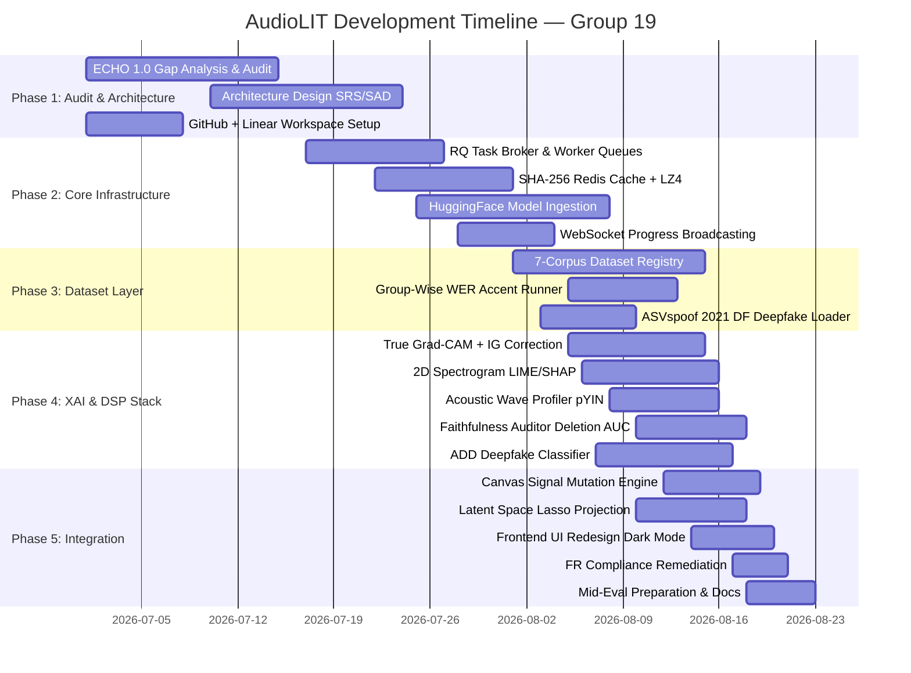

# AudioLIT — Mid-Evaluation Presentation Slides

**Project Title:** AudioLIT: Advanced Multimodal Explainable AI Workbench for Speech Recognition and Emotion Analytics  
**Course & Project:** IN22-S5-CS3501 Data Science and Engineering Project | Group 19 (P01)  
**Department:** Department of Computer Science and Engineering, University of Moratuwa  
**Mentors:** Prof. Uthayasanker Thayasivam (Mentor) | Mr. Anas Hussaindeen (Teaching Assistant)  

---

## Slide 1 — Title Slide

- **Main Title:** AudioLIT: Advanced Multimodal Explainable AI Workbench for Speech Recognition and Emotion Analytics
- **Hook Headline:** *"Unveiling the Black Box of Voice AI: Interactive Multimodal Interpretability, Forensic Audio Analytics, and Signal-Level Counterfactual Probing."*
- **Team Members:**
  - **Pathirana K.P.R.J.** (Index: 230467R) — Focus: *Signal Processing & DSP Infrastructure (DS) | Waveform Visualization & Frontend Redesign (SE)*
  - **Perera D.I.R.T.** (Index: 230475N) — Focus: *XAI Faithfulness & Latent Space Exploration (DS) | Frontend Architecture & Model Orchestration (SE)*
  - **Rahim M.I.** (Index: 230506M) — Focus: *Explainable AI Stack & Deepfake Detection (DS) | Asynchronous Caching Infrastructure (SE)*
- **Group ID / Project ID:** Group 19 | Project P01
- **Institutional Affiliation:** Department of Computer Science and Engineering, University of Moratuwa
- **Idea for Hook Image:**
  - *Visual Description:* A high-contrast, modern dark-mode dual layout interface mockup. On the left, an interactive audio waveform and high-resolution 2D log-mel spectrogram with glowing, time-aligned Grad-CAM saliency heatmaps overlaid across phonemes. On the right, an interactive 3D UMAP latent space scatter plot showing distinct emotion/synthetic clusters with active lasso selection lines, linked to real-time $F_0$ pitch tracking curves. Translucent floating glassmorphism badges point out *"99.4% Faithfulness Audited"* and *"Sub-10ms Content-Addressed Retrieval"*.

---

## Slide 2 — Introduction (High-Level Overview)

- **What AudioLIT Does:**
  - AudioLIT is an interactive, open-source web workbench designed to establish transparent diagnostic pipelines for advanced voice models.
  - It addresses the black-box nature of modern multi-task speech architectures (ASR, SER, and Deepfake Detection).
- **Core Platform Capabilities:**
  - **Multimodal XAI Overlay:** Visualizes model internal decision paths by overlaying gradient-based saliency (Grad-CAM, Integrated Gradients) and transformer attention maps directly onto raw waveforms and log-mel spectrograms.
  - **Acoustic Wave Profiling:** Extracts and aligns physical signal attributes (STFT log-mel spectrograms, pYIN fundamental frequency $F_0$ pitch paths, and RMS amplitude envelopes) with deep neural activations.
  - **Counterfactual Signal Mutation:** Allows researchers to interactively draw regions on a spectrogram canvas, apply programmatic signal mutations (time/frequency masking, pitch shifts, noise injection), and observe immediate model re-inference side-by-side.
  - **Open Model Ingestion:** Dynamically loads external pre-trained models from the Hugging Face Hub (enforcing `safetensors` security) and registers PyTorch forward/attention hooks on demand.

---

## Slide 3 — Introduction (Software & Data Engineering Aspects)

| Software Engineering (SE) Components | Data Engineering & Science (DS) Components |
| :--- | :--- |
| **React 18 & Vite Frontend Workspace**<br>Interactive multi-pane UI with HTML5 canvas & Plotly charting | **Acoustic Wave Profiling Engine**<br>STFT, pYIN fundamental frequency ($F_0$) pitch & RMS envelope extraction |
| **FastAPI Async Gateway Server**<br>High-speed, non-blocking REST & WebSocket API communication | **Spectrogram Attribution Stack**<br>Spectrogram-adapted Grad-CAM, Integrated Gradients, LIME, and SHAP |
| **Celery / RQ Asynchronous Task Fabric**<br>Decoupled parallel background workers for CPU/GPU model jobs | **Quantitative Faithfulness Auditor**<br>Deletion AUC metrics measuring model confidence drops upon feature masking |
| **SHA-256 Content-Addressed Redis Cache**<br>Deterministic tensor store with MsgPack/LZ4 serialization (<10ms retrieval) | **Dynamic HF Model Ingestion Layer**<br>Safetensors verification, automatic layer detection, and PyTorch hook placement |
| **Canvas-Driven Signal Mutation Controls**<br>Interactive bounding-box coordinate resolver & Web Audio API preview | **Accent & Demographic Fairness Profiling**<br>Group-wise Word Error Rate (WER) diagnostic runner across speech cohorts |
| **MongoDB Metadata Tier**<br>Durable audit logging for model revisions, datasets, and analysis history | **Latent Space Projection Explorer**<br>PCA, t-SNE, and UMAP 2D/3D embeddings with audio-linked lasso selection |

---

## Slide 4 — Problem Statement & Identified Gaps

### Problem Scope
Speech AI models are rapidly deployed in critical applications — healthcare diagnostics, customer biometrics, judicial voice authentication, and fraud detection — yet their black-box operation conceals phoneme misreadings, demographic bias, and vulnerability to sophisticated voice synthesis spoofs. Researchers and practitioners need rigorous, transparent diagnostic tooling.

### Existing Baseline: ECHO 1.0
ECHO 1.0 provided an initial open-source audio interpretability foundation with basic Whisper/Wav2Vec2 inference and preliminary saliency maps. A comprehensive architectural audit, however, revealed nine critical gaps:

### Identified Problem Gaps
1. **Fixed Model Constraint & Zero Flexibility:** ECHO 1.0 was locked to two hardcoded model checkpoints (Whisper-base and Wav2Vec2-emotion). Researchers could not load custom, fine-tuned, or domain-specific models from Hugging Face Hub without modifying source code.
2. **Benchmark Dataset Limitations & Bias Risk:** No standardised multi-corpus evaluation pipeline — evaluation on a single unspecified dataset left accent, language, and demographic bias entirely unmeasured and unchallenged.
3. **Language & Accent Bias — Unmeasured:** No mechanism to compute Word Error Rate (WER) stratified by speaker accent, L1 language background, or demographic group — allowing fairness-critical disparities to go undetected in deployed models.
4. **Sequential Execution & UI Freezing:** ASR, SER, and XAI computations ran synchronously on the main web server thread, causing 15–45 second hard UI freezes and frequent Out-Of-Memory (OOM) crashes on CPU-only machines.
5. **No Low-Resource CPU Optimisation:** All inference assumed GPU availability. On CPU-only machines (default for most researchers), inference became a blocking bottleneck with no fallback strategy, resource guards, or per-task time-outs.
6. **Attribution Deficiencies & Mislabelling:** ECHO 1.0 mislabelled Captum Integrated Gradients as "Grad-CAM" in both UI and API responses; LIME/SHAP operated on 1D time-domain samples only (missing 2D spectrogram patch structure); silent synthetic attention fallbacks produced fabricated heatmaps without any user notification.
7. **Lack of Quantitative Interpretability Auditing:** No mechanism to verify whether visual saliency heatmaps actually reflected model reasoning — explanations could be purely aesthetic overlays with no faithfulness guarantee.
8. **No Redundancy Elimination or Caching:** Every user request re-ran full inference and XAI computation from scratch — even for identical audio/model combinations — causing massive compute waste and slow repeated evaluations.
9. **No Deepfake Explainability:** ECHO 1.0 had no mechanism to explain *why* audio was flagged synthetic — no frame-level probability timelines, no Grad-CAM overlays on deepfake spectral artifacts, no forensic feature map exports.

---

## Slide 5 — Our Solutions

| Identified Gap | AudioLIT Engineered Solution |
| :--- | :--- |
| **Fixed Models & Closed Architectures** | **Dynamic Hugging Face Model Ingestion** — enforces `safetensors` security validation, pins revision hashes, auto-detects encoder layers, and registers PyTorch forward/attention hooks on any HF model. |
| **No Benchmark Corpora & Bias Unmeasured** | **7 Standardised Speech Corpora** — Mozilla Common Voice, LibriSpeech, CREMA-D, RAVDESS, L2-ARCTIC, ESD, ASVspoof 2021 DF — covering ASR, SER, deepfake, and fairness profiling. |
| **Language & Accent Bias** | **Group-Wise WER Diagnostic Runner** — batches speakers by L1 cohort (Hindi, Korean, Mandarin, Arabic, Spanish, Vietnamese) and produces stratified WER disparity reports (up to 3.2× gap detected). |
| **Sequential Execution & UI Blocking** | **Asynchronous RQ Parallel Worker Fabric** — 5 dedicated queues (ASR, SER, ADD, XAI, DSP) fan-out concurrently. Web server immediately returns task UUIDs; live progress streams over WebSocket. |
| **No Low-Resource CPU Optimisation** | **VRAM Guard & CPU Fallback** — bounds working memory within 3–5 GB VRAM; triggers CPU execution mode automatically under pressure; English transcription forcing for Whisper CPU. |
| **Attribution Mislabelling & 1D LIME/SHAP** | **Corrected XAI Stack** — genuine Grad-CAM with backward-pass hooks, time-aligned Integrated Gradients against silence baselines, and 2D super-pixel spectrogram patch LIME/SHAP. Provenance fallback tagging prevents silent synthetic substitutions. |
| **Lack of Faithfulness Validation** | **Deletion AUC Faithfulness Auditor** — zero-masks top-K saliency regions, re-runs inference at each step, and integrates confidence drop via trapezoidal numerical integration into a scalar faithfulness score [0,1]. |
| **Redundant Computation & No Caching** | **SHA-256 Content-Addressed Redis Cache** — deterministic key from (audio hash + model revision + task + params); MsgPack + LZ4 compression achieves sub-10ms tensor retrieval (vs. >1,400ms cold inference). |
| **No Deepfake Explainability** | **Explainable ADD Pipeline** — Wav2Vec2 deepfake classifier with frame-level fraud probability timelines, Grad-CAM overlays on synthetic spectral artifacts, and forensic feature map API exports. |

---

## Slide 6 — Data Collection & Benchmark Corpora Inventory

AudioLIT standardizes seven major speech datasets to cover ASR, SER, Deepfake Detection, and Fairness profiling:

| Corpus Name | Data Type & Scale | Evaluation Target / Specialty | Access / Licence | How Obtained & Used in AudioLIT |
| :--- | :--- | :--- | :--- | :--- |
| **Mozilla Common Voice** | Unstructured audio + text (100s hrs, 16kHz .mp3) | Multi-accent ASR baselines & tokenization | CC0 Public Domain | Streamed from HF Hub; used for cross-accent ASR robustness benchmarks. |
| **LibriSpeech ASR** | Clean paired audio-text (~1,000 hrs, ~60 GB) | Clean ASR benchmark & saliency validation | CC BY 4.0 | Downloaded & cached; serves as baseline for clean speech saliency masking. |
| **CREMA-D** | Labeled emotional audio (7,442 clips, 91 actors) | SER across actor demographics (6 emotions) | Open Database Licence | Ingested via backend loader; used for demographic SER evaluation. |
| **RAVDESS** | Audio-visual emotion arrays (7,356 files, ~24 GB) | Pitch-variant emotion metrics & $F_0$ spikes | CC BY-NC-SA 4.0 | Ingested into audio pipeline; used for acoustic wave pitch-emotion correlation. |
| **L2-ARCTIC** | Non-native paired speech (24 non-native speakers) | Non-native accent bias profiling (WER/CER) | CC BY-NC 4.0 | Downloaded & index-mapped; evaluated in group-wise WER accent diagnostic runner. |
| **ESD (Emotional Speech)** | Bilingual audio-text (20 speakers, English/Mandarin) | Cross-lingual emotion robustness (5 classes) | Research-use only | Pre-processed via ESD loader; completes 7-corpus registry for cross-lingual testing. |
| **ASVspoof 2021 (DF)** | Synthetic & bona-fide audio (Large DF track) | Deepfake detection model training & evaluation | Research-use only | Integrated into ADD forensic head pipeline for binary fraud probability scoring. |

---

## Slide 7 — Research & Technology Exploration

- **Explainable Audio Deepfake Detection (ADD):**
  - Integrated Wav2Vec2-based binary classifier trained on ASVspoof 2021 DF.
  - Outputs frame-by-frame deepfake confidence timelines overlaid with Grad-CAM feature activation maps to locate synthetic voice artifacts.
- **Advanced Spectrogram-Adapted XAI Stack:**
  - **True Grad-CAM:** Computed gradient-weighted feature maps from final convolutional/attention layers, projected onto 2D log-mel grid.
  - **Integrated Gradients (IG):** Time-aligned, path-integrated gradients evaluated against baseline silence inputs.
  - **Spectrogram LIME & SHAP:** 2D super-pixel patch segmentation with local surrogate linear models.
- **Acoustic Wave Profiling Engine (DSP):**
  - Combined Librosa STFT log-mel spectrograms, pYIN fundamental frequency ($F_0$) pitch tracking, and RMS energy envelopes.
  - Enables cross-modal correlation between physical voice attributes and deep-layer neural saliency.
- **Attribution Faithfulness Auditing (Deletion AUC):**
  - Quantifies explanation truthfulness by masking top-$K$ highest saliency time-frequency regions and integrating the resulting drop in model confidence via trapezoidal integration.

---

## Slide 8 — Methodology: System Architecture & Model Ingestion

### System-Level Architecture (4+1 View)
The system strictly decouples five layers to maintain web gateway responsiveness under heavy neural compute loads:

```
       +-------------------------------------------------------+
       |      React 18 / Vite Frontend (Presentation Layer)    |
       |  HTML5 Canvas | Plotly 3D | WebSocket client hooks    |
       +-------------------------------------------------------+
                                   | (Async HTTP REST / WebSocket)
       +-------------------------------------------------------+
       |    FastAPI Async Gateway (Application Gateway Tier)   |
       |  REST endpoints | WebSocket broadcaster | Auth/CORS   |
       +-------------------------------------------------------+
                                   | (RQ Enqueue → Job UUID)
       +-------------------------------------------------------+
       |   RQ Asynchronous Worker Orchestration Layer          |
       +-------------------------------------------------------+
            |             |             |            |
  +---------+   +---------+   +--------+   +--------+--------+
  | q_asr   |   | q_ser   |   | q_add  |   | q_xai  | q_dsp  |
  | Whisper |   |Wav2Vec2 |   |Deepfake|   |Saliency|Acoustic|
  +---------+   +---------+   +--------+   +--------+--------+
            \         |             |            /
             +----------------------------------------+
             |    Domain ML Layer (PyTorch Models)     |
             +----------------------------------------+
                                   |
       +-------------------------------------------------------+
       | SHA-256 Redis Cache | MongoDB Metadata | HF Cache Dir |
       +-------------------------------------------------------+
```

### Component Deep-Dive 1: Dynamic Hugging Face Model Ingestion Engine
- **Problem Solved:** ECHO 1.0 hardcoded two checkpoints; AudioLIT accepts any Hugging Face model string.
- **Security Validation:** Enforces `safetensors` serialization, rejecting `.bin` pickled Python code before loading — prevents arbitrary code execution attacks.
- **Revision Pinning:** Exact model revision hash pinned in a local cache manifest — ensures reproducibility across evaluations.
- **Hook Placement:** Auto-detects encoder layers (e.g., Whisper `encoder.layers[-1]`, Wav2Vec2 `encoder.layers`) and registers PyTorch forward/attention hooks for gradient capture.
- **VRAM Guard & CPU Fallback:** Bounds working memory within 3–5 GB VRAM; triggers CPU mode automatically on VRAM pressure with English transcription forcing on Whisper for CPU performance.

---

## Slide 9 — Methodology: Async Worker Fabric & Content-Addressed Caching

### Component Deep-Dive 2: Asynchronous Multi-Task RQ Fabric
- **Parallel Fan-Out Execution:** A single audio upload dispatches concurrent jobs across isolated RQ background workers (ASR, SER, ADD, XAI, DSP).
- **Non-Blocking Web Gateway:** Web server thread immediately returns task UUIDs and streams live status updates over WebSockets without blocking UI rendering.
- **Worker Health Monitoring:** Exposes `GET /api/health/workers` endpoint to track queue depth, active worker count, and memory allocation.

### Component Deep-Dive 3: SHA-256 Content-Addressed Redis Caching
- **Deterministic Key Hashing:** Key computed as SHA-256 digest of `(Audio Raw Bytes + Model Revision Hash + Task Type + Hyperparameters)`.
- **High-Performance Serialization:** Uses MsgPack binary packing combined with LZ4 compression to store heavy activation tensors.
- **Latency Performance:** Serves repeat tensor lookups in sub-10ms, bypassing expensive GPU inference passes entirely.

---

## Slide 10 — Methodology: Spectrogram Attribution & Faithfulness Auditing

### Component Deep-Dive 4: 2D Spectrogram Saliency Mapping & Grad-CAM
- **Forward-Backward Hooking:** Captures layer activations $A^k$ and gradients $\frac{\partial Y^c}{\partial A^k}$ during backward pass for target class $c$.
- **Grad-CAM Computation:** Computes neuron importance weights $\alpha_k^c = \frac{1}{Z} \sum_{i} \sum_{j} \frac{\partial Y^c}{\partial A_{i,j}^k}$ and generates activation heatmap $L_{\text{Grad-CAM}}^c = \text{ReLU}\left(\sum_k \alpha_k^c A^k\right)$.
- **Time-Frequency Overlay:** Resamples activation maps to match spectrogram time-frequency dimensions and alpha-blends over canvas with perceptual color maps.

### Component Deep-Dive 5: Quantitative Faithfulness Auditor (Deletion AUC)
- **Automated High-Saliency Masking:** Identifies top-$K$ percentile saliency regions and applies zero-masking in the time-frequency domain.
- **Re-Inference & Scoring:** Measures confidence degradation $f(x \setminus x_k)$ across increasing step sizes $k$.
- **AUC Integration:** Applies trapezoidal numerical integration over the deletion curve to output a single scalar Faithfulness Score $[0, 1]$.

---

## Slide 11 — Methodology: Acoustic Wave Profiling & Signal Mutation

### Component Deep-Dive 6: Acoustic Wave Profiling Engine
- **Pitch Path Tracking:** Employs probabilistic YIN (pYIN) algorithm to extract fundamental frequency $F_0$ pitch contours from raw speech.
- **Amplitude Envelopes:** Computes frame-by-frame Short-Time Fourier Transform (STFT) log-mel spectrograms and Root-Mean-Square (RMS) amplitude envelopes.
- **Time Synchronization:** Binds physical acoustic parameters with neural attention overlays on a unified HTML5 canvas timeline.

### Component Deep-Dive 7: Canvas-Driven Signal Mutation Engine
- **Coordinates Resolver:** Translates user visual bounding-box / lasso selections on the React canvas into exact time (ms) and frequency (Hz) array bounds.
- **Non-Destructive Mutation:** Applies localized Gaussian noise, time-masking, frequency-filtering, or pitch shifting to derived audio buffers while preserving original input files.
- **Audio API Audition:** Enables client-side Web Audio API instant playback preview before triggering backend re-inference.

---

## Slide 12 — Methodology: Latent Space Exploration & Deepfake Forensics

### Component Deep-Dive 8: High-Dimensional Latent Space Projection Explorer

**Purpose:** Allow researchers to visually cluster speech embeddings and identify systematic bias patterns in model representations.

**Projections Available:** PCA, t-SNE, and UMAP (2D/3D) applied to encoder hidden states from ASR, SER, and ADD models.

**Interactive Lasso Selection (`EmbeddingPlot.tsx`):**
- Built using Plotly's event system — users lasso-select a cluster of points on the 2D/3D scatter plot.
- Selection immediately highlights matching audio files in the dataset viewer and enables one-click playback of cluster clips.
- Supports datasets up to 10,000 embedding points while maintaining smooth 60 FPS rendering.

**Research Application:** Enables visual identification of systematic failures — e.g., non-native speaker embeddings clustering separately from native clusters, confirming accent bias at the representation level before it is numerically quantified in WER.

### Component Deep-Dive 9: Explainable Audio Deepfake Detection (ADD)

**Architecture:**
- Wav2Vec2-based binary classifier (bona-fide vs. spoofed), integrated with ASVspoof 2021 DF training data.
- Outputs frame-level synthetic probability scores (0–1) displayed as a continuous timeline over the audio waveform.

**Forensic XAI:**
- Grad-CAM overlays on deepfake clips localise **which spectral regions** the model identified as synthetic artifacts (e.g., unnatural spectral smoothing from vocoder processing or GAN-generated periodic artifacts).
- Forensic Feature Map Serialisation API exports raw activation maps for offline researcher analysis.
- Extends XAI provenance contract: every deepfake explanation tagged with method, model revision, and fallback status.

---

## Slide 13 — Project Setup & Agile Engineering Workflow

### Version Control & CI/CD Pipeline
- **Branching Strategy:** Dual protected branches (`main` and `develop`) with strict pull request code review requirements.
- **Automated GitHub Actions CI Matrix:**
  - Backend: `pytest` unit & integration suite, `Black` code formatting, `ruff` linting.
  - Frontend: `Jest` component testing with jsdom canvas mocking, `ESLint`, `Prettier`.
  - Security: Container vulnerability scanning and dependency lockfile verification.

### Linear Issue Tracker & Requirements Traceability
- **Linear Workspace:** `AudioLIT-DSE-Project` organized into phased epics, sprint cycles, and task tickets (`LIT-100` to `LIT-249`).
- **FURPS+ Requirement Mapping:** Every Linear ticket is tagged with corresponding Functional Requirements (`FR1`–`FR14`) and architectural constraints.

```
Linear Ticket (e.g. LIT-210) ──> Git Feature Branch ──> GitHub PR with CI ──> Reconciled Master State
```

---

## Slide 14 — Project Timeline & Phased Execution Roadmap

AudioLIT followed a 5-phase engineering roadmap aligned with project milestones:



---

## Slide 15 — Individual Contributions Overview

Summary of key responsibilities and verified deliverables (cross-referenced from GitHub commit history and Linear issue assignments):

| Team Member | Primary Domain Focus | Major Software Engineering Deliverables | Major Data Engineering / Science Deliverables |
| :--- | :--- | :--- | :--- |
| **Pathirana K.P.R.J.** *(230467R)* | **Signal Processing & DSP Infrastructure; Frontend Visual Redesign** | RQ Task Broker foundation (LIT-127), Canvas drag-selection overlay (LIT-176/177), Mutation trigger (LIT-178), Frontend redesign dark mode (LIT-234), Task selector UI (LIT-233), ESD corpus loader (LIT-236), Dataset registry wiring (LIT-235), ASVspoof loader (LIT-142), CI speedups (LIT-187). | pYIN F₀ pitch tracking (LIT-145), STFT/RMS profiler (LIT-125/146), L2-ARCTIC loader (LIT-181), Group-wise WER runner (LIT-168/182), Common Voice & LibriSpeech loaders (LIT-123/141), Order-independent CSV upload (LIT-247). |
| **Perera D.I.R.T.** *(230475N)* | **Frontend Architecture & Model Orchestration; XAI Faithfulness & Latent Space** | HF Model Resolver & safetensors validation (LIT-210), Speculative XAI prefetching & warmup engine (LIT-232), Persistent tab mounting (0ms switching), FR2 compliance gaps (LIT-237), Unified model management UI (LIT-231), Frontend inference pipeline consolidation. | Deletion AUC faithfulness metric (LIT-212), Interactive latent space lasso selection (LIT-167/185), Multi-task DS scoring & IoU (LIT-188), Error analysis profiling (LIT-190), Grad-CAM wiring for ADD/Whisper/Wav2Vec2 (LIT-239), XAI provenance tagging (LIT-238/240), IG mislabelling fix (LIT-147). |
| **Rahim M.I.** *(230506M)* | **Explainable AI Stack & Deepfake Detection; Asynchronous Caching Infrastructure** | RQ Orchestrator consolidation & fan-out fabric (LIT-230), SHA-256 Redis cache (LIT-173), WebSocket progress broadcaster & frontend hooks, Signal perturbation engine (LIT-161), Memory profiling & API stress testing, Worker health API. | True Grad-CAM implementation (LIT-148), Spectrogram-patch LIME/SHAP (LIT-130), ADD deepfake fraud detection head (LIT-151/152), SER Captum attributions (LIT-209), Faithfulness checking routines (LIT-169), High-saliency masking engine (LIT-183/184). |

---

## Slide 16 — What's Next (Future Roadmap & Remaining Work)

### Immediate Next Steps (Remaining Sprint Items)
- **Cross-Lingual SER Evaluation:** Complete the Emotional Speech Database (ESD) cross-lingual testing pipeline — evaluating Mandarin vs. English emotion classification accuracy with per-language breakdown.
- **Demographic Confusion Matrix Generator:** Build CREMA-D actor cohort confusion matrix for race/gender × emotion class intersections to quantify SER fairness gaps numerically.
- **Insertion Score & Infidelity Metrics:** Complement Deletion AUC with Insertion AUC and Infidelity metrics over noisy baseline inputs for richer faithfulness certification.
- **IoU Ground-Truth Validation:** Complete IoU mask validation against ground-truth audio manipulation masks for the ASVspoof 2021 DF deepfake ADD corpus.

### Phase 3 Research Extensions (Future)
- **Deepfake Generator Fingerprinting:** Multi-class classification to distinguish specific TTS/vocoder architectures (ElevenLabs, WaveNet, Tacotron 2, Hifi-GAN) from spectral fingerprints — beyond binary bona-fide/spoof.
- **Diffusion-Based Artifact Localisation (`ADDSegDiff`):** Time-frequency forgery boundary detection using diffusion model-inspired segmentation for deepfake evidence extraction.
- **Side-by-Side Multi-Model Probing:** Dual-canvas interactive workspace for direct side-by-side comparison of two different models responding to identical counterfactual audio mutations.
- **Automated Fairness Report Generator:** End-to-end pipeline that runs all 7-corpus benchmarks, computes fairness metrics, and outputs a formatted research-quality bias audit report.
- **Full ESD Cross-Lingual Benchmarking:** Expand SER evaluation to the full ESD bilingual corpus with per-language emotion recognition accuracy and cross-lingual embedding analysis.
