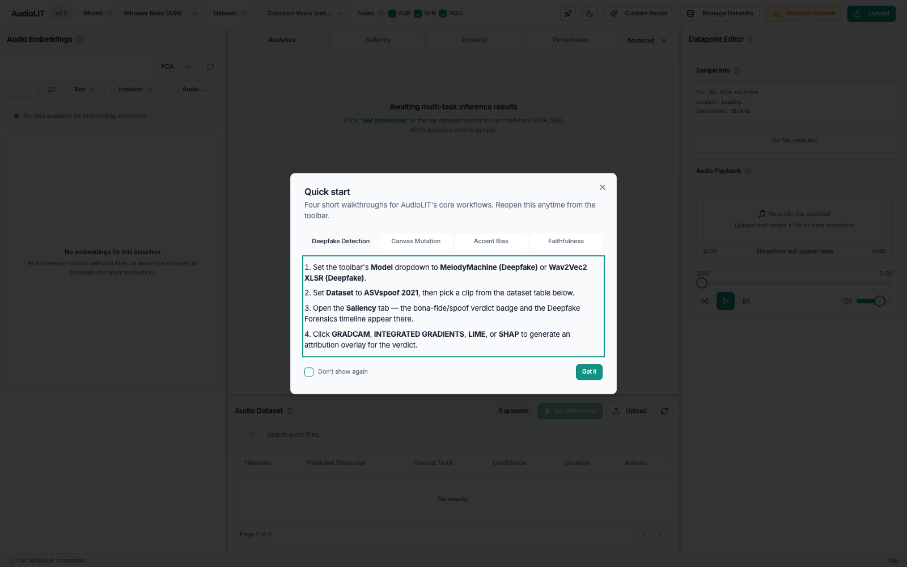
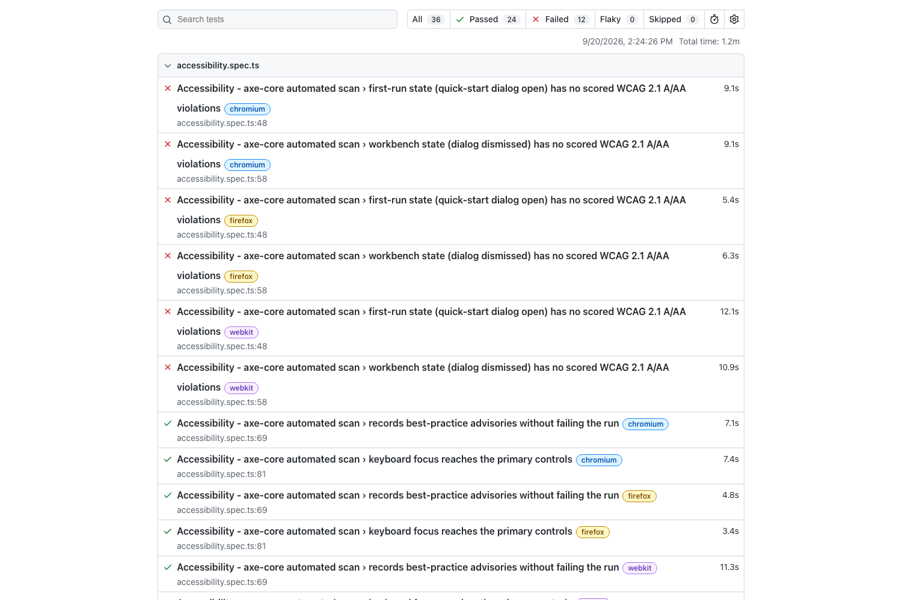
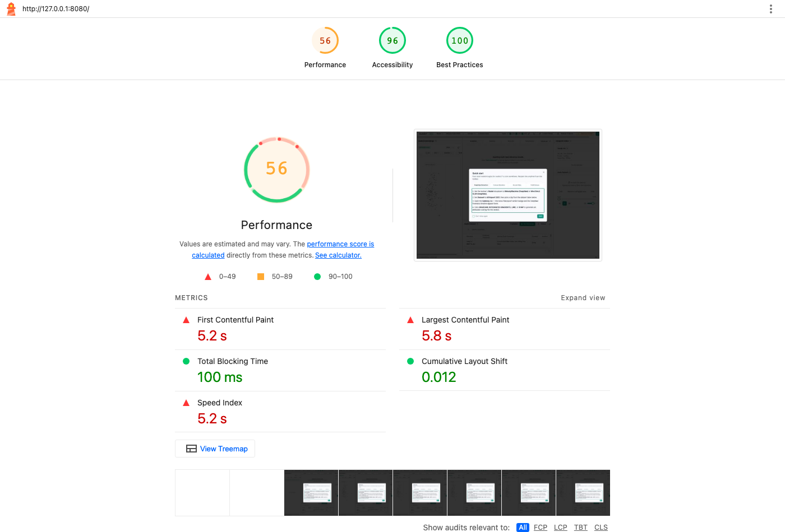
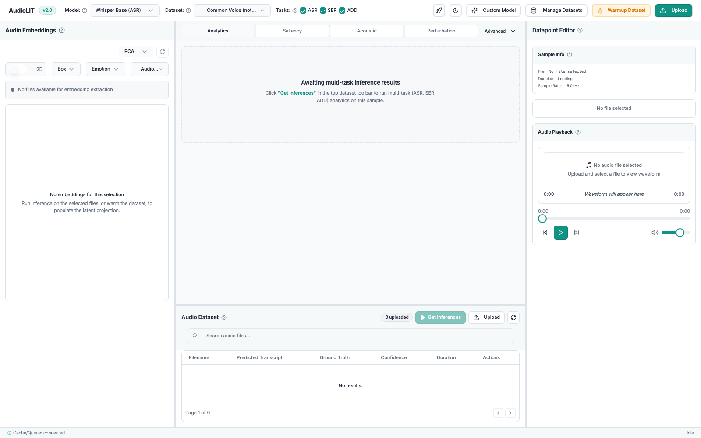
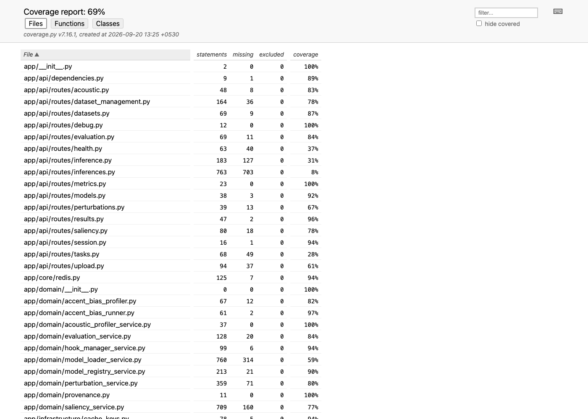

# AudioLIT

# Master Test Plan

**Version 1.0**

This document follows the structure of `Template for Test plan.docx`, the
Rational Unified Process test plan template. Two headings are mis-numbered in
the source template ("Testing Techniques and Types" and "Reporting on Test
Coverage" both render as 1.1). Both are corrected here. All placeholder guidance
text from the template has been removed and replaced with AudioLIT content.

Sections 1 to 3 describe how each technique is designed. Section 4 carries the
results of running them, so this document serves as both the plan and the report
on it.

---

## Revision History

| Date | Version | Description | Author |
| --- | --- | --- | --- |
| 2026-09-20 | 1.0 | Master Test Plan for the AudioLIT Phase 3 test effort. Covers all eight testing techniques required by the template, with executed evidence for each. | Ravindu Pathirana, Tharusha Perera, Rahim Iqbal |

---

## Table of Contents

1. Evaluation Mission and Test Motivation
2. Target Test Items
3. Test Approach
   3.1 Testing Techniques and Types
   3.1.1 Data and Database Integrity Testing
   3.1.2 Function Testing
   3.1.3 User Interface Testing
   3.1.4 Performance Profiling
   3.1.5 Load Testing
   3.1.6 Security and Access Control Testing
   3.1.7 Failover and Recovery Testing
   3.1.8 Configuration Testing
4. Deliverables
   4.1 Test Evaluation Summaries
   4.2 Reporting on Test Coverage
5. Risks, Dependencies, Assumptions, and Constraints
6. References

---

# 1. Evaluation Mission and Test Motivation

This section states why the test effort described by this plan is being
undertaken, what the system under test is, and what this evaluation is trying to
achieve.

## 1.1 Background

**The problem being solved.** Speech and audio machine learning models are used
to make consequential judgements: what a speaker said, how they sounded, and
whether a recording is genuine or synthetic. The models that make these
judgements are opaque. A practitioner can see the answer but not the reasoning,
which makes it hard to tell a correct answer from a lucky one, or to find out
whether a model is failing a particular group of speakers. Existing
interpretability tooling is largely built for text and images, so speech
practitioners have had little support.

**The solution and its major benefits.** AudioLIT is an interpretability
workbench for three speech tasks: Automatic Speech Recognition (ASR), Speech
Emotion Recognition (SER), and Audio Deepfake Detection (ADD). It extends the
open source ECHO 1.0 baseline. Its benefits are:

- One workbench covering all three tasks, so a clip can be analysed by several
  models at once rather than through three separate tools.
- Visual explanations, through saliency heatmaps over the spectrogram,
  attention extraction, and acoustic profiling, so a user can see which part of
  the audio drove a prediction.
- Measured faithfulness, so an explanation is scored rather than merely
  displayed, which is the difference between a picture and evidence.
- Bias profiling across accent groups, so systematic unfairness is measurable
  rather than anecdotal.
- Interactive audio mutation, so a user can alter a region of a clip and see how
  the prediction moves, which answers "what would have changed the answer".

**The planned architecture.** The backend is a FastAPI gateway that performs no
model work on the request path. It validates a request, places it on a queue,
and returns a job identifier. Redis 7 provides the result cache, progress
messaging, and an RQ task queue with five background worker families, one each
for ASR, SER, ADD, explanation work, and audio mutation. Each family runs in its
own process so that only one model is held in memory per process, and the
families bound by graphics memory are limited to one worker each. MongoDB 6
holds durable metadata such as model records and bias reports. The frontend is a
React 18 single-page workbench that follows a running job over a WebSocket and
falls back to polling. The whole stack is containerised.

**A brief history of the project.** AudioLIT is an academic project built by
three developers across four phases: Phase 1 planning, Phase 2 delivering a
minimum viable product, Phase 3 refinement and testing, and Phase 4 submission.
It began from the ECHO 1.0 codebase rather than from nothing, and much of Phase
2 went on reorganising that inherited code into the layered architecture above
and replacing synchronous inference with the background queue. This plan covers
the Phase 3 test effort.

**There is no earlier test report to build on.** The file supplied as the
previous ECHO baseline report was opened and checked. All 11 of its pages are
the unmodified template, with every field still holding placeholder text and no
ECHO content anywhere in it. This Master Test Plan is therefore the first test
document for this system, and it establishes the baseline that later work will
be measured against.

## 1.2 Why testing this product is not ordinary web testing

The motivation for this test effort is shaped by four properties that a general
web application does not have.

**The product is an explanation, not only a prediction.** A wrong transcript is
a visible defect. A saliency map that looks reasonable but does not reflect what
the model actually did is an invisible defect, and it is worse, because the user
acts on it believing it is true.

**Most interpretability outputs have no ground truth.** There is no single
correct heatmap for a clip that a test can compare against. Ordinary
input-and-expected-output checks are not enough on their own, so this plan uses
relationships that must hold between two runs wherever a direct answer does not
exist.

**Inference is slow and not fully repeatable.** The cache is therefore not an
optional speed-up that testing can ignore. The reproducibility claim depends on
it, and the requirements demand that identical requests return identical cached
responses.

**The inherited baseline is known to be defective.** ECHO 1.0 quietly replaced
failed attention extraction with a fabricated pattern and returned it in the
same shape as a real one. It also labelled a panel with the name of one
attribution method while running a different one underneath. Both are treated
here as first-class regression targets, because a workbench built for faithful
interpretation cannot inherit unfaithful interpretation.

## 1.3 Mission for this evaluation

From the concerns offered by the template, this evaluation adopts three.

**Verify a specification.** The committed functional requirements FR1 to FR4,
FR6 to FR12 and FR15 to FR17, together with the security requirements SR1 to
SR7, are written down and independently testable. The main job of this plan is
to show that each one is met, or to report exactly where it is not.

**Find important problems and assess perceived quality risks.** Particular
weight goes to the faithfulness risk above, because that is the risk unique to
an interpretability tool, and to the failure behaviour of the queue and cache
tiers the whole system depends on.

**Advise about product quality.** The audience is the people deciding whether
the system is ready for Phase 4 submission, so this plan reports what was not
tested as plainly as what was.

Three of the template's other concerns are deliberately not adopted, and the
reasons are given so that they do not look like omissions. **Certify to a
standard** does not apply, because no certification target exists for this
academic deployment. **Fulfil process mandates** does not apply, because no
external process mandate governs the project. **Find as many bugs as possible**
is not the goal either; the effort is aimed at the requirements and the
architectural risk areas rather than at maximising a defect count.

## 1.4 Scope boundary

Only committed functionality is in scope. Stretch items are out of scope,
including multi-model side-by-side comparison, which was moved from committed
scope to stretch. There is deliberately no FR5, FR13 or FR14 in the reconciled
requirements, and this document does not test requirements that do not exist.

---

# 2. Target Test Items

The listing below identifies those test items, being software, hardware, and
supporting product elements, that have been identified as targets for testing.
This list represents what items will be tested.

## 2.1 Build under test

The build under test is the AudioLIT integration branch, `origin/testing`, which
is where all feature work is merged. Each result reported in section 4 names the
exact commit it was produced from, so any figure can be traced back to a
specific state of the code.

## 2.2 Items produced by the project team

| Category | Target test items | Relative importance |
| --- | --- | --- |
| API gateway | The FastAPI application and its 17 routers, covering upload, inference, saliency, perturbation, acoustic profiling, evaluation, datasets, dataset management, models, results, session, tasks, metrics, health and debug | High. Every user-facing capability passes through this layer. |
| Interpretability and model engines | Model registry and loader, hook manager, saliency service, acoustic profiler, perturbation service, accent bias profiler, evaluation service, provenance tracking | High. The interpretability claims of the product are implemented here, and they are what the product exists to provide. |
| Task orchestration | The single task orchestrator, the worker launcher, the fan-out and multi-task orchestrators, the session queue, and the five worker families for ASR, SER, ADD, explanation and mutation | High. This is the asynchronous behaviour required by FR3, and it is where two duplicate-module incidents have already occurred. |
| Caching and persistence | The two cache key schemes, the content-addressed cache manager, the Redis keyspace, and the MongoDB metadata store | High. The reproducibility guarantee in FR4.4 depends entirely on this tier. |
| Web workbench | The single-page workbench and its panels for prediction, acoustic profiling, accent bias, faithfulness and embedding; the overlay canvas, waveform viewer, spectrogram grid selector and perturbation tools; the quick-start walkthrough; the shared React contexts; and the job-status hook | High. This is the only interface an end user sees. |
| Deployment assets | The backend and frontend container images, the nginx configuration, the base compose file and the GPU overlay | Medium. Newly added, and not yet covered by an executed run. |
| Test assets | The backend test suite, the frontend component suite, the browser suite, the accessibility suite, the API collection and the load harness | Medium. A defective test is a silent risk, so the harness itself is treated as a target. |

## 2.3 Items the product relies on

These are not produced by the project team, but the product depends on them and
failures surface through them, so they are in scope as targets.

| Category | Target test items | Relative importance |
| --- | --- | --- |
| Machine learning models | Whisper for ASR; a Wav2Vec2 speech emotion model pinned to a fixed revision; a Wav2Vec2 family deepfake detector trained on ASVspoof | High. A model swap or an unpinned revision changes every downstream result. |
| Datasets | Common Voice, LibriSpeech, RAVDESS, CREMA-D, L2-ARCTIC, ASVspoof 2021 DF and ESD | Medium. Licence gated and sub-sampled to stay within the 100 GB working footprint bound. |
| Runtime services | Redis 7 for cache, queues and progress messaging; MongoDB 6 for durable metadata | High. Redis is on the request path, so its failure behaviour is a first-order concern. |
| Third-party libraries | PyTorch, Transformers, Captum, Librosa, soundfile, RQ, FastAPI, pymongo, React, Vite | Medium. Not authored by the team, but defects and security advisories reach the product through them. |
| Operating systems | Ubuntu on the continuous integration runners, macOS and Windows 11 on developer machines | Medium. The product must behave identically on all three. |
| Processor and accelerator hardware | CPU-only hosts, including Apple silicon and x86, against graphics-accelerated hosts | Medium. The split decides whether the CPU fallback path required by FR1.4 is ever exercised, and the committed performance targets assume accelerated hardware. |
| Browsers | Chromium, Firefox and WebKit at desktop widths from 1024 to 1920 pixels | Medium. The workbench is canvas-heavy, and rendering differences between engines are plausible. |
| Supporting infrastructure | Docker and Docker Compose, the continuous integration pipeline, and the Hugging Face model hub | Medium. These gate whether the system can be built, tested and provisioned at all. |

## 2.4 Explicitly out of scope

The availability of the Hugging Face model hub and the training-time accuracy of
the pretrained models are outside the project's control and are not tested.
Browser engine behaviour below the level the browser automation tool can observe
is not tested. Screen reader compatibility is not tested, for the reason given
in section 3.1.3.

---

# 3. Test Approach

This section describes how the items in section 2 are exercised to serve the
mission in section 1.

The approach is automated first. At commit `c9fbd46` the backend carries
**722 collected pytest cases across 59 test files**, the frontend carries
**55 Jest cases across 7 suites**, and the browser suite carries **30 Playwright
cases across three engines**. Alongside these sit a 13-request Postman
collection carrying 39 assertions, an axe-core accessibility suite, and a Locust
load harness. Manual work is kept for what genuinely cannot be automated:
judging whether an explanation looks trustworthy, and screen reader review.

How each of the eight techniques is realised here:

- **Data and database integrity.** Exercised against the Redis keyspace, the
  MongoDB metadata tier, and the dataset loaders, without going through the UI.
- **Function testing.** Black-box route tests and domain tests against every
  committed FR, traced in the matrix in section 4.2, plus an independent
  Postman collection driven by newman.
- **User interface testing.** Jest component tests for the canvas and waveform
  parts, a cross-browser Playwright layout suite, and automated accessibility
  scanning with axe-core and Lighthouse.
- **Performance profiling.** Single-user timing against the eleven SRS section
  3.4.1 targets, with warm and cold paths separated, plus front-end load
  timings from Lighthouse and the new operational metrics tier.
- **Load testing.** Locust driving concurrent users against the real stack.
- **Security and access control.** Mapped one to one against SR1 to SR7, plus
  container image scanning and dependency vulnerability scanning.
- **Failover and recovery.** Reframed from the template's power-cable and disk
  controller model to the failure surface this system actually has: Redis lost,
  MongoDB lost, a worker killed, and a partial task-family failure.
- **Configuration testing.** Across browsers, operating systems, language
  runtimes, the CPU and GPU split, and the new container matrix.

## 3.1 Testing Techniques and Types

### The fault models this plan tests against

Interpretability tooling has failure modes a generic web application plan would
not name, so they are named here once.

1. **Silent unfaithfulness.** A returned explanation that is fabricated or
   mislabelled (FR17, FR9).
2. **Cache-shape corruption.** The right key holding a wrong-shaped value, so a
   consumer reads it instead of falling back to recomputation and fails
   downstream. This is a documented real incident: dataset warm-up once stored
   an ASR result under the transcript family, whose consumers expect a plain
   string, and the accuracy endpoint died on `AttributeError: 'dict' object has
   no attribute 'lower'`.
3. **Silent combination breakage.** Two individually green changes that break
   only together. Also a real incident: one PR added a module importing
   `app.core.settings` while another relocated `settings.py`; neither touched
   the same lines, both merged cleanly, and the combination broke pytest
   collection repository-wide until a third PR fixed it.
4. **Resource exhaustion.** VRAM overflow, the Redis 2 GB cap, and oversized
   uploads against the SR1 bound of 100 MB and 15 minutes.
5. **Partial-failure cascade.** One task family failing must not stop the other
   two returning, per SRS section 3.3.1. Tested in section 3.1.7.

### A note on oracles

The template asks each technique to state its oracle, meaning how the test
decides pass or fail. AudioLIT uses four kinds, and they are named in each
technique below.

**Deterministic.** The expected answer is known, so the test compares directly.
Used for cache keys, licence records, HTTP status codes, typed error codes and
digest stability.

**Tolerance-based.** No single right answer, but a bounded one. F0 and RMS are
checked against a Librosa reference, which FR10.3 explicitly mandates; WER is
checked within a stated delta; latency is checked at a stated percentile.

**Metamorphic.** No ground truth at all, but an invariant must hold between two
runs. This is the most important class here: a warm cache read must equal the
cold computation; identical requests must be byte-identical (FR4.4); masking the
highest-saliency region must drop confidence more than masking an equal-sized
random region (FR16.1); and an attribution labelled Grad-CAM must not equal the
Integrated Gradients output for the same input, which is the FR9 regression
check.

**Tool judgement.** An external tool decides, such as axe-core for WCAG rules,
Trivy for image layers, or pip-audit for known vulnerabilities. This is the
weakest kind, because it only finds what the tool knows about, and it is never
used alone for a claim the other three can make.
### 3.1.1 Data and Database Integrity Testing

The template assumes a SQL database with tables and an ORM. AudioLIT has no
SQL tier. Its persistence is Redis 7 for the cache, the queues and progress
messaging, MongoDB 6 for durable metadata, and a read-only corpus on disk. The
section title is kept as the template writes it, and the content is mapped onto
those three stores. The mapping is deliberate, not a gap.

| Row | Content |
| --- | --- |
| **Technique Objective** | Exercise every read and write path into Redis, MongoDB and the corpus loaders directly, without the UI, so that wrong data, a wrong value shape, document-schema drift, index loss, or payload leaking into the metadata tier can be seen at the point it happens rather than after it is rendered. Accountable to FR4.1 to FR4.4, FR2.1 to FR2.3, SRS section 3.10 and SR5. |
| **Technique** | Drive `RedisCacheManager` directly against fakeredis, asserting round-trip fidelity through its msgpack and lz4 encoding. Assert key uniqueness across the tuple of audio content, model, task and parameters, and that the schema version participates in the key so a schema change cannot collide with old entries. Separately assert the value shape stored under each key family matches what every declared consumer expects. Seed the dataset loaders with valid, truncated, wrong-sample-rate and malformed audio. Force the Redis memory cap and confirm LRU eviction. Force a corrupted cached value and confirm it is treated as a miss and recomputed (FR4.3). Drive the MongoDB store through mongomock for the unit tier, and against the degraded path with the tier switched off. |
| **Oracles** | Deterministic for round-trips and digests, and for FR4.4 byte-identity. Metamorphic for warm against cold, where a warmed entry must equal what the cold computation would have produced. Stated plainly rather than glossed: a naive round-trip oracle passes even when a key holds the wrong-shaped value for its family, which is exactly the incident above, so shape is asserted per key family separately from round-trip fidelity. |
| **Required Tools** | Redis 7-alpine (container `lit-redis`), fakeredis 2.23.2, MongoDB 6 (`mongo:6`, container `audiolit-mongo`), pymongo, mongomock as the serverless oracle, mongosh for manual index inspection, pytest with pytest-asyncio, msgpack and lz4, soundfile and numpy for fixtures. |
| **Success Criteria** | Every key family has at least one shape-assertion test. Every corpus loader has both a valid-data and a malformed-data test. FR4.4 byte-identity is demonstrated. Eviction and corrupt-value-as-miss are both demonstrated. For the metadata tier: all four collections are created; the uniqueness index on `model_id` and the TTL index on `analysis_results` are asserted present; `bias_reports` is asserted to carry no TTL; schema creation is idempotent; re-running an analysis refreshes one document rather than accumulating duplicates; and the privacy boundary, meaning no audio bytes and no tensor payloads in any collection, is asserted explicitly rather than assumed. |
| **Special Considerations** | No SQL tier, so SQL injection and schema normalisation from the template do not apply. Redis persistence is deliberately disabled because every entry is cheaply recomputable, so there is no Redis backup path to test here; that concern moves to section 3.1.7. MongoDB is durable state, so backup and TTL expiry are genuine concerns for it. Tests in this category must stay green with both Redis and MongoDB unreachable, because CI has neither service container. |

### 3.1.2 Function Testing

| Row | Content |
| --- | --- |
| **Technique Objective** | Exercise ingestion, inference, attribution, acoustic profiling, mutation and auditing through the interface a client actually reaches, with valid and invalid data, to verify correct results, correct typed errors, and correct application of every committed rule (FR1 to FR4, FR6 to FR12, FR15 to FR17). |
| **Technique** | Route-level black-box tests through httpx against the live FastAPI app, covering every router. Domain-level unit tests per engine. The highest-value checks: safetensors-only ingestion with rejection before deserialisation (FR1.1, FR1.3); concurrent ASR, SER and ADD dispatch on one clip (FR3.1); SER returning a full distribution over at least six categories with top-1 and confidence (FR6); ADD returning a binary judgement with confidence (FR7.1); Grad-CAM being genuinely gradient-weighted and not equal to the Integrated Gradients output for the same input (FR8.2 against FR9); fallback-derived attributions carrying a provenance flag (FR17.1); F0, RMS and log-mel validated against Librosa (FR10); mutations preserving the original and returning a correctly shaped 16 kHz mono clip (FR12); per-cohort WER disparity over L2-ARCTIC (FR15.1); and the top-K deletion-score audit (FR16.1). Run the same surface a second time from an independent harness: a Postman collection executed headless by newman. |
| **Oracles** | Deterministic for contracts, meaning status codes, typed error codes, schema shape and label-set membership. Tolerance-based for numeric outputs against a Librosa reference and for WER within a delta. Metamorphic for the interpretability claims themselves, because no ground-truth saliency map exists to compare against. Stated plainly: a saliency map's correctness is not directly assertable, and faithfulness metrics are the deliberate substitute. |
| **Required Tools** | pytest, pytest-asyncio, httpx and fakeredis for the in-process tier. Postman as the collection format and newman as the headless runner for the black-box tier. Jest with Testing Library for frontend component logic. Captum and Librosa as reference implementations. A live stack of Redis, the API and the five workers. |
| **Success Criteria** | Every committed FR traces to at least one executed test in the section 4.2 matrix. Every route has both a happy-path and an invalid-input test. Both inherited baseline defects have a regression test that would fail against pre-fix ECHO 1.0 behaviour. The black-box run passes with no failed assertions. |
| **Special Considerations** | Model downloads make cold-path tests slow and network-dependent, so Hub-downloading tests are gated behind `AUDIOLIT_HUB_TESTS=1`. Inference is not deterministic in general, so tests pin model revisions or assert on tolerance, never on exact floating-point equality. Any test calling a task-orchestrator function needs a `broker` fixture even when the domain call is mocked, because the orchestrator wrapper itself touches Redis. The two tiers deliberately overlap: the pytest tier imports the application, while the collection speaks to it over a socket, so the pytest tier can pass while the deployed contract is broken. |

### 3.1.3 User Interface Testing

| Row | Content |
| --- | --- |
| **Technique Objective** | Verify navigation, panel state, canvas interaction and playback synchronisation across the workbench, and confirm the UI meets the SRS section 3.2.3 accessibility target of WCAG 2.1 AA. |
| **Technique** | Jest with Testing Library for the interaction-heavy primitives. Playwright across Chromium, Firefox and WebKit at three desktop widths, checking that no panel forces the page to scroll sideways. axe-core through Playwright for WCAG 2.1 A and AA rules. Lighthouse for a whole-page score. A keyboard walk that presses Tab repeatedly and records what receives focus. System-specific checks: time synchronisation between playback, the F0 contour and the attribution overlay (FR10.2); the alpha-blend control and perceptually uniform colour scale on overlays (FR8.4); the Web Audio preview before dispatch (FR12.2); and a fallback-derived attribution being visibly distinguished in the UI, not only flagged in the API response (FR17.1). |
| **Oracles** | Deterministic for component behaviour and the overflow check, where document scroll width must not exceed client width. Tool judgement for the WCAG rules. Not automatable, and stated rather than hidden: whether an explanation reads as interpretable to a first-time user, and whether progressive disclosure achieves the SRS section 3.2.1 goal. |
| **Required Tools** | Jest 29 with jsdom, Testing Library, Playwright 1.63 with all three engines, `@axe-core/playwright` 4.13.0 with axe-core 4.13.0, and Lighthouse 13.5.0. |
| **Success Criteria** | Every committed panel has at least one automated test. No horizontal overflow at any tested width in any engine. No scored WCAG 2.1 A or AA violation. Keyboard traversal reaches every interactive control in a logical order. |
| **Special Considerations** | Canvas and WebGL content is largely opaque to DOM assertions, so these tests assert on the state driving the canvas rather than on pixels. jsdom has no real Web Audio or Canvas 2D, so those are mocked in Jest and only covered for real in the Playwright pass. Automated scanning finds only part of what is wrong: axe-core reports a separate incomplete list needing human judgement, and those are recorded rather than counted as passes. Screen reader testing with JAWS, which the resource list names, was not performed, because JAWS is Windows-only and the accessibility pass ran on macOS. That is stated as a gap in section 5 rather than quietly skipped. |

### 3.1.4 Performance Profiling

Every figure here is anchored to the SRS section 3.4.1 performance table,
reproduced as the requirement baseline.

| Operation | SRS 3.4.1 target | Notes |
| --- | --- | --- |
| Cached tensor retrieval | under 10 ms | SHA-256 cache hit (FR4) |
| API response for a cached request | under 200 ms | End to end, including deserialisation |
| Cache miss to task enqueue | under 50 ms | Validation, hashing, acknowledgement |
| Cold ASR inference, Whisper-base, 15 s audio | under 3 s | GPU, inherited model |
| Multi-task inference, ASR plus SER plus ADD | under 8 s cold | Concurrent workers, instant on a cache hit (FR3) |
| Interpretability attribution, IG or saliency | under 8 s | Captum, 15 s clip (FR8, FR9) |
| Canvas mutation, UI response | under 500 ms | Targeting 30 to 60 FPS (FR12) |
| Canvas mutation, backend result | under 2 s | Per perturbation |
| Accent bias profiling | under 30 s | L2-ARCTIC cohort batch with cache reuse (FR15) |
| Faithfulness audit | under 15 s | Per clip, deletion score (FR16) |
| Cold model download plus hook registration | under 60 s | Bounded by Hub bandwidth (FR1) |

| Row | Content |
| --- | --- |
| **Technique Objective** | Measure single-user response times and resource use for each operation above, under normal single-user load, and compare against the SRS targets on stated hardware. |
| **Technique** | Time each operation across repeated runs, reporting median and 95th percentile rather than one sample. Keep cached and cold paths separate so a warm hit is never counted as a cold run. Profile memory with `scripts/run_memory_profile.py`, asserting on growth across iterations rather than absolute RSS, which is host-dependent. Measure the frontend with Lighthouse against the production build rather than the development server. Capture the exported operational metrics alongside the wall-clock figures and reconcile the two. |
| **Oracles** | Tolerance-based against the numeric budgets above, with the measurement method stated beside every figure. The confound is stated rather than hidden: the SRS targets assume an NVIDIA T4 class GPU, and both evaluation hosts are CPU-only, so model-bound targets are not meaningfully assessable from them. |
| **Required Tools** | Locust for API timings, Lighthouse 13.5.0 for the client, `test_performance_load.py`, `test_memory_profiling.py` and `scripts/run_memory_profile.py` for the in-process tier, the LIT-259 metrics endpoint for the system's own view, and `/health/workers` for queue depth. |
| **Success Criteria** | The infrastructure targets, which are not bound by model speed, are met. The model-bound targets are measured and reported with hardware stated, and any deviation is explained rather than concealed. |
| **Special Considerations** | Measured on a quiet machine, since background load invalidates the figures. The first call after a worker starts includes model load time and is reported separately. Instrumentation measures the system's own view and is not independent verification of it, so external timing governs any pass or fail claim against SRS 3.4.1. |

### 3.1.5 Load Testing

| Row | Content |
| --- | --- |
| **Technique Objective** | Put the system under concurrent load and observe whether response times, queue depth and failure rate stay acceptable past the ordinary working point, and confirm it degrades rather than collapses. |
| **Technique** | Drive the running stack over HTTP the way a browser does, with a weighted mix of cached prediction reads, job enqueues, attribution requests, cold predictions, acoustic profiling and health checks. Warm the cache for the clips used by the cached path before measuring, so that statistic measures hits rather than first runs. Score the observed 95th percentile against the SRS budgets. Observe queue depth per family and worker saturation under the concurrency-1 GPU pin. |
| **Oracles** | Tolerance-based against the SRS section 3.4.1 budgets, using the 95th percentile rather than the mean, because the targets describe what a user should reliably get. The decisive oracle is behavioural rather than numerical: past saturation the system must queue and degrade, never corrupt state, silently drop a job, or lose a progress message. A job once enqueued must always be observable. |
| **Required Tools** | Locust driving `Backend/loadtests/locustfile.py` against a live Redis, API and five-worker stack, with `/health/workers` for queue depth. |
| **Success Criteria** | No request failures. The infrastructure targets are met at the 95th percentile. No data loss or silent job drop at or beyond saturation. |
| **Special Considerations** | Concurrency is kept modest on CPU. Attribution takes seconds per request on this hardware, so a high user count measures a queue backing up rather than the system's response. The GPU families are deliberately pinned to concurrency 1 under SRS constraint C2, so queueing past that point is correct behaviour, not a defect. The harness enforces only the infrastructure targets unless `LOADTEST_ENFORCE_MODEL_TARGETS=1` is set. |

### 3.1.6 Security and Access Control Testing

Mapped one to one against SR1 to SR7, plus the inherited items in SRS section
4.5.

| Row | Content |
| --- | --- |
| **Technique Objective** | Verify upload validation, model-deserialisation safety, session isolation, data minimisation in cache keys and logs, and remediation of every inherited ECHO 1.0 exposure point. Add a level the template predates: that the dependencies and images the product ships carry no known unpatched vulnerabilities. |
| **Technique** | SR1: submit oversized, over-duration, wrong-MIME, magic-number-mismatched, zero-byte and malformed audio, and confirm rejection before hashing. SR2: attempt to ingest a pickle checkpoint disguised as a model artefact and confirm refusal before any deserialisation, which is the highest-severity check here because it prevents arbitrary code execution. SR4: confirm uploaded audio is purged on its TTL. SR5: inspect cache keys and logs for filenames, session identifiers and transcripts. SR6: confirm the inherited unauthenticated debug endpoint and wildcard CORS are hardened, and attempt cross-session dataset access with a forged session cookie. SR7: scan both dependency trees and the built images. Attempt path traversal against every route accepting a file path. |
| **Oracles** | Deterministic for access rules and typed rejection codes: a rejection must surface as an explicit typed error with the right status, and a cross-session attempt must return a refusal and never leak data. Tool judgement for the scans. A necessary caution, stated rather than implied: a passing security test proves the specific tested attack failed, not that the system is secure in general, and scanner output is an oracle only for known advisories at scan time. |
| **Required Tools** | pytest with `test_security.py`, `test_session_cookie.py`, `test_debug_and_tasks_routes.py`, `test_dataset_service.py` and `test_dataset_management_routes.py`; `npm audit`; `pip-audit`; Trivy in CI for image layers; curl for raw header and CORS probing; safetensors for format verification. The resource list names OWASP and CheckMarx for this row; the OWASP API risks are used as the checklist and the scanners take the place of a commercial product. |
| **Success Criteria** | Every SR1 to SR7 clause has at least one executed test. Every inherited exposure is either demonstrably remediated with evidence or recorded here as outstanding with an issue id. Every advisory found is recorded with its severity and whether it reaches production code. |
| **Special Considerations** | AudioLIT has no user authentication or role-based access model. It is single-tenant and session-cookie scoped, appropriate to its academic deployment target, so the template's "test each user type's permissions" does not apply, which is stated explicitly rather than left looking unaddressed. TLS is a deployment-time concern and is not testable against localhost. A dependency advisory is not automatically an exploitable defect: several findings below sit in build tooling that never runs in production, and they are reported with that distinction made rather than as one alarming count. |

### 3.1.7 Failover and Recovery Testing

The template frames this section around power loss, network cables and disk
controllers. That is not this system's failure surface. The section is reframed
to the dependencies AudioLIT actually has, keeping the template's intent exactly:
force a failure and watch the recovery.

| Row | Content |
| --- | --- |
| **Technique Objective** | Force each dependency to fail while the system is serving, observe what it does, then restore the dependency and observe whether it recovers without human intervention, with no data loss and no silently wrong answer, which is the one unacceptable outcome. |
| **Technique** | A scenario matrix. F1, run with the MongoDB tier off and call every store method. F2, stop Redis while the API is serving. F3, restart Redis and re-test without restarting the API. F4, kill the workers abruptly and immediately restart them. F5, apply the manual recovery. F6, inspect what the worker health endpoint reports after a crash. Plus the end-to-end check that a full multitask job completes once the stack is clean. |
| **Oracles** | Deterministic for the intended degraded responses, in particular that health returns 503 with a degraded body rather than 500 when Redis is gone, and that metadata writes become no-ops rather than raising. Self-consistency between what the documentation promises and what the code does. The strongest single oracle is the retryable against non-retryable classification, because that is what makes recovery automatic. |
| **Required Tools** | Docker for stopping and starting Redis, `pkill` for worker failures, the FastAPI TestClient for isolating where a failure originates, direct Redis inspection for lock and registration state, and the RQ failed-job registry. |
| **Success Criteria** | No dependency failure produces an unhandled 500. Each dependency recovers on restoration without restarting the application. A killed worker can be restarted immediately. No in-flight job becomes permanently unobservable. |
| **Special Considerations** | These scenarios are destructive and were run last, after all other evidence had been captured, against a local stack only. There is no redundant infrastructure and no continuous SLA: recovery is by cheap resubmission, which is an explicit architectural decision rather than an untested gap. |

### 3.1.8 Configuration Testing

| Row | Content |
| --- | --- |
| **Technique Objective** | Verify the product behaves the same across the browser engines, operating systems, language runtimes, accelerators and deployment topologies it is expected to run on, and identify any configuration-dependent behaviour. |
| **Technique** | Browsers: Playwright across Chromium, Firefox and WebKit at three widths. Operating systems: macOS, Windows 11 and Ubuntu on CI. Runtimes: Python 3.10 on CI against 3.11 locally, Node 20 on CI against Node 26 locally. Accelerator: CPU-only against GPU. Redis: containerised against unreachable. Topology: the native development setup against the containerised stack. |
| **Oracles** | A cross-configuration differential oracle: the same functional suite must produce the same pass or fail outcome across configurations, and any divergence is itself the finding rather than noise to average away. CI is the continuous instance of this oracle. Numeric outputs may legitimately differ slightly between CPU and GPU floating-point paths, and where that matters a tolerance is stated rather than asserting exact equality. |
| **Required Tools** | GitHub Actions, Playwright's three engine projects, Docker Compose, local Python and Node environments on each host. |
| **Success Criteria** | The functional suite passes on every declared supported configuration. The CPU fallback path is exercised in at least one. No browser-specific layout failure. Any configuration-dependent divergence is quantified rather than left unexamined. |
| **Special Considerations** | CI deliberately installs the CPU-only torch wheel, so CI never exercises the GPU path at all, and GPU coverage is necessarily manual and local. That is stated plainly rather than implying CI covers it. |

---

# 4. Deliverables

This section lists the artefacts created by the test effort that give direct,
tangible benefit to a stakeholder, and by which the success of the test effort
should be measured. Every result in this report is reported here; section 3
describes how each technique was designed, and this section reports what running
it produced.

- Backend test logs and summary
- Frontend component test logs and summary
- Static analysis and production build logs
- Cross-browser and accessibility reports
- Black-box API collection and run report
- Load test report scored against SRS section 3.4.1
- Accelerated inference measurements
- Failover scenario matrix
- Dependency and container image scan output
- Containerised deployment report
- Defect register
- Requirement to test traceability matrix and line coverage report
- Continuous integration history

## 4.1 Test Evaluation Summaries

**Form and content.** Each automated run records the suite name, the tests
collected, passed, failed and skipped, the wall-clock duration, the commit it ran
against, and the exact command, so that anyone can reproduce it. Manual results
are recorded as a dated observation naming the reviewer.

**Frequency.** The automated suites run on every pull request through continuous
integration. The fuller pass, meaning load, failover, accessibility, dependency
scanning and the containerised run, is produced at each milestone and once before
Phase 4 submission.

**Environment.** Two hosts were used, both running against the same commit.

| Item | macOS host | Windows host |
| --- | --- | --- |
| Hardware | Apple M3 Pro, 18 GB, 14-core GPU | Windows 11 |
| Python | 3.11.15 | 3.11.0 |
| Node | 26.4.0 | 20 |
| PyTorch | 2.13.0, no CUDA, MPS available | 2.13.0, CPU |

---

### Backend test logs

The backend suite is the largest single body of evidence in this effort. It is
run with `REDIS_URL` pointed at an unreachable port, which reproduces the
condition continuous integration runs under, where no Redis service container
exists. The code under test talks to `fakeredis` and `mongomock`, in-memory
substitutes injected by fixtures; the unreachable port is a guard that stops a
test silently passing against a developer's local Redis. Logs are produced on
every run and reviewed before any branch is pushed.

```
cd Backend
REDIS_URL="redis://127.0.0.1:1/0" pytest -q --tb=short

collected 722 items
716 passed, 6 skipped, 406 warnings in 135.04s (0:02:15)
```

**722 collected, 716 passed, 0 failed** on macOS. The Windows host reported 715
passed and 7 skipped from the same 722, also with zero failures.

Every skip is environment-gated with a stated reason, so none is a silent
omission: two require a reachable broker, two require GPU or CUDA resources, and
three download roughly 1.2 GB from the model hub and are gated behind an
environment variable.

The skip count differs between hosts because `test_fanout_orchestrator.py` reads
a **separate** `TEST_REDIS_URL`, defaulting to the standard Redis port, rather
than the variable the documented command sets. Skip counts are therefore not
comparable across hosts, which is recorded as defect D8.

---

### Frontend component test logs

Component behaviour is covered by Jest with Testing Library, concentrated on the
interaction-heavy canvas, waveform, grid selector, perturbation and quick-start
components. These run on every pull request.

```
cd Frontend && npm test -- --silent

Test Suites: 7 passed, 7 total
Tests:       55 passed, 55 total
Time:        5.833 s
```

**7 of 7 suites and 55 of 55 tests passed**, identically on both hosts.

---

### Static analysis and production build logs

Static analysis runs on every pull request and blocks the merge on any error.
The production build log is kept because bundle size is a standing risk.

```
cd Frontend && npm run lint
✖ 113 problems (0 errors, 113 warnings)

cd Frontend && npm run build
✓ 2585 modules transformed.
dist/assets/index-CIsQwW4P.js   5,913.76 kB │ gzip: 1,763.97 kB
✓ built in 11.10s
```

**Zero errors** on both hosts; the warnings are loose typing on WebSocket
payloads, two deliberately partial dependency arrays, and a fast-refresh
advisory. None blocks the build.

The build log carries one standing finding, recorded as observation O1: the
application ships as a single 5.9 MB chunk, 1.76 MB gzipped, and the build tool
itself warns that chunks above 500 kB should be split.

---

### Cross-browser and accessibility reports

Layout is verified across three browser engines at three desktop widths, and
accessibility is scanned with axe-core inside the same browser automation, plus
Lighthouse for a whole-page score. These are produced per milestone and after any
change to shared layout or styling.

```
cd Frontend && npm run test:e2e
24 passed, 6 failed (32.5s)
```

**Every layout and component assertion passed in Chromium, Firefox and WebKit.**
The six remaining results are the same two accessibility assertions repeated once
per engine, so they are one finding observed three times rather than six distinct
problems. That they reproduce identically in all three confirms the cause is the
markup rather than any one browser.

The accessibility scan was run in two states, because the first-run state shows
the quick-start dialog over the workbench, and a modal hides the application
behind it from any scanner.

| State | Scored WCAG 2.1 A and AA findings | Detail |
| --- | --- | --- |
| First run, dialog open | 1 rule | `color-contrast`, serious, 6 nodes |
| Workbench, dialog dismissed | 4 rules | `button-name`, critical, 18 nodes; `label`, critical, 1 node; `aria-input-field-name`, serious, 2 nodes; `color-contrast`, serious, 6 nodes |

axe-core additionally passed 27 checks, listed 2 items as needing human review,
and reported 3 advisory best-practice rules. The keyboard walk reached 15
focusable controls in 15 presses with no dead stops, so the workbench is
navigable without a mouse.

The findings fall into two narrow classes, both fixable without structural
change: missing accessible names on select triggers and icon-only buttons, 9 in
panel components, 5 in audio components and 4 in layout components; and colour
contrast on badge and button styles, measured at 3.37 to 1 against the 4.5 to 1
required, on 10px text.

**A methodological result worth keeping.** A single Lighthouse run against the
default landing page reported an accessibility score of 100, while axe-core found
the violations above in the same application, because Lighthouse had scanned the
first-run state where the modal hides the workbench. Scanning two states rather
than trusting one default-state score is what made the real picture visible. The
first-run state is shown below; the workbench behind the dialog is what a
single-state scan never reaches.



The browser automation tool's own report is reproduced below. The scoped command
above runs the three layout and accessibility projects, 30 tests in total.



**Running the unscoped command adds the full-stack data-flow project**, which
requires live models and a working cache. Against the containerised deployment
all 36 tests ran and **24 passed, 12 failed**: the same 6 accessibility
assertions, plus all 6 data-flow tests. Those six cover prediction repeatability,
transcript rendering, clip selection binding, deepfake confidence and attribution
provenance, and they are consistent with the cache defect D11 below combined with
the container's empty model cache. They were not re-run natively, so they are
reported as corroborating D11 rather than as an independent finding.

The Lighthouse report below is from the containerised deployment. The screenshot
is the tool's own output, not a transcription of it.



---

### Black-box API collection and run report

An independent Postman collection exercises the HTTP contract from outside the
application, complementing the in-process route tests. It is committed at
`Backend/apitests/AudioLIT.postman_collection.json` and runs headless through
newman, so it can be executed against any deployment.

```
npx newman run Backend/apitests/AudioLIT.postman_collection.json \
  --env-var baseUrl=http://127.0.0.1:8000

requests     13 executed, 0 failed
assertions   39 executed, 0 failed
total run duration 1876ms
average response time 132ms
```

**All 39 assertions passed against the native stack.** Two behaviours are worth
naming because they are easy to get wrong and are correct here. Resolving a
supported model returns a 40-character commit identifier rather than a mutable
branch name, plus a 64-character weight digest, so a result can be tied to exact
weights. Resolving an unsupported architecture is refused with a typed code and a
message naming the supported families, rather than loading something the system
cannot explain.

Run again against the containerised deployment, **37 of 39 assertions passed**;
the two failures are the container-only cache defect reported below.

---

### Load test report

The load harness drives the running stack over HTTP with a weighted mix of cached
reads, job enqueues, attribution, cold predictions and health checks, and scores
the 95th percentile against the committed performance targets. It is produced per
milestone, on a quiet machine.

```
locust -f loadtests/locustfile.py --host http://127.0.0.1:8000 \
       --headless -u 8 -r 2 -t 3m
```

**979 requests, 0 failures, a 0.00 percent failure rate.**

| Operation | Requests | 95th percentile | Budget | Verdict |
| --- | --- | --- | --- | --- |
| Cached prediction | 583 | 10 ms | 200 ms | Pass |
| Enqueue multitask | 323 | 21 ms | 50 ms | Pass |
| Health | 65 | 14 ms | not budgeted | Recorded |
| Cold prediction | 2 | 6400 ms | 3000 ms | Sample too small to judge |
| Attribution | 5 | 44000 ms | 8000 ms | Sample too small to judge |
| Acoustic profile | 1 | 2500 ms | 2000 ms | Sample too small to judge |

Both enforced targets passed with a wide margin. Enqueue acknowledgement at 21 ms
against a 50 ms budget is the most important figure for the architecture claim,
because it demonstrates that the request path hands work to the queue rather than
doing it inline. The three model-bound rows are reported as not judgeable: the
harness requires 20 samples before scoring a target and these drew 1, 2 and 5,
because each occupies a worker for seconds on this hardware.

One limitation of this deliverable is worth stating, because this run
demonstrated it. The harness measures the HTTP exchange, and it reported a clean
0.00 percent failure rate during a window in which a background worker was
failing every job it accepted, because those failures occur after the response
has been returned. Load testing alone cannot see that; the failover inspection
below is what caught it.

---

### Accelerated inference measurements

The committed performance targets assume accelerated hardware. Neither host has
an NVIDIA device, but the macOS host is an Apple M3 Pro whose 14-core integrated
GPU is reachable through the Metal Performance Shaders backend, which makes the
model-bound rows measurable on real acceleration. Whisper-base was timed on a
3.9 second clip, five runs after a discarded warm-up.

| Device | Model load | Inference, median | Range | Speed relative to real time |
| --- | --- | --- | --- | --- |
| CPU | 1177 ms | 242.4 ms | 241.3 to 242.9 ms | 15.9x |
| Apple MPS GPU | 1573 ms | 118.1 ms | 117.6 to 129.7 ms | 32.7x |

**The GPU is 2.05 times faster, and both devices returned an identical
transcript,** so acceleration changes the speed and not the answer. Scaled to the
15 second reference clip the requirements name, this is roughly 940 ms on CPU and
460 ms on the GPU against a 3 second budget, so the cold ASR target is met on this
hardware by a wide margin.

Two cautions keep this honest. These are pure inference timings with the model
already resident, a different measurement from the end-to-end figure under load
above. And an Apple GPU is not the reference device the requirements assume, so
this shows the targets are reachable on accelerated hardware rather than
certifying them against that device.

**The application cannot currently use this GPU**, which is defect D9: every
device selection in the codebase chooses between CUDA and CPU only, with no MPS
branch anywhere, so on Apple silicon every model runs on the CPU while an idle
GPU sits beside it.

---

### Failover scenario matrix

Each dependency is deliberately failed while the system is serving, then
restored, and the behaviour is recorded. This deliverable is destructive and is
produced once per milestone, against a local stack, after all other evidence has
been captured.

| Scenario | Outcome |
| --- | --- |
| F1, MongoDB tier unavailable | Degrades correctly on every data method; writes return false and reads return empty without raising. One method breaks the pattern and raises, recorded as D1 |
| F2, Redis lost while serving | **Every endpoint returns 500, including health, instead of the intended 503.** Recorded as D2 |
| F3, Redis restored | **Passes.** Health returns to 200 and enqueue works again with no application restart |
| F4, abrupt worker kill then immediate restart | **Only one of five families starts.** The four GPU-bound families refuse for about seven minutes. Recorded as D3 |
| F5, manual recovery | **Passes.** Clearing the locks and stale registrations brings all five families up cleanly |
| F6, worker health after a crash | Reports six active workers when one process is alive. Recorded as D4 |

F2 was isolated rather than assumed. With Redis pointed at a dead port, the same
request was made twice against the same application object:

```
with SessionMiddleware:     500 Internal Server Error
without SessionMiddleware:  503 {"status":"degraded","redis":false,
                                 "detail":"Error 61 connecting to 127.0.0.1:1. 61."}
```

The health route is written to degrade, but the session middleware runs before
routing on every request and issues an unguarded Redis call, so the route's own
handler is never reached.

**End-to-end verification after recovery.** With all five families cleanly
restarted, a full multitask job over a real corpus clip was enqueued and polled to
completion: acknowledged in 23 ms and finished successfully within 4 seconds, with
the aggregator combining all three family results. Emotion recognition returned a
real distribution and deepfake detection a real judgement at 0.92 confidence.
Speech recognition returned scaffold output, which is defect D5.

---

### Dependency and container image scan output

Three scanners cover different layers. Image-layer scanning runs on every build
in continuous integration through Trivy. Application-dependency scanning is run
manually per milestone and is not yet wired into the pipeline, which is a gap
worth closing.

`npm audit` reports **23 vulnerabilities: 2 critical, 15 high, 5 moderate, 1
low**. The two critical findings are the ones to act on first, because they reach
the plotting library that renders the projection panel, which is a direct runtime
dependency executing in the user's browser. The build-tooling findings do not
ship.

`pip-audit` reports **9 distinct advisories across 3 packages**. Seven are in the
web framework layer that sits directly on the request path and matter most. One
is in the test runner and does not ship, which is checkable because the
dependency files are split so that production images install runtime
requirements only. One has no published fix and can only be tracked.

---

### Containerised deployment report

The full stack was built and run from the compose definition, and the API
collection was executed against it, to confirm the containerised topology behaves
the same as the native one. This deliverable is produced whenever the deployment
definition changes.

Both images build, at 538 MB for the backend and 103 MB for the frontend, and all
five services start. The API serves correctly from inside the container network
with all five worker families registered, and the web container serves the built
frontend.



**The differential run found three container-only defects that no native run
could have found.**

| Check | Native | Containerised |
| --- | --- | --- |
| API assertions passed | 39 of 39 | **37 of 39** |
| Cache miss returns 200 or 404 | Pass | **Fail, returns 500** |
| Worker service health | Not applicable | **Reported unhealthy while working** |
| Lighthouse performance | 75 | **56** |
| Main bundle transfer size | 1.76 MB gzipped | **5.9 MB uncompressed** |

**D11, the cache tier is non-functional in containers.** The compose file supplies
`REDIS_URL`, but the content-addressed cache manager reads `REDIS_HOST`,
`REDIS_PORT` and `REDIS_DB` and falls back to `localhost`. There is no Redis
inside the api container, so every route backed by that cache fails with
`ConnectionError: Error 111 connecting to localhost:6379`. The native
configuration hides this because a developer machine usually has Redis on
localhost.

**D10, the worker is permanently reported unhealthy while working correctly.** It
defines no healthcheck, so it inherits the API's from the shared image, which
requests an HTTP endpoint. A worker container runs no HTTP server, so the probe
always fails. Any orchestrator acting on health status would treat a healthy
worker as failed and could restart it in a loop.

**D12, assets are served uncompressed.** The nginx configuration contains no
compression directive, and the main bundle is served with a content length of
5914703 bytes and no content encoding. The container therefore ships 5.9 MB where
the native preview ships 1.76 MB, which is why the Lighthouse performance score
falls from 75 to 56 in the container.

Two operational notes, neither a product defect. Building the api and worker
services concurrently fails because both write the same image name; building in
sequence succeeds. And the stack cannot start while a standalone Redis or a
development server holds the published ports. One measurement worth recording:
the containerised API's first model resolution took 5 minutes 35 seconds against
roughly 1 second natively, because the container starts with an empty model cache;
the compose file declares a cache volume for exactly this reason.

---

### Defect register

Twelve defects and two observations. None was known before this test effort.
Seven of the twelve appear only under deliberate fault injection, in tooling, or
in deployment configuration, rather than in normal operation.

| ID | Severity | Area | Defect |
| --- | --- | --- | --- |
| D1 | Low | MongoDB tier | `ensure_schema()` raises when the tier is unset while every other method degrades quietly. Nothing in the application calls it, so production is unaffected today. |
| D2 | High | Request path | During a Redis outage every endpoint returns 500 instead of the intended 503, because the session middleware issues an unguarded call before routing. |
| D3 | High for operations | Worker pool | After an abrupt kill, all four GPU-bound families refuse to restart for about seven minutes because their locks are not purged. The purge treats a freshly killed worker as alive. |
| D4 | Medium | Monitoring | Worker health reports dead workers as active, because it reads registrations rather than process liveness. |
| D5 | Medium | Multitask ASR | Speech recognition returns scaffold output with an empty transcript while the other two tasks return real predictions. Documented in code as pending wiring. |
| D6 | Medium | Test suite | The suite hangs under coverage instrumentation at one file; the same tests pass in the ordinary run. |
| D7 | Medium | Deployment configuration | The compose MongoDB service publishes no host port, so the hybrid setup developers use cannot reach it, and the tier degrades silently. |
| D8 | Low | Test harness | Skip behaviour is governed by a second broker variable distinct from the documented one, so skip counts vary between hosts for reasons unrelated to the code. |
| D9 | Medium, the easiest win here | Device selection | Device selection is CUDA or CPU only, with no MPS branch, so Apple silicon runs every model at roughly half the achievable speed beside an idle GPU. |
| D10 | Medium | Container healthcheck | The worker inherits the API's HTTP healthcheck and is permanently reported unhealthy while functioning. |
| D11 | High in containers | Cache configuration | Containers set `REDIS_URL` but the cache manager reads `REDIS_HOST` and defaults to localhost, so the content-addressed cache tier fails entirely in the containerised deployment. |
| D12 | Medium | Deployment configuration | The nginx image serves assets with no compression, shipping 5.9 MB instead of 1.76 MB and costing 19 Lighthouse performance points. |

| ID | Observation |
| --- | --- |
| O1 | The frontend ships as a single 5.9 MB chunk with no code splitting. The build tool warns about it and it is the main lever on first-load time. |
| O2 | A worker left running with older code silently failed every job it accepted while the HTTP surface stayed healthy and the load test reported no failures. Deployment must restart workers on every code change, and monitoring should alert on the failed-job counter. |

Defects D2, D3, D11 and D12 should be raised before Phase 4 submission. All four
are small, well-understood fixes with reproductions recorded above.

## 4.2 Reporting on Test Coverage

**Form.** The centre of coverage reporting is the requirement-to-test matrix
below. Each row was checked against the repository rather than assumed from the
SRS.

**Frequency.** Regenerated at each milestone and immediately before submission.

**Line coverage: 69 percent, with one file excluded.** A straight
`pytest --cov=app` does not finish, because it reaches the sixth test in
`test_multitask_orchestrator.py` and hangs indefinitely, while those same six
tests pass in the ordinary run. Instrumentation slows execution enough to expose
a race, which is recorded as defect D6. Excluding that one file lets the
measurement complete:

```
REDIS_URL="redis://127.0.0.1:1/0" pytest -q --ignore=tests/test_multitask_orchestrator.py --cov=app

709 passed, 7 skipped in 154.95s
TOTAL   6618 statements   2065 missed   69%
```

Fully covered modules include `infrastructure/settings.py`,
`domain/provenance.py`, `domain/acoustic_profiler_service.py` and
`api/routes/metrics.py`. The gaps are concentrated rather than spread thin, which
makes them actionable: `api/routes/inferences.py` is the largest by a wide margin
at 8 percent of 763 statements, followed by `api/routes/inference.py` at 31
percent. Both are the legacy inference surface inherited from the baseline, and
both are the obvious next target for test effort.

The figure is stated with its exclusion rather than rounded up: six tests out of
722 are not represented in it, and coverage should not be added to the CI gate
until D6 is fixed.



### Requirement to test traceability

| Requirement | Summary | Technique | Test files | Coverage |
| --- | --- | --- | --- | --- |
| FR1 | Dynamic Hugging Face model ingestion, safetensors only | 3.1.2, 3.1.6 | `test_model_registry_service.py`, `test_models_routes.py`, `test_custom_model_fidelity.py` | 3 files |
| FR2 | Benchmark dataset ingestion and management | 3.1.1, 3.1.2 | `test_dataset_ingestion.py`, `test_dataset_service.py`, `test_datasets_routes.py`, `test_dataset_management_routes.py`, `test_l2arctic_loader.py`, `test_librispeech_loader.py`, `test_asvspoof_loader.py` | 7 files |
| FR3 | Asynchronous multi-task inference | 3.1.2, 3.1.5, 3.1.7 | `test_task_orchestrator.py`, `test_multitask_orchestrator.py`, `test_fanout_orchestrator.py`, `test_queue.py` | 4 files, but see defect D5 |
| FR4 | Deterministic cache by hash | 3.1.1, 3.1.4 | `test_redis_cache.py`, `test_results_cache.py`, `test_hashing.py`, `test_warmup_cache_contract.py` | 4 files |
| FR6 | Speech Emotion Recognition | 3.1.2 | `test_ser_model.py`, `test_ser_corpora.py`, `test_ser_checkpoint.py` | 3 files, checkpoint tests partly Hub-gated |
| FR7 | Audio Deepfake Detection | 3.1.2 | `test_deepfake_classifier.py`, `test_asvspoof_loader.py`, `test_degradation_scoring.py` | 3 files |
| FR8 | Spectrogram LIME and SHAP, Grad-CAM | 3.1.2 | `test_grad_cam.py`, `test_saliency_service.py`, `test_saliency_routes.py`, `test_spectrogram_attribution.py` | 4 files |
| FR9 | Integrated Gradients, label correction | 3.1.2 | `test_integrated_gradients.py`, `test_grad_cam.py` | 2 files, regression-critical: verify the two are asserted as distinct outputs, not merely both present |
| FR10 | Acoustic wave profiling | 3.1.2 | `test_acoustic_profiler_service.py`, `test_acoustic_routes.py` | 2 files |
| FR11 | Latent projection explorer | 3.1.2, 3.1.3 | No dedicated backend test file found | **0 files, a real gap** |
| FR12 | Canvas driven signal mutation | 3.1.2, 3.1.3 | `test_perturbation_service.py`, plus `PerturbationTools.test.tsx` and `SpectrogramGridSelector.test.tsx` | 1 backend file, thin for four sub-clauses |
| FR15 | Accent bias profiling | 3.1.2 | `test_accent_bias_profiler.py`, `test_accent_bias_runner.py`, `test_l2arctic_loader.py`, `test_evaluation_routes.py` | 4 files |
| FR16 | Attribution faithfulness auditing | 3.1.2 | `test_auc_faithfulness.py`, `test_faithfulness.py`, `test_evaluation_scoring.py`, `test_high_saliency_masking.py` | 4 files |
| FR17 | Faithful attention extraction with fallback flag | 3.1.2 | `test_hook_manager_service.py`, `test_provenance.py` | 2 files, regression-critical as FR9 |
| SRS 3.10 | MongoDB metadata tier | 3.1.1, 3.1.7 | `test_metadata_store.py` (26 tests), plus the degraded path in scenario F1 | Covered, live-server checks open |
| SR1 to SR7 | Security requirements | 3.1.6 | `test_security.py`, `test_session_cookie.py`, `test_debug_and_tasks_routes.py`, `test_dataset_service.py`, plus the dependency and image scans | Automated subset executed, manual probing open |

There is no FR5, FR13 or FR14 row, because the reconciled SRS does not define
them. FR5, multi-model comparison, was moved to stretch scope. This matrix does
not invent rows to look complete.

### Gaps this matrix exposes

1. **FR11, the latent projection explorer, has no dedicated backend test file.**
   The route and the UMAP dependency both exist, and the frontend has the
   embedding context, panel and plot, but nothing in `Backend/tests/` targets the
   embedding extraction or projection logic by name. Either a test exists under a
   name that does not mention it, in which case this row is wrong and should be
   corrected, or it is a real gap. Settle it with the owner of FR11 before
   submission.
2. **FR12 has thin backend coverage** relative to its four SRS sub-clauses,
   which cover non-destructive originals, Web Audio preview, correct 16 kHz mono
   output shape, and timing bounds. The frontend side is better covered than the
   backend side.
3. **ASR in the multitask path is scaffolded, not wired,** recorded as defect
   D5. The FR3 row passes at the orchestration level while the ASR result itself
   is empty, which is exactly the kind of thing a pass count hides and a
   traceability matrix should surface.

### Continuous regression record

Coverage is not only a point-in-time measurement. Every pull request runs the
pipeline, which gives a standing regression record independent of the manual
passes in section 4.1. Over the last 15 recorded runs, **12 completed green and
3 failed**. All three failures occurred on feature branches during development
of the containerisation and operational-metrics work, and each was green by the
time the branch merged, so no failure reached the integration branch. That is
the pattern a healthy gate produces: it catches problems on the branch, which is
where catching them is cheap.

**Generic per-run report fields**, applied to every future automated run: date,
commit, host, actor, suite, tests executed, pass count, fail count, skip count
with reasons, and comments.

---

# 5. Risks, Dependencies, Assumptions, and Constraints

## 5.1 Risks

The template's own example rows concern load test prerequisites, test data and
database refresh. Those are kept where they apply and the rest are replaced with
the risks this project actually carries. Likelihood and impact are rated low,
medium or high.

| Risk | Likelihood | Impact | Mitigation | Contingency if it happens |
| --- | --- | --- | --- | --- |
| A Redis outage takes the whole API down with 500 responses rather than degrading, so monitoring cannot tell an outage from a crash (D2) | High, reproducible today | High | Guard `ensure_session()` the way `cache_result()` in the same file already is | Treat any mass 500 as a possible dependency outage and check Redis before restarting the API |
| Workers cannot be restarted for about seven minutes after a crash, and the system runs with no GPU workers meanwhile (D3) | High after any abrupt stop | High for availability | Fix the liveness check so a killed worker is not treated as alive; until then use the manual purge from scenario F5 | Delete the four lock keys and call `register_death()` on stale registrations, then restart |
| Worker health reporting shows dead workers as active, so an outage goes unnoticed (D4) | High | Medium | Report process liveness, not RQ registration | Confirm worker state from the process list rather than the endpoint |
| The containerised deployment ships a non-functional cache tier, an always-unhealthy worker and uncompressed assets (D11, D10, D12) | Certain, all three reproduced | High if the container is the deployment target | Run the containerised differential before any release, as section 3.1.8 now does; fix the cache environment variables, give the worker its own healthcheck, and enable compression in nginx | Deploy natively until the three are fixed, or accept a dead cache tier and triple transfer size |
| The hybrid development topology silently runs without MongoDB, so durable records are never written while everything appears to work (D7) | High for anyone following the compose workflow | Medium | Publish the mongo port in compose, or document the hybrid workflow explicitly | Check `MONGO_URL` and the store's `available` flag before trusting any durability claim |
| The branch model has inverted: `testing` is 34 commits ahead and `develop` is frozen, contradicting `CLAUDE.md` | Already happened | Medium | Re-verify the branch relationship before each evidence run and declare the evidence commit explicitly | Raise in Linear as a branch-model decision; do not let two branches both be treated as authoritative |
| Model-bound targets are not verified on the SRS's reference device, since neither host has a CUDA GPU | Certain | Medium | Report figures with the device stated; the Apple MPS GPU results in section 3.1.4 show the targets are reachable on accelerated hardware | Re-run on a T4 or equivalent before making a certified performance claim in the submission |
| Accessibility violations remain unfixed at submission, including 18 buttons with no accessible name | Medium | Medium | The axe-core suite now runs in the browser suite and fails the run, so the violations cannot be ignored silently | Fix the button names and contrast first, being the critical and serious ones |
| A dependency vulnerability reaches production code, in particular the critical plotly.js and maplibre-gl advisory and the seven starlette advisories | Medium | High | Run `npm audit` and `pip-audit` at each milestone, and wire both into CI alongside the existing Trivy image scan | Apply `npm audit fix` and raise starlette to 0.40.0 or later |
| A stale worker silently fails every job while the HTTP surface looks healthy (O2) | Medium | High, because it is invisible | Restart workers on every code change; alert on the failed-job counter | Compare worker names on failed jobs against live workers, which is how it was found here |
| A stale virtual environment makes the metadata tests fail with a signature that mimics a product defect | Medium | Low once known | Install `requirements.txt` and `requirements-dev.txt` before trusting any suite result | Read the actual exception rather than inferring a missing service container |
| The suite hangs under coverage instrumentation, so coverage cannot be reported and a timing-sensitive race sits in the orchestrator tests (D6) | High under coverage, low in the ordinary run | Medium | Keep coverage out of CI until the race is fixed, and stress-run orchestrator tests in a loop as the project convention asks | Run without coverage, which passes, and report coverage through the traceability matrix |
| Skip counts differ between hosts for reasons unrelated to the code, making two honest runs look like a regression (D8) | Medium | Low | Pin `TEST_REDIS_URL` explicitly in any evidence run | Compare skip reasons rather than skip counts across hosts |
| Two individually green pull requests break in combination, which has happened twice here | Medium | High | Merge the latest integration branch and run the full suite again before pushing | Fix forward on a third branch, as was done previously |
| FR11 and FR12 have absent or thin backend coverage | Already true | Medium | Assign owners before submission and add the missing FR11 test file | Report the gap explicitly rather than let the matrix imply coverage that does not exist |
| The frontend ships as one 5.9 MB chunk with no code splitting (O1) | Already true | Medium | Consider manual chunks or dynamic imports for the largest dependencies | Measure cold load on a throttled connection before deciding whether it is acceptable |
| Local and CI runtimes differ, so a local pass is not a CI pass. CI pins Python 3.10 and Node 20 | Medium | Medium | Treat CI as the authority and wait for a terminal result on every check | Reproduce against the pinned versions before drawing a conclusion |
| Corpora are large, licence-restricted and slow to provision | Low | Medium | Streaming and sub-sampling loaders under the 100 GB bound (FR2.2); revision pinned in `datasets.lock` | Sub-sample and state the reduced corpus size in any report depending on corpus scale |
| Test data proves inadequate, from the template | Low | Medium | Corpora are pinned by revision so a result can be tied to exact data | Re-provision from the pinned revision, never from a branch name |
| Load test prerequisites not met, from the template | Low | Medium | The prerequisites are Redis, the API and five workers, all started before the run | Restart the stack and re-run; the run is only three minutes |

## 5.2 Dependencies

Docker for Redis and MongoDB. The Hugging Face cache or Hub for the models used.
The corpora provisioned at the revision pinned in `datasets.lock`. GitHub
Actions for the continuing regression record. GPU access for the model-bound
performance rows and for the GPU-gated skips to actually run.

MongoDB 6 is a runtime dependency of the metadata tier, though the application
degrades gracefully without it and the tier's own tests need no server at all.
A live `mongo:6` container is required only for the index-enforcement and
TTL-expiry checks left open in section 3.1.1.

## 5.3 Assumptions

Single-tenant academic deployment with best-effort availability and no
continuous SLA. No user authentication or role-based access tier exists or is
planned. The corpora on disk match the pinned revision. The models resolved from
the local cache are the same artefacts CI would fetch, which the commit SHA and
weight digest in the resolve response make checkable.

**An assumption that must be re-checked, not inherited.** This plan assumes the
branch named in section 2.1 is the branch where integration work actually lands.
That is true today, but branch roles on this project have shifted before, and a
result attributed to the wrong branch is worse than no result. Re-verify which
branch is the integration trunk before each evidence run rather than carrying
this assumption forward.

## 5.4 Constraints

SRS constraint C2, the VRAM budget, which is why GPU-family concurrency is
pinned to 1. Constraint C3, safetensors only, with no arbitrary pickle
deserialisation. The 100 GB dataset working-footprint bound in FR2.2. CI's
CPU-only torch wheel, which means CI can never be the source of GPU-path
evidence.

Both evaluation hosts were single machines with no CUDA GPU, though the macOS
host has an Apple MPS GPU that was benchmarked. No screen reader testing
was done, because JAWS, which the resource list names, is Windows only and the
accessibility pass ran on macOS. Load testing was limited to 8 concurrent users
for three minutes, enough to score the infrastructure targets but not to produce
a degradation curve or to gather the 20 samples the harness wants before scoring
a model-bound target. The `accelerate` advisory has no published fix and can
only be tracked.

---

# 6. References

Tool versions are those actually installed in the evaluation environment and
used to produce the results in section 4.

**Tool references**

1. pytest 8.4.2 available at https://docs.pytest.org (Accessed on 20 September 2026)
2. pytest-asyncio 0.23.7 available at https://pytest-asyncio.readthedocs.io (Accessed on 20 September 2026)
3. pytest-cov 7.1.0 available at https://pytest-cov.readthedocs.io (Accessed on 20 September 2026)
4. Jest 29.7.0 available at https://jestjs.io (Accessed on 20 September 2026)
5. jest-environment-jsdom 29.7.0 available at https://github.com/jestjs/jest/tree/main/packages/jest-environment-jsdom (Accessed on 20 September 2026)
6. React Testing Library 16.3.2 available at https://testing-library.com/docs/react-testing-library/intro (Accessed on 20 September 2026)
7. Playwright 1.63.0 available at https://playwright.dev (Accessed on 20 September 2026)
8. Locust 2.46.5 available at https://locust.io (Accessed on 20 September 2026)
9. fakeredis 2.23.2 available at https://github.com/cunla/fakeredis-py (Accessed on 20 September 2026)
10. mongomock 4.3.0 available at https://github.com/mongomock/mongomock (Accessed on 20 September 2026)
11. httpx 0.27.0 available at https://www.python-httpx.org (Accessed on 20 September 2026)
12. axe-core 4.13.0 available at https://github.com/dequelabs/axe-core (Accessed on 20 September 2026)
13. axe-core Playwright binding 4.13.0 available at https://github.com/dequelabs/axe-core-npm (Accessed on 20 September 2026)
14. Google Lighthouse 13.5.0 available at https://developer.chrome.com/docs/lighthouse (Accessed on 20 September 2026)
15. Postman available at https://www.postman.com (Accessed on 20 September 2026)
16. newman 6.2.2 available at https://github.com/postmanlabs/newman (Accessed on 20 September 2026)
17. newman-reporter-htmlextra available at https://github.com/DannyDainton/newman-reporter-htmlextra (Accessed on 20 September 2026)
18. ESLint 9.9.0 available at https://eslint.org (Accessed on 20 September 2026)
19. typescript-eslint 8.65.0 available at https://typescript-eslint.io (Accessed on 20 September 2026)
20. npm audit, npm 11.17.0, available at https://docs.npmjs.com/cli/commands/npm-audit (Accessed on 20 September 2026)
21. pip-audit 2.10.1 available at https://github.com/pypa/pip-audit (Accessed on 20 September 2026)
22. Trivy, run as aquasecurity/trivy-action v0.36.0, available at https://github.com/aquasecurity/trivy (Accessed on 20 September 2026)
23. GitHub Actions available at https://docs.github.com/actions (Accessed on 20 September 2026)
24. Docker Compose 2.40.3 available at https://docs.docker.com/compose (Accessed on 20 September 2026)

**Technology references**

25. Python 3.11.15 available at https://www.python.org (Accessed on 20 September 2026)
26. Node.js 26.4.0 available at https://nodejs.org (Accessed on 20 September 2026)
27. FastAPI 0.111.0 available at https://fastapi.tiangolo.com (Accessed on 20 September 2026)
28. Starlette 0.37.2 available at https://pypi.org/project/starlette/ (Accessed on 20 September 2026)
29. RQ 2.10.0 available at https://python-rq.org (Accessed on 20 September 2026)
30. Redis 7 available at https://redis.io (Accessed on 20 September 2026)
31. MongoDB 6 available at https://www.mongodb.com/docs (Accessed on 20 September 2026)
32. pymongo 4.18.1 available at https://pymongo.readthedocs.io (Accessed on 20 September 2026)
33. PyTorch 2.13.0 available at https://pytorch.org (Accessed on 20 September 2026)
34. Transformers 5.14.1 available at https://huggingface.co/docs/transformers (Accessed on 20 September 2026)
35. Captum 0.9.0 available at https://captum.ai (Accessed on 20 September 2026)
36. Librosa 0.11.0 available at https://librosa.org (Accessed on 20 September 2026)
37. soundfile 0.14.0 available at https://python-soundfile.readthedocs.io (Accessed on 20 September 2026)
38. NumPy 1.26.4 available at https://numpy.org (Accessed on 20 September 2026)
39. React 18.3 available at https://react.dev (Accessed on 20 September 2026)
40. Vite 5.4 available at https://vite.dev (Accessed on 20 September 2026)
41. TypeScript 5.5.3 available at https://www.typescriptlang.org (Accessed on 20 September 2026)
42. nginx available at https://nginx.org (Accessed on 20 September 2026)

**Standards**

43. World Wide Web Consortium, "Web Content Accessibility Guidelines (WCAG) 2.1", W3C Recommendation, 5 June 2018, available at https://www.w3.org/TR/WCAG21 (Accessed on 20 September 2026)
44. Open Worldwide Application Security Project, "OWASP API Security Top 10", 2023, available at https://api-security.owasp.org/ (Accessed on 20 September 2026)
45. Rational Unified Process, "Test Plan template", supplied as docs/testing/Template for Test plan.docx

**Research articles for the methods used**

46. T. Y. Chen, S. C. Cheung and S. M. Yiu, "Metamorphic testing: a new approach for generating next test cases", Department of Computer Science, Hong Kong University of Science and Technology, Technical Report HKUST-CS98-01, 1998.
47. R. R. Selvaraju, M. Cogswell, A. Das, R. Vedantam, D. Parikh and D. Batra, "Grad-CAM: visual explanations from deep networks via gradient-based localization", in Proc. IEEE International Conference on Computer Vision (ICCV), Venice, Italy, 2017, pp. 618-626.
48. M. Sundararajan, A. Taly and Q. Yan, "Axiomatic attribution for deep networks", in Proc. 34th International Conference on Machine Learning (ICML), Sydney, Australia, 2017, pp. 3319-3328.
49. M. T. Ribeiro, S. Singh and C. Guestrin, "Why should I trust you? Explaining the predictions of any classifier", in Proc. 22nd ACM SIGKDD International Conference on Knowledge Discovery and Data Mining (KDD), San Francisco, CA, USA, 2016, pp. 1135-1144.

**Project documents**

50. AudioLIT, "Software Requirements Specification", version 1.0, docs/SRS.md
51. AudioLIT, "Software Architecture Document", version 1.0, docs/SAD.md
52. AudioLIT, "Project conventions and errata", docs/README.md
53. AudioLIT, "Issue plan and dependency map", docs/ISSUE_PLAN.md
54. AudioLIT, "Master Test Plan design specification", docs/testing/TEST_PLAN_DESIGN.md
55. AudioLIT, "Testing and evaluation document", docs/evaluation/TESTING_AND_EVALUATION.md
56. AudioLIT, "Data science error analysis", docs/evaluation/DS_ERROR_ANALYSIS.md
57. MPM Solutions, "Find Your Job: Master Test Plan", 2016, supplied as docs/testing/Sample test plan report.pdf
58. ECHO 1.0 baseline repository, AudioLIT-DSE-Project/ECHO, forked from AnasSAV/ECHO
